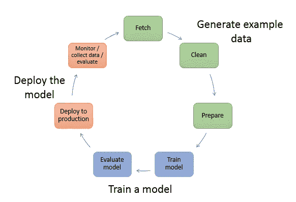
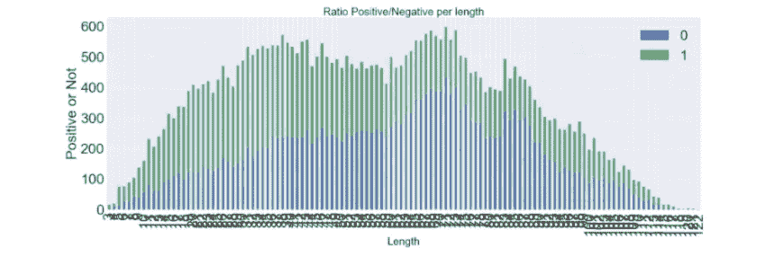
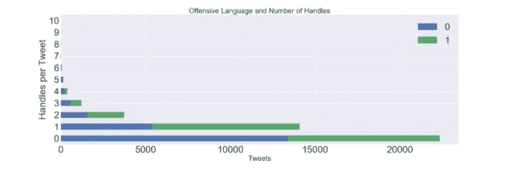
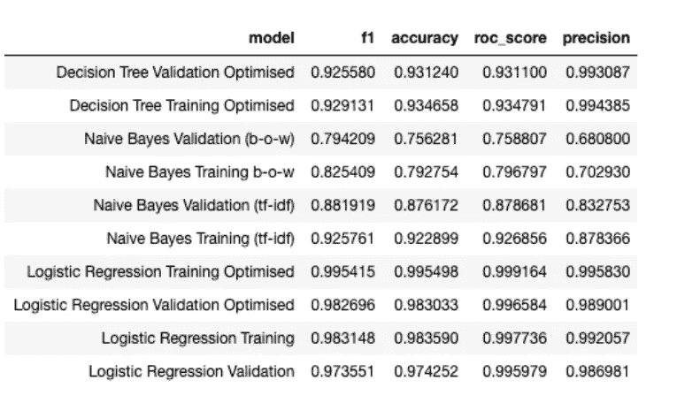
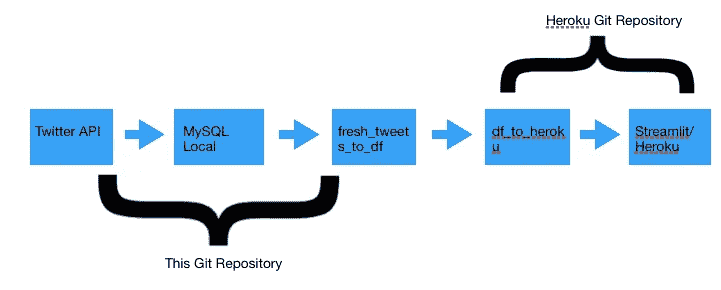
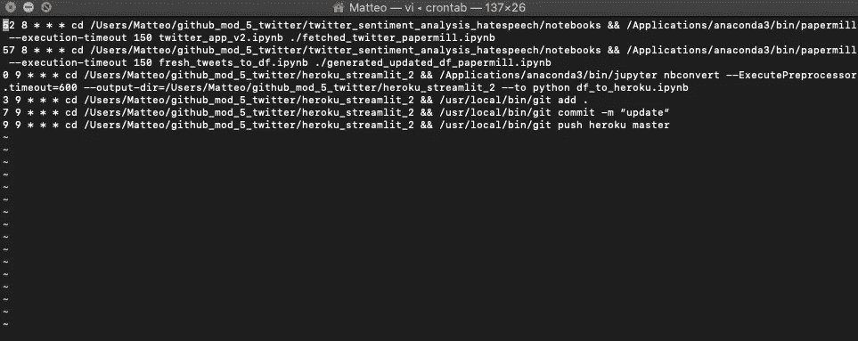

# 如何为 Twitter 建立一个(准)实时仇恨言论分类器

> 原文：<https://towardsdatascience.com/how-to-build-a-quasi-real-time-hate-speech-classifier-for-twitter-286d7cc440c2?source=collection_archive---------56----------------------->

资料来源:联合国人类住区规划署

## 从培训到新推文中的模型部署

社交平台上的网络欺凌和攻击性语言是我们现代的瘟疫之一。网上言论自由很容易演变成对性、政治和宗教信仰的攻击性、不合理和无建设性的批评。机器学习分类器和社交平台上可用的大量数据为缓解这一问题提供了有效的解决方案。

在这个项目中，一系列分类器，如逻辑回归、决策树和 CNN，在 40000 万条人类标记为冒犯性或非冒犯性的推文中进行了训练。这 4 万条推文是通过合并两个不同的数据集汇编而成的。其中一个最初取自于一个 [Analytics Vidhaya](https://datahack.analyticsvidhya.com/contest/practice-problem-twitter-sentiment-analysis/) 竞赛，而第二个数据集是在这个 [Github](https://github.com/t-davidson/hate-speech-and-offensive-language/tree/master/data) 回购上发现的 20000 条攻击性推文的集合。

整个项目可以在这个 [Github](https://github.com/matteomm/twitter_sentiment_analysis_hatespeech) 页面上找到。

仇恨言论的定义取自《剑桥词典》:“基于种族、宗教、性别或性取向等因素，针对某个人或群体表达仇恨或鼓励暴力的公开言论”。这个项目的主要目标是建立一个能够识别 Twitter 上仇恨言论的模型。在最后一部分，获胜的模型运行了每天从英国和美国的 Twitter API 收集的新推文，显示了被标记为攻击性语言或仇恨言论的推文占总推文的百分比。可以在[这里](https://shrouded-sands-52273.herokuapp.com/) *找到最终仪表板的链接(如果没有任何东西出现，给它 20 秒的时间来加载和刷新页面)。*

我曾尝试手动复制任何数据科学家在将模型投入生产时都会经历的流程(例如在 AWS SageMaker 上):

亚马逊 Sagemaker 上的典型循环来源:AWS 文档

项目的整体结构分为 5 个主要部分:

*   Tweets 和 EDA 的数据清理
*   模特培训
*   Twitter API 获取新数据到本地 MySQL 数据库
*   使用离线模型对新推文进行预测
*   通过 Streamlit 应用展示结果

# 数据清理

在循环的最开始，有必要处理我们可用的推文，并对它们进行一些转换，以便我们的算法能够以可理解的方式理解文本。与此同时，我们需要合并两个不同的数据集，以便获得负面和正面推文的例子。从最初的数据集中，我有意从每个类别(负面/正面)**中选择了大约 20000 条推文，这样最终的数据集就已经平衡了。**

现在一切就绪，预处理步骤可以应用于我们所有的最终推文。下面我分解了所有的预处理步骤(每个步骤的所有代码都可以在 data_cleaning.ipynb 笔记本中找到):

*   降低推文中的所有单词
*   删除重复
*   删除转发
*   移除 Twitter 句柄并计数*
*   移除特殊字符并测量推文长度
*   词类词汇化
*   在引理化之后重新格式化所有的空间和 ashtags
*   移除停用字词和短于 3 个字符的字词
*   删除不必要的列并保存最终的数据帧用于探索性数据分析

(在 Twitter 中，句柄用于在推文中指代某人，例如“今天塔图因阳光明媚，我们去喝杯奶昔吧@LukeSkywalker”。)

# **探索性数据分析**

从这一点来看，所有这些 tweets 都准备好进行标记化，我们还可以对它们执行一些其他操作。下面是我创建的一些代码片段，用于创建最常见单词的数据框架，并根据词频构建单词云:

在这个阶段，已经有一些潜在的模式和初步的见解可以揭示出来:

*你能从一条微博的长度来判断它吗？*

推特的答案是肯定的！推文是否具有攻击性和长度似乎有关系。更具体地说，更长的推文与更积极的信息相关联。

基于推文长度的比率(正 0/负 1)

如上图所示，负面推文似乎比正面推文平均要短。1 代表负面推文，0 代表正面推文。可以看到，大多数负面推文集中在图表的左侧，对应于较短的长度。简单的 t 检验证实，p 值小于 0.001 时，平均差异显著。

*手柄越多的推文攻击性越强吗？*

答案似乎是肯定的。

基于每条推文的句柄数量的比率(正 0/负 1)

在最后一节中，手柄数量和攻击性之间的关系通过再次绘制正/负手柄数量与手柄总数的关系来衡量。绝大多数推文的句柄介于 0 和 3 之间，0 和 1 句柄推文之间存在明显差异，后者的攻击性推文比例明显高于 2 和 3 类。这可以解释为人们通过使用把手对某人咆哮。

**由于敏感语言，在 EDA 笔记本上可以找到更多 EDA 和 wordclouds】*

# 模特培训

我在建模中使用的唯一预测器只是文本本身。用 tf-idf 方法对我们文本的词条化和精炼版本进行矢量化。Tf-idf 优于词袋(B-o-w ),因为在这种情况下词的稀有性非常重要。

tf-idf 矩阵用于所有模型，除了 CNN(它只将单词的符号化序列作为输入)和 Naive Bayes，在 Naive Bayes 中，我还尝试使用 B-o-w 框架来查看性能是否会受到影响。

CNN 的性能没有添加到下面的图表中，但是，它非常低，在验证集上的准确率刚刚超过 50%。在神经网络部分还需要做更多的工作，我可能会在低性能的 CNN 上实现 RNN。

跨培训和验证的所有模型的性能概述

所有模型都用 GridSearch CV 进行了调整和优化。如前所述，最终表现最好的模型是一个逻辑回归，在测试集上有 98%的 f-1 分数。由于初始数据集从一开始就被设计为平衡的，因此上述任何指标在这种情况下实际上都是有意义的。如果数据集是不平衡的，ROC 曲线或宏观/微观精度将是更好的拟合。

**最后，获胜模型的高性能可以用缺乏中立类别的推文来解释。**f1 如此高的分数是因为该模型可以轻松识别非常令人不快的推文和非常积极的推文。在这种情况下，引入第三类中性推文肯定会降低性能，也有助于模型拾取既不一定非常积极也不一定非常消极的推文。

# Twitter API 获取和 MySQL 存储

现在我们已经有了一个分类推文的离线模型，我们还需要一个基础设施来收集和处理实时和新鲜的推文。

为了连接到 Twitter API，Twitter 开发团队需要批准您的登录请求。这可以通过点击链接[这里](https://developer.twitter.com/en)来完成，并给出一些关于你打算如何使用 Twitter 数据的基本信息。Twitter 团队通常需要 2-3 个工作日才能获得最终批准和登录凭证。

在请求访问 Twitter 开发者门户后，可以在本地 MySQL 数据库上定期收集新的推文，该数据库的创建只是为了容纳推文的输入流。python 库 Tweepy 用于创建与 Twitter API 的连接。我们从原始 JSON 流中存储在 SQL 数据库上的唯一信息是:

*   Twitter ID
*   推文时间
*   Twitter 文本

所有文本都必须去掉表情符号，才能存储在数据库中。Tweepy 的流监听器可以基于特定主题和其他过滤器(如语言)收集信息。在这种情况下，所有标签为“冠状病毒”的词都被跟踪，以确保大量的推文流。同时，为了方便起见，只选择了英语。

请在下面找到用于此项目的 Tweepy 监听器对象的代码片段:

下面是 Listener 对象的实现，它只流式传输带有“冠状病毒”的标签，也是英文的。Wait_on_rate_limit 还确保不会达到每天的流媒体 tweets 限额。

在与数据库建立连接后，使用以下函数将数据传递并存储到 MySQL 数据库:

# 使用离线模型对新推文进行预测

有了基本的管道，我们现在可以在一个单独的笔记本上从 MySQL 数据库中提取批量的新流推文，在那里应用完全相同的预处理和数据清理(下面的 fresh_tweets_to_df 笔记本)。下图描述了管道的整体结构:

数据管道

在 df_to_heroku 部分，召回最终获胜的模型和 tf-idf 酸洗对象。唯一合适的 tf-idf 对象被转换到新的 tweets 上，以便生成每次都具有完全相同数量的列(9000 个单词)的矩阵。在这种情况下，单词之外的词汇被丢弃，而其余的由矩阵保留。

随后，将 predict_proba 函数应用于矢量化矩阵，并且仅过滤高于 0.9 的值，希望仅收集模型认为非常令人不快的推文。最后一步，绘制攻击性推文和大多数重复出现的词随时间的波动。这个数字然后通过 Streamlit 上传到 Heroku 上。

*使这些笔记本运行的整个过程是通过一系列* ***cron*** *命令自动完成的，这些命令每隔 4 小时定期执行这些笔记本，使用 papermill 和 nbconvert 来触发和转换笔记本(下面的示例显示了计划在每天晚上 8.52 到 9.09 之间执行一次的整个过程):*

自动化管道的 Cron 命令

请注意，nbconvert 和 papermill 的超时命令(设置为 150 秒)是一种额外的安全措施，以防止 Tweepy 对象随着时间的推移下载大量的 Tweepy。

# **通过 Streamlit 应用展示结果**

在 df_to_heroku 笔记本中，一些非常高级的数据被汇总并保存到 matplotlib 图中，如下所示:

添加到 Streamlit 的 Matplotlib 图形的快照

最终仪表板应用程序的底层结构由几行代码构建而成:

# 局限性和未来工作

虽然最终的模型性能即使在我们数据集的测试结果上也非常好，但这个项目的一个主要限制是测量模型在新推文中的性能。实际上，我们可以只看一些被贴上负面标签的推文，就主观地认为它们是否具有攻击性。这最后一点提出了这个框架中的另一个重要问题，它与人类手动标记推文的固有偏见有关。

用来标记最初的基本事实的判断也是谬误的，因为对一些人来说是冒犯性的，对另一些人来说可能不是冒犯性的。单词以外的词汇可能是这种模式的主要缺点之一。该算法不能很好地处理包含大量单词的句子，这些单词不包含在我们最初的 9000 万单词长的词汇表中。递归神经网络可能是处理词汇外单词的最佳选择。

感谢阅读！