# 如何使用 Apache Beam、Pub/Sub 和 SQL 为在线商店构建实时数据管道

> 原文：<https://towardsdatascience.com/how-to-build-a-real-time-data-pipeline-for-an-online-store-using-apache-beam-pub-sub-and-sql-6424f33eba97?source=collection_archive---------9----------------------->

## 为虚拟在线商店(我们也将创建)构建实时数据管道的分步指南，以便稍后对其进行分析。

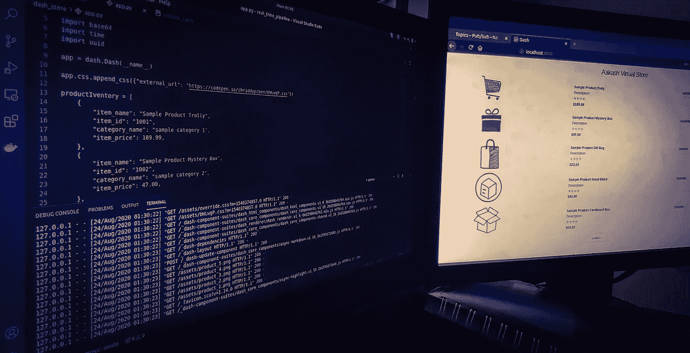

我的设置正在运行

看到我们的数据变得如此具有可塑性是一件令人着迷的事情。如今，我们有工具可以将高度嵌套的复杂日志数据转换为简单的行格式，有工具可以存储和处理数 Pb 的事务数据，还有工具可以在原始数据生成后立即捕获原始数据，并从中处理和提供有用的见解。

在本文中，我想分享一个这样的一步一步的过程，从我们自己的虚拟在线商店生成、摄取、处理并最终利用实时数据。

## 先决条件

1.  谷歌云平台账户(如果你没有账户，请在此注册[获得 3 个月的免费试用，可使用 300 美元的信用点数)。](https://cloud.google.com/)
2.  Linux 操作系统。
3.  Python 3。

## 体系结构

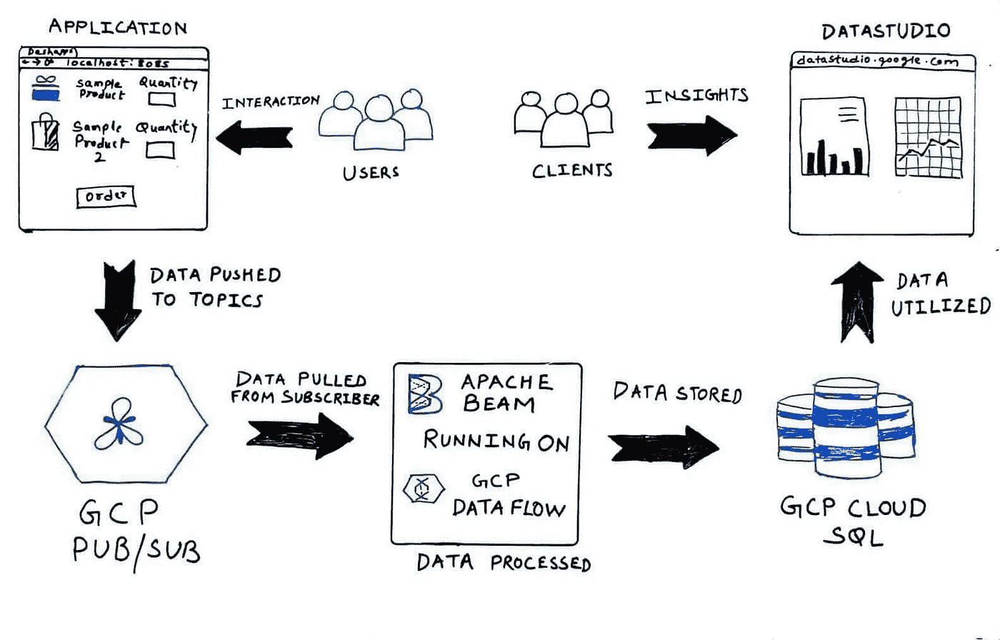

我在白板上设计流程图的技巧，当然还有一些编辑😉

## 步骤 1:创建发布/订阅主题和订阅者

Pub/Sub 是谷歌云平台中可用的消息服务。可以认为是 Apache Kafka 或者 Rabbitmq 的托管版。

消息服务基本上将产生数据的系统(在我们的例子中是虚拟存储应用程序)与处理数据的系统(在我们的例子中是 Apache beam on Dataflow)分离开来。

首先，我们需要在 GCP 创建一个服务帐户，允许我们从应用程序和 Apache beam 访问 Pub/Sub:

登录你的 GCP 控制台，从左侧菜单中选择 **IAM & Admin** :

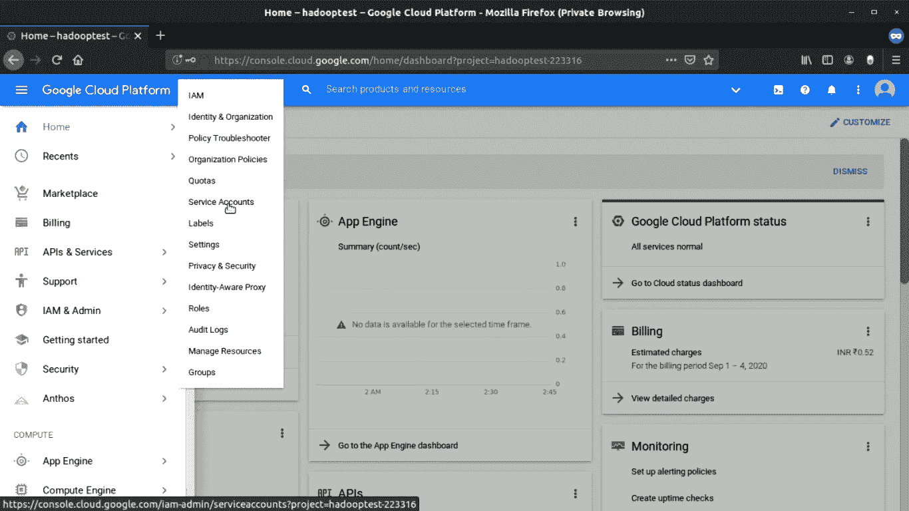

创建服务帐户。

选择**服务账户**选项并创建一个新的服务账户:

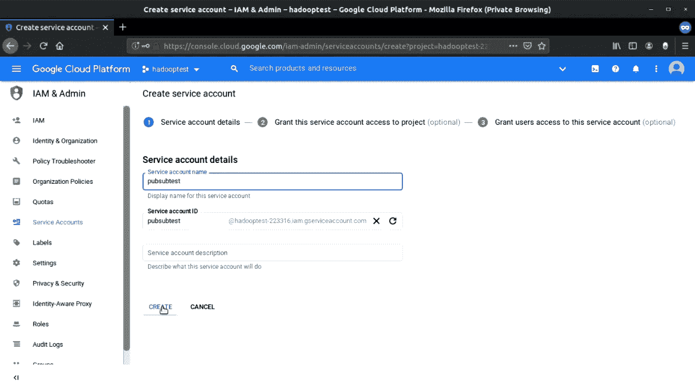

插入新的服务帐户详细信息。

为我们的服务帐户提供**发布/订阅管理**角色:

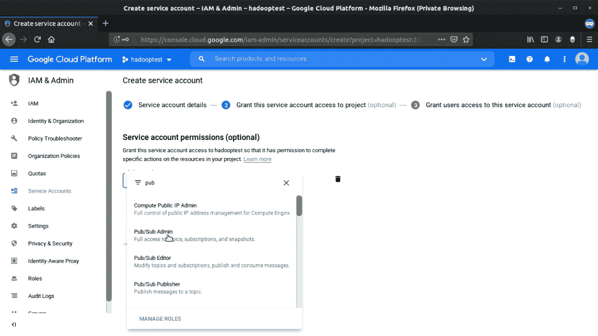

提供访问发布/订阅所需的角色。

最后，**创建一个密钥**并下载私钥 JSON 文件以备后用:

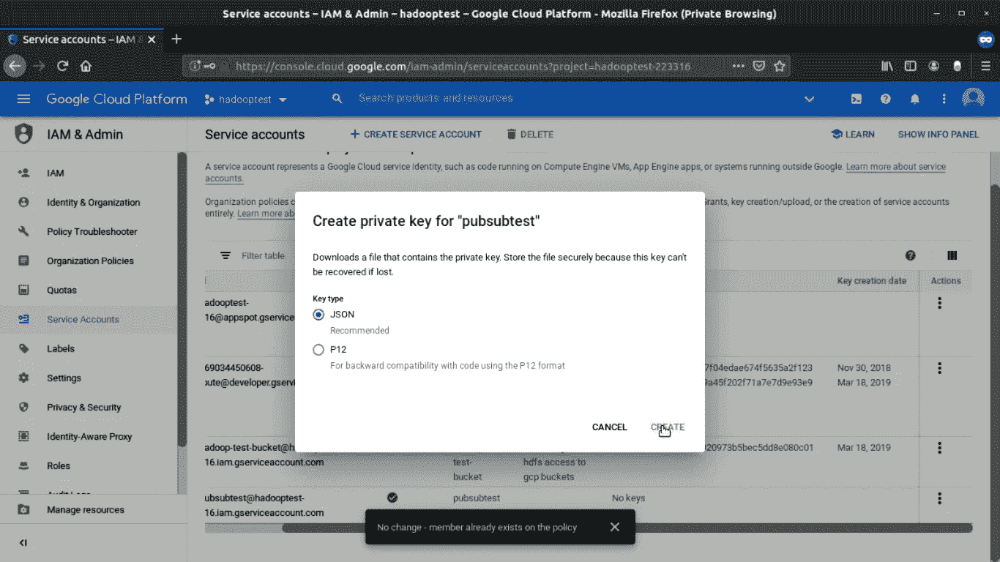

正在下载服务帐户密钥。

接下来，我们将在 Pub/Sub 中创建一个主题，将我们的虚拟商店数据发布到其中，并创建一个订阅者，使用 Apache Beam 从其中提取数据。

从 GCP 控制台的左侧菜单中选择**发布/订阅**。

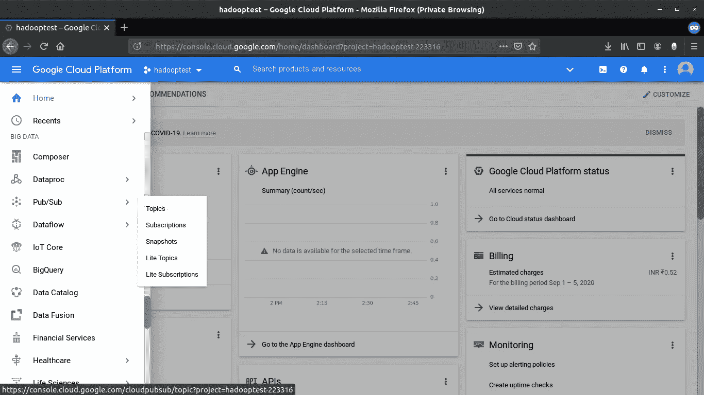

从控制台选择发布/订阅工具。

从子菜单中选择**主题**。从顶部选择**创建主题。**输入合适的名称，点击**创建主题**。

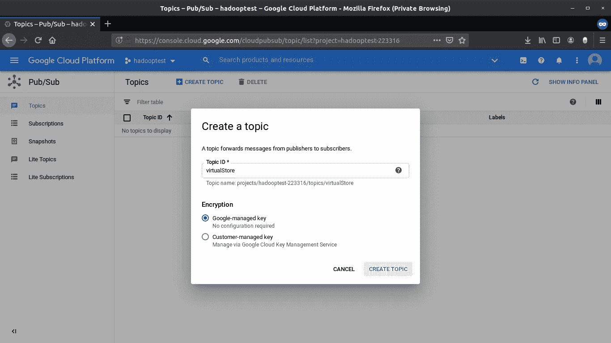

创建新主题。

现在，从左侧选择**订阅**选项，从顶部选择**创建订阅。**输入一个合适的名称，从下拉列表(我们在上一步中创建的)中选择订阅者将监听数据流的主题。之后点击**在最后创建**，保持其他选项不变。

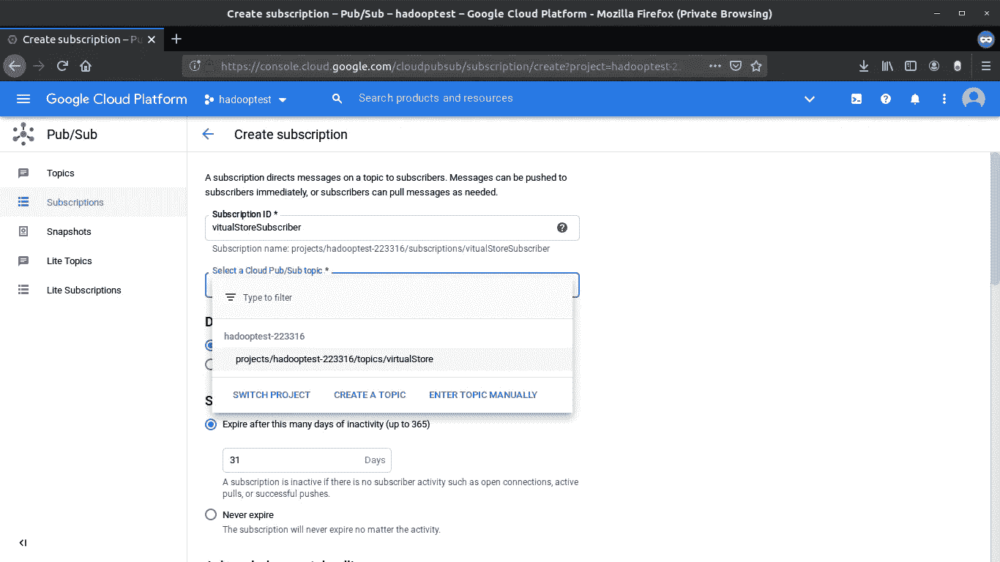

为已创建的主题创建新的订阅者。

## **第二步:为生成实时数据创建一个虚拟存储**

现在，我们将创建一个虚拟在线商店，将交易数据推送到我们在前面步骤中创建的发布/订阅主题中。

我使用过 [Dash](https://dash.plotly.com/introduction) ，这是一个由 Plotly 创建的工具，使用不同的预构建 UI 组件(如按钮、文本输入等)快速构建 web 应用程序。构建 web 应用程序的完整教程超出了本文的范围，因为我们的主要焦点是构建实时管道。所以你可以在这里 **从 GitHub repo [**下载完整的应用。**](https://github.com/aakashrathore92/gcp-realtime-pipeline-project)**

唯一重要的是将我们的数据发布到发布/订阅主题的脚本:

让我们开始我们的在线虚拟商店，从 Git 下载项目后，创建一个虚拟 python 环境，并使用 ***需求安装所有的包。txt*文件。现在打开终端中的文件夹，运行 ***app.py*** 文件。您将看到以下输出:**

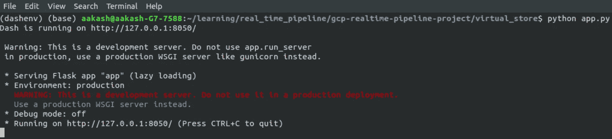

正在运行虚拟存储 dash 应用程序服务器。

进入你的网络浏览器，打开 ***localhost:8085。*** 你会看到虚拟商店的主页。

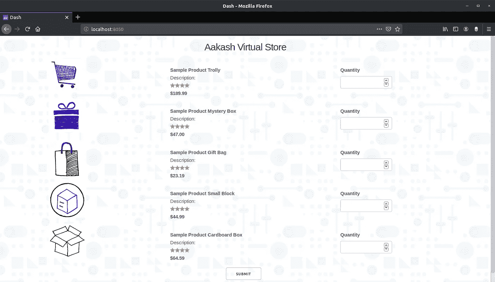

我自己的虚拟商店😜。如果你有密码，你可以改名字😉。

现在有趣的部分让我们订购一些商品，看看我们的数据是如何被发布到发布/订阅主题中，然后被我们之前创建的订阅者获取的。为每个项目添加一些数量，然后点击**提交**:

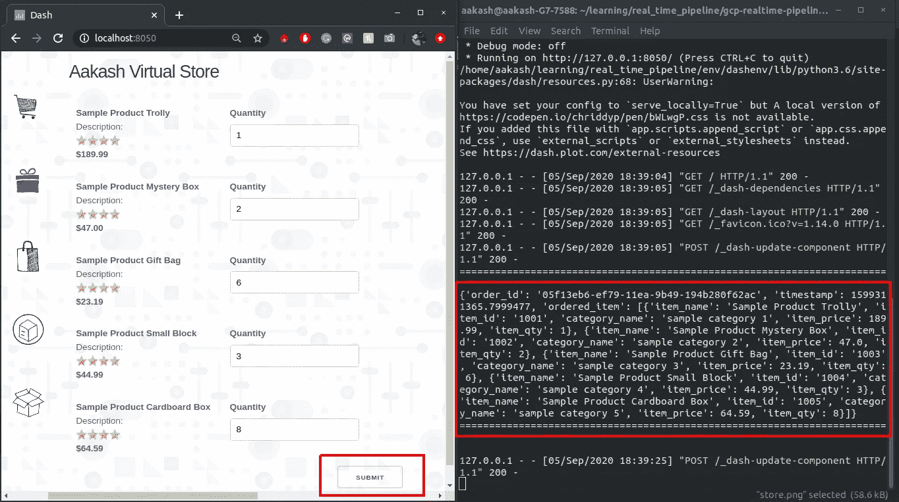

通过下单进行测试。

您可以在终端中看到，每次下订单时，都会打印出 JSON 格式的一些交易数据。同样的 JSON 数据也被推送到发布/订阅主题。让我们从我们的订户那里获取数据，进入 GCP 的发布/订阅仪表板，从左侧菜单中选择**订阅**选项，然后点击顶部的**查看消息**，然后点击**获取**以查看发布的数据:

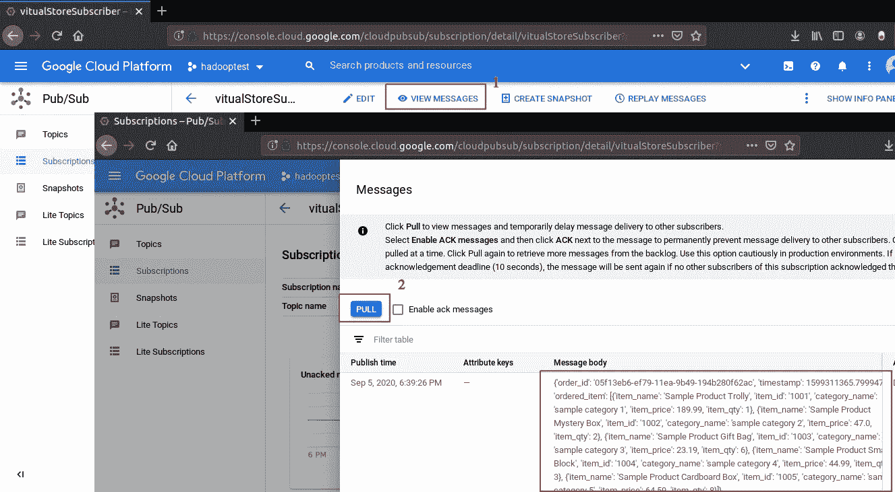

在酒吧/酒馆登记。

## 步骤 3:创建 Apache Beam 管道并在数据流上运行它

在这个阶段，我们从虚拟在线商店向我们的发布/订阅用户实时获取数据。现在，我们将在 Apache Beam 中编写我们的管道，以解除数据嵌套，并将其转换为类似行的格式，以将其存储在 MySQL 服务器中。最后，我们将使用 GCP 数据流运行器运行我们的管道。

在我们开始编写数据管道之前，让我们在 GCP 创建一个云 SQL 实例，这将是我们存储已处理数据的最终目的地，您也可以使用其他云 SQL 服务，我已经为 MySQL 服务器编写了管道。

在 GCP 控制台上，从左侧菜单中选择 **SQL** 选项:

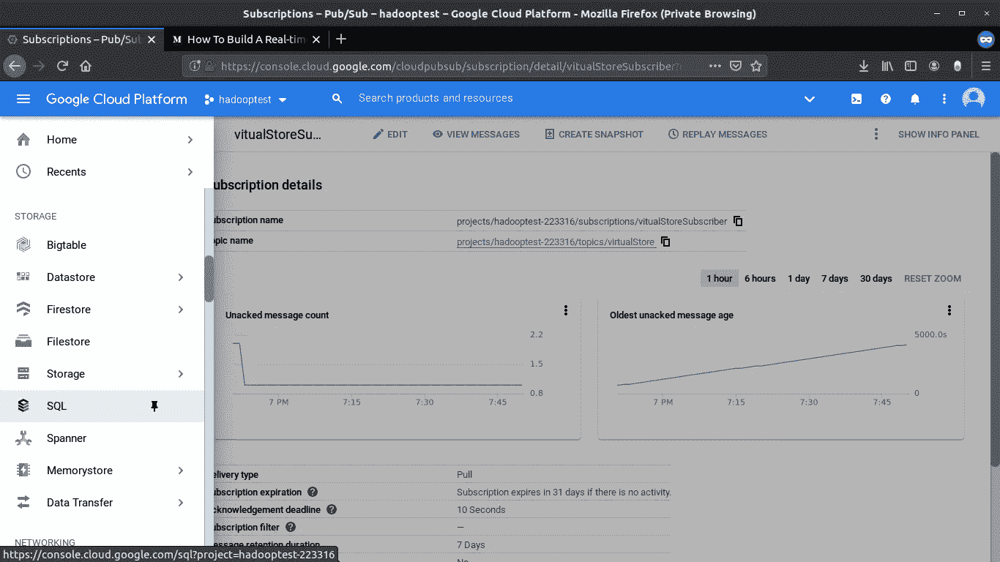

从 GCP 控制台选择 SQL 工具。

选择**创建实例:**

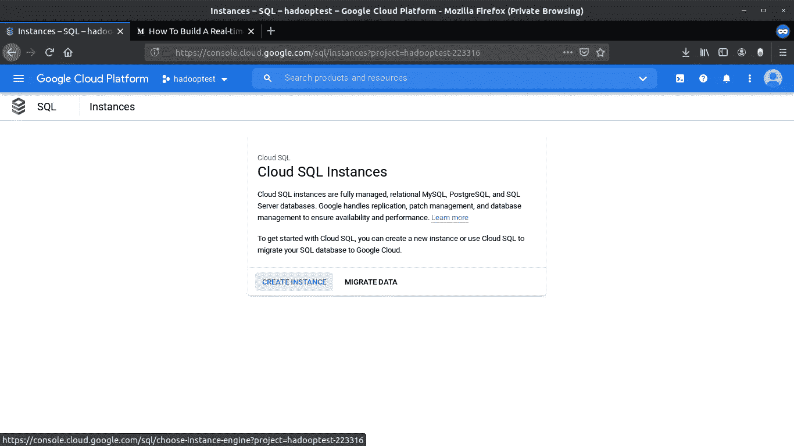

正在创建云 SQL 实例。

选择 MySQL:

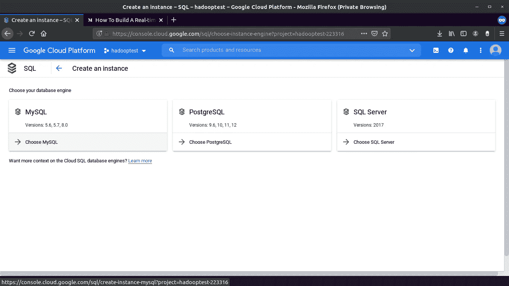

选择 MySQL 服务器。

为 root 用户输入**实例名**和**密码**，将其他设置保留为默认设置，然后单击**创建，**现在可以休息了，启动实例需要 5-10 分钟:

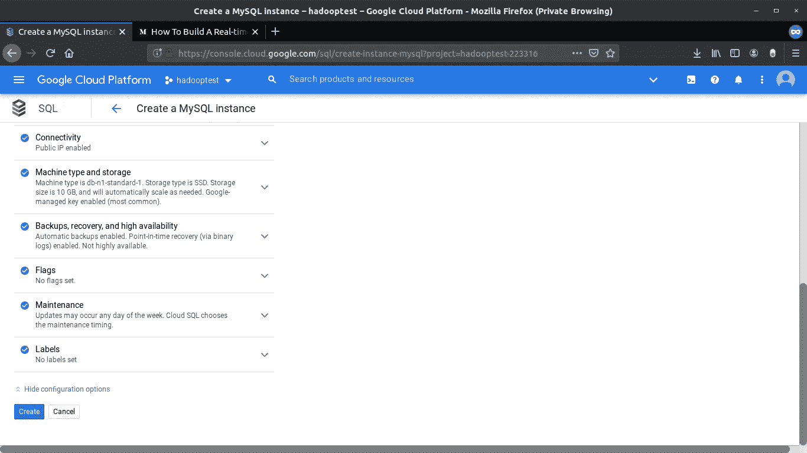

插入细节并创建云 SQL 实例。

数据库启动并运行后，我们需要创建一个数据库和表。使用任何 SQL 客户端连接您的 MySQL 实例，并运行以下查询:

```
CREATE DATABASE virtual_store;CREATE TABLE transaction_data(
`id` int(11) NOT NULL AUTO_INCREMENT,
`order_id` VARCHAR(255),
`timestamp` INT(11),
`item_id` VARCHAR(255),
`item_name` VARCHAR(255),
`category_name` VARCHAR(255),
`item_price` FLOAT,
`item_qty` INT,
PRIMARY KEY(`id`)
);
```

到目前为止，我们已经创建了我们的源(发布/订阅用户)和接收器(MySQL)，现在我们将创建我们的数据管道。

下面给出了我们管道的目录表示，你可以从我的 GitHub repo [**这里**](https://github.com/aakashrathore92/gcp-realtime-pipeline-project) 克隆完整的目录:

```
├── dataflow_pipeline
│   ├── mainPipeline.py
│   ├── pipeline_config.py
│   ├── requirement.txt
│   └── setup.py
```

让我们首先从配置文件 ***pipeline_config.py、*** 开始。该文件包含所有配置，如发布/订阅订户详细信息、服务帐户密钥路径、MySQL DB 连接详细信息和表详细信息。

接下来是主管道文件，***main pipeline . py***，这是不同运行者(本地、数据流等)运行管道的入口点。在这个管道脚本中，我们从发布/订阅中读取数据，取消数据嵌套，并将最终数据存储在关系数据库中。稍后，我们将使用谷歌数据工作室可视化它。让我们看看代码:

首先，让我们在本地运行管道:

```
python mainPipeline.py
```

您将看到下面的输出，这意味着我们的管道现在正在侦听传入数据的发布/订阅。

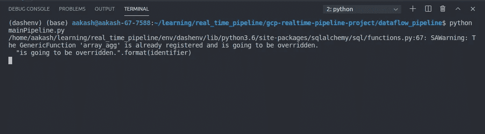

本地运行管道的输出。

让我们从我们的虚拟在线商店下一些订单，看看管道的输出。

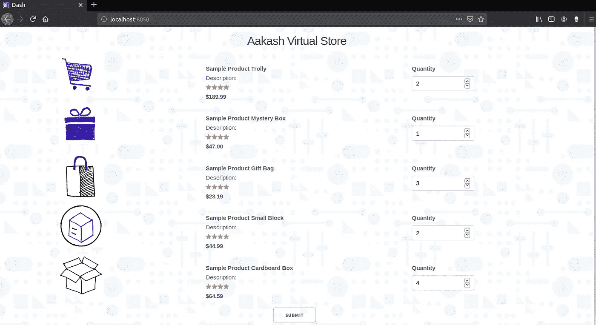

下样品订单。

单击提交后，您将立即在管道终端中看到输出:

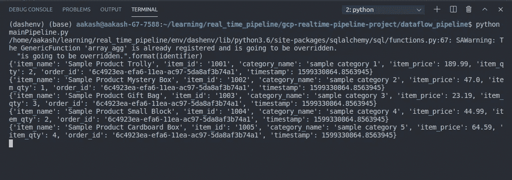

通过下订单测试管道。

如您所见，我们的输入是嵌套数据，其中所有项目都嵌套在一个对象中，但是我们的管道将数据非嵌套到行级别。

让我们检查一下我们的数据库表:

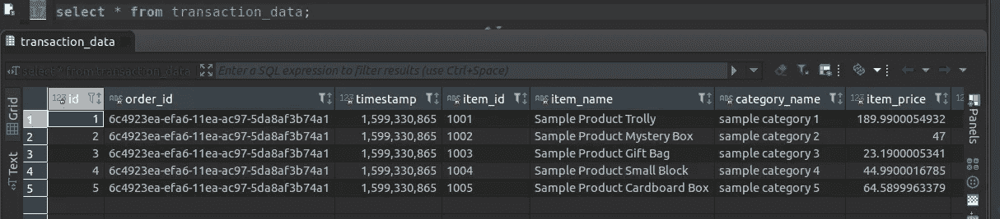

检查最终目的表。

正如预期的那样，我们的单个订单被转换成项目式的行级数据，并实时地插入到我们的数据库中。

现在，我们将在 GCP 数据流中运行我们的管道，为此，我们需要运行以下命令:

```
python mainPipeline.py --runner DataflowRunner \
--project hadooptest-223316 \
--temp_location gs://dataflow-stag-bucket/ \
--requirements_file requirement.txt \
--setup_file ./setup.py
```

确保像我一样在 GCP 创建一个 staging bucket，并在上面的命令中的" **temp_location** "选项下提供链接，并在您的目录中创建一个包含以下内容的 ***setup.py*** ，这将防止 *ModuleNotFoundError* **。**

高枕无忧，启动 GCP 数据流管道需要 5-10 分钟。现在转到 GCP 数据流仪表板，检查服务器是否启动。

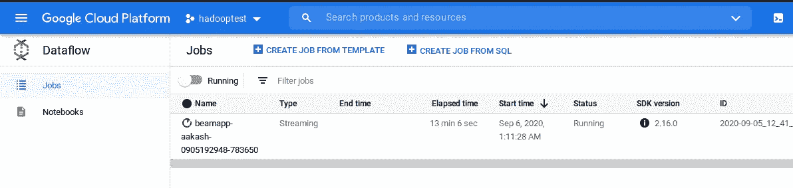

检查在 GCP 运行的数据流作业。

您还可以看到管道的不同阶段，单击正在运行的作业可以查看详细信息。

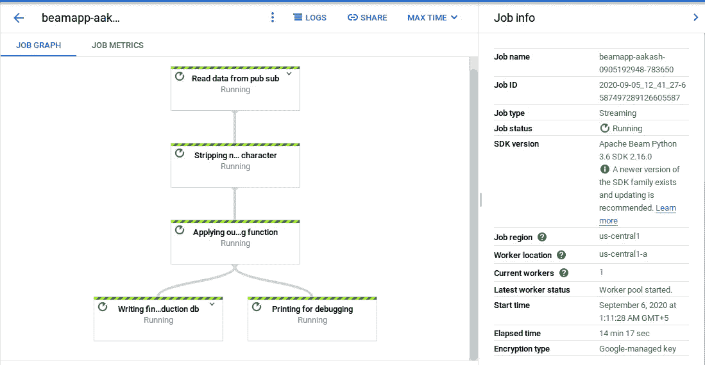

数据流中管道所有阶段的可视化表示。

从虚拟商店下一些订单，并测试数据是否进入数据库。在我的情况下，它像预期的那样工作。MySQL 表中的数据行被实时插入:

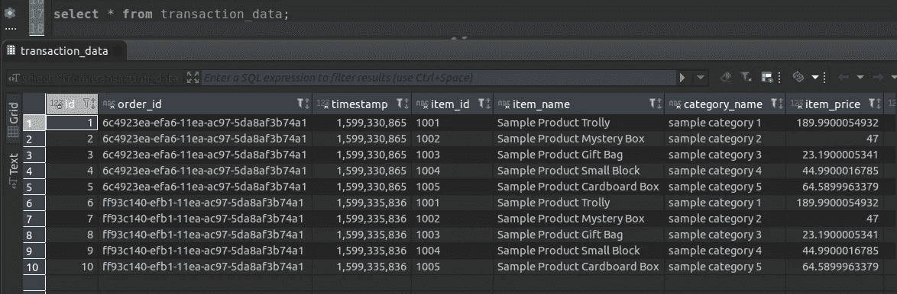

最终测试检查数据流处理的数据。

*注意:关闭我们在 GCP 部署管道的本地终端不会影响管道在 GCP 数据流中的运行。确保从 GCP 也终止管道。*

## 步骤 4:创建 Datastudio Dashboard 以可视化我们的实时数据

Google Data Studio 是一款免费的数据可视化工具。它使用户能够从不同的数据源非常快速地创建一个交互式的、有效的报告仪表板。

让我们将我们的接收器(MySQL 服务器)连接到 Data Studio，并在我们的实时数据上创建一个仪表板。

转到[https://datastudio.google.com](https://datastudio.google.com)。点击**创建**并选择**数据源。**

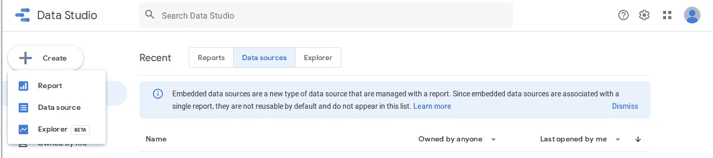

正在为 data studio 仪表板创建数据源。

在左上角为您的源命名，并选择 **Cloud SQL for MYSQL** 作为源(如果您的 MYSQL 数据库不在 GCP，请仅选择 **MySQL**

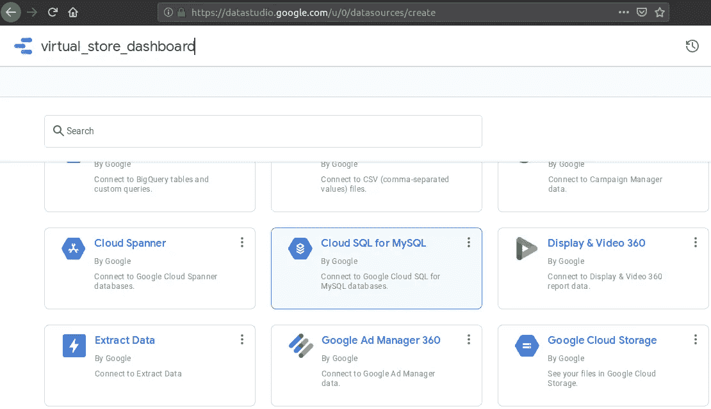

命名我们的数据源并选择云 SQL 进行连接。

输入您的数据库凭证并点击**验证。**之后选择**自定义查询**，进入查询，选择右上角的**连接**。

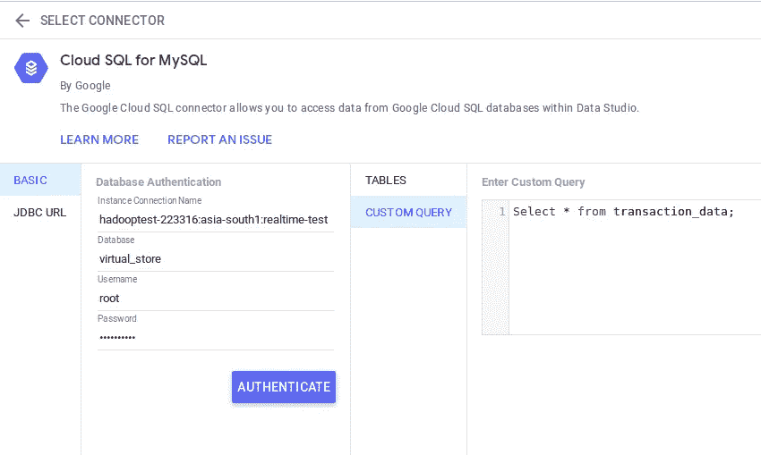

放入所有需要的细节和一个自定义查询从数据库中提取数据。

Data Studio 将连接到云 SQL 实例，并向我们显示我们的表的模式。现在点击右上角的**创建报告**:

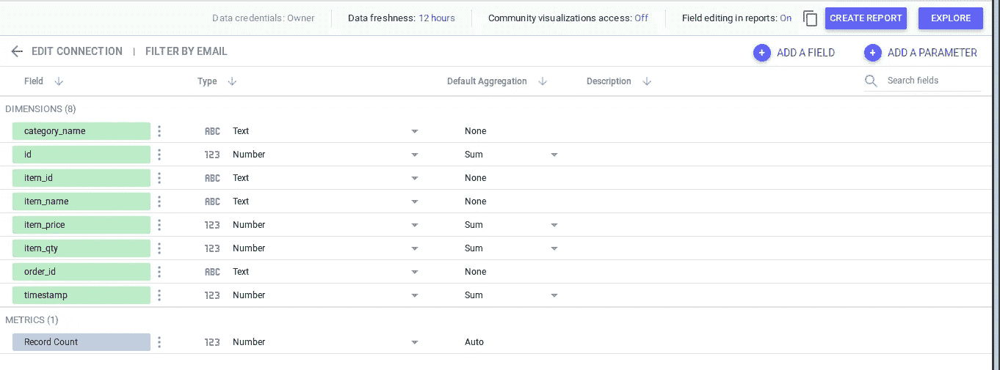

Data Studio 提取的表架构。

根据您的要求添加图表和图形。您可以在这里 了解更多数据工作室 [**:**](https://analytics.google.com/analytics/academy/course/10)


在 data studio 中添加图表和图形的选项。

我已经创建了一个基本的，2 图表仪表板，显示 ***项目销售数量*** 和 ***项目销售。***

我的最终控制面板会在收到订单后立即更新:

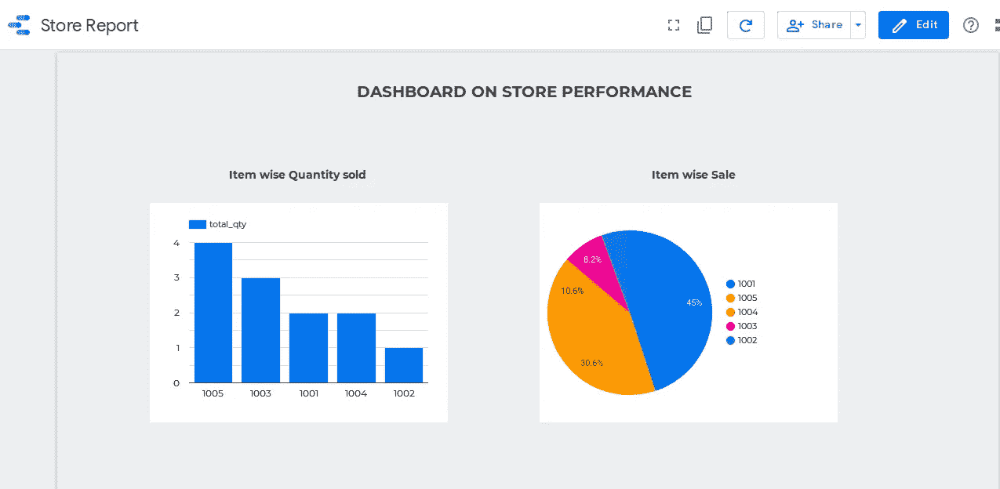

最终控制面板，查看我们实时数据的见解。

## 结论

在本文中，我解释了实时管道是如何工作的。我们已经创建了数据管道的所有组件，一个实时生成数据的源应用程序，一个接收数据的缓冲区，一个在 Google 云平台中处理数据的实际管道，一个存储已处理数据的接收器，以及一个显示最终数据的仪表板。

请在下面留下您对本文的评论，如果您在上面指定的任何步骤中遇到问题，您可以通过[**insta gram**](https://www.instagram.com/_aakash.rathore/)**和[**LinkedIn**](https://www.linkedin.com/in/aakash-data-engineer)**联系我。****