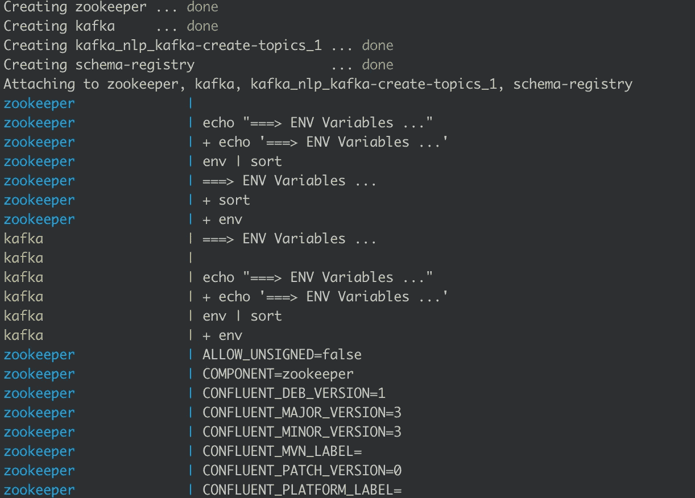

# 如何使用 Faust 和 MLFlow 构建实时欺诈检测管道

> 原文：<https://towardsdatascience.com/how-to-build-a-real-time-fraud-detection-pipeline-using-faust-and-mlflow-24e787dd51fa?source=collection_archive---------17----------------------->

## 关于使用类似 Kafka Streams 的 python 库(Faust)和使用 MLFlow 服务的欺诈检测模型构建低延迟 ML 管道的教程


照片由[杰佛森·桑多斯](https://unsplash.com/@jefflssantos?utm_source=unsplash&utm_medium=referral&utm_content=creditCopyText)在 [Unsplash](https://unsplash.com/s/photos/fraud?utm_source=unsplash&utm_medium=referral&utm_content=creditCopyText) 上拍摄

在本教程中，我们将学习在本地启动一个 Kafka 集群，编写一个发送消息的生成器，创建一个简单的欺诈检测机器学习训练流程，通过 REST 接口公开模型，并进行实时预测。

我们将使用的主要框架是:

*   [Faust](https://github.com/robinhood/faust/) :流处理库，使用 [async/away](https://en.wikipedia.org/wiki/Async/await) 范例，需要 python 3.6 以上版本
*   [Kafka](https://www.confluent.io/) :我们将使用 Kafka 的融合版本作为我们的流媒体平台
*   [MLFlow](https://www.mlflow.org) :一个开源平台，用于监控和保存训练后的机器学习模型
*   Jupyter 实验室:我们运行代码的环境

我们还需要一些数据来进行培训。我们可以使用来自 [Kaggle 信用卡欺诈竞赛](https://www.kaggle.com/mlg-ulb/creditcardfraud/data#)的 CSV 源。

**TL；DR:代码在**[**GitHub**](https://github.com/BogdanCojocar/medium-articles/tree/master/realtime_fraud_detection)**上。**

## 第一步:进行培训

让我们首先构建我们的欺诈检测模型。我们将读取代表信用卡交易的 CSV 数据，并在两个类`0(not fraud)`和`1(fraud)`之间应用简单的二元逻辑回归分类。

```
df = pd.read_csv('creditcard.csv')df.dtypesTime      float64
V1        float64
V2        float64
V3        float64
V4        float64
V5        float64
V6        float64
V7        float64
V8        float64
V9        float64
V10       float64
V11       float64
V12       float64
V13       float64
V14       float64
V15       float64
V16       float64
V17       float64
V18       float64
V19       float64
V20       float64
V21       float64
V22       float64
V23       float64
V24       float64
V25       float64
V26       float64
V27       float64
V28       float64
Amount    float64
Class       int64
```

正如我们所看到的，我们读取的大多数列都是`float`，除了`Class`，它是我们的目标变量。现在让我们开始训练:

```
x_name = df.iloc[:, 1:30].columns
y_name = df.iloc[:1, 30: ].columnsdata_x = df[x_name]
data_y = df[y_name]train_x, test_x, train_y, test_y = train_test_split(data_x, data_y, train_size=0.7, test_size=0.3)model = LogisticRegression()
model.fit(train_x, train_y.values.ravel())
```

对于特征，我们使用`V1 — V28`和`Amount`。我们在`train`和`test`数据之间进行分割，并拟合模型。我们可以检查一些性能指标:

```
pred_y = model.predict(test_x)accuracy_score(test_y, pred_y)
0.9993094811745842f1_score(test_y, pred_y)
0.7773584905660378precision_score(test_y, pred_y)
0.8272727272727273recall_score(test_y, pred_y)
0.6776315789473685
```

如果我们仅仅使用准确性作为衡量标准，我们可能会搬起石头砸自己的脚。始终使用更好的绩效指标，如`f1_score`、`precision`和`recall`。

## 步骤 2:通过 REST 服务模型

培训结束后，我们可以保存新的欺诈检测模型:

```
mlflow.sklearn.save_model(model, path='./fraud_model')
```

我们在 MLFlow 中使用`sklearn`模块，因为这将帮助我们处理 servis 部分。

让我们在项目的根目录下启动一个终端，并键入以下命令:

```
mlflow models serve -m fraud_model
```

这需要一点时间，因为除了部署微服务之外，还会创建一个`conda`环境。这是为了确保下次我们进行部署时，我们将依赖关系锁定在某个版本和单独的虚拟环境中。如果一切运行正常，我们会注意到我们的服务有了一个 url:

`Listening at: [http://127.0.0.1:5000](http://127.0.0.1:5000)`

我们可以使用`cURL`从终端进行快速测试:

```
curl [http://127.0.0.1:5000/invocations](http://127.0.0.1:9999/invocations) -H 'Content-Type: application/json' -d '{
    "columns":["V1","V2","V3","V4","V5","V6","V7","V8","V9","V10","V11","V12","V13","V14","V15","V16","V17","V18","V19","V20","V21","V22","V23","V24","V25","V26","V27","V28","Amount"],
    "data":[[12.8,0.029,0.48,0.98,6.2,29.1,3.33,1.2,0.39,75.1,0.66,1.2,1.3,44.2,12.8,0.029,0.48,0.98,6.2,29,3.33,1.2,0.39,75.3,0.66,1.2,1.3,44.2,1.1]]
}'
```

我们使用包含特性列和一组值的`JSON`对象发送一个`POST`请求。我们将从分类器`[0]`中得到答案。

## 步骤 3:运行 docker compose 来启动 kafka 集群

为了构建集群，我们将使用一个`docker-compose`文件来启动所有需要的 docker 容器:zookeeper 和一个代理。

现在简单地说，kafka 是一个分布式流媒体平台，能够处理大量的消息，这些消息被组织或分组到主题中。为了能够并行处理一个主题，必须将它分成多个分区，来自这些分区的数据存储在称为代理的独立机器中。最后，zookeeper 用于管理集群中代理的资源。为了读写 kafka 集群，我们需要一个代理地址和一个主题。

`docker-compose`将启动端口`2181`上的`zookeper`，端口`9092`上的`kafka broker`。除此之外，我们使用另一个 docker 容器`kafka-create-topic`的唯一目的是在 kafka broker 中创建一个主题(称为 test)。

要启动 kafka 集群，我们必须在定义 docker compose 文件的同一文件夹中运行以下命令行指令:

```
docker-compose up
```

这将启动所有带有日志的 docker 容器。我们应该在控制台中看到类似这样的内容:



## 第四步:运行卡夫卡制作程序

为了能够实时消费数据，我们首先必须将一些消息写入 kafka。我们将使用 python 中的`confluent_kafka`库来编写一个生产者:

我们将发送格式如下的`JSON`消息:

```
{
    "columns":["V1","V2","V3","V4","V5","V6","V7","V8","V9","V10","V11","V12","V13","V14","V15","V16","V17","V18","V19","V20","V21","V22","V23","V24","V25","V26","V27","V28","Amount"],
    "data":[]
}
```

这与我们用于 MLFlow web 服务的格式相同，其中`data`可以包含多个特性值列表。

对于我们写入队列的每条消息，我们还需要分配一个键。我们将根据`uuid`随机分配一个，以在集群中实现良好的分布。最后，我们还运行一个`flush`命令来确保所有的消息都被发送出去。

一旦我们运行`confluent_kafka_producer`，我们应该会收到一个日志，告诉我们数据已经正确发送:

```
we’ve sent 6 messages to 127.0.0.1:9092
```

## 第五步:经营浮士德消费者

我们已经到达了教程的最后一步。使用 Faust 框架，我们将运行一个简单的 worker，它将使用来自 Kafka 的数据，并将预测应用到新功能上。我们需要为此创建一个单独的 python 脚本。首先，我们定义我们的 Faust 应用程序，以及主题:

```
app = faust.App(
    'fraud_detection_app',
    broker='kafka://localhost:9092',
    value_serializer='raw',
)kafka_topic = app.topic('test')
```

我们定义从中读取数据的代理和序列化程序格式。我们很乐意使用`raw`，因为我们只是将数据传递给机器学习算法。

现在，让我们定义协程。在浮士德框架中，它被称为`agent`:

代理是一个异步进程。我们连接到 Kafka 主题，对于我们读取的每个值，我们调用 REST 服务并获得结果。正如预期的那样，在 Kafka 中有了新的值之后，它会立即运行。

剧本定稿了。姑且称之为`fraud_detection_worker.py`。现在我们可以运行它了。从项目根目录的终端开始，我们需要键入:

```
faust -A fraud_detection_worker worker -l info
```

这将启动一个 worker，它是应用程序的一个实例。如果我们需要更多的计算能力，我们可以启动额外的工人。

如果一切运行正常，我们将开始看到以下日志:

```
Input data: b'{"columns": ["V1", "V2", "V3", "V4", "V5", "V6", "V7", "V8", "V9", "V10", "V11", "V12", "V13", "V14", "V15", "V16", "V17", "V18", "V19", "V20", "V21", "V22", "V23", "V24", "V25", "V26", "V27", "V28", "Amount"], "data": [[12.8, 0.029, 0.48, 0.98, 6.2, 29.1, 3.33, 1.2, 0.39, 75.1, 0.66, 11.2, 1.3, 0.2, 12.8, 0.029, 0.45, 0.98, 6.2, 29, 3.33, 1.2, 0.39, 75.3, 0.3, 2.2, 1.3, 2.2, 1.01]]}'Fraud detection result: [0]
```

我们已经到了本教程的结尾。我希望你喜欢它，并发现它有用。我们看到了现在如何选择使用纯 python 框架来进行实时数据处理。这是一个很大的优势，因为这种编程语言中有很多数据科学工作。