# 如何使用潜在因素模型在图形数据库中建立推荐系统

> 原文：<https://towardsdatascience.com/how-to-build-a-recommendation-system-in-a-graph-database-using-a-latent-factor-model-fa2d142f874?source=collection_archive---------3----------------------->

## 数据库内训练避免了将数据从 DBMS 导出到其他机器学习平台，从而更好地支持连续的模型更新

# **什么是推荐系统？**

推荐系统是基于可用数据预测个人偏好选择的任何评级系统。推荐系统被用于各种服务，例如视频流、在线购物和社交媒体。通常，系统基于其对用户将给予项目的评级的预测向用户提供推荐。推荐系统可以从两个方面进行分类，利用的信息和预测模型。

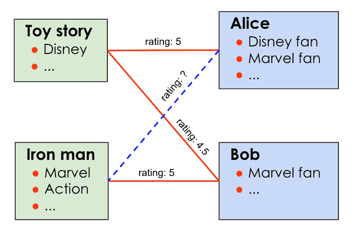

图。1(图片作者)。这个示例数据集包括两个用户，Alice 和 Bob，两部电影，*玩具总动员*和*钢铁侠*，以及三个评级记录(实线)。每个用户和电影都标有其属性。

## **内容过滤与协同过滤**

两种主要的推荐方法，内容过滤和协作过滤，主要根据用于评级预测的信息而不同。图 1 显示了一组电影分级数据以及一些用户和电影的标签。注意用户对电影的评分来自一个图结构:用户和电影是图的顶点，评分是图的边。在这个例子中，内容过滤方法利用电影和用户的标签属性。通过查询标签，我们知道爱丽丝是漫威电影的忠实粉丝，而*钢铁侠*是漫威电影，因此*钢铁侠*系列将是对她的一个很好的推荐。内容过滤评分系统的一个具体例子是 TF-IDF，用于对文档搜索进行排名。

用户和电影上的标签可能并不总是可用。当标签数据稀疏时，内容过滤方法可能不可靠。另一方面，协同过滤方法主要依赖于用户行为数据(例如，评级记录或电影观看历史)。在上面的例子中，爱丽丝和鲍勃都喜欢电影*玩具总动员*，他们分别给这部电影打了 5 分和 4.5 分。基于这些评级记录，可以推断这两个用户可能共享相似的偏好。现在考虑到鲍勃喜爱*钢铁侠*，我们可以预期爱丽丝也会有类似的行为，向爱丽丝推荐*钢铁侠*。k-最近邻( [KNN](https://docs.tigergraph.com/v/2.6/dev/gsql-examples/common-applications#example-1-collaborative-filtering) )是一种典型的协同过滤方法。然而，协同过滤有所谓的冷启动问题——它不能为没有评级记录的新用户产生推荐。

**基于内存与基于模型的对比**

根据所使用特征的隐含性，推荐系统还可以分为基于记忆的方法和基于模型的方法。在上面的例子中，所有的用户和电影特征都是显式给出的，这使得我们可以根据他们的标签直接匹配电影和用户。然而，有时需要深度学习模型来从用户和电影的信息中提取潜在特征(例如，基于电影的轮廓对电影进行分类的 NLP 模型)。基于模型的推荐系统利用机器学习模型进行预测。而基于记忆的推荐系统主要利用显式特征。

不同类型的推荐系统的一些典型例子如下所示。

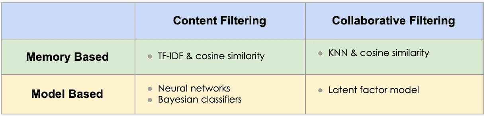

(图片由作者提供)

# **图因子分解如何为推荐系统工作**

如上所述，诸如 KNN 的协作过滤方法可以在不知道电影和用户属性的情况下预测电影评级。然而，当评级数据稀疏时，即典型用户只对几部电影进行了评级时，这种方法可能不会产生准确的预测。在图 1 中，如果鲍勃没有对*玩具总动员*评分，KNN 无法预测爱丽丝对*钢铁侠*的评分，因为爱丽丝和鲍勃之间没有路径，爱丽丝本身也没有“邻居”。为了应对这一挑战，图分解方法[1]将基于模型的方法与协作过滤方法相结合，以提高评级记录稀疏时的预测准确性。

图 2 说明了图分解方法的直觉。图分解也称为潜在因素或矩阵分解方法。目标是获得每个用户和电影的向量，该向量代表他们的潜在特征。在这个例子中(图 2)，向量的维数被指定为 2。电影向量的两个元素 *x* ( *i* )表示这部电影的浪漫程度和动作内容，用户向量的两个元素 *θ* ( *j* )分别表示用户对浪漫和动作内容的偏好程度。对用户 *j* 将给予电影 *i* 的评价的预测是 *x* ( *i* )和 *θ* ( *j* )的点积，因为我们预期这两个向量的更好的对齐表示用户对电影的更高程度的偏好。

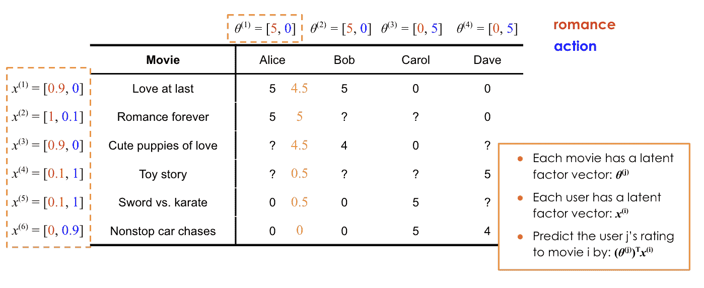

图。2(图片由作者提供)。该表显示了由 4 个用户给出的 6 部电影的评级记录。等级在 0 到 5 的范围内。缺失的评级用问号表示。 *θ(j)* 和 x(i)代表潜在因子向量。Alice 的评级预测是根据潜在因素计算得出的，并在真实值旁边显示为橙色。

图 2 中的例子仅仅是为了说明图分解方法的直观性。实际上，每个矢量元素的含义通常是未知的。向量实际上是随机初始化的，并通过最小化下面的损失函数得到“训练”[1]。

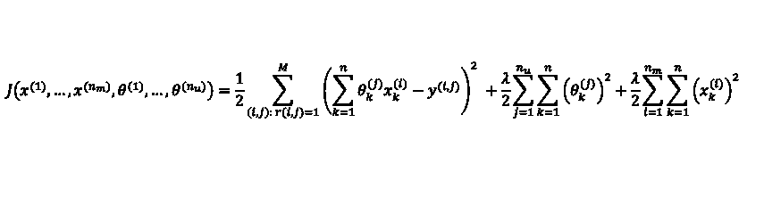

其中 *M* 为评分记录数， *n* 为潜在因子向量的维数， *y* ( *i* ， *j* )为用户 *j* 给电影 *i* 的评分，𝝀为正则化因子。第一项本质上是预测的平方误差(k 上的 *θ(j)_k* 和x(i)_k 之和)，第二项是避免过拟合的正则化项。损失函数的第一项也可以用矩阵的形式表示，

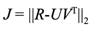

其中 *R* 是以 *y* ( *i* ， *j* )为元素的评分矩阵， *U* 和 *V* 分别是由用户和电影的潜在因素向量构成的矩阵。最小化预测的平方误差等价于最小化 *R* - *UV^T* 的 Frobenius 范数。因此，这种方法也被称为矩阵分解法。

您可能想知道为什么我们也将这种方法称为图分解方法。如前所述，评级矩阵 *R* 很可能是一个稀疏矩阵，因为不是所有的用户都会给所有的电影评级。基于存储效率的考虑，这种稀疏矩阵往往存储为一个图，其中每个顶点代表一个用户或一部电影，每个边代表一条评分记录，其权重作为评分。如下所示，用于优化损失函数并由此获得潜在因子的梯度下降算法也可以表示为图形算法。

*θ(j)_k* 和 x(i)_k 的偏导数可以表示如下:

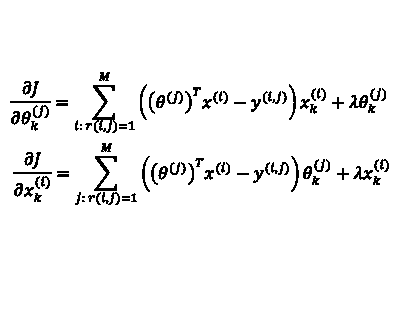

上面的等式表明，顶点上的潜在向量的偏导数只取决于它的边和邻居。对于我们的例子，用户向量的偏导数仅由用户之前已经评级的电影的评级和潜在向量来确定。这一特性允许我们将评级数据存储为图表(图 5 ),并使用图表算法来获取电影和用户的潜在因素。用户和电影特征可通过以下步骤获得:

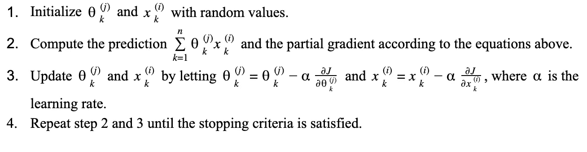

(图片由作者提供)

值得一提的是，计算导数和更新潜在因子可以在 Map-Reduce 框架中进行，其中步骤 2 可以针对每个*边* _( *i* 、 *j* )(即评级)并行进行，步骤 3 也可以针对每个*顶点 i* (即用户或电影)并行进行。

# **为什么您需要一个图表数据库来进行推荐**

对于工业应用程序，数据库可以容纳数亿用户和电影，以及数十亿条评级记录，这意味着评级矩阵 A、特征矩阵 U 和 V，加上其他中间变量，在模型训练期间可以消耗万亿字节的内存。这种挑战可以通过在图形数据库中训练潜在特征来解决，其中评级图形可以分布在多节点集群中并且部分存储在磁盘上。此外，图形结构的用户数据(即评级记录)首先存储在数据库管理系统中。数据库内模型训练还避免了将图形数据从 DBMS 导出到其他机器学习平台，从而更好地支持对进化训练数据的连续模型更新。

## **如何在 TigerGraph 中构建推荐系统**

在这一部分，我们将在 TigerGraph Cloud 上提供一个图形数据库(免费)，加载一个电影评级图，并在数据库中训练一个推荐模型。按照下面的步骤，你将在 15 分钟内拥有一个电影推荐系统。

按照[创建您的第一个 TigerGraph 实例](https://www.tigergraph.com/2020/01/20/taking-your-first-steps-in-learning-tigergraph-cloud/)(前 3 步)到**在 TigerGraph Cloud** 上提供一个免费实例。第一步，选择*数据库内机器学习推荐*作为入门套件。第三步，选择 TG.Free。

按照[tiger graph 云门户](https://www.tigergraph.com/2020/01/20/taking-your-first-steps-in-learning-tigergraph-cloud/)入门和**登录 GraphStudio** 。在*将数据映射到图形*页面，您将看到数据文件是如何映射到图形的。在这个初学者工具包中， [MovieLens-100K](https://grouplens.org/datasets/movielens/) 文件已经上传到实例中。 [MovieLens-100K](https://grouplens.org/datasets/movielens/) 数据集有两个文件:

*   movieList.csv 有两列显示每部电影的 id 和电影名称(电影年份)。
*   rating.csv 是用户对电影的评级列表。这三列包含用户 id、电影 id 和分级。

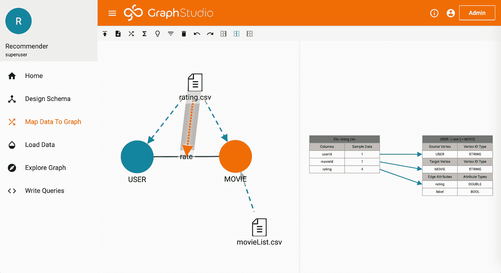

图 3(图片由作者提供)。*将数据映射到图形*页面

**进入加载数据页面，点击开始/恢复加载**。加载完成后，您可以在右侧看到图表统计信息。MovieLens-100K 数据集有 944 个用户对 1682 部电影给出的 100，011 条评级记录。

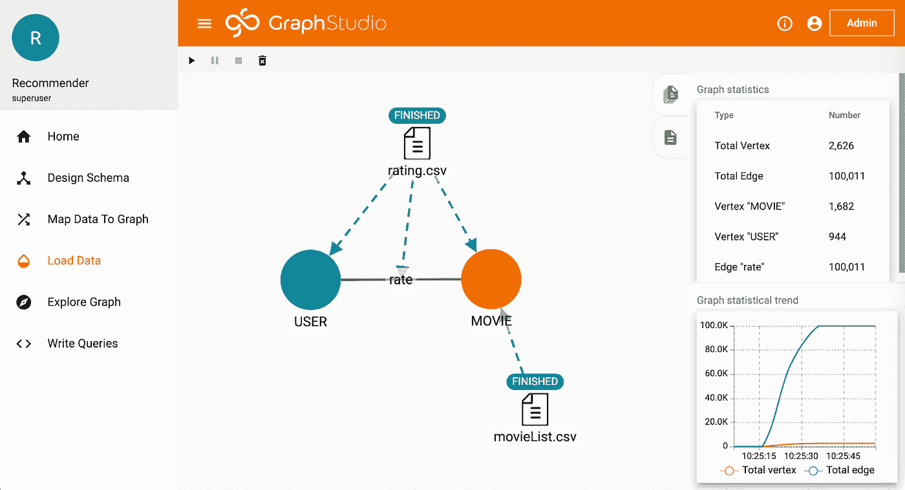

图 4(图片由作者提供)。*加载数据*页面。

加载完成后，您可以在右侧看到图表统计信息。在 *Explore Graph* 页面中，您可以看到我们刚刚创建了一个二分图，其中每个电影和用户的信息存储在顶点中，评级记录存储在边中。

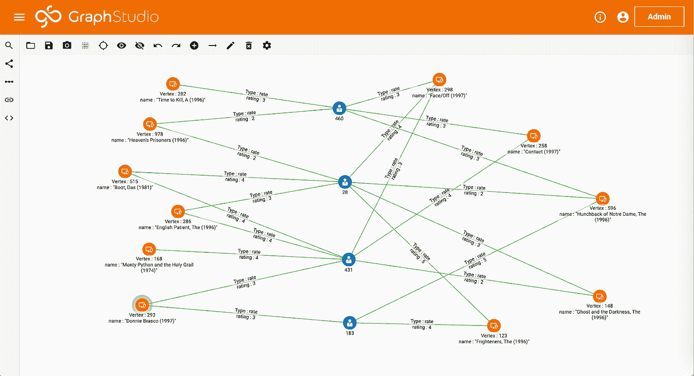

图 5(图片由作者提供)。*探索图*页面。

在*编写查询*页面中，您会发现我们的推荐系统所需的查询已经添加到数据库中。这些查询是用 TigerGraph 的查询语言 GSQL 编写的。**点击安装所有查询**将所有 GSQL 查询编译成 C++代码。您还可以在此页面上看到自述文件查询。按照下面的步骤用电影分级记录建立一个推荐。

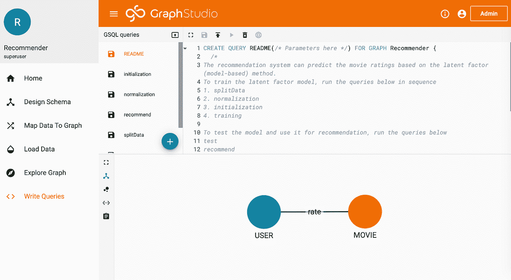

图 6(图片由作者提供)。*编写查询*页面

**运行 splitData 查询**

该查询将评级数据分为验证集和训练集。测试数据的分数默认设置为 30%。(即 30%的评级数据将用于模型验证，其余 70%将用于模型训练)。该查询还输出总数据集、验证数据集和训练数据集的大小。

**运行规范化查询**

该查询通过用电影的平均评分减去每个评分来标准化评分。每部电影的平均评级是根据训练数据计算的。

**运行初始化查询**

该查询初始化用户和电影的潜在因素向量。潜在因素向量中的元素由正态分布随机数生成器初始化。查询输入是标准偏差和正态分布的平均值。

**运行培训查询**

该查询使用梯度下降算法训练推荐器模型。默认情况下，特征数量设置为 19。该数字必须与初始化查询中的 num_latent_factors 相同。查询输入是学习率、正则化因子和训练迭代次数。该查询输出每次迭代的均方根误差(RMSE)

计算出潜在因素后，我们可以测试并使用该模型进行推荐。

**运行测试查询**

该查询输出用户提供的真实评级以及模型预测的评级。查询输入是一个用户 id。查询输出是用户给出的所有评级和评级预测

**运行推荐查询**

该查询输出推荐给用户的前 10 部电影。基于评级预测推荐电影。

# 结论

在图数据库中训练机器学习模型有可能实现推荐模型的实时更新。在本文中，我们介绍了图分解方法的机制，并展示了一个使用 TigerGraph 云服务构建自己的电影推荐系统的分步示例。一旦您熟悉了这个例子，您应该有信心根据您的用例定制这个推荐系统。

# **参考**

[1] Ahmed，Amr 等.“分布式大规模自然图分解”*第 22 届国际万维网会议论文集* (2013)