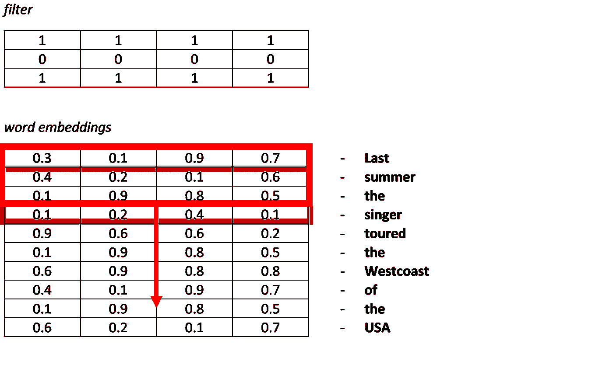
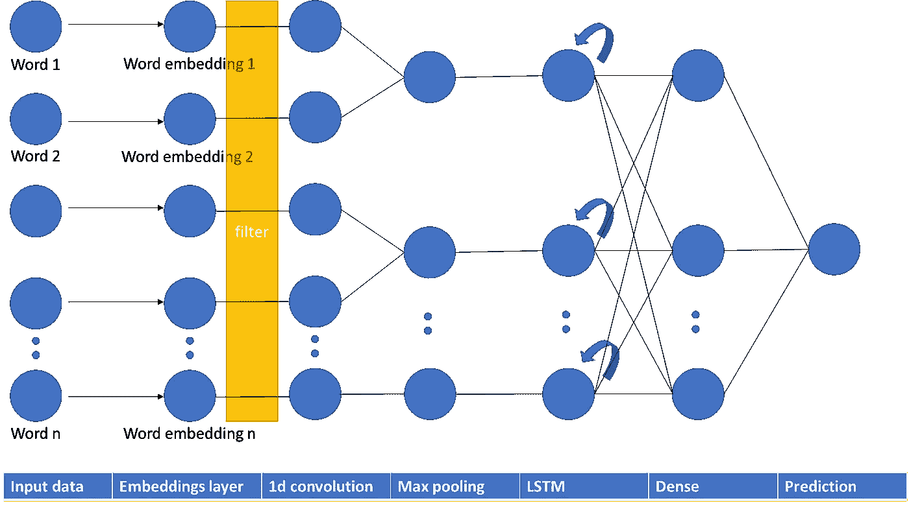
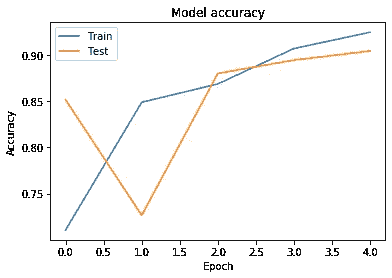

# 如何构建递归神经网络检测假新闻

> 原文：<https://towardsdatascience.com/how-to-build-a-recurrent-neural-network-to-detect-fake-news-35953c19cf0b?source=collection_archive---------12----------------------->

在一个联系越来越紧密的世界里，谎言更容易传播。事实证明，有了由被分类为可靠或不可靠的新闻文章组成的数据集，就有可能检测出假新闻。在本教程中，我们将建立一个具有卷积和 LSTM 细胞的神经网络，在 [Kaggle 假新闻挑战](https://www.kaggle.com/c/fake-news/)中给出前 5 名的性能。

由 [u/Borysk5](https://www.reddit.com/r/MapPorn/comments/aotm0b/which_countries_ban_fake_news/) 制作的地图

**我们试图探测什么？** 如上图所示，假新闻是全世界的问题。中国对假新闻的定义可能与中东或美国有很大不同。数据决定了检测假新闻的定义。我们在这个例子中使用的数据集来自 Kaggle，一个举办机器学习竞赛的网站。数据集由带有可靠或不可靠标签的新闻文章组成。如果一条新闻不可靠，它就被认为是假新闻。

数据集中的假新闻文章示例:

> *被证明是真的五大阴谋论因为唐纳德·特朗普在每个选举年都竞选总统，媒体上对他偏袒的指控飞来飞去，这和共和国本身一样古老。但今年，阴谋论者声称，MSM 不仅是不诚实的希拉里的囊中之物，而且还积极努力，通过虚假的民调、虚假的故事以及与候选人的猖獗和非法勾结来确保她的当选。谢谢你，维基解密(……)我知道希拉里克林顿删除的邮件在哪里，也知道如何合法获取。*

数据集中一篇可靠文章的例子:

> 美国职业棒球大联盟的春季训练又开始了，纽约大都会队的游击手路易斯·吉约莫已经给这个大联盟俱乐部留下了深刻的印象。周四，迈阿密马林鱼队的游击手 Adeiny Hechavarria 挥棒丢掉了球棒。球棒飞向大都会队的休息区，队员们争先恐后地躲开。然而，吉约姆没有离开他的位置，而是在蝙蝠飞过他的头时抓住了它。

**算法如何工作** 文本有多种格式。推特上的文字可能真的很乱。新闻文章可以使用大量的空行。每个自然语言处理任务的第一步是清理文本，删除空行和不必要的标点符号。

下一步是将单词转换成数字，因为计算机不能阅读单词。有多种方法可以做到这一点。最简单的方法是为每个独特的单词分配数字，然后将其用作模型的输入。因此，句子“去年夏天，歌手游览了美国西海岸”将变成[1 2 3 4 5 3 6 7 3 8]。如你所见，每个独特的单词都被赋予了一个新的编号。另一种更常见的方法是使用预训练的单词嵌入。单词被转换成张量表示，而不是转换数字中的每个单词。因此，当使用四维嵌入时，每个(唯一的)单词都被转换成四个数字的组合。单词嵌入工作得如此好是因为单词的语义被捕获，具有相同含义的单词具有相似的张量值，并且与其他单词组的差异也是相似的。下面的例子形象地说明了这一点。正如你所看到的，当单词是阴性时，所有的单词都有更大的 Y 值。

来源:斯坦福大学

在单词被转换成单词嵌入之后，单词被输入到神经网络中。这个神经网络由不同的层组成。第一层是卷积层。卷积是一种可以从数据中提取要素的过滤器。例如，在图像检测中，卷积可用于检测边缘或形状。在自然语言处理中，卷积也可以提高性能。下面的示例显示了一个过滤器，它提取中间有一个单词的两个单词之间的关系。在每一步中，滤波器与字嵌入值相乘。过滤值 1 乘以单词嵌入值得到单词嵌入值，而过滤值 0 得到 0。

下一层是最大池层。这一层在张量上迭代并取最大值。这样，特征空间被压缩。这一步确保重要的特征被保留，而空白被删除。

下一层是长短期记忆(LSTM)层。普通的 LSTM 单元由一个单元、一个输入门、一个输出门和一个遗忘门组成。细胞在任意的时间间隔内记忆数值，三个门调节进出细胞的信息流。更多关于 LSTM 层的信息可以在这里找到。

进行预测之前的最后一层是完全连接的层。这是一个常规的神经网络层，其中所有节点都相互连接。整体网络架构如下所示:

**代码** 代码是在 Google Colab 中编程的。数据可在此下载:

[https://www.kaggle.com/c/fake-news/data](https://www.kaggle.com/c/fake-news/data)

Google Colab 环境可以在以下位置找到:

[https://github . com/matdekoning/FakeNewsClassifier/blob/master/FakeNewsClassifier . ipynb](https://github.com/matdekoning/FakeNewsClassifier/blob/master/FakeNewsClassifier.ipynb)

这个 Google Colab 环境将引导你通过编码递归卷积神经网络。在代码中，首先导入所需的库(即 Keras 和 Tensorflow)。该代码检查是否安装了 Tensorflow 2.0，如果安装了旧版本，将进行更新。如果您更新了 Tensorflow，请重新启动网页。在第二个单元格中，您可以填充您的 Google Drive 环境。这是一种连接数据集的简单方法。将数据集上传到 Google drive 上的主文件夹，挂载 Google drive，在 cell 3 中可以在 Google Colab 环境中导入数据集。

**结果** 结果如下图所示:

经过 5 分钟的训练，该模型达到了 0.9041 的验证精度，这意味着 10 篇新闻文章中有超过 9 篇被正确分类为可靠与否。在 Kaggle 的提交数据集上进行预测后，该算法获得了 0.96 的分数。这个分数是前 5 名的表现。

事实证明，这种架构对于假新闻检测非常有效。具有池层的卷积的优点是执行时间短得多，而性能保持不变。这种架构在其他自然语言分类任务中也很有用。该模型在有毒评论分类以及情感分析方面给出了良好的结果。