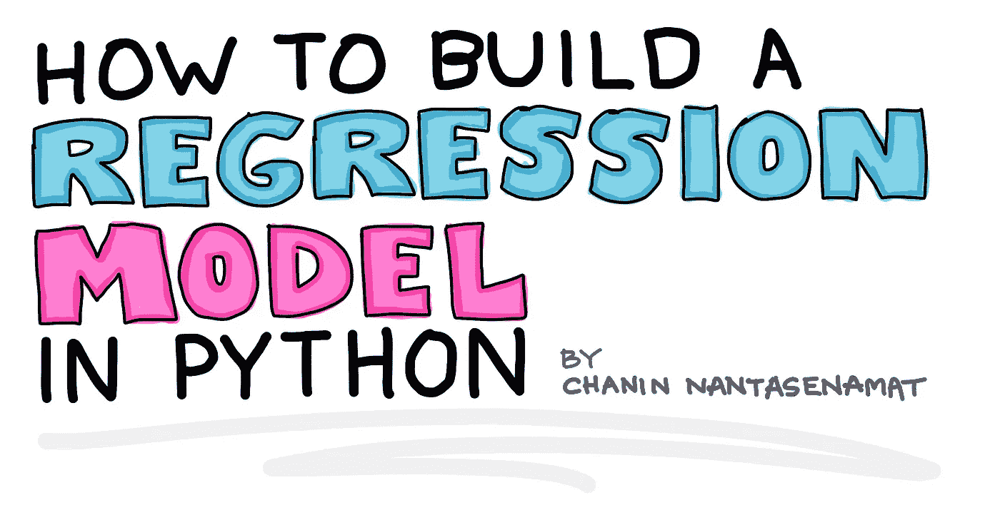

# 如何用 Python 构建回归模型

> 原文：<https://towardsdatascience.com/how-to-build-a-regression-model-in-python-9a10685c7f09?source=collection_archive---------3----------------------->



## 数据科学

## 详细直观的分步演练

如果你是一名有抱负的数据科学家或资深数据科学家，这篇文章就适合你！在本文中，我们将使用 Python 构建一个简单的回归模型。为了增加一点趣味，我们将不会使用广受欢迎且无处不在的*波士顿房屋*数据集，而是使用一个简单的生物信息学数据集。特别是，我们将使用 ***德莱尼溶解度*** 数据集，它代表了计算药物发现中一个重要的物理化学性质。

有抱负的数据科学家会发现逐步教程特别容易获得，而经验丰富的数据科学家可能希望找到一个新的具有挑战性的数据集，以尝试他们最先进的机器学习算法或工作流。

# 1.我们今天在建造什么？

一个回归模型！我们将使用 Python 来完成这项工作。在此过程中，我们将使用一个生物信息学数据集(从技术上讲，它是化学信息学数据集)来建立模型。

特别是，我们要预测小分子水溶性的对数值。水溶性值是分子溶于水的能力的相对量度。它是有效药物的重要理化性质。

有什么比卡通插图更好的方式来了解我们今天正在建造的概念呢？


**化学信息学数据集的机器学习模型构建的示意性工作流程的卡通图示，其中目标响应变量被预测为输入分子特征的函数。**从技术上讲，这一过程被称为*定量构效关系* (QSAR)。(由 Chanin Nantasenamat 绘制

# 2.德莱尼溶解度数据集

## 2.1.数据理解

顾名思义， ***德莱尼溶解度*** 数据集由一组 1144 个分子的 ***水溶性*** 值及其相应的化学结构组成。对于这些，在生物学领域之外，有一些术语我们将花一些时间来澄清。

***分子*** 或有时被称为小分子或化合物是由原子组成的化学实体。让我们打个比方，让我们把原子想象成乐高积木，1 个原子就是 1 个乐高积木。当我们用几块乐高积木来建造某样东西时，不管是房子、汽车还是某个抽象的实体；这样构建的实体可与分子相媲美。由此，我们可以将原子形成一个分子的具体排列和连接方式称为 ***化学结构*** 。


**把分子的构造比喻成乐高积木。**这个黄色的房子来自乐高 10703 创意建造者盒子。(由 Chanin Nantasenamat 绘制)

那么你正在构建的每个实体有什么不同呢？它们的不同之处在于区块的空间连通性(即各个区块是如何连接的)。在化学术语中，每个分子的化学结构不同。因此，如果你改变了积木的连接性，那么你就有效地改变了你正在建造的实体。对于分子，如果原子类型(例如碳、氧、氮、硫、磷、氟、氯等。)或原子团(例如羟基、甲氧基、羧基、醚基等。)被改变，那么分子也将被改变，从而成为新的化学实体(即产生新的分子)。


**一个分子模型的卡通插图。**红色、蓝色、深灰色和白色代表氧、氮、碳和氢原子，而连接这些原子的浅灰色是键。每个原子都可以媲美一块乐高积木。上面显示的构建分子可与构建的乐高实体(如本文上面显示的黄色房子)相媲美。(由 Chanin Nantasenamat 绘制)

要成为一种有效的药物，分子将需要被人体吸收和分布，这种特性直接由 ***水溶性*** 决定。溶解性是研究人员在设计和开发治疗药物时考虑的一个重要特性。因此，由于溶解性差而不能到达所需目的地的有效药物将是差的候选药物。

## 2.2.正在检索数据集

Delaney 在名为 [ESOL:从分子结构直接估算水溶性](https://pubs.acs.org/doi/10.1021/ci034243x)的研究论文中进行的水溶性数据集可作为[补充文件](https://pubs.acs.org/doi/10.1021/ci034243x)获得。为了您的方便，我们还下载了整个 [**德莱尼溶解度数据集**](https://github.com/dataprofessor/data/blob/master/delaney.csv) ，并在[数据 GitHub 教授](https://github.com/dataprofessor)上提供。

**Delaney 溶解度数据集原始版本的预览。**[完整版](https://github.com/dataprofessor/data/blob/master/delaney.csv)可在[数据教授 GitHub](https://github.com/dataprofessor) 上获得。

**代码练习**

我们开始吧，好吗？

启动 Google Colab 或您的 Jupyter 笔记本，运行以下代码单元。

**代码解释**

现在让我们来看看每个代码单元的含义。

第**个编码单元**，

*   正如代码字面上所说，我们将把`pandas`库作为`pd`导入。

**第二代码单元**:

*   将德莱尼溶解度数据集所在的 URL 分配给`delaney_url`变量。
*   通过`pd.read_csv()`函数读入德莱尼溶解度数据集，并将结果数据帧分配给`delaney_df`变量。
*   调用`delaney_df`变量返回输出值，该输出值实际上打印出包含以下 4 列的数据帧:

1.  **化合物 ID** —化合物的名称。
2.  **实测对数(溶解度:mol/L)**—Delaney 在原始研究文章中报告的实验水溶性值。
3.  **ESOL 预测对数(溶解度:mol/L)**—Delaney 在原始研究文章中报告的预测水溶性值。
4.  **SMILES** —化学结构信息的一维编码

## 2.3.计算分子描述符

需要注意的一点是，作者最初提供的上述数据集还不能开箱即用。特别是，我们将不得不使用 ***SMILES 符号*** 通过 *rdkit* Python 库来计算 ***分子描述符*** ，这在以前的媒体文章( [*如何使用机器学习进行药物发现*](/how-to-use-machine-learning-for-drug-discovery-1ccb5fdf81ad) )中以逐步的方式进行了演示。

需要注意的是， ***微笑符号*** 是对分子化学结构信息的一维描绘。 ***分子描述符*** 是对分子独特的物理化学性质的定量或定性描述。

让我们将分子描述符视为一种以数字形式唯一表示分子的方法，机器学习算法可以理解这种方法，以学习、预测和提供关于 ***结构-活性关系*** 的有用知识。如前所述，原子的特定排列和连接产生不同的化学结构，从而决定了它们将产生的最终活性。这种概念被称为结构-活性关系。

包含计算的分子描述符及其相应响应变量(对数)的数据集的处理版本如下所示。这个处理过的数据集现在准备好用于机器学习模型构建，其中前 4 个变量可以用作 **X** 变量，而对数变量可以用作 **Y** 变量。

**德莱尼溶解度数据集处理版本的预览。**实际上，原始版本中的 SMILES 符号被用作计算 4 个分子描述符的输入，这在之前的[媒体文章](/how-to-use-machine-learning-for-drug-discovery-1ccb5fdf81ad)和 [YouTube 视频](https://www.youtube.com/watch?v=VXFFHHoE1wk)中有详细描述。[完整版](https://github.com/dataprofessor/data/blob/master/delaney.csv)可在[数据教授 GitHub](https://github.com/dataprofessor) 上获得。

4 个分子描述符和响应变量的快速描述如下:

1.  **cLogP** —辛醇-水分配系数
2.  **MW** —分子量
3.  **RB**—可旋转债券数量
4.  **AP** *—* 芳香比例=芳香原子数/重原子总数
5.  **日志** —水溶性的日志

**代码练习**
让我们继续读入包含计算出的分子描述符的 CSV 文件。

**代码解释**

现在让我们来看一下代码单元的含义。

*   将 Delaney 溶解度数据集(带有计算的描述符)所在的 URL 分配给`delaney_url`变量。
*   通过`pd.read_csv()`函数读入德莱尼溶解度数据集(带有计算出的描述符),并将结果数据帧赋给`delaney_descriptors_df`变量。
*   调用`delaney_descriptors_df`变量返回输出值，该输出值实际上打印出包含以下 5 列的数据帧:

1.  莫洛格普
2.  MolWt
3.  NumRotatableBonds
4.  芳香比例
5.  日志

前 4 列是使用`rdkit` Python 库计算的分子描述符。第五列是响应变量*日志*。

# 3.数据准备

## 3.1.将数据分离为 X 和 Y 变量

在使用`scikit-learn`库构建机器学习模型时，我们需要将数据集分成输入特征( **X** 变量)和目标响应变量( **Y** 变量)。

**代码练习**

遵循并实现以下 2 个代码单元，将包含在`delaney_descriptors_df`数据帧中的数据集分成 **X** 和 **Y** 子集。

**代码解释**

让我们来看看这两个代码单元。

***第一个编码单元格:***

*   这里我们使用 drop()函数专门“删除”logS 变量(这是 **Y** 变量，我们将在下一个代码单元格中处理它)。因此，我们将有 4 个剩余变量分配给 **X** 数据帧。特别是，我们将`drop()`函数应用于`delaney_descriptors_df`数据帧，如在`delaney_descriptors_df.drop(‘logS’, axis=1)`中，其中第一个输入参数是我们想要删除的特定列，而`axis=1`的第二个输入参数指定第一个输入参数是一列。

**第二编码单元:**

*   这里，我们通过`delaney_descriptors_df.logS`从`delaney_descriptors_df`数据帧中选择一列(‘logS’列),并将其分配给 **Y** 变量。

## 3.2.数据分割

在评估模型性能时，标准做法是将数据集拆分为 2 个(或更多分区)分区，这里我们将使用 80/20 的拆分比率，其中 80%的子集将用作训练集，20%的子集将用作测试集。由于 scikit-learn 要求将数据进一步分离到它们的 **X** 和 **Y** 组件，因此`train_test_split()`函数可以轻松执行上述任务。

**代码练习**

让我们实现以下两个代码单元。

**代码解释**

让我们看看代码在做什么。

***第一个编码单元格:***

*   这里我们将从 scikit-learn 库中导入`train_test_split`。

***第二个编码单元格:***

*   我们首先定义`train_test_split()`函数将生成的 4 个变量的名称，这包括`X_train`、`X_test`、`Y_train`和`Y_test`。前 2 个对应于训练和测试集的 X 数据帧，而后 2 个对应于训练和测试集的 Y 变量。

# 4.线性回归模型

现在，有趣的部分来了，让我们建立一个回归模型。

## 4.1.训练线性回归模型

**代码练习**

这里，我们将使用 scikit-learn 中的`LinearRegression()`函数，使用普通的最小二乘线性回归建立一个模型。

**代码解释**

让我们看看代码在做什么

**第一个编码单元:**

*   这里我们从 scikit-learn 库中导入了 linear_model

**第二编码单元:**

*   我们将`linear_model.LinearRegression()`函数赋给`model`变量。
*   使用命令`model.fit(X_train, Y_train)`构建模型，由此 model.fit()函数将把`X_train`和`Y_train`作为输入参数来构建或训练模型。特别是，`X_train`包含输入特征，而`Y_train`包含响应变量(日志)。

## 4.2.应用经过训练的模型来预测来自训练和测试集的日志

如上所述，`model.fit()`训练模型，训练后的模型保存在`model`变量中。

**代码练习**

我们现在将应用经过训练的模型对训练集进行预测(`X_train`)。

我们现在将应用训练好的模型对测试集进行预测(`X_test`)。

**代码解释**

让我们开始解释。

以下解释将仅涵盖训练集(`X_train`)，因为通过执行以下简单调整，完全相同的概念可以同样地应用于测试集(`X_test`):

*   将`X_train`替换为`X_test`
*   将`Y_train`替换为`Y_test`
*   将`Y_pred_train`替换为`Y_pred_test`

其他一切都完全一样。

***第一个编码单元格:***

*   通过调用`model.predict()`并使用`X_train`作为输入参数来执行对日志值的预测，这样我们就可以运行命令`model.predict(X_train)`。产生的预测值将被赋给`Y_pred_train`变量。

***第二个编码单元:***

模型性能指标现已打印。

*   回归系数值从`model.coef_`获得，
*   y 轴截距值从`model.intercept_`获得，
*   使用`mean_squared_error()`函数计算均方误差(MSE ),使用`Y_train`和`Y_pred_train`作为输入参数，因此我们运行`mean_squared_error(Y_train, Y_pred_train)`
*   使用`Y_train`和`Y_pred_train`作为输入参数，使用`r2_score()`函数计算决定系数(也称为 R ),因此我们运行`r2_score(Y_train, Y_pred_train)`

## 4.3.打印出回归方程

线性回归模型的方程实际上是模型本身，您可以插入输入特征值，方程将返回目标响应值(对数)。

**代码练习**

现在让我们打印出回归模型方程。

**代码解释**

***第一个编码单元格:***

*   回归模型方程的所有组成部分都是从`model`变量中导出的。在`model.intercept_`、`model.coef_[0]`、`model.coef_[1]`、`model.coef_[2]`和`model.coef_[3]`中提供了 y 截距和 LogP、MW、RB 和 AP 的回归系数。

***第二码单元格:***

*   在这里，我们通过`print()`功能将组件放在一起并打印出方程式。

# 5.实验测井与预测测井的散点图

现在，我们将通过散点图来直观显示实验与预测测井曲线的相对分布。这样的情节可以让我们很快看到模型的性能。

**代码练习**

在接下来的例子中，我将向你展示如何不同地布置 2 个子图，即:(1)垂直图和(2)水平图。

**代码解释**

现在让我们看看实现垂直和水平图的底层代码。在这里，我提供了两个选项供您选择，让您选择是在垂直布局还是水平布局中使用这个多点图的布局。

***导入库***

两者都从导入必要的库开始，即`matplotlib`和`numpy`。特别是，大部分代码将使用`matplotlib`来创建绘图，而`numpy`库在这里用于添加趋势线。

***定义图尺寸***

接下来，我们通过`plt.figure(figsize=(5,11))`为垂直绘图指定图形尺寸(图形的宽度和高度)，通过`plt.figure(figsize=(11,5))`为水平绘图指定图形尺寸。特别是，(5，11)告诉 matplotlib，垂直图的图形应该是 5 英寸宽和 11 英寸高，而水平图则使用相反的图形。

***定义子图*** 的占位符

我们将告诉 matplotlib，我们希望有 2 行和 1 列，因此它的布局将是垂直绘图。这是由`plt.subplot(2, 1, 1)`指定的，其中`2, 1, 1`的输入参数指的是 2 行 1 列以及我们在它下面创建的特定子图。换句话说，让我们把使用`plt.subplot()`功能看作是通过为图形包含的各种子图创建占位符来构建图形的一种方式。垂直图的第二个子图由`plt.subplot()`功能的第三个输入参数中的值 2 指定，如`plt.subplot(2, 1, 2)`所示。

通过应用相同的概念，通过容纳 2 个子图的`plt.subplot(1, 2, 1)`和`plt.subplot(1, 2, 2)`创建水平图的结构为 1 行 2 列。

***创建散点图***

既然图的一般结构已经就绪，现在让我们添加数据可视化。分别使用`plt.scatter(x=Y_train, y=Y_pred_train, c=”#7CAE00", alpha=0.3)`中的`plt.scatter()`函数添加数据散点，其中`x`指的是用于 *x* 轴的数据列，`y`指的是用于 *y* 轴的数据列，`c`指的是用于散点数据的颜色，`alpha`指的是 alpha 透明度级别(散点数据的透明度，数值越低，透明度越高)。

***添加趋势线***

接下来，我们使用来自`numpy`的`np.polyfit()`和`np.poly1d()`函数以及来自`matplotlib`的`plt.plot ()`函数来创建趋势线。

```
*# Add trendline*
*# https://stackoverflow.com/questions/26447191/how-to-add-trendline-in-python-matplotlib-dot-scatter-graphs*
z = np.polyfit(Y_train, Y_pred_train, 1)
p = np.poly1d(z)
plt.plot(Y_test,p(Y_test),"#F8766D")
```

***添加 x 和 y 轴标签***

为了给 *x* 和 *y* 轴添加标签，我们使用了`plt.xlabel()`和`plt.ylabel()`功能。需要注意的是，对于垂直图，我们省略了顶部子图的 x 轴标签(*为什么？因为对于底部子图*，x 轴标签是多余的。

***保存图***

最后，我们将把构建好的图形保存到文件中，我们可以使用来自`matplotlib`的`plt.savefig()`函数，并指定文件名作为输入参数。最后，以`plt.show()`结束。

```
plt.savefig('plot_vertical_logS.png')
plt.savefig('plot_vertical_logS.pdf')
plt.show()
```

**视觉解释**

上一节提供了基于文本的解释，在这一节中，我们将对这个视觉解释做同样的解释，它利用颜色高亮来区分情节的不同组成部分。


**创建散点图的可视化说明。**这里我们用颜色高亮显示特定的代码行和它们对应的绘图组件。(由 Chanin Nantasenamat 绘制)

# 需要您的反馈

作为一名教育工作者，我喜欢听我如何改进我的内容。请在评论中告诉我:

1.  可视化插图有助于理解代码是如何工作的，
2.  视觉插图是多余的和不必要的，或者是否
3.  可视化插图补充了基于文本的解释，有助于理解代码是如何工作的。

## 订阅我的邮件列表，获取我在数据科学方面的最佳更新(偶尔还有免费赠品)!

# 关于我

我是泰国一所研究型大学的生物信息学副教授和数据挖掘和生物医学信息学负责人。在我下班后的时间里，我是一名 YouTuber(又名[数据教授](http://bit.ly/dataprofessor/))制作关于数据科学的在线视频。在我制作的所有教程视频中，我也在 GitHub 上分享 Jupyter 笔记本([数据教授 GitHub page](https://github.com/dataprofessor/) )。

[](https://www.youtube.com/dataprofessor?sub_confirmation=1) [## 数据教授

### 数据科学、机器学习、生物信息学、研究和教学是我的激情所在。数据教授 YouTube…

www.youtube.com](https://www.youtube.com/dataprofessor?sub_confirmation=1) 

## 在社交网络上与我联系

✅YouTube:[http://youtube.com/dataprofessor/](http://youtube.com/dataprofessor/)
♇网站:[http://dataprofessor.org/](https://www.youtube.com/redirect?redir_token=w4MajL6v6Oi_kOAZNbMprRRJrvJ8MTU5MjI5NjQzN0AxNTkyMjEwMDM3&q=http%3A%2F%2Fdataprofessor.org%2F&event=video_description&v=ZZ4B0QUHuNc)(在建)
♇LinkedIn:[https://www.linkedin.com/company/dataprofessor/](https://www.linkedin.com/company/dataprofessor/)
♇Twitter:[https://twitter.com/thedataprof](https://twitter.com/thedataprof)
♇Facebook:[http://facebook.com/dataprofessor/](https://www.youtube.com/redirect?redir_token=w4MajL6v6Oi_kOAZNbMprRRJrvJ8MTU5MjI5NjQzN0AxNTkyMjEwMDM3&q=http%3A%2F%2Ffacebook.com%2Fdataprofessor%2F&event=video_description&v=ZZ4B0QUHuNc)
♇github:[https://github.com/dataprofessor/](https://github.com/dataprofessor/)
♇insta gram:【t2t