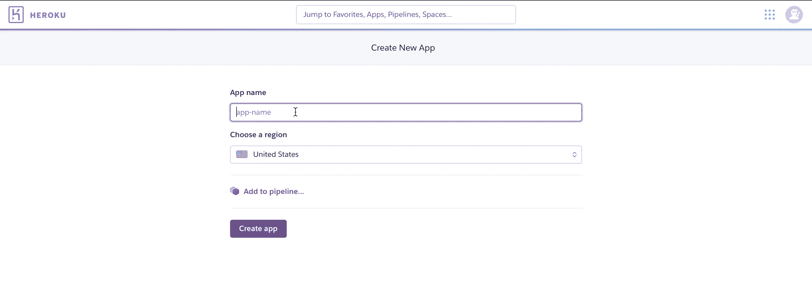
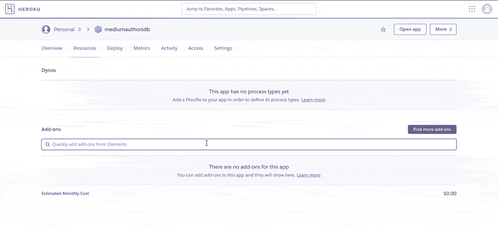
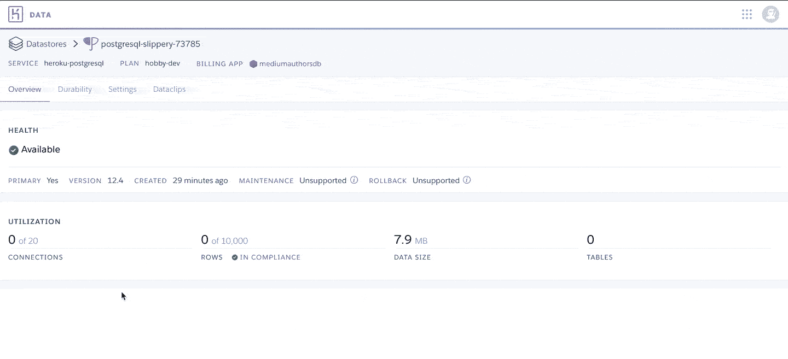
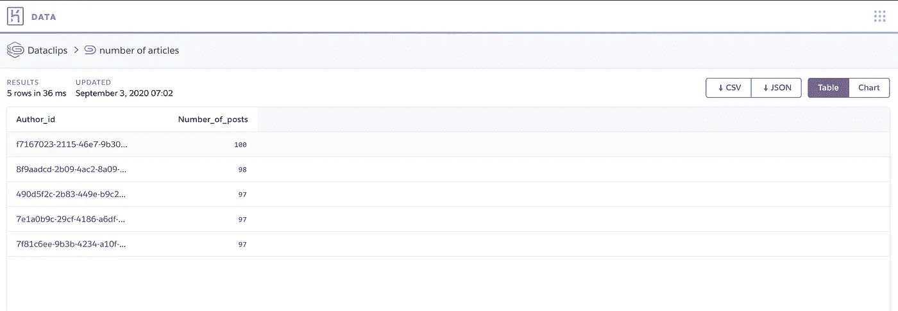

# 如何使用 Python 和 Heroku 从 CSV 文件构建关系数据库

> 原文：<https://towardsdatascience.com/how-to-build-a-relational-database-from-csv-files-using-python-and-heroku-20ea89a55c63?source=collection_archive---------8----------------------->

## 通过三个简单的步骤免费构建您自己的 PostgreSQL 数据库

对于较小的项目，CSV 是存储数据的好格式。但是，如果您想升级您的数据管理游戏呢？关系数据库为组织和管理您的数据提供了一种更可靠的方式。在这篇文章中，我展示了如何通过三个简单的步骤将 CSV 文件转换成 PostgreSQL 数据库。我还将讨论使用关系数据库的一些优点。

# 关系数据库的优势

关系数据库是一种将数据划分到具有共享数据点的链接表中的数据库。这些共享的数据点允许我们通过一个简单的查询来组合信息并创建新颖的表或视图。流行的关系数据库包括 [MySQL](https://www.mysql.com/) 、 [SQLite](https://www.sqlite.org/) 和 [PostgreSQL](https://www.postgresql.org) 。

构建一个合适的关系数据库需要时间和精力。但是，如果做得好，它有许多优势。

首先，关系数据库使您能够更容易地看到数据不同部分之间的关系。数据被划分到表中，并且可以使用包含简单数学运算的结构化查询语言(SQL)查询来组合(“联接”)。

其次，关系数据库提供了更好的数据管理，具有更高的一致性和灵活性。CSV 文件等其他格式很快变得难以管理，即使对于较小的项目也是如此。关系数据库允许您使用模式强制数据类型，从而减少了主要的潜在错误源。关系数据库还提供了更大的灵活性，因为您可以使用复杂的查询从相对简单的表中生成更复杂的数据。

第三，关系数据库解决了数据冗余的问题:一个好的关系数据库是围绕最小化数据重复和不一致的依赖关系而设计的，通过一个称为“规范化”的过程。[标准化是组织数据库中数据的过程](https://docs.microsoft.com/en-us/office/troubleshoot/access/database-normalization-description)，包括创建表格和定义表格之间的关系。

第四，关系数据库已成为行业标准，数据库管理系统(DBMS)通常会提供一组您希望用于任何数据库的高级功能，如备份、故障转移和镜像。

阅读下面的说明时有一个重要的警告:这篇文章是*而不是*用来解释如何为你的关系数据库设计和建立一个生产级架构。在为生产环境设计数据库时，您需要更仔细地考虑权限、创建只读版本还是写版本、版本控制等等。相反，我将展示如何快速、轻松地创建自己的数据库供个人使用。

记住这一点，让我们开始使用 Heroku 和 Python 从 CSV 文件构建一个关系数据库。

# 步骤 1:在 Heroku 上设置 PostgreSQL 数据库

我们将从在 [Heroku](http://www.heroku.com) 上设置 PostgreSQL 实例开始。Heroku 是基于亚马逊网络服务(AWS)的平台即服务(PaaS)，而[为 PostgreSQL](https://www.heroku.com/postgres) 提供了一个免费层。free 计划限制为 10，000 行，最大并发数为 20。您也将无法使用回滚和故障转移等更高级的功能，这两种功能对于任何生产级数据库都是可取的。它有一个手动备份功能，允许您生成和下载数据库的备份。

要在 Heroku 上设置 PostgreSQL 实例，首先登录您的 Heroku 帐户，从下拉菜单中创建一个新的应用程序。


创建一个新的应用程序(由作者创建)

为你的应用程序选择一个名称和地区，然后点击“创建应用程序”按钮。



为你的应用程序选择一个名字和地区

为您的新应用程序配置 PostgreSQL 数据库。



为你的 Heroku 应用提供一个数据库

最后，找到并复制您的数据库凭证(您将需要它们来设置 Python 中的连接)。就这样，您拥有了自己的 PostgreSQL 数据库并正在运行！



在 Heroku 上找到并复制你的数据库凭证

# 步骤 2:定义您的模式

在本例中，我们将构建一个由随机生成的*媒体作者及其文章组成的数据库，并将这些数据存储为两个 CSV 文件。第一个 CSV 文件(或:“表”)是“作者表”，第二个 CSV 文件包含他们的帖子的数据。这些 CSV 文件和用于生成它们的脚本[可以在 Github](https://gist.github.com/ngoet/1b0e8b14a4169e42d9192a9b18e73afa) 上获得。*

让我们来看看这些表的模式。“模式”是数据库中表的正式语言表示。它定义了列、它们的名称和类型、分区规则等等。

**authors** 表包含条目写入表中的时间戳(`row_timestamp`)、作者的通用唯一标识符(UUID(`author_id`)、作者的名和姓(`author_first_name`)；`author_last_name`)，以及他们的电子邮件地址(`email`)。

```
row_timestamp TIMESTAMP NOT NULL,
author_id VARCHAR PRIMARY KEY NOT NULL,
author_first_name VARCHAR NOT NULL,
author_last_name VARCHAR NOT NULL,
email VARCHAR NOT NULL
```

**posts** 表还包括一个`row_timestamp`，每篇文章的唯一标识符(`post_id`)，一个引用回`authors`表中`author_id`列的二级键，以及每篇文章的标题(`article_title`)。

```
row_timestamp TIMESTAMP NOT NULL,
post_id VARCHAR PRIMARY KEY NOT NULL,
author_id VARCHAR REFERENCES authors(author_id),
article_title VARCHAR NOT NULL
```

稍后在 PostgreSQL 数据库中设置表时，我们将使用这些模式。

# 第三步:一点 Python 的魔力

在我们的第三步也是最后一步，我们需要一些 Python 代码来使用 [psycopg2](https://www.psycopg.org) 库建立与 PostgreSQL 数据库的连接。我们首先创建三个函数，将表添加到数据库中，并将数据注入到数据库中。第一个函数`run_syntax`是一个助手函数，它使用数据库连接执行语法。第二个函数`create_table`接受模式定义、表和数据库名称，并将表添加到我们的数据库中。第三个函数`populate_table`获取一个 pandas 数据帧，并用该数据填充数据库中指定的表。

注意，我使用[环境变量](https://www.askpython.com/python/environment-variables-in-python)作为数据库访问凭证。即使对于较小的(非生产)项目，也不要在代码中包含这样的凭证，这是一个很好的做法。当您将代码推送到 Github 时，您可能会忘记删除它们，从而将您的数据库暴露给其他用户。

## 把所有的放在一起

要在 PostgreSQL 实例中设置表，您必须添加我们之前定义的模式定义，并添加一些代码来执行下面脚本中所示的`create_table`函数。

要将数据从 CSV 文件注入到这些表中，请使用以下脚本:

## 使用 IDE 或终端

要在 IDE 中使用上述代码，您必须将您的凭证作为环境变量添加到 Python 配置中(我使用 Pycharm)。或者，如果您想从终端运行上述脚本，您需要采取一些额外的步骤。首先，通过运行以下语法，将凭证作为环境变量添加到终端中，用您之前从 Heroku 获得的数据库凭证替换占位符。

```
hostname = <my_hostname>
user = <my_user>
password = <my_password>
database = <my_database>
```

第二步，您需要将环境变量传递给 Python 进程，方法是将以下代码添加到上面所示的`db_management`模块中:

```
os.environ["hostname"] = hostname
os.environ["user"] = user
os.environ["password"] = password
os.environ["database"] = database
```

最后，使用下面的命令，使用上面显示的`create_tables.py`和`populate_table.py`脚本，从终端执行 Python 代码来填充数据库:

```
python create_tables.py
python populate_tables.py
```

# 后续步骤:使用您的数据库

现在您有了一个可以连接和查询的 PostgreSQL 数据库。让我们检查一下这是否有效。Heroku 有一个简洁的数据剪辑功能，你可以用它在你的网站上嵌入查询输出，或者与合作者分享。



一个 Heroku 数据剪辑，显示了我们的数据库中前 5 名最多产的作者(语法:SELECT author_id，COUNT(post _ id)AS number _ of _ posts FROM posts GROUP BY author _ id ORDER BY number _ of _ posts desc 限制 5) (i *mage by author* )

准备好数据库后，您可以继续使用 [psycopg2](https://www.psycopg.org) 库直接在 Python 中管理数据，或者开始使用免费的数据库工具，如 [DBeaver](https://dbeaver.io) 。现在，您可以使用一系列简单的 SQL 命令来查看、管理您的数据并从中获得新的见解，或者将您的数据库用于其他应用程序，如仪表板或网站。

感谢阅读！

[](https://medium.com/@ndgoet/membership) [## 用我的推荐链接加入媒体。

### 作为一个媒体会员，你的会员费的一部分会给你阅读的作家，你可以完全接触到每一个故事…

medium.com](https://medium.com/@ndgoet/membership) 

**如果你喜欢这篇文章，这里还有一些你可能喜欢的文章:**

[](/creating-and-managing-elasticsearch-indices-with-python-f676ff1c8113) [## 使用 Python 创建和管理弹性搜索索引

### 从 CSV 文件创建 ES 索引以及使用 Python Elasticsearch 管理数据的实践指南…

towardsdatascience.com](/creating-and-managing-elasticsearch-indices-with-python-f676ff1c8113) [](/automating-unit-tests-in-python-with-hypothesis-d53affdc1eba) [## 使用假设在 Python 中自动化单元测试

### 单元测试是产生高质量代码的关键。以下是如何自动化测试 Python 代码。

towardsdatascience.com](/automating-unit-tests-in-python-with-hypothesis-d53affdc1eba) [](https://medium.com/python-in-plain-english/how-to-improve-your-python-code-style-with-pre-commit-hooks-e7fe3fd43bfa) [## 如何用预提交钩子改进 Python 代码风格

### 实施代码风格是简化开发过程的关键，下面是如何实现自动化。

medium.com](https://medium.com/python-in-plain-english/how-to-improve-your-python-code-style-with-pre-commit-hooks-e7fe3fd43bfa) 

*请仔细阅读* [*本免责声明*](https://medium.com/@ndgoet/disclaimer-5ad928afc841) *中的任何内容后再依托* [*我的 Medium.com 文章*](/@ndgoet) *。*