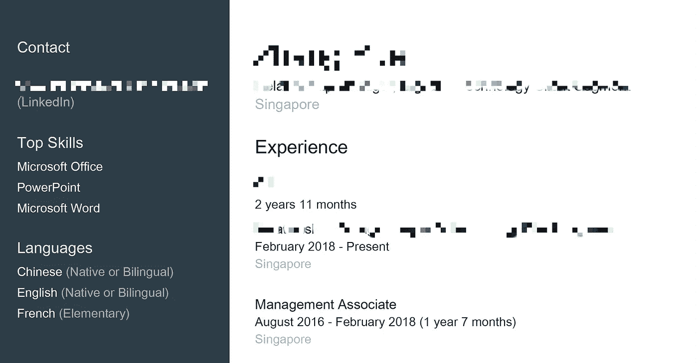

# 如何构建简历解析工具

> 原文：<https://towardsdatascience.com/how-to-build-a-resume-parsing-tool-ae19c062e377?source=collection_archive---------4----------------------->

## 我发现的最有效的方法

照片由 [Pexels](https://www.pexels.com/photo/graphs-job-laptop-papers-590016/?utm_content=attributionCopyText&utm_medium=referral&utm_source=pexels) 的 [Lukas](https://www.pexels.com/@goumbik?utm_content=attributionCopyText&utm_medium=referral&utm_source=pexels) 拍摄

当我还是一个大学的学生时，我很好奇简历的自动化信息提取是如何工作的。我将准备各种格式的简历，并将它们上传到求职门户网站，以测试背后的算法实际上是如何工作的。我总是想自己造一个。因此，在最近几周的空闲时间里，我决定构建一个简历解析器。

起初，我认为这相当简单。只是用一些模式去挖掘信息**但是事实证明我错了**！建立一个简历解析器是很困难的，你可以想象简历的布局有很多种。

例如，有些人会把日期放在简历标题的前面，有些人不写工作经历的时间，有些人不在简历中列出公司。这使得简历解析器更加难以构建，因为没有固定的模式可以捕获。

经过一个月的工作，根据我的经验，我想分享一下哪些方法效果很好，以及在开始构建自己的简历解析器之前应该注意哪些事项。

在进入细节之前，这里有一个视频短片，展示了我的简历解析器的最终结果。

# 数据收集

我刮了多个网站检索了 800 份简历。简历要么是 PDF 格式，要么是 doc 格式。

我使用的工具是谷歌的 Puppeteer (Javascript ),从几个网站收集简历。

数据收集的问题之一是找到一个好的来源来获取简历。在您能够发现它之后，只要您不太频繁地访问服务器，抓取部分就不会有问题。

之后我选择了一些简历，手动将数据标注到各个字段。标记工作已经完成，这样我就可以比较不同解析方法的性能。

# 预处理数据

剩下的部分，我用的编程是 Python。有几个软件包可以将 PDF 格式解析成文本，如 [PDF Miner](https://pypi.org/project/pdfminer/) 、 [Apache Tika](https://tika.apache.org/) 、[PDF tree](https://pypi.org/project/pdftotree/0.2.13/)等。让我比较一下不同的文本提取方法。

使用 PDF Miner 的一个缺点是当你处理的简历与 Linkedin 简历的格式相似，如下所示。

PDF Miner 在 PDF 中的读取方式是逐行读取。因此，如果发现左右部分的文本在同一行，它们将被组合在一起。因此，你可以想象，在随后的步骤中，你将更难提取信息。

另一方面，pdftree 将省略所有的' \n '字符，因此提取的文本将类似于一大块文本。因此，很难将它们分成多个部分。

所以我用的工具是 Apache Tika，这似乎是解析 PDF 文件的更好选择，而对于 docx 文件，我用 [docx](https://pypi.org/project/python-docx/) 包解析。

# 数据提取流程概述

这是棘手的部分。有几种方法可以解决这个问题，但是我会和你分享我发现的最好的方法和基线方法。

## 基线方法

先说基线法。我使用的基线方法是首先为每个部分(这里我指的部分是`experience`、`education`、`personal details`和`others`)抓取关键字，然后使用 regex 来匹配它们。

比如我要提取大学的名字。所以，我先找一个包含大部分大学的网站，把它们刮下来。然后，我使用 regex 来检查这个大学名称是否可以在特定的简历中找到。如果找到，这条信息将从简历中提取出来。

这样，我就能够构建一个基线方法，用来比较我的其他解析方法的性能。

## 最佳方法

另一方面，这是我发现的最好的方法。

首先，我将把纯文本分成几个主要部分。比如`experience`、`education`、`personal details`、`others`。我所做的是为每个主要部分的标题设置一组关键字，例如，`Working Experience`、`Eduction`、`Summary`、`Other Skills`等等。

当然，你可以尝试建立一个机器学习模型来进行分离，但我选择了最简单的方法。

之后，将有一个单独的脚本来分别处理每个主要部分。每个脚本将定义自己的规则，利用抓取的数据提取每个字段的信息。每个剧本里的规则其实都挺脏挺复杂的。由于我想让这篇文章尽可能简单，我不会在这个时候披露它。如果有兴趣了解详情，在下面评论！

我使用的机器学习方法之一是区分`company name`和`job title`。我在这里使用机器学习模型的原因是，我发现有一些明显的模式来区分公司名称和职位名称，例如，当你看到关键词“ **Private Limited”或“Pte Ltd”，**时，你肯定这是一个公司名称。

我从哪里得到数据来训练？

我从[绿皮书](http://www.thegreenbook.com/)上搜集数据，得到公司名称，并从[这个 Github 回购](https://github.com/fluquid/find_job_titles)上下载职位名称。

得到数据后，我只是训练了一个非常简单的朴素贝叶斯模型，它可以将职称分类的准确率提高至少 10%。

简而言之，我解析简历解析器的策略是通过**分而治之**。

# 估价

我使用的评估方法是 fuzzy-wuzzy 令牌集比率。比方说

*   s = #个公共令牌
*   S1 = Sorted _ tokens _ in _ intersection
*   S2 = Sorted _ tokens _ in _ intersection+Sorted _ rest _ of _ str 1 _ tokens
*   S3 = Sorted _ tokens _ in _ intersection+Sorted _ rest _ of _ str 2 _ tokens

并且 token_set_ratio 将被计算如下:

token _ set _ ratio = max(fuzz.ratio(s，s1)，fuzz.ratio(s，s2)，fuzz . ratio(s，s3))

我使用 token_set_ratio 的原因是，如果解析后的结果与带标签的结果相比有更多的公共标记，这意味着解析器的性能更好。

如果你对评估绩效的指标有其他想法，也欢迎在下面发表评论！

# 最终想法

安德烈亚斯·韦兰在 [Unsplash](https://unsplash.com/s/photos/happy?utm_source=unsplash&utm_medium=referral&utm_content=creditCopyText) 上拍摄的照片

非常感谢你一直读到最后。这个项目实际上消耗了我很多时间。然而，如果你想解决一些具有挑战性的问题，你可以尝试这个项目！:)

# 关于作者

[Low 魏宏](https://www.linkedin.com/in/lowweihong/?source=post_page---------------------------)是 Shopee 的数据科学家。他的经验更多地涉及抓取网站，创建数据管道，以及实施机器学习模型来解决业务问题。

他提供爬行服务，可以为你提供你需要的准确和干净的数据。你可以访问[这个网站](https://www.thedataknight.com/)查看他的作品集，也可以联系他获取**的抓取服务**。

你可以在 [LinkedIn](https://www.linkedin.com/in/lowweihong/?source=post_page---------------------------) 和 [Medium](https://medium.com/@lowweihong?source=post_page---------------------------) 上和他联系。

 [## ●伟鸿-中等

### 在媒体上阅读低纬鸿的作品。数据科学家|网络抓取服务:https://www.thedataknight.com/.每…

medium.com](https://medium.com/@lowweihong?source=post_page-----6bef8cb1477a----------------------) 

# 你可能喜欢的故事

 [## NLP 数据科学家不会告诉你的残酷事实

### 由数据科学家分享

towardsdatascience.com](/brutal-truths-that-nlp-data-scientists-will-not-tell-you-7f387de66cd5)