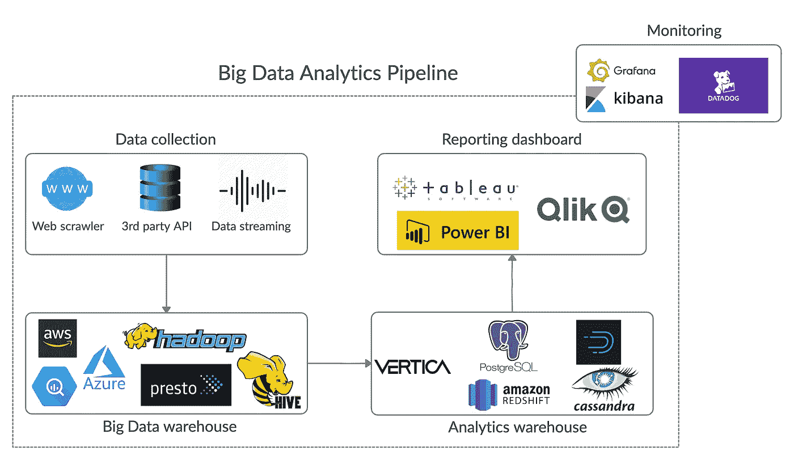
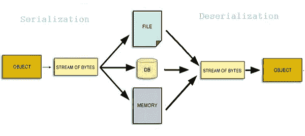
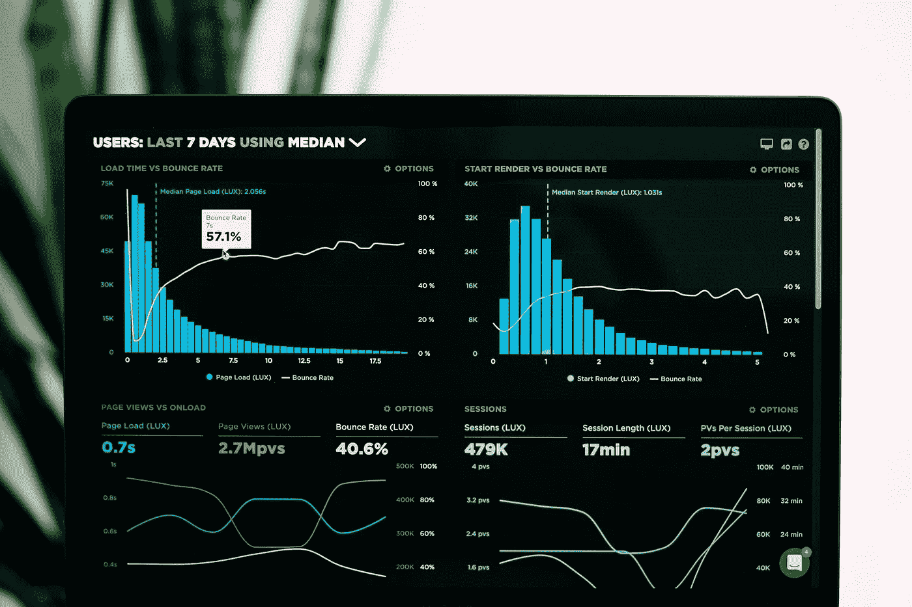
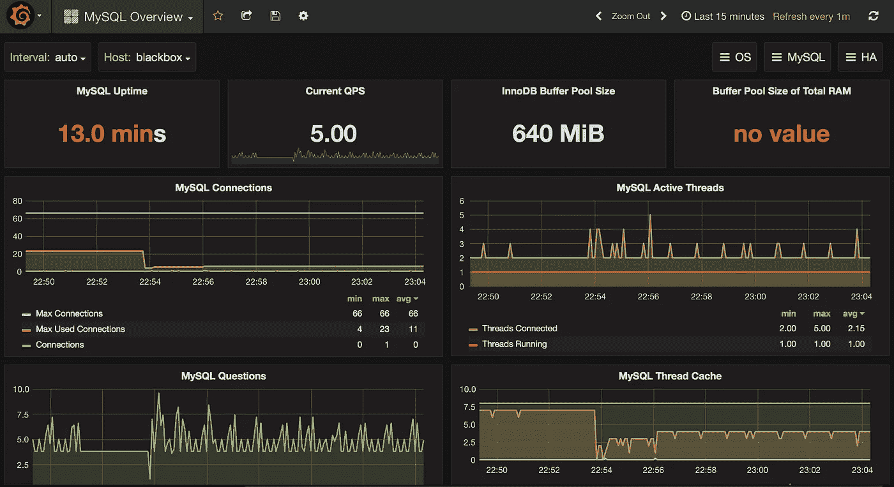

# 如何构建可扩展的大数据分析管道

> 原文：<https://towardsdatascience.com/how-to-build-a-scalable-big-data-analytics-pipeline-7de18f8be848?source=collection_archive---------11----------------------->

## 大规模建立端到端系统


照片由 [Pexels](https://www.pexels.com/photo/person-writing-on-notebook-669615/?utm_content=attributionCopyText&utm_medium=referral&utm_source=pexels) 的 [Lukas](https://www.pexels.com/@goumbik?utm_content=attributionCopyText&utm_medium=referral&utm_source=pexels) 拍摄

D ata 是当今创新企业的重要元素。数据驱动的决策使企业能够适应不可预测的世界。*报告数据的能力是商业分析的支柱*。随着 21 世纪数据的空前增长，大数据不再是一个时髦词，而是企业必须面对的现实。

> 你应该像爱自己一样爱你的数据

数据呈指数级增长，这要求数据系统始终具有可扩展性。构建大规模的**大数据管道**以及整合到现有的分析生态系统中，对于那些不熟悉这两者的人来说将是一个巨大的挑战。


由[弗兰基·查马基](https://unsplash.com/@franki?utm_source=unsplash&utm_medium=referral&utm_content=creditCopyText)在 [Unsplash](https://unsplash.com/photos/1K6IQsQbizI?utm_source=unsplash&utm_medium=referral&utm_content=creditCopyText) 上拍摄的照片

要构建可扩展的大数据分析渠道，您必须首先确定三个关键因素:

> **输入数据**

*无论是时间序列还是非时间序列，你都必须知道你的管道输入数据的性质。它将决定以何种格式存储数据，当数据丢失时如何处理，以及在管道的其余部分使用何种技术。*

> **输出数据**

构建分析渠道时，你需要关心终端用户。数据分析师使用您的管道来构建报告仪表板或可视化。鉴于最终用户可能缺乏数据工程方面的强有力的技术专长，输出数据需要是可访问和可操作的。如今，著名的分析引擎简化了大数据生态系统和分析仓库之间的集成。

> **管道可以摄取多少数据？**

*您的数据系统的可扩展性可以决定企业的长期生存能力。一天处理 100 GB 和 1 TB 之间没有什么相似之处。硬件和软件基础设施必须跟上数据量的突然变化。由于业务的有机增长，您不想让您的数据系统过载。以最佳方式扩展您的数据管道！*



典型的大数据分析渠道。作者署名

# 数据收集

数据收集是数据管道的第一个也是最重要的模块，在这里您必须评估数据的来源。它们是来自另一个数据源还是顶级应用程序？数据是结构化的还是非结构化的？您需要执行任何数据清理吗？*我们可能认为大数据是一堆杂乱无章的数据，但实际上，大多数大数据都是结构化的*。非结构化数据需要额外的技术来构建数据管道。

您的管道架构将因您选择的数据收集方法而异:批处理或通过流服务。批处理流水线需要一个高效的存储系统来进行 I/O 操作，而流处理流水线更喜欢容错传输协议。

说到结构化数据，无论是文本、数字还是图像，要将它们输入管道，都必须经过一个必不可少的过程:**数据序列化**。[数据序列化是将结构化数据转换为一种格式的过程，这种格式允许以允许恢复其原始结构的形式共享或存储数据。](https://docs.python-guide.org/scenarios/serialization/)



来源:[https://devopedia.org/data-serialization](https://devopedia.org/data-serialization)

数据串行化导致跨管道的同质数据结构，从而保持所有数据处理模块的一致性。 **XML** 、 **CSV** 、 **YAML** 、 **JSON** 是数据序列化中最流行的一些格式。序列化数据在存储和传输方面更加优化。*将数据从一个系统传输到另一个系统可能会遇到不兼容的问题，因此逐位通信可以确保没有信息丢失。*

JSON 对于处理互联网上的平面和嵌套数据结构来说非常方便。它提供了人类可读的格式和与 JVM 系统的高度集成。然而，在大数据处理中，JSON 的使用不如其他方法受欢迎，因为它没有经过优化的存储和缺乏结构验证。

一个 JSON 例子来模拟一个地址簿

[**【proto buf】**](https://en.wikipedia.org/wiki/Protocol_Buffers)协议缓冲区是 Google 内部序列化结构化数据的机制。使用 protobuf，您可以定义一个通用模式，然后用您喜欢的编程语言执行读/写操作。*想想像 XML 这样的语言神经格式，但是更快更小*。除了非人类可读的缺点，protobuf 的执行速度比 JSON 快 6 倍。

来源:[https://developers . Google . com/protocol-buffers/docs/Java tutorial](https://developers.google.com/protocol-buffers/docs/javatutorial)

```
***Key takeaways:***- Storage is essential for batch processing while the transmission is critical for streaming service
- Serialization maintains a stable communication transferring between systems
- Use protobuf to serialize data for a better performance
```

# 数据存储

假设您已经启动并运行了数据收集模块，那么您将在哪里存储所有这些数据呢？取决于很多东西:*硬件资源、数据管理专业知识、维护预算等。在决定把钱花在哪里之前，你需要下定决心，因为这是一场长期的比赛。*

> 数据是新的石油，所以最好把石油放在你的后院


资料来源:https://architecht.io/what-happened-to-hadoop-211aa52a297

如果你有大笔资金，最好的办法是建立自己的数据基础设施。*数据是新的石油，所以最好把石油放在你的后院*。雇佣最好的硬件工程师，组装一个合适的数据中心，并在此基础上构建您的管道。 **Hadoop 文件系统(HDFS)** 一直是内部数据架构的首选。它提供了一个紧密集成的生态系统，包含所有可用于数据存储和 ETL 的工具和平台。设置一个可行的 Hadoop 堆栈只需付出最少的努力。它的强大之处在于横向扩展的能力，这意味着并排捆绑商用硬件以最大化性能和最小化成本。

您甚至可以通过优化存储格式来更进一步。将文件存储在。txt 或者。在 HDFS 的领导下，csv 格式可能不是最明智的想法。 [**Apache Parquet**](https://parquet.apache.org/) 是一种列格式，适用于 Hadoop 中的任何项目，并且是每个数据工程师都推荐的格式。作为一种基于列的存储格式，Parquet 提供了更好的压缩，从而优化了 I/O 操作。它唯一的缺点是模式修改的限制，例如，添加或删除一列需要花费更多的精力。


这是你的数据在 Hadoop 分区下的样子。照片由 [Kolar.io](https://unsplash.com/@jankolar?utm_source=unsplash&utm_medium=referral&utm_content=creditCopyText) 在 [Unsplash](https://unsplash.com/s/photos/database?utm_source=unsplash&utm_medium=referral&utm_content=creditCopyText) 上拍摄

来自 SQL 后台，也可以建立一个更易访问的查询系统。 [**Apache Hive**](https://hive.apache.org/) 数据仓库软件有助于使用 SQL 读取、写入和管理驻留在分布式存储中的大型数据集。 [Hive 提供了一种类似 SQL 的查询语言(HiveQL)来直接在 HDFS 上执行查询。](https://en.wikipedia.org/wiki/Apache_Hive)尽管 HiveQL 没有遵循所有的 SQL 标准，但它仍然简化了那些不懂 Hadoop 的人的查询过程。另一个常见的查询引擎是由脸书工程师开发的[](https://prestodb.io/)**。**

**同样，如果你没有足够的资源来构建自己的数据仓库，[你可以将整个系统外包给基于云的平台](https://www.g2.com/products/hadoop-hdfs/competitors/alternatives)。许多著名的科技公司都提供一体化的大数据架构，如 [**【谷歌大查询】**](https://cloud.google.com/bigquery)[**亚马逊 AWS**](https://aws.amazon.com/)[**微软 Azure**](https://azure.microsoft.com/) 。通过外包，你不必费心建立或维护生态系统，但这带来了无法控制你的管道的风险。*在高成本、低维护和低成本、高维护之间有一个折衷方案*。然而，你可以把赌注压在科技巨头管理你的管道的专业技能上。**

```
***Key takeaways:***-If you have big money, go for DIY data architecture, if not, our-sourcing is your answer
- Use parquet to store files in Hadoop ecosystem
- Setup a query system upon Hadoop for easy access
```

# **分析引擎**

**Hadoop 生态系统及其替代品有利于大数据存储系统，但它们不适合作为分析引擎。它们不是为执行快速查询而构建的。*出于分析目的，我们经常执行特别查询，因此需要一个能快速返回结果的系统。*从属存储需要建立在分析引擎之上。**

**[**Vertica**](https://www.vertica.com/) 是一个数据库管理系统，专为大规模分析和快速查询性能而设计。*它以列格式存储数据，并创建投影以将数据分布在其节点上，用于高速查询*。由于其提供强大的分析引擎和高效的查询系统的声誉，Vertica 被许多科技公司广泛使用。由于使用 **Java** 、 **Scala** 、 **Python** 、 **C++** 的简单集成，Vertica 可以为众多与数据相关的外部应用程序扮演数据库的角色。**

****

**分析仪表板示例。[卢克·切瑟](https://unsplash.com/@lukechesser?utm_source=unsplash&utm_medium=referral&utm_content=creditCopyText)在 [Unsplash](https://unsplash.com/s/photos/chart?utm_source=unsplash&utm_medium=referral&utm_content=creditCopyText) 上拍摄的照片**

**[然而，Vertica 显示了处理实时数据或高延迟分析的一些缺点](https://imply.io/post/compare-apache-druid-to-vertica)。它对更改模式或修改投影的约束限制了它对快速转换数据的使用。 [**德鲁伊**](https://druid.apache.org/) 是一个开源的分析数据库，专门为***【OLAP】***在线分析处理而设计。时间序列数据需要优化的存储机制和快速的聚集器。它主要包含时间戳和指标。 *Druid 将指标存储为列，并基于索引和指标对数据进行分区，以便快速访问，因此提供了敏捷的聚合操作。***

```
***Key takeaways:***- Vertica is great for low-latency analytics but requires much expertise to scale
- Druid is built for time series data and provide a fast access system
- Choose analytics database with maximum integration to visualization tools
```

# **监控和质量**

**完成数据收集、存储和可视化集成后，您可能想要即插即用。但是还有最后一件事就是万一发生事故该怎么办。当您的管道无缘无故崩溃时，您会向谁求助？这就是整个监控过程的目的。它可以帮助您跟踪、记录和观察系统的健康状况和性能。一些工具甚至允许你动态调试。也就是说，如果你想建立一个持久的数据管道，一个合适的监控系统是必不可少的。这里我们区分两种: **IT 监控**和**数据监控**。**

**IT 监控对于任何软件开发都是必要的。它显示各种与系统相关的指标，如 CPU、磁盘使用、资源消耗、分配的内存等。您可以查看 IT 监控，看看能否将管道的容量增加一倍或两倍。借助 Hadoop 或 Vertica 等预优化的生态系统，我们不需要太担心 IT 性能。你可以选择[任何基本的 IT 监控工具](https://searchitoperations.techtarget.com/feature/Compare-Grafana-vs-Datadog-for-IT-monitoring)，如 [**Grafana**](https://grafana.com/) 或 [**Datadog**](https://www.datadoghq.com/) 来建立一个简单的仪表板，跟踪你的指标。**

****

**Grafana 仪表板示例。来源:[佩尔科纳](https://www.percona.com/blog/2016/10/25/monitoring-os-metrics-amazon-rds-grafana/)**

***数据监控与大数据分析管道中的其他模块一样重要。*它检测与数据相关的问题，如延迟、数据缺失、数据集不一致。数据管道的质量反映了系统内数据流通的完整性。这些指标确保从一个地方传输到另一个地方的数据丢失最小或为零，而不会影响业务成果。我们无法说出数据监控工具记录的所有指标，因为每个数据管道都有其特定的需求，因此需要特定的跟踪。*如果你正在建立一个时间序列数据管道，关注延迟敏感指标。如果您的数据是成批出现的，请确保正确跟踪传输过程*。一些数据监控工具可以帮助您构建一个简单的数据监控仪表板，但是为了适合您的特定用途，最好自己构建一个。**

```
***Key takeaway:***- Monitoring tools are indispensable in a data pipeline, but not all metrics are equally important *-* Data pipeline quality means the integrity of your data
```

# **结论**

**我们花了相当多的时间讨论基本的端到端大数据分析管道，我希望您已经获得了一些有用的知识。构建这样的管道没有万能的公式，但是您可以基于基本的蓝图来创建自己的管道。**