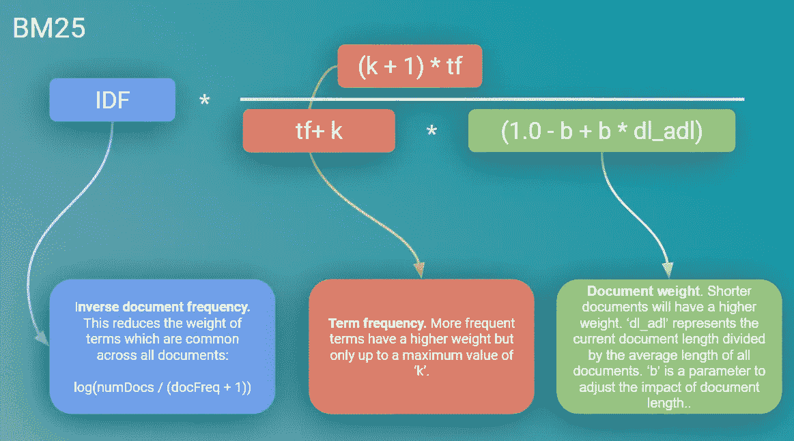
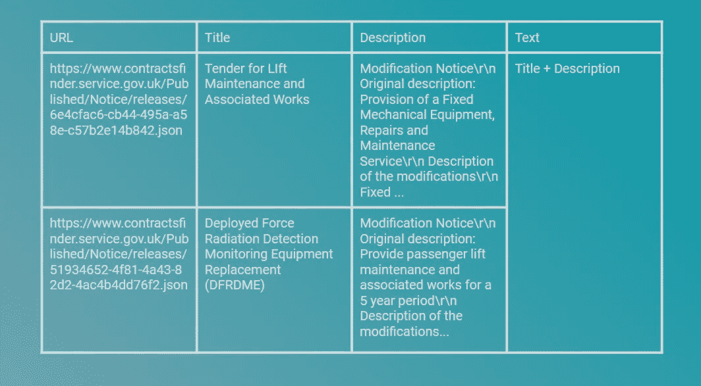

# 如何建立一个搜索引擎

> 原文：<https://towardsdatascience.com/how-to-build-a-search-engine-9f8ffa405eac?source=collection_archive---------3----------------------->

## 用几行代码在 Python 中创建健壮的全文搜索

这篇文章概述了当今使用的最重要的搜索算法之一，并展示了如何用几行代码用 Python 实现它。


来源:作者

## 搜索的价值

我们认为搜索数据的能力是理所当然的。现代搜索引擎现在如此复杂，以至于我们的大部分搜索“刚刚好”。事实上，我们经常只注意到网站或应用程序上的搜索没有执行。我们对这一领域的期望从未如此之高。

搜索引擎的智能一直在增长，原因很简单，一个有效的搜索工具能给企业带来的价值是巨大的；一项重要的知识产权。搜索栏通常是客户和企业之间的主要界面。因此，一个好的搜索引擎可以通过改善用户体验来创造竞争优势。

MckKinsey 估计，2009 年这一价值在全球范围内总计达到 7800 亿美元。这将使每次搜索的价值为 0.50 美元[1]。当然，自 2009 年以来，这一数值无疑有了大幅增长…

考虑到这一点，创建一个现代搜索引擎超出了大多数开发团队的能力，需要大量的资源和复杂的算法，这是可以理解的。然而，有点令人惊讶的是，大量的企业业务搜索引擎实际上是由非常简单和直观的规则驱动的，这些规则可以使用开源软件轻松实现。

例如，优步、Udemy Slack 和 Shopify(以及 3000 家其他企业和组织[2])都在使用 Elasticsearch。直到 2016 年，这个搜索引擎都是由极其简单的*词频、逆文档频率*(或 tf-idf)单词分数驱动的。[3](关于这是什么的更多细节，我已经在这里和这里写了关于 tf-idf [。](/supercharging-word-vectors-be80ee5513d)

在这之后，它切换到更复杂(但仍然非常简单)的 BM25，这种 BM25 一直沿用至今。这也是 Azure 认知搜索中实现的算法[4]。

## BM25:你从未听说过的最重要的算法

那么 BM25 是什么呢？它代表“最佳匹配 25”(其他 24 次尝试显然不太成功)。它是在 1994 年第三届文本检索会议上发布的，是的，的确有一个致力于文本检索的会议…

它可能被认为是 tf-idf 的“兴奋剂”，实现了两个关键的改进:

*   **项频率饱和**。BM25 为与文档匹配的术语数量提供递减的回报。这是相当直观的，如果你想搜索一个在文档中非常常见的特定术语，那么这个术语的出现次数对搜索来说就变得不那么有用了。
*   **公文长度。** BM25 在匹配过程中考虑文档长度。同样，这是直观的；如果一篇较短的文章包含与一篇较长的文章相同数量的匹配项，那么这篇较短的文章可能更相关。

这些改进还引入了两个超参数来调整这些项目对排名函数的影响。“k”用于调整术语饱和的影响,“b”用于调整文档长度。

综上所述，BM25 的计算公式为:



简化的 BM25 算法。来源:作者

## 实施 BM25，一个成功的例子

实现 BM25 非常简单。多亏了 *rank-bm25* Python 库，这可以用几行代码实现。

在我们的示例中，我们将创建一个搜索引擎来查询英国公共部门组织发布的合同通知。

我们的起点是一个 dateset，它包含合同通知的标题、描述以及通知本身的链接。为了简单起见，我们将标题和描述组合在一起，在数据集中创建“文本”列。我们将使用该列进行搜索。我们想要搜索 50，000 个文档:



要在搜索引擎中使用的数据格式(50，000 行中的前两行)。来源:作者

在本文的底部可以找到数据和代码的链接。

本练习的第一步是提取该数据集的“文本”列中的所有单词，以创建一个由每个文档及其单词组成的“列表列表”。这被称为标记化，可以由优秀的空间库来处理:

```
import spacy
from rank_bm25 import BM25Okapi
from tqdm import tqdm
nlp = spacy.load("en_core_web_sm")text_list = df.text.str.lower().values
tok_text=[] # for our tokenised corpus#Tokenising using SpaCy:
for doc in tqdm(nlp.pipe(text_list, disable=["tagger", "parser","ner"])):
   tok = [t.text for t in doc if t.is_alpha]
   tok_text.append(tok)
```

构建 BM25 索引只需一行代码:

```
bm25 = BM25Okapi(tok_text)
```

查询这个索引只需要一个已经标记化的搜索输入:

```
query = "Flood Defence"tokenized_query = query.lower().split(" ")import timet0 = time.time()
results = bm25.get_top_n(tokenized_query, df.text.values, n=3)
t1 = time.time()print(f'Searched 50,000 records in {round(t1-t0,3) } seconds \n')for i in results:
   print(i)
```

这将返回与搜索查询“防洪”高度相关的前 3 个结果:

```
*Searched 50,000 records in 0.061 seconds:*Forge Island Flood Defence and Public Realm Works Award of Flood defence and public realm works along the canal embankment at Forge Island, Market Street, Rotherham as part of the Rotherham Renaissance Flood Alleviation Scheme. Flood defence maintenance works for Lewisham and Southwark College **AWARD** Following RfQ NCG contracted with T Gunning for Flood defence maintenance works for Lewisham and Southwark College Freckleton St Byrom Street River Walls Freckleton St Byrom Street River Walls, Strengthening of existing river wall parapets to provide flood defence measures
```

我们可以根据执行搜索的用户的预期偏好来微调“k”和“b”的值，但是默认的 k=1.5 和 b=0.75 在这里似乎也很好。

## 最后

希望这个例子突出了用 Python 实现健壮的全文搜索是多么简单。这可以很容易地用来驱动一个简单的 web 应用程序或智能文档搜索工具。还有很大的空间来进一步提高这方面的性能，这将在下面的后续帖子中介绍！

[](/how-to-build-a-smart-search-engine-a86fca0d0795) [## 如何建立一个智能搜索引擎

### 用 Python 创建智能搜索服务

towardsdatascience.com](/how-to-build-a-smart-search-engine-a86fca0d0795) 

**参考文献:**

这篇文章的代码和数据可以在这个 [Colab 笔记本](https://colab.research.google.com/drive/1vtBleNUwj4a29vCjzFMKheaBO1Du0fwq?usp=sharing)中找到。

[1]麦肯锡对网络搜索的评论:[https://www . McKinsey . com/~/media/McKinsey/dot com/client _ service/High % 20 tech/pdf/Impact _ of _ Internet _ technologies _ search _ final 2 . aspx](https://www.mckinsey.com/~/media/mckinsey/dotcom/client_service/High%20Tech/PDFs/Impact_of_Internet_technologies_search_final2.aspx)

[2] [据 StackShare 报道，2020 年 8 月。](https://stackshare.io/elasticsearch#:~:text=Who%20uses%20Elasticsearch%3F&text=3034%20companies%20reportedly%20use%20Elasticsearch,Uber%2C%20Udemy%2C%20and%20Shopify.)

[3]从 Elasticsearch v5.0 开始，BM25 成为默认搜索:[https://www.elastic.co/blog/elasticsearch-5-0-0-released](https://www.elastic.co/blog/elasticsearch-5-0-0-released)

[4][https://docs . Microsoft . com/en-us/azure/search/index-ranking-similarity](https://docs.microsoft.com/en-us/azure/search/index-ranking-similarity)