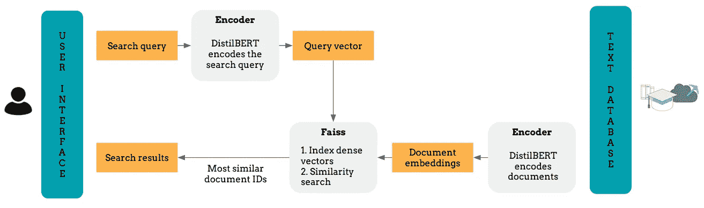
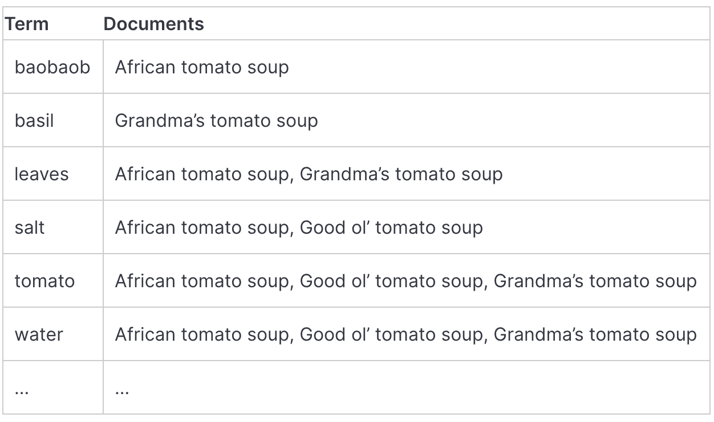
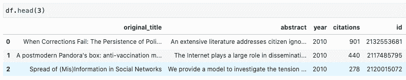
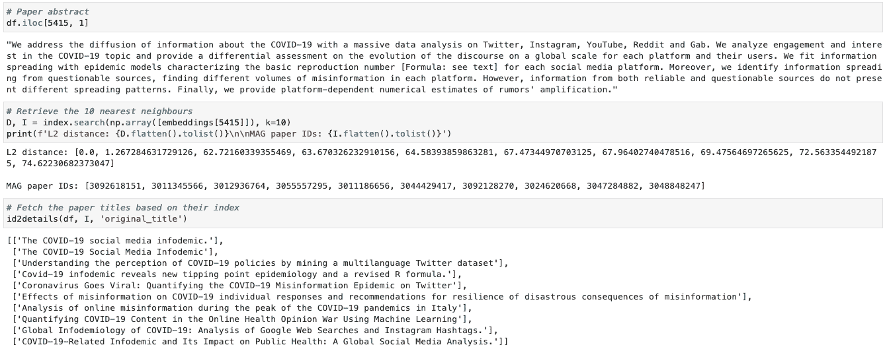
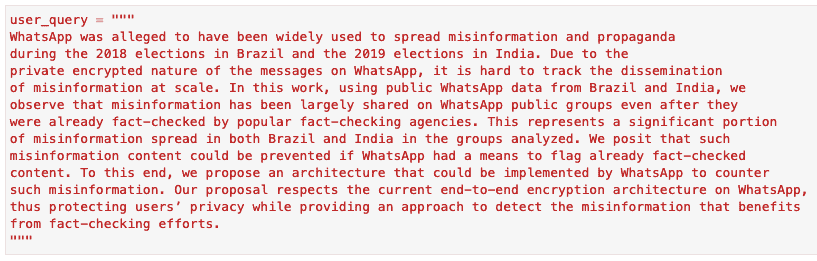
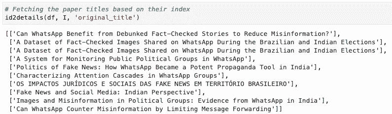

# 如何用 Transformers 和 Faiss 构建语义搜索引擎

> 原文：<https://towardsdatascience.com/how-to-build-a-semantic-search-engine-with-transformers-and-faiss-dcbea307a0e8?source=collection_archive---------2----------------------->

## [实践教程](https://towardsdatascience.com/tagged/hands-on-tutorials)

图片由 Kostas Stathoulopoulos 提供

# 介绍

您是否想过如何使用 Transformers 创建最先进的句子嵌入，并将其用于下游任务，如语义文本相似性？

在本教程中，你将学习如何用[句子变形器](https://github.com/UKPLab/sentence-transformers/)和 [Faiss](https://github.com/facebookresearch/faiss) 构建一个基于向量的搜索引擎。如果你想直接进入代码，看看 [GitHub repo](https://github.com/kstathou/vector_engine) 和 [Google Colab notebook](https://colab.research.google.com/drive/11WBCrwNzbNWN7QbMEwzy-8MZROOVQFnZ?usp=sharing) 。

在本教程的第二部分，您将学习如何在一个 Streamlit 应用程序中服务搜索引擎，使用 Docker 和 AWS Elastic Beanstalk 部署它。

# 为什么要建立一个基于向量的搜索引擎？

基于关键字的搜索引擎易于使用，并且在大多数情况下都工作得很好。你查询*机器学习*论文，它们会返回一堆结果，这些结果包含与查询完全匹配或相近的变体，比如*机器学习*。其中一些甚至可能返回包含查询同义词或出现在相似上下文中的单词的结果。其他的，如 [Elasticsearch](https://www.elastic.co/elasticsearch/) ，以快速和可扩展的方式做所有这些事情，甚至更多。然而，基于关键字的搜索引擎通常会遇到以下问题:

*   复杂的查询或具有双重含义的单词。
*   长查询，如论文摘要或博客中的段落。
*   不熟悉某个领域的行话的用户或希望进行探索性搜索的用户。

基于向量的(也称为语义的)搜索引擎通过使用最先进的语言模型找到文本查询的数字表示，在高维向量空间中索引它们，并测量查询向量与索引文档的相似程度来解决这些缺陷。

# 索引、矢量化和排序方法

在深入本教程之前，我将简要解释基于关键字和基于向量的搜索引擎如何(1) **索引文档**(即以易于检索的形式存储它们)，(2) **对文本数据进行矢量化**和(3) **测量文档与查询的相关性**。这将有助于我们突出两个系统之间的差异，并理解为什么基于向量的搜索引擎可能会为长文本查询提供更有意义的结果。

## **1。基于关键词的搜索引擎**

让我们用一个过于简化的版本 [Elasticsearch](https://www.elastic.co/elasticsearch/service) 作为例子。Elasticsearch 使用一个[标记器](https://www.elastic.co/guide/en/elasticsearch/reference/current/analysis-tokenizers.html)将一个文档分割成标记(即有意义的文本单元)，这些标记被映射成数字序列并用于构建一个[倒排索引](https://en.wikipedia.org/wiki/Inverted_index)。

*倒排索引:倒排索引使我们能够一次查找一个术语并检索包含该术语的所有文档的列表，而不是遍历每个文档来检查它是否包含查询术语。* [*图片*](https://www.elastic.co/blog/found-indexing-for-beginners-part3/) *作者:*[Morten Ingebrigtsen](https://www.elastic.co/blog/author/morten-ingebrigtsen)

与此同时，Elasticsearch 用一个高维的加权向量来表示每个索引文档，其中每个不同的索引项都是一个维度，它们的值(或权重)用 [TF-IDF](http://www.tfidf.com/) 来计算。

为了找到相关的文档并对它们进行排序，Elasticsearch 结合了布尔模型(BM)和向量空间模型(VSM)。BM 标记哪些文档包含用户的查询，VSM 对它们的相关程度进行评分。在搜索期间，使用相同的 TF-IDF 管道将查询转换为向量，然后文档`d`对于查询`q`的 VSM 分数是加权查询向量`V(q)`和`V(d)`的余弦相似度。

> 这种度量相似性的方式非常简单，并且不可扩展。Elasticsearch 背后的主力是 Lucene，它采用了各种技巧，从增强字段到改变向量的标准化方式，来加速搜索并提高搜索质量。

Elasticsearch 在大多数情况下都很有效，然而，我们也想创建一个关注单词上下文的系统。这就把我们带到了基于向量的搜索引擎。

## 2.基于向量的搜索引擎

我们需要创建考虑单词上下文的文档表示。我们还需要一种高效可靠的方法来检索存储在索引中的相关文档。

**创建密集文档向量**

近年来，NLP 社区在这方面取得了长足的进步，许多深度学习模型都是开源的，并由像 [Huggingface 的变形金刚](https://huggingface.co/)这样的软件包分发，这些软件包提供了对最先进的预训练模型的访问。使用预训练模型有许多优点:

*   它们通常产生高质量的嵌入，因为它们是在大量文本数据上训练的。
*   他们不要求你创建一个定制的标记器，因为变形金刚有他们自己的[方法](https://github.com/huggingface/tokenizers)。
*   根据您的任务微调模型是很简单的。

这些模型为文档中的每个**标记**生成一个固定大小的向量。但是，我们如何获得文档级向量呢？这通常是通过平均或汇集单词向量来完成的。然而，这些方法[产生低于平均水平的句子和文档嵌入，通常比平均手套向量](https://arxiv.org/abs/1908.10084)更差。

为了构建我们的语义搜索引擎，我们将使用[句子转换器](https://github.com/UKPLab/sentence-transformers)来微调基于 BERT 的模型，以生成语义上有意义的长文本序列嵌入。

**建立指数和衡量相关性**

检索相关文档最简单的方法是测量查询向量和数据库中每个文档向量之间的余弦相似性，并返回得分最高的那些向量。不幸的是，这在实践中非常慢。

首选的方法是使用 **Faiss** ，一个用于高效相似性搜索和密集向量聚类的库。Faiss 提供了大量的[指数](https://github.com/facebookresearch/faiss/wiki/Faiss-indexes)和[综合指数](https://github.com/facebookresearch/faiss/wiki/Faiss-indexes-(composite))。此外，给定一个 GPU，Faiss 可以扩展到数十亿个向量！

# 教程:用句子转换器和 Faiss 构建基于向量的搜索引擎

在这个实际例子中，我们将使用真实世界的数据。我通过用 [Orion](https://github.com/orion-search/orion) 查询[微软学术图](https://www.microsoft.com/en-us/research/project/academic-knowledge/)，创建了一个包含 2010 年至 2020 年间发表的 8430 篇关于错误信息、虚假信息和假新闻的学术文章的数据集。

我检索了论文的摘要、标题、引文、出版年份和 ID。我做了最少的数据清理工作，比如拿走没有摘要的文件。数据如下所示:

图片由 Kostas Stathoulopoulos 提供

## **导入 Python 包并从 S3 读取数据**

让我们导入所需的包并读取数据。该文件是公开的，所以你可以[在 Google Colab](https://colab.research.google.com/drive/11WBCrwNzbNWN7QbMEwzy-8MZROOVQFnZ?usp=sharing) 上运行代码，或者通过[访问 GitHub repo](https://github.com/kstathou/vector_engine) 在本地运行代码！

## **使用句子转换器对文档进行矢量化**

接下来，让我们对论文摘要进行编码。[句子变形器](https://github.com/UKPLab/sentence-transformers)提供了许多预训练的模型，其中一些可以在这个[电子表格](https://docs.google.com/spreadsheets/d/14QplCdTCDwEmTqrn1LH4yrbKvdogK4oQvYO1K1aPR5M/)中找到。这里，我们将使用在语义文本相似性任务中表现出色的`distilbert-base-nli-stsb-mean-tokens`模型，它比 BERT 快得多，因为它要小得多。

在这里，我们将:

1.  通过将模型名称作为字符串传递来实例化转换器。
2.  如果可用，切换到 GPU。
3.  使用`. encode()'方法对所有论文摘要进行矢量化处理。

> 使用转换器对文档进行矢量化时，建议使用 GPU。Google Colab 免费提供一个！**如果你想在 AWS 上运行它，请查看我的指南** [**如何在 AWS 上启动用于机器学习的 GPU 实例**](https://medium.com/@kstathou/how-to-set-up-a-gpu-instance-for-machine-learning-on-aws-b4fb8ba51a7c) **。**

## **用 Faiss 索引文档**

Faiss 包含在任意大小的向量组中搜索的算法，甚至是不适合 RAM 的向量组。要了解 Faiss 的更多信息，你可以阅读他们在 arXiv 或 wiki 上的论文。

Faiss 是围绕`Index`对象构建的，该对象包含可搜索向量，有时还对其进行预处理。它处理固定维度的向量集合`d`，通常是几十到 100 个。

> Faiss 只使用 32 位浮点矩阵。这意味着我们必须在构建索引之前改变输入的数据类型。

这里，我们将使用执行强力 L2 距离搜索的`IndexFlatL2`索引。它适用于我们的数据集，但是，对于大型数据集，它可能会非常慢，因为它与索引向量的数量成线性关系。Faiss 还提供[快速索引](https://github.com/facebookresearch/faiss/wiki/Faster-search)！

为了用抽象向量创建索引，我们将:

1.  将抽象向量的数据类型更改为`float32`。
2.  建立一个索引，并向它传递它将操作的向量的维数。
3.  将索引传递给`IndexIDMap`，这个对象使我们能够为索引向量提供一个定制的 id 列表。
4.  将抽象向量及其 ID 映射添加到索引中。在我们的例子中，我们将把向量映射到 Microsoft Academic Graph 中的论文 id。

为了测试索引是否按预期工作，我们可以用一个索引向量查询它，并检索它最相似的文档以及它们的距离。第一个结果应该是我们的查询！

因为我们使用索引向量查询 Faiss，所以第一个结果必须是查询，并且距离必须等于零！图片由 Kostas Stathoulopoulos 提供

## **使用用户查询进行搜索**

让我们尝试为一个新的、看不见的搜索查询找到相关的学术文章。在这个例子中，我将使用 [*的第一段来查询我们的索引。WhatsApp 可以从被揭穿的事实核查的故事中受益以减少错误信息吗？*](https://misinforeview.hks.harvard.edu/article/can-whatsapp-benefit-from-debunked-fact-checked-stories-to-reduce-misinformation/) 发表在《HKS 误传评论》上的文章。

图片由 Kostas Stathoulopoulos 提供

要为新的查询检索学术文章，我们必须:

1.  用我们用于抽象向量的相同的句子蒸馏模型对查询进行编码。
2.  将其数据类型更改为`float32`。
3.  使用编码的查询搜索索引。

为了方便起见，我将这些步骤包装在了`vector_search()`函数中。

这篇文章讨论了错误信息、事实核查、WhatsApp 以及巴西和印度的选举。我们希望基于向量的搜索引擎能够返回这些主题的结果。通过检查论文标题，大多数结果看起来与我们的查询非常相关。我们的搜索引擎工作正常！

图片由 Kostas Stathoulopoulos 提供

# 结论

在本教程中，我们使用句子转换器和 Faiss 构建了一个基于向量的搜索引擎。我们的索引运行良好，但相当简单。我们可以通过使用领域特定的转换器来提高嵌入的质量，比如 SciBERT 已经在来自 semanticscholar.org 语料库的论文上进行了训练。我们还可以在返回结果之前删除重复项，并尝试使用其他索引。

对于那些使用 Elasticsearch 的人，Open Distro 引入了一个[近似 k-NN 相似性搜索特性](https://opendistro.github.io/for-elasticsearch/blog/odfe-updates/2020/04/Building-k-Nearest-Neighbor-(k-NN)-Similarity-Search-Engine-with-Elasticsearch/)，它也是 [AWS Elasticsearch 服务](https://aws.amazon.com/about-aws/whats-new/2020/03/build-k-nearest-neighbor-similarity-search-engine-with-amazon-elasticsearch-service/)的一部分。在另一篇博客中，我也会深入探讨这个问题！

最后，你可以在 GitHub 上找到[代码，然后用 Google Colab](https://github.com/kstathou/vector_engine) 试一试[。](https://colab.research.google.com/drive/11WBCrwNzbNWN7QbMEwzy-8MZROOVQFnZ?usp=sharing)

# 参考

[1]n . tha kur，n . Reimers，n . daxen Berger，j .和 Gurevych，I .，2020 年。增强 SBERT:用于改进成对句子评分任务的双编码器的数据增强方法。 *arXiv 预印本 arXiv:2010.08240* 。

[2]j .约翰逊，m .杜泽和 h .杰古，2019 年。用 GPU 进行亿级相似性搜索。 *IEEE 大数据汇刊*。