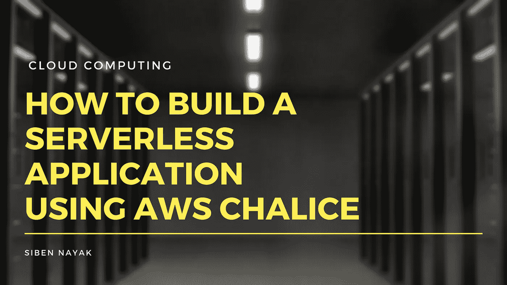
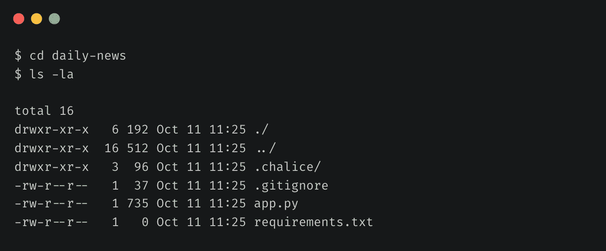
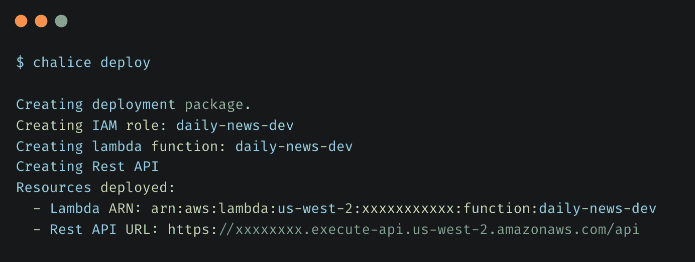
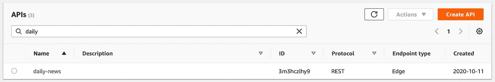
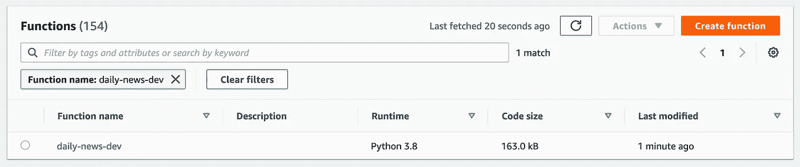
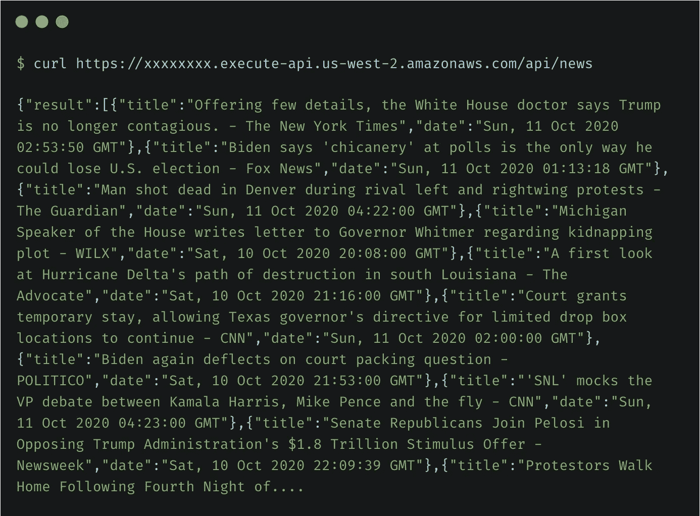
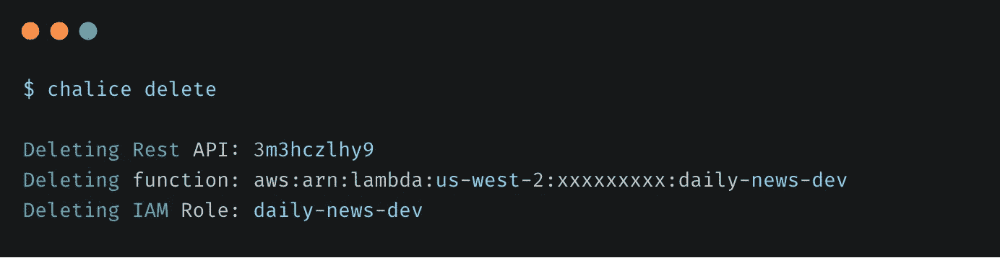

# 如何使用 AWS Chalice 构建无服务器应用程序

> 原文：<https://towardsdatascience.com/how-to-build-a-serverless-application-using-aws-chalice-91024416d84f?source=collection_archive---------21----------------------->

## [动手教程](https://towardsdatascience.com/tagged/hands-on-tutorials)，云计算系列

## 立即构建和部署基于 Python 的无服务器 REST API



图片作者。由 [Pixabay](https://www.canva.com/p/pixabay/) 通过 [Canva](https://www.canva.com/media/MADQ4_ajPZc) 生成的原始图像

我最近偶然发现了 AWS Chalice，并被它提供的简单性和可用性迷住了。AWS Chalice 是一个无服务器框架，允许您使用 Python 构建无服务器应用程序，并使用 Amazon API Gateway 和 AWS Lambda 将它们部署在 AWS 上。

我决定尝试一下，并在几分钟之内在 AWS 上创建和部署了一个示例 REST API。在本文中，我将带您了解构建和部署一个无服务器应用程序所需的步骤，该应用程序使用 AWS Chalice 从 Google News 获取最新新闻。

# 先决条件

本教程需要一个 AWS 帐户。如果你还没有，那么[创建一个](https://aws.amazon.com/premiumsupport/knowledge-center/create-and-activate-aws-account/)。我们的应用程序将只使用自由层资源，因此成本应该不是问题。您还需要配置安全性，并为您的访问创建用户和角色。

# 配置 AWS 凭据

Chalice 在幕后使用 AWS 命令行界面(CLI)来部署项目。如果您以前没有使用过 AWS CLI 来处理 AWS 资源，您可以按照这里的指南[安装它](https://docs.aws.amazon.com/cli/latest/userguide/install-cliv2.html)。

安装完成后，您需要[配置](https://docs.aws.amazon.com/cli/latest/userguide/cli-configure-quickstart.html)您的 AWS CLI，以使用来自您的 AWS 帐户的凭证。

```
$ aws configure                       
AWS Access Key ID [****************OI3G]:
AWS Secret Access Key [****************weRu]:
Default region name [us-west-2]:
Default output format [None]:
```

# 安装圣杯

接下来，你需要安装圣杯。在本教程中，我们将使用 Python 3，但是您可以使用 AWS Lambda 支持的任何 Python 版本。

## 验证 Python 安装

```
$ python3 --version
Python 3.8.6
```

## 安装圣杯

```
$ python3 -m pip install chalice
```

## 验证圣杯安装

```
$ chalice --version
chalice 1.20.0, python 3.8.6, darwin 19.6.0
```

# 创建项目

接下来，运行`chalice`命令创建一个新项目:

```
$ chalice new-project daily-news
```

这将在当前目录下创建一个`daily-news`文件夹。你可以看到 Chalice 在这个文件夹中创建了几个文件。



作者图片

让我们看看`app.py`文件:

`new-project`命令创建了一个定义单一视图的示例应用程序，`/`在被调用时返回 JSON 主体`{"hello": "world"}`。您现在可以修改这个模板并添加更多代码来阅读来自 Google 的新闻。

我们将使用 Google 的 RSS 提要，并且需要一个名为 Beautiful Soup 的 Python 库来解析 XML 数据。您可以使用`pip`安装 Beautiful Soup 及其 XML 解析库。

```
$ python3 -m pip install bs4
$ python3 -m pip install lxml
```

接下来将下面的导入添加到`app.py`。这实际上增加了从`urllib`进行 HTTP 调用的导入和从`bs4`解析 XML 的导入。

接下来，您需要添加一个方法来从 Google 获取 RSS 提要，解析它以提取新闻标题和发布日期，并创建一个新闻条目列表。为此，将以下代码添加到您的`app.py`中

更新`app.py`中的 index 方法来调用它并返回新闻条目列表作为结果。

请注意，您安装了一些依赖项来使代码工作。这些依赖项是本地安装的，在运行时对 AWS Lambda 容器不可用。为了使它们对 AWS Lambda 可用，您需要将它们与您的代码打包在一起。为此，将以下内容添加到`requirements.txt`文件中。在构建期间，Chalice 将这些依赖项打包成代码的一部分，并作为 Lambda 函数的一部分上传。

# 部署项目

让我们部署这个应用程序。从`daily-news`文件夹中，运行`chalice deploy`命令。



部署(图片由作者提供)

这将使用 Amazon API Gateway 和 AWS Lambda 在 AWS 上部署您的 API。



API 网关中的每日新闻 API(图片由作者提供)



每日新闻-dev Lambda 函数(图片由作者提供)

您现在可以尝试访问 API 了。



调用新闻 API(图片由作者提供)

# 清理

您还可以使用`chalice delete`命令删除运行`chalice deploy`命令时创建的所有资源。



删除资源(作者图片)

# 结论

恭喜你！！您刚刚使用 Chalice 在 AWS 上部署了一个无服务器应用程序。这并不太难，是吗？

现在，您可以继续对您的`app.py`文件进行任何修改，并重新运行`chalice deploy`来重新部署您的更改。

您还可以使用 Chalice 将您的无服务器应用程序与亚马逊 S3、亚马逊 SNS、亚马逊 SQS 和其他 AWS 服务集成在一起。看看[教程](https://aws.github.io/chalice/tutorials/index.html)继续探索。

本教程的完整源代码可以在[这里](https://github.com/theawesomenayak/daily-news)找到。