# 如何使用 AWS SAM 构建无服务器应用程序

> 原文：<https://towardsdatascience.com/how-to-build-a-serverless-application-using-aws-sam-b4d595fe689f?source=collection_archive---------8----------------------->

## [动手教程](https://towardsdatascience.com/tagged/hands-on-tutorials)，云计算系列

## 立即构建和部署基于 Java 的无服务器 REST API

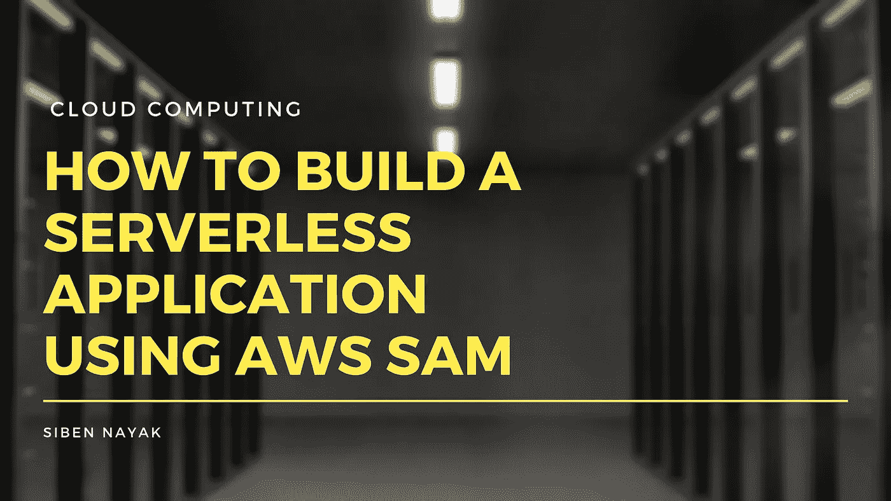

图片作者。原始图像由 [Pixabay](https://www.canva.com/p/pixabay/) 通过 [Canva](https://www.canva.com/media/MADQ4_ajPZc)

在我之前的[文章](/how-to-build-a-serverless-application-using-aws-chalice-91024416d84f)中，我谈到了 AWS Chalice，以及我们如何快速构建一个基于 Python 的无服务器应用程序，并在几分钟内将其部署到 AWS 上。

虽然 Python 是一个快速而有趣的原型，但在运行大规模生产应用程序时，它可能不是许多人的首选语言。许多组织使用 Java 作为他们的主要开发语言，许多开发人员也在转向更新的语言，如 Go。

在本文中，我将带您了解构建和部署从 Google News 获取最新新闻的无服务器应用程序所需的步骤。但这一次，我们将使用 AWS 无服务器应用程序模型(SAM)和 Java 进行开发。像 Chalice 一样，AWS SAM CLI 提供了一组丰富的工具，使开发人员能够快速构建无服务器应用程序。

# 先决条件

本教程需要一个 AWS 帐户。如果你还没有，那么[创建一个](https://aws.amazon.com/premiumsupport/knowledge-center/create-and-activate-aws-account/)。我们的应用程序将只使用自由层资源，因此成本应该不是问题。

您还需要配置安全性，并为您的访问创建用户和角色。

# 如何配置 AWS 凭据

SAM 在幕后使用 AWS 命令行界面(CLI)来部署项目。如果你以前没有使用过 AWS 的 CLI 来使用 AWS 资源，你可以按照这里的指南[来安装它。](https://docs.aws.amazon.com/cli/latest/userguide/install-cliv2.html)

安装完成后，您需要[配置](https://docs.aws.amazon.com/cli/latest/userguide/cli-configure-quickstart.html)您的 AWS CLI，以使用来自您的 AWS 帐户的凭证。

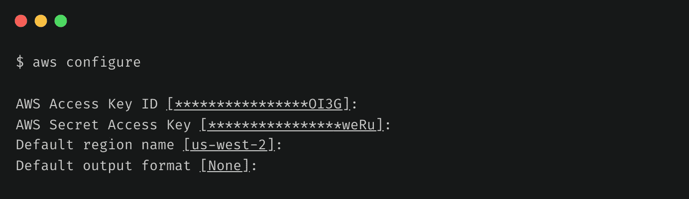

作者图片

# 如何安装 SAM

接下来，您需要安装 SAM。我们将在本教程中使用 Java，但是您可以使用 AWS Lambda 支持的任何语言运行时。

## 验证 Java 安装

```
$ java --versionopenjdk 11.0.8 2020-07-14
OpenJDK Runtime Environment AdoptOpenJDK (build 11.0.8+10)
OpenJDK 64-Bit Server VM AdoptOpenJDK (build 11.0.8+10, mixed mode)
```

## 安装 SAM CLI

根据您的操作系统，SAM CLI 的安装说明会有所不同。本文介绍了在 MacOS 上安装它的说明。

在 macOS 上安装 SAM CLI 的推荐方法是使用 Homebrew 软件包管理器。

确认你是否安装了自制软件。

```
$ brew --versionHomebrew/homebrew-core (git revision fe68a; last commit 2020-10-15)
Homebrew/homebrew-cask (git revision 4a2c25; last commit 2020-10-15)
```

如果没有，您可以使用以下命令安装 Homebrew。

```
$ /bin/bash -c "$(curl -fsSL [https://raw.githubusercontent.com/Homebrew/install/master/install.sh](https://raw.githubusercontent.com/Homebrew/install/master/install.sh))"
```

接下来，使用以下命令安装 SAM。

```
brew tap aws/tap
brew install aws-sam-cli
```

## 验证 SAM 安装

```
$ sam --versionSAM CLI, version 1.6.2
```

# 如何创建项目

接下来，运行`sam-init`命令创建一个新项目。

```
sam init -r java11 -d maven --app-template hello-world -n daily-news-java
```

默认情况下，SAM 会创建一个 Python 项目。因为我们想要创建一个 Java 项目，所以我们需要传递一些额外的参数。

**参数:**

*   `-r java11`:使用 Java 11 运行时
*   `-d maven`:使用 maven 作为依赖管理器
*   `--app-template hello-world`:使用 HelloWorld 快速入门模板
*   `-n daily-news-java`:我们项目的名称

这将在当前目录下创建一个`daily-news-java`文件夹。您可以看到 SAM 在这个文件夹中创建了几个文件。

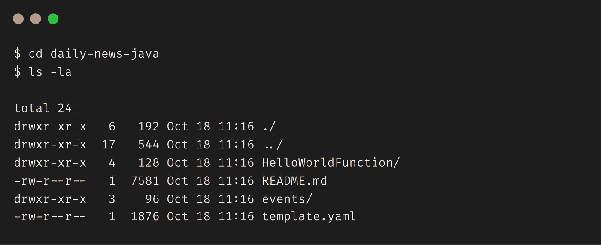

作者图片

我们来看看`App.java`文件。

`sam-init`命令创建了一个简单的 Lambda 函数，该函数在被调用时返回 JSON 主体`{"message": "hello world"}`和机器的 IP 地址。我们现在可以更改这个模板并添加更多代码来阅读来自 Google 的新闻。

现在我们来看看`template.yml`文件。

这包含了创建我们的 Amazon API 网关和 AWS Lambda 资源的 CloudFormation 模板。

Lambda 配置指定我们有一个运行在`Java 11`和`512 MB`内存上的`HelloWorldFunction` lambda。

API 网关配置定义了一个带有`/hello`路径的`GET`方法，我们将使用它来调用 API。

我们将使用 Java 的内部 HTTP 和 XML 解析库，所以我们不需要向我们的`pom.xml`文件添加任何依赖项。请注意，作为样板代码的一部分提供的默认`pom.xml`带有设置为`1.8.`的编译器源代码，我们需要将其更新为`11`，这样我们就可以使用 Java 11 中的新 HTTP 库。

按照 Java 面向对象的方式，让我们也创建一个包含新闻标题和出版日期的`NewsItem`类。

注意，我们已经覆盖了`toString`方法。这是为了创建对象的 JSON 表示，避免使用任何 JSON 解析库。

接下来，您需要添加一个方法来从 Google 获取 RSS 提要，解析它以提取新闻标题和发布日期，并创建一个新闻条目列表。为此，将以下代码添加到您的`App.java`

现在让我们更新`App.java`中的`handleRequest`方法来调用这个方法并返回新闻条目列表作为结果。

不要忘记更新单元测试。编写它们是为了测试响应中是否存在“hello world ”,它们将在我们更改后开始失败。

# 如何构建

从`daily-news-java`文件夹中，运行`sam build`命令。

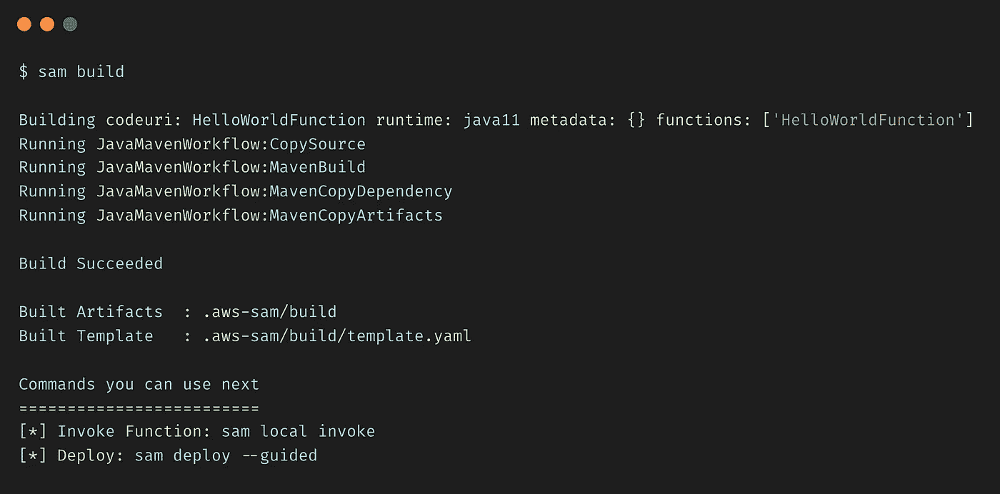

作者图片

这将编译您的源代码并构建您在应用程序中拥有的任何依赖项。然后，它将所有文件移动到`.aws-sam/build`文件夹中，这样它们就可以打包和部署了。它也会相应地更新`template.yml`文件。

# 如何在本地测试

这是萨姆最精彩的部分。您可以在本地部署和测试您的应用程序！！在开发阶段，当您想测试代码而不必将它部署到 AWS 时，这非常有用。

SAM CLI 提供了`sam local`命令来本地运行您的应用程序。这在内部使用 Docker 来模拟 Lambda 的执行环境。如果没有安装 Docker，可以从[这里](https://docs.docker.com/get-docker/)获取。

我们可以用两种方式在本地测试我们的应用程序:

*   本地托管 API
*   直接调用 Lambda 函数

让我们来看看这两个选项。

## 本地托管

使用以下命令在本地启动 API。

```
sam local start-api
```

这在内部创建了一个本地服务器，并公开了一个复制 REST API 的本地端点。

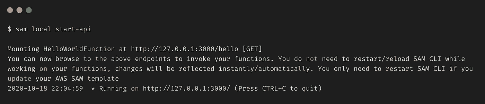

作者图片

一旦 Docker 容器被加载，您就可以访问`localhost`上的 api。

```
curl [http://127.0.0.1:3000/hello](http://127.0.0.1:3000/hello)
```

## 直接调用

使用以下命令调用 Lambda 函数。

```
sam local invoke "HelloWorldFunction" -e events/event.json
```

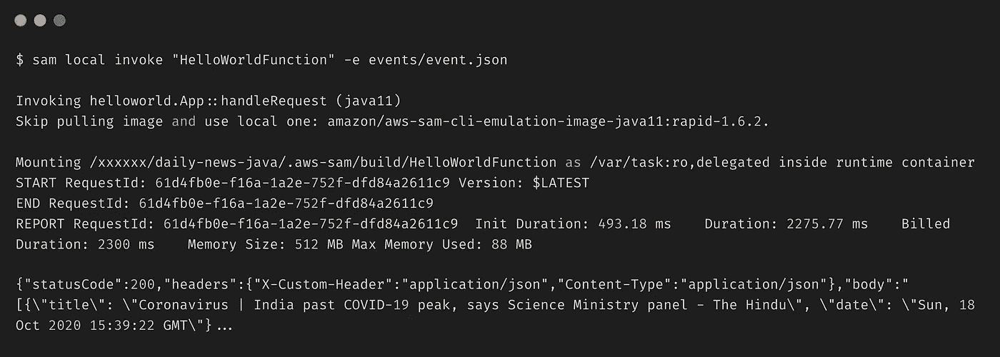

作者图片

这直接调用 Lambda 函数(就像我们调用`main`方法一样)并将`event.json`文件作为有效载荷传递。

# 如何部署项目

让我们部署应用程序。从`daily-news-java`文件夹中，运行`sam deploy --guided`命令。遵循提示并提供所需的输入(或按 Enter 键接受默认值)。

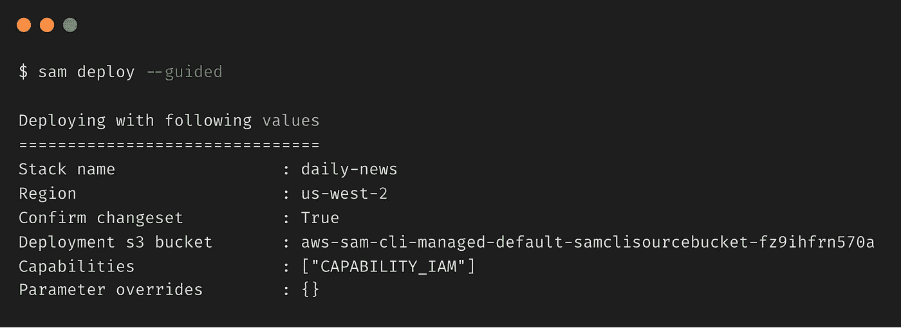

作者图片

这将使用 Amazon API Gateway 和 AWS Lambda 在 AWS 上部署我们的应用程序。它采用我们用`sam build`命令构建的部署工件，打包并上传到由 AWS SAM CLI 创建的亚马逊 S3 桶，并使用 AWS CloudFormation 部署应用程序。

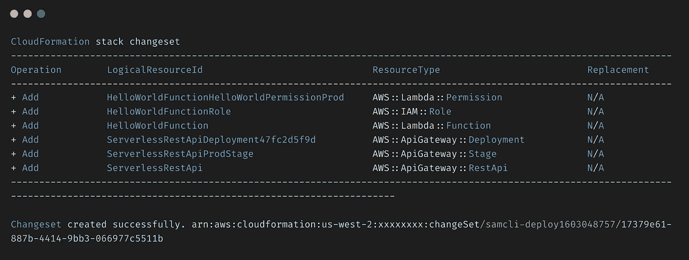

作者图片

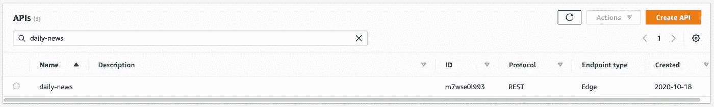

API 网关中的每日新闻 API(图片由作者提供)

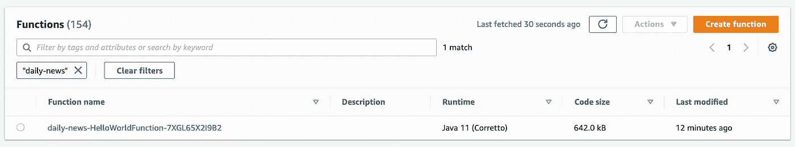

每日新闻 Lambda 函数(图片由作者提供)

我们现在可以尝试使用上面提供的端点 URL 来访问 API。

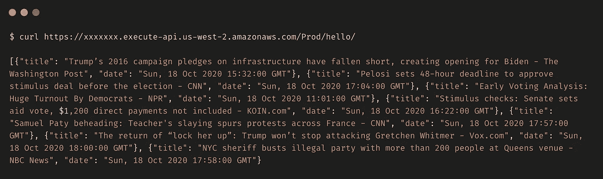

作者图片

# 如何清理资源

我们可以使用`aws cloudformation delete-stack` 命令删除 AWS CloudFormation 堆栈以及我们运行`sam deploy`命令时创建的所有资源。

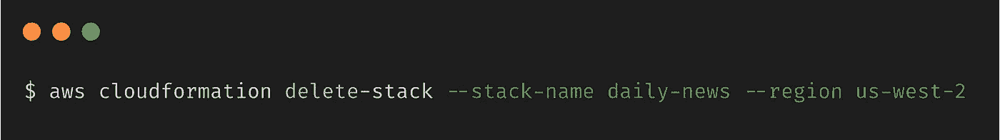

作者图片

# 结论

恭喜你！！您刚刚使用 AWS SAM 在 AWS 上部署了一个无服务器应用程序。它确实比之前的多做了一点工作，但也不太难。

现在，您可以继续对您的`App.java`文件进行任何修改，并重新运行`sam deploy`来重新部署您的更改。

本教程的完整源代码可以在[这里](https://github.com/theawesomenayak/daily-news-java)找到。