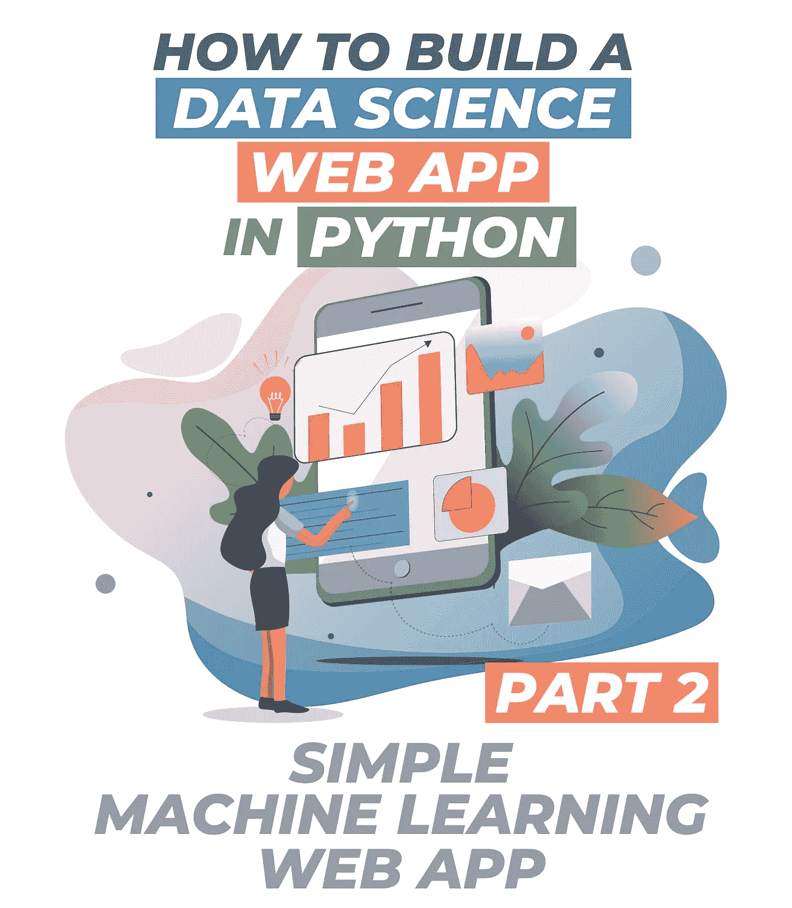
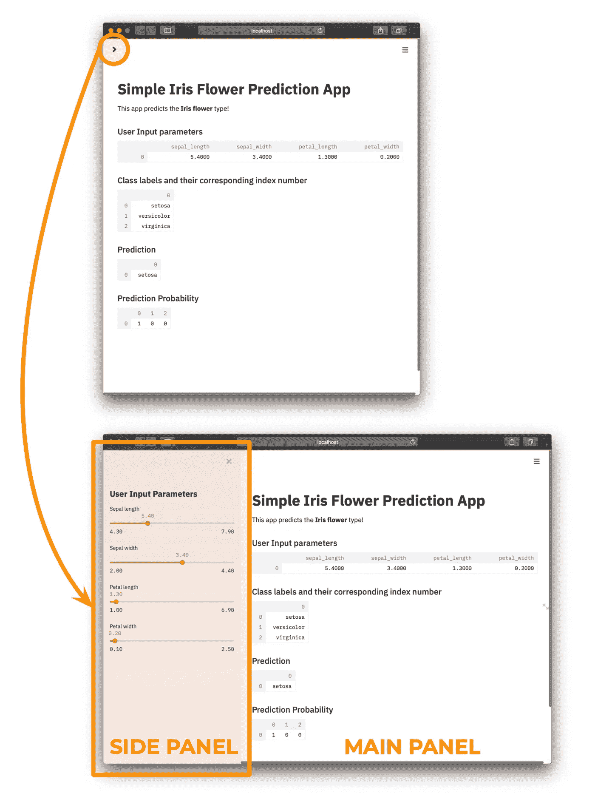

# 如何用 Python 构建一个简单的机器学习 Web 应用

> 原文：<https://towardsdatascience.com/how-to-build-a-simple-machine-learning-web-app-in-python-68a45a0e0291?source=collection_archive---------0----------------------->



## [数据科学](https://towardsdatascience.com/tagged/data-science/)

## 第 2 部分:不到 50 行代码的 ML 支持的 Web 应用程序

在本文中，我将向您展示如何使用 streamlit 库在不到 50 行代码中用 Python 构建一个简单的基于机器学习的数据科学 web 应用程序。

*(快速提示:你可能还想看看这个 streamlit 教程系列的第一部分*[](/how-to-build-a-data-science-web-app-in-python-61d1bed65020)**来构建你的第一个 web 应用。大喊到* [*西门*](https://medium.com/@smutama) *为提示提及第 1 部分。)**

*数据科学生命周期本质上由数据收集、数据清理、探索性数据分析、模型构建和模型部署组成。如需了解更多信息，请查看 [Ken Jee](https://www.youtube.com/channel/UCiT9RITQ9PW6BhXK0y2jaeg) 关于 [*不同数据科学角色的精彩视频(由数据科学家)*](https://www.youtube.com/watch?v=BZFfNwj7JhE) 。此生命周期的摘要信息图如下所示:*

**

*数据科学生命周期。由 Chanin Nantasenamat 绘制。*

*作为一名数据科学家或机器学习工程师，能够部署我们的数据科学项目极其重要，因为这将有助于完成数据科学生命周期。使用 Django 或 Flask 等已建立框架的机器学习模型的传统部署可能是一项艰巨和/或耗时的任务。*

*这篇文章基于我在[数据教授 YouTube 频道](https://www.youtube.com/dataprofessor?sub_confirmation=1) ( [如何用 Python](https://www.youtube.com/watch?v=8M20LyCZDOY) 构建一个简单的机器学习 Web 应用)上制作的同一主题的视频，你可以边看边看这篇文章。*

# *鸢尾花预测应用概述*

*今天，我们将构建一个简单的基于机器学习的 web 应用程序，用于预测鸢尾花的分类标签，如 setosa、versicolor 和 virginica。*

*或许，你已经在教程和机器学习的例子中看到过太多臭名昭著的 Iris 数据集的使用。在这一点上请原谅我，因为 Iris 数据集仅用作一种" *lorem ipsum"* (通常用作书写内容中的填充词)。我向您保证，在本系列教程的后续部分中，我将使用其他示例数据集。*

*这将需要使用三个 Python 库，即`streamlit`、`pandas`和`scikit-learn`。*

*让我们来看看应用程序的概念流程，它将包括两个主要组件:(1)前端和(2)后端。*

*在 ***前端*** 中，左侧的侧边栏将接受与鸢尾花的特征相关的输入参数(*即*花瓣长度、花瓣宽度、萼片长度和萼片宽度)。这些特征将被传递到后端，在后端，经过训练的模型将根据输入参数来预测分类标签。预测结果送回前端显示。*

*在 ***后端*** 中，用户输入的参数将被保存到一个数据帧中，该数据帧将被用作测试数据。同时，将使用来自`scikit-learn`库中的随机森林算法构建分类模型。最后，该模型将被应用于对用户输入数据进行预测，并将预测的类别标签作为三种花类型之一返回:setosa、versicolor 或 virginica。此外，还将提供预测概率，这将允许我们辨别预测类标签中的相对置信度。*

# *安装必备库*

*在本教程中，我们将使用三个 Python 库，即`streamlit`、`pandas`和`scikit-learn`。您可以通过`pip install`命令安装这些库。*

*要安装 streamlit:*

```
*pip install streamlit*
```

*要安装熊猫:*

```
*pip install pandas*
```

*要安装 scikit-learn:*

```
*pip install -U scikit-learn*
```

# *web 应用程序的代码*

*好的，让我们看一下幕后，我们会看到我们今天要构建的应用程序不到 50 行代码(*即*或确切地说是 48 行)。如果我们删除空行和注释(*即*占 12 行)，我们可以把数字减少到 36 行。*

# *对代码的逐行解释*

*好的，那么让我们解码，看看每一行(或代码块)在做什么。*

## *导入库*

*   ****第 1–4 行***
    分别导入别名为`st`和`pd`的`streamlit`和`pandas`库。具体来说，从 scikit-learn 库(`sklearn`)导入`datasets`包，我们随后将利用 loader 函数加载 Iris 数据集(第 30 行)。最后，我们将专门从`sklearn.ensemble`包中导入`RandomForestClassifier()`函数。*

## **侧面板**

*   ****第 11 行***
    我们将使用`st.sidebar.header()`函数添加侧边栏的标题文本。注意在`st`和`header`之间使用`sidebar`(*即*因此`st.sidebar.header()`函数)告诉 streamlit 您想要将标题放在侧边栏面板中。*
*   ***值得注意的是，每个输入参数将通过滑块按钮接受用户指定的值，如`st.sidebar.slider(‘Sepal length’, 4.3, 7.9, 5.4)`中的萼片长度。四个输入参数中的第一个对应于将在滑动按钮上方指定的标签文本，在我们的例子中是`‘Sepal length’`，而接下来的两个值对应于滑动条的最小值和最大值。最后，最后一个输入参数表示加载 web 应用程序时将选择的默认值，该值设置为 5.4。***

## *模型结构*

*   ****第 25 行***
    如前所述，数据帧形式的综合用户输入参数信息将被赋给`df`变量。*
*   ****第 30–38 行***
    该代码块属于实际的模型构建阶段。
    * *第 30 行—* 从`sklearn.datasets`包加载 Iris 数据集，并将其赋给`iris`变量。
    * *第 31 行—* 创建包含`iris.data`中提供的 4 个花特征(*即*萼片长度、萼片宽度、花瓣长度和花瓣宽度)的`X`变量。
    * *第 32 行—* 创建与`iris.target`中提供的虹膜类标签相关的`Y`变量。
    * *第 34 行—* 将随机森林分类器，尤其是`RandomForestClassifier()`函数，分配给`clf`变量。
    * *第 35 行—* 使用`X`和`Y`变量作为输入参数，通过`clf.fit()`函数训练模型。这实质上意味着将通过使用 4 个花特征(`X`)和类别标签(`Y`)来训练分类模型来构建分类模型。*

## *主面板*

*   ******第 27–28 行*** 第一部分将被赋予`‘User Input parameters’`的副标题文本(通过使用`st.subheader function`分配)。在下一行中，我们将通过使用`st.write()`函数显示`df`数据框的内容。***
*   ******第 40–41 行***
    在主面板的第二部分，打印出类别标签(*即* setosa、versicolor 和 virginica)及其相应的索引号(*即* 0、1 和 2)。***
*   ******第 43–44 行***
    预测类标签显示在主面板的第三部分。这里应该注意的是，`prediction`变量(第 45 行)的内容是预测的类别索引号，对于要显示的类别标签(*即* setosa、versicolor 和 virginica)，我们需要使用`prediction`变量作为`iris.target_names[prediction]`括号内的参数。***
*   ******第 47–48 行***
    在主面板的第四个也是最后一个部分，显示预测概率。该值允许我们辨别预测类别标签的相对置信度(*即*概率值越高，我们对该预测的置信度越高)。***

# ***运行 web 应用程序***

***因此，web 应用程序的代码保存在 iris-ml-app.py 文件中，现在我们可以运行它了。您可以通过在命令提示符(终端窗口)中键入以下命令来运行该应用程序:***

```
***streamlit run iris-ml-app.py***
```

***之后，您应该会看到以下消息:***

```
***> streamlit run iris-ml-app.pyYou can now view your Streamlit app in your browser.Local URL: [http://localhost:8501](http://localhost:8501/)
Network URL: http://10.0.0.11:8501***
```

***几秒钟后，应会弹出一个互联网浏览器窗口，并通过将您带到如下所示的`[http://localhost:8501](http://localhost:8501./)`来引导您找到创建的 web 应用程序。***

******

***鸢尾花预测 App 截图。单击左上角的按钮(顶部窗口)，我们将看到侧面板将被显示(底部窗口)。***

# ***恭喜你！您已经用 Python 创建了 ML 驱动的 web 应用程序！***

***现在，是时候表扬一下自己了，因为你已经创建了一个基于机器学习的 web 应用程序。现在是时候在您的数据科学产品组合和网站中展示这一点了(*即*您可能希望通过使用您感兴趣的数据集来定制 web 应用程序)。请务必查看这些关于指针和建议的视频([使用 GitHub 建立您的数据科学组合](https://www.youtube.com/watch?v=fCXBaEnPzgo)和[如何使用 Hugo & Github Pages 建立数据科学组合网站【壮举。【数据教授】](https://www.youtube.com/watch?v=mEZ1Hj5yQ-8))。***

## ***订阅我的邮件列表，获取我在数据科学方面的最佳更新(偶尔还有免费赠品)!***

# ***关于我***

***我是泰国一所研究型大学的生物信息学副教授和数据挖掘和生物医学信息学负责人。在我下班后的时间里，我是一名 YouTuber(又名[数据教授](http://bit.ly/dataprofessor/))制作关于数据科学的在线视频。在我制作的所有教程视频中，我也在 GitHub 上分享 Jupyter 笔记本([数据教授 GitHub 页面](https://github.com/dataprofessor/))。***

***[](https://www.youtube.com/dataprofessor?sub_confirmation=1) [## 数据教授

### 数据科学、机器学习、生物信息学、研究和教学是我的激情所在。数据教授 YouTube…

www.youtube.com](https://www.youtube.com/dataprofessor?sub_confirmation=1) 

## 在社交网络上与我联系

✅YouTube:[http://youtube.com/dataprofessor/](http://youtube.com/dataprofessor/)
♇网站:[http://dataprofessor.org/](https://www.youtube.com/redirect?redir_token=w4MajL6v6Oi_kOAZNbMprRRJrvJ8MTU5MjI5NjQzN0AxNTkyMjEwMDM3&q=http%3A%2F%2Fdataprofessor.org%2F&event=video_description&v=ZZ4B0QUHuNc)(在建)
♇LinkedIn:[https://www.linkedin.com/company/dataprofessor/](https://www.linkedin.com/company/dataprofessor/)
♇Twitter:[https://twitter.com/thedataprof](https://twitter.com/thedataprof)
♇Facebook:[http://facebook.com/dataprofessor/](https://www.youtube.com/redirect?redir_token=w4MajL6v6Oi_kOAZNbMprRRJrvJ8MTU5MjI5NjQzN0AxNTkyMjEwMDM3&q=http%3A%2F%2Ffacebook.com%2Fdataprofessor%2F&event=video_description&v=ZZ4B0QUHuNc)
♇github:[https://github.com/dataprofessor/](https://github.com/dataprofessor/)
♇insta gram:***