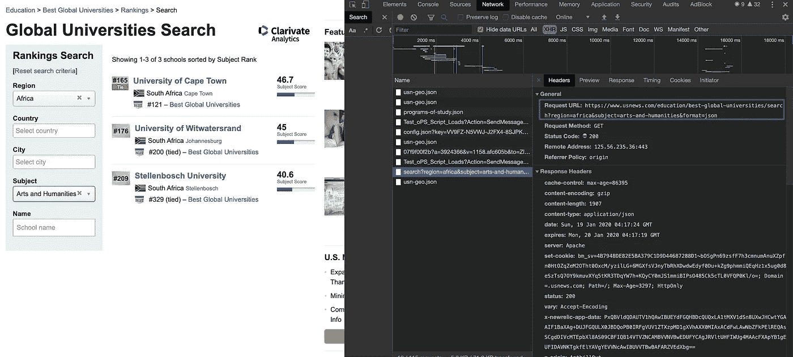
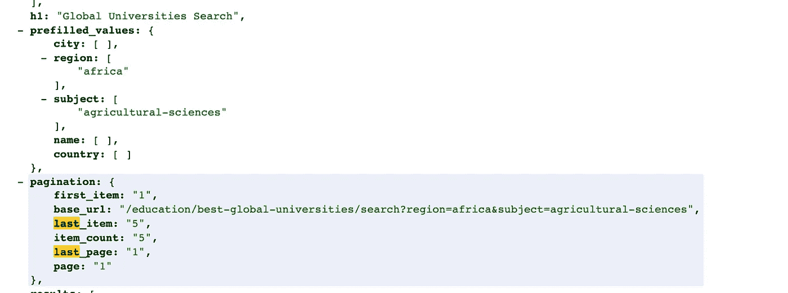
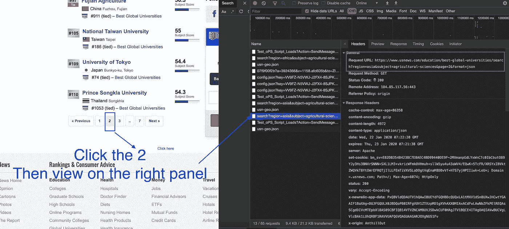

# 如何构建一个简单的网络爬虫

> 原文：<https://towardsdatascience.com/how-to-build-a-simple-web-crawler-66082fc82470?source=collection_archive---------1----------------------->

## 一步一步的指南刮出最好的全球大学排名

[图片来源](https://unsplash.com/photos/wbXdGS_D17U)

三年前，我在新加坡 NTU 大学的机构统计部门担任学生助理。

我被要求通过手动从网站上复制并粘贴到 excel 表格中来获得最佳全球大学排名。我很沮丧，因为我的眼睛累了，因为我长时间连续看着电脑屏幕。因此，我在想是否有更好的方法来做这件事。

那时，我在谷歌上搜索自动化，找到了答案——网络抓取。从那以后，我设法创建了 100 多个网络爬虫，这是我的第一个网络爬虫，我想和大家分享一下。

之前我做的是用 requests 加 BeautifulSoup 来完成任务。然而，三年后，当我再次访问同一个网站时，我发现有一种方法可以获取 JSON 数据，而且速度更快。

如果你正在考虑自动化你的无聊和重复的任务，请向我保证你会读到最后。您将学习如何创建网络爬虫，以便您可以专注于更多增值任务。

在这篇文章中，我想分享我如何建立一个简单的爬虫来抓取 usnews.com 大学的排名。

# 检查网站

当你想抓取[网站](https://www.usnews.com/education/best-global-universities/search?region=africa&subject=arts-and-humanities&name=)时，首先要做的是检查 web 元素。为什么我们需要这样做？

这实际上是为了发现是否存在更可靠的方法来获取数据或获得更清晰的数据。对于前者，我这次没有深究去挖掘 API。然而，我确实找到了提取更干净数据的方法，这样我就可以**减少数据清理时间**。

如果您不知道如何检查 web 元素，您只需导航到网页的任意位置，右键单击，单击检查，然后单击网络选项卡。之后，刷新您的页面，您应该会看到一个网络活动列表逐一出现。让我们来看看我在上面的截图中使用光标选择的特定活动(即`"search?region=africa&..."`)。

之后，请参考上面截图中的紫色框，突出显示浏览器将向其发送请求的 URL，以便获得要呈现给你的数据。

嗯，我们可以通过向那个 URL 发送请求来模仿浏览器的行为，并获得我们需要的数据，对吗？但是在这之前，为什么我选择调用请求网址而不是原来的网站网址？

让我们点击预览选项卡，你会注意到我们需要的所有信息，包括**大学排名**、**地址**、**国家等..**都在蓝色框中突出显示的结果字段中。

这就是我们勉强通过网址的原因。URL 返回的数据是一种非常好的格式——JSON 格式。

上面的截图显示了今天和 3 年前的代码对比。3 年前，当我还是一个网络抓取新手时，我只是使用请求、漂亮的页面、大量的 XPATH 和繁重的数据清理过程来获取我需要的数据。然而，如果你比较我今天写的代码，我只需要使用 httpx 来获取数据，不需要清理数据。

供您参考，httpx 是建立在请求之上的，但是它支持额外的功能，比如提供异步 API，使用 httpx，您可以发送 HTTP/2 请求。更完整的对比，你可以参考[这篇文章](https://medium.com/@factoryhr/http-2-the-difference-between-http-1-1-benefits-and-how-to-use-it-38094fa0e95b)。

**请求网址:**

[https://www . us news . com/education/best-global-university/search？区域=非洲&主题=农业科学&格式=json](https://www.usnews.com/education/best-global-universities/search?region=africa&subject=agricultural-sciences&format=json)

所以现在，让我们来关注一下如上图所示我们将要使用的链接。您会注意到，您可以更改 region 和 subject 的值，因为它们是 URL 的参数。(关于 URL 参数的更多信息，这里的[是一个很好的阅读)但是，请注意，它们的值仅限于网站提供的区域和主题。](https://www.searchenginejournal.com/technical-seo/url-parameter-handling/#close)

例如，您可以将**地区=非洲**改为**地区=亚洲**或者**科目=农业科学**改为**科目=化学。**如果你有兴趣了解支持的地区和题材有哪些，可以访问[我的回购](https://github.com/M140042/us_news)了解一下。

在了解了如何查询这个 URL 来获取你需要的数据之后，剩下的部分就是对于一个特定的地区和主题的组合，你需要查询多少个页面。

那么，我们就以[这个网址](https://www.usnews.com/education/best-global-universities/search?region=africa&subject=agricultural-sciences&format=json)为例，将网址复制粘贴到你的浏览器中并回车，然后用`command+f`搜索关键词“last_page”，你会发现类似如下的截图。

*请注意，我已经安装了一个 [chrome 扩展](https://chrome.google.com/webstore/detail/json-formatter/bcjindcccaagfpapjjmafapmmgkkhgoa)，它可以帮助我将普通数据美化成 JSON 格式。这就是为什么您可以看到我的浏览器中显示的数据打印得很好。

恭喜你，你成功找到了如上所示的 last_page 变量。现在，剩下的唯一过程是，如果 last_page 大于 1，如何转到下一页并获取数据。

下面是我如何找到导航到第 2 页的方法。以[这个环节](https://www.usnews.com/education/best-global-universities/search?region=asia&subject=agricultural-sciences)为例。

首先，点选页码 2，然后检视右边的面板。请注意紫色的框，您会注意到在请求 URL 中添加了 page=2。这意味着您只需要将`&page={page_number}`附加到原始请求 URL 上，以便在不同的页面间导航。

现在，您已经对如何创建一个 web scraper 来从网站获取数据有了一个整体的想法。

如果你想看完整的 Python 代码，请随意访问这里的。

# 最终想法

[图像来源](https://unsplash.com/photos/4K2lIP0zc_k)

非常感谢你一直读到最后。

以下是我想让你看完这篇文章后得到的收获。

1.  知道有许多不同的方法可以从网站上抓取数据，例如获取 JSON 格式的数据链接。
2.  花一些时间检查网站，如果你设法找到检索数据的 API，这可以节省你很多时间。

我之所以将我三年前写的代码和我今天写的代码进行比较，是为了让你知道如何通过不断的练习来提高你的网页抓取和编码技能。

努力吧，结果一定会来的。——低伟鸿

如果你有任何问题或想法要问或补充，欢迎在下面评论！

# 关于作者

[Low 魏宏](https://www.linkedin.com/in/lowweihong/?source=post_page---------------------------)是 Shopee 的数据科学家。他的经验更多地涉及抓取网站，创建数据管道，以及实施机器学习模型来解决业务问题。

他提供爬行服务，可以为你提供你需要的准确和干净的数据。你可以访问[这个网站](https://www.thedataknight.com/)查看他的作品集，也可以联系他获取**的抓取服务**。

你可以在 [LinkedIn](https://www.linkedin.com/in/lowweihong/?source=post_page---------------------------) 和 [Medium](https://medium.com/@lowweihong?source=post_page---------------------------) 上和他联系。

 [## ●伟鸿-中等

### 在媒体上阅读低纬鸿的作品。数据科学家|网络抓取服务:https://www.thedataknight.com/.每…

medium.com](https://medium.com/@lowweihong?source=post_page-----6bef8cb1477a----------------------)