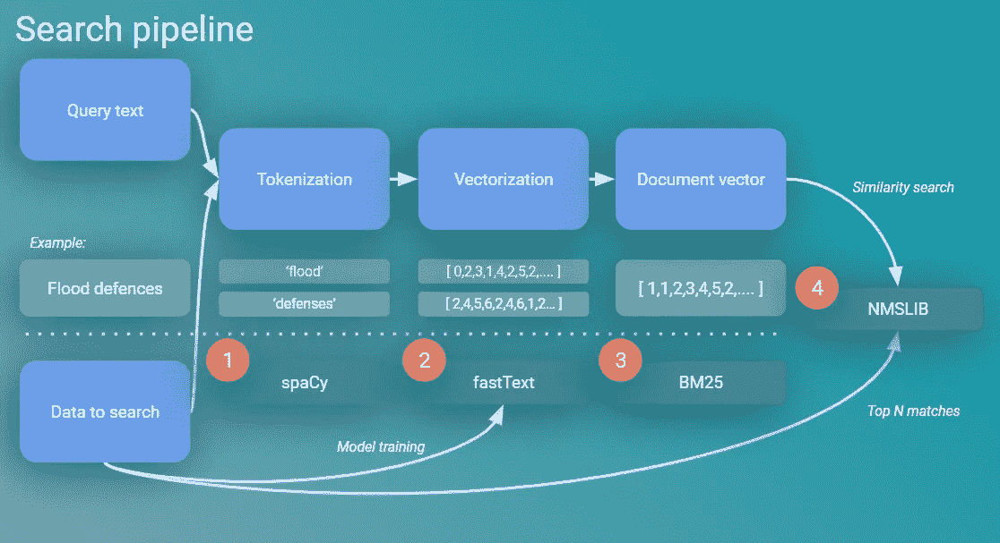
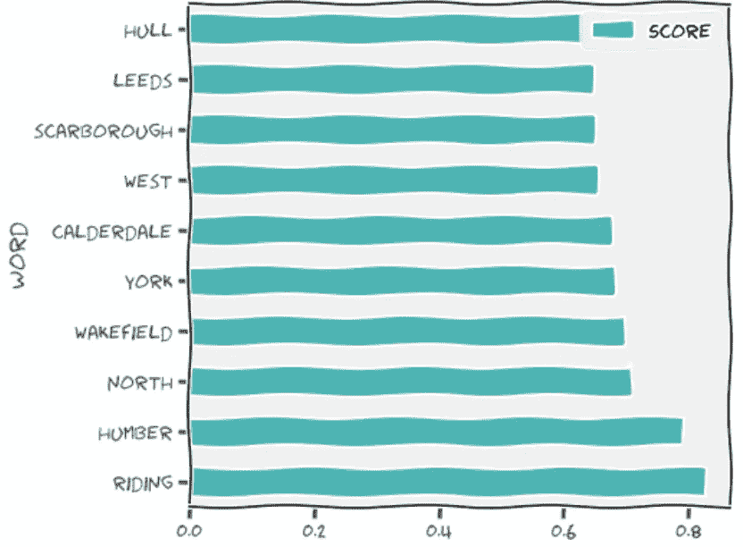
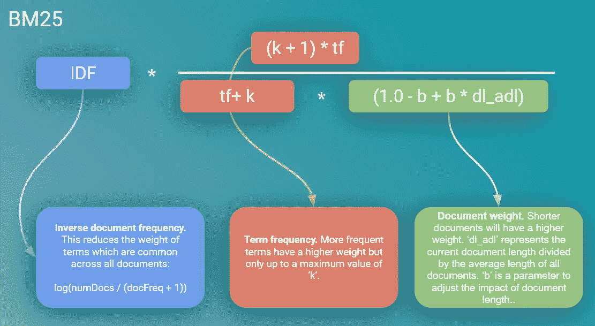

# 如何构建智能搜索引擎(下)

> 原文：<https://towardsdatascience.com/how-to-build-a-smart-search-engine-a86fca0d0795?source=collection_archive---------2----------------------->

## 用 Python 创建智能搜索服务


*作者所有图片*

[在本系列的第一篇文章](/how-to-build-a-search-engine-9f8ffa405eac)中，我们只用了几行代码就构建了一个搜索引擎，该引擎采用了当今许多大型企业搜索引擎中使用的 BM25 算法。

在这篇文章中，我们想超越这一点，并**创造一个真正智能的搜索引擎**。这篇文章将描述这样做的过程，并提供在任何数据集上实现这一点的**模板代码。**

但是我们所说的“聪明”是什么意思呢？我们将它定义为一个能够:

*   向用户返回相关结果，即使他们没有在这些结果中搜索特定的单词。
*   注意位置；了解英国邮政编码和英国城镇的地理关系。
*   能够扩展到更大的数据集(我们将迁移到一个更大的数据集，而不是上一个示例中的 212k 记录，但是我们需要能够扩展到更大的数据)。
*   比我们上次的实施快几个数量级，甚至在搜索大型数据集时也是如此。
*   以明智的方式处理拼写错误、打字错误和以前“看不见”的单词。

为了实现这一点，我们需要结合多种技术:

*   快速文本单词向量。我们将在我们的数据集上训练一个模型来创建单词的向量表示(更多信息[在这里](/supercharging-word-vectors-be80ee5513d))。
*   BM25。我们仍将使用这种算法来支持我们的搜索，但我们需要将它应用到我们的词向量结果中。
*   使用轻量级和高效的[非度量空间库(NMSLIB)](https://github.com/nmslib/nmslib) 超快速搜索我们的结果。

这将看起来像下面这样:



我们将在本帖中创建的管道概述

本文将逐一介绍这些领域，并描述如何将它们结合起来创建一个智能搜索引擎。

## **1。设置；预处理和标记文本**

创建搜索引擎的第一步是将我们的文档分割成单独的单词或“记号”。spaCy 库使这变得非常简单和快速。提醒一下，我们在本文中使用的例子与上一篇文章中的例子相同。它包含发布在 [Contracts Finder](https://www.contractsfinder.service.gov.uk/Search) 平台上的英国公共部门合同通知。但是，出于本练习的目的，我们增加了数据集的大小(现在是 212k 记录，以前只有 50k)。除此之外，我们还将位置数据引入了我们的数据集。在进行任何处理之前，我们使用的数据框如下所示:


数据集的一些示例记录(总共 212k 记录)

我们将在搜索引擎中使用的列是“文本”列，它是每个通知的自由文本和位置字段的合并。

我们可以使用 spaCy 库，对这个列进行清理和标记。以下代码通过使用 spaCy 管道来实现这一点，这使得处理尽可能高效，并且还允许我们仅选择我们想要使用的令牌化器引擎的部分(再次确保该过程尽可能快):

上面的代码将我们的文档分割成一个令牌列表，同时执行一些基本的清理操作，删除标点符号、空白并将文本转换为小写。在 Colab 笔记本上运行，每秒钟可以处理 1800 多个通知。

## **2。创建单词向量；建立一个快速文本模型**

***为什么字矢？为什么不是伯特/GPT-3/[最新的 SOTA NLP 模型]？***

自从引入像 BERT 这样复杂的变压器模型以来，单词向量模型似乎已经过时了。然而，由于以下原因，它们今天仍然具有相关性:

*   与 transformer 模型相比，它们在创建可伸缩服务的所有重要方面(模型大小、训练时间、推理速度)都是“轻量级”的。
*   由于上述原因，他们可以在特定领域的文本上从头开始训练。除此之外，它们可以在相对较小的数据集上被训练(即，数千个文档，而不是通常用于训练变压器模型的数百万个文档)。
*   它们更容易解释，因为单词向量将保持一致，并且不会根据周围文本的上下文而改变(这既是优点也是缺点，稍后将详细介绍)。

除此之外，使用 Gensim 库实现它们非常简单。这里我们正在构建一个快速文本模型:

***回顾绩效:***

现在我们已经训练好了我们的模型，让我们看看它的表现如何。

fastText 在捕获语料库中单词之间的关系方面的有效性一直让我感到惊讶。有几个例子可以很好地说明这一点:

**与‘M4’最相似的单词:**

```
ft_model.wv.most_similar("m4", topn=20, restrict_vocab=5000)
```


与“m4”最相似的单词。该模型理解与英国高速公路命名的联系。分数越高，相似性越大

这真的令人震惊，该模型已经清楚地了解到 M4 与英国高速公路相关，并理解其他大型英国高速公路与此类似(M1、M5、M3、M60)。

它还了解到，LRN 也密切相关(这代表当地的道路网络)我甚至不知道这一点！

“9AT”标记看起来很奇怪，但是快速搜索就会发现这是英国高速公路的邮政编码。

在单词向量模型中包含邮政编码和位置信息是经过深思熟虑的设计选择。基本原理是该模型将理解英国邮政编码和位置如何相互关联。让我们来测试一下:

**与‘约克郡’最相似的单词:**



与“Yorkshire”最接近的单词的相似性得分越高，表示相似性越大

该模型了解到约克郡是英国的一个地区(位于西北部)以及其中的主要城镇。它还理解该区域和其子区域之间的关系；这里的“骑马”指的是约克郡境内的北/东/西骑马。但是邮政编码呢？

**与‘RG9’最相似的词:**

RG9 是英国境内与亨利镇相关的邮政编码。这是一个棘手的例子，因为亨利是一个很小的城镇，RG 邮政编码也用于附近其他更大的城镇(如雷丁)。该模型能够正确地将此邮政编码与 Henley 关联起来吗？


该模型知道 RG9 邮政编码与亨利镇相关

它出色地通过了！Henley 是最相似的单词，其他结果也高度相关，代表邻近的城镇和邮政编码。

显然，我们的词向量模型表现良好，在下一步中，我们将使用 BM25 算法来增强我们的词嵌入。

## **3。将 BM25 应用于单词向量**

现在我们有了单词向量，我们需要找到一种方法，在搜索引擎中为每个文档组合这些向量。

最简单的方法是对每个文档的单词向量进行平均(这是可行的),但是已经证明将单词向量与 BM25 算法相结合可以产生更高质量的搜索结果[1]

下面是 BM25 的简单回顾，但是请回顾我的第一篇文章，以获得更多关于其内部工作的细节:



BM25 内部运作的回顾

虽然这看起来很复杂，但用我们的单词 vectors 实现它实际上非常简单，只需要几行代码(就像本文中的所有其他步骤一样！)

将我们的单词向量转换成使用 BM25 加权的文档向量

这个输出将为我们的搜索引擎中的每个文档提供一个向量。

## **4。使用 NMSLIB** 创建超快速搜索索引

我们现在已经有了数据集中每个文档的向量列表。我们还可以使用上面概述的技术为用户的搜索查询创建一个向量。

但是我们如何根据这个搜索查询返回相关的结果呢？我们需要能够找到与我们的搜索向量最近的向量。鉴于我们的向量中有大量的维度(100 ),这是我们的方法可能开始失败的地方。搜索引擎需要很快，在超过 20 万条记录的数据集中搜索超过 100 个维度是非常耗费资源的。

**NMS lib:**

令人欣慰的是，这是计算机科学中一个相当普遍的挑战，并且已经有解决方案来大规模加速相似性搜索问题。NMSLIB 是最快的解决方案之一[2]。使用这个库，我们可以创建一个搜索索引，这将比使用暴力方法查找相似向量快几个数量级:

## 将所有这些放在一起；更智能的搜索引擎:

现在我们有了搜索索引，只需创建一个搜索向量并从索引中返回最接近的匹配项:

使用与我们上一篇文章中相同的查询 ***【洪水防御】*** ，我们现在得到以下结果(前 5 名):

```
Searched 212,447 records in 0.0005 seconds:Q3172 PROPERTY FLOOD MITIGATION SCHEME WASH GREEN, WIRKSWORTH, DERBYSHIRE SUPPLY AND INSTALL CERTIFIED FLOOD PROTECTION PRODUCTS INCLUDING  FLOOD DOORS, FLOOD BARRIERS, AIR BRICKS AND OTHER WORKS IDENTIFIED IN THE PROPERTY LEVEL FLOOD PROTECTION SURVEY REPORTS, AS WELL AS SKIMMER PUMPS AND HOSES. Matlock DE4 3AG WHIMPLE FLOOD DEFENCE IMPROVEMENTS CONSULTANCY SERVICES FOR PREPARATION OF CONTRACT FOR CONSTRUCTION OF FLOOD ALLEVIATION SCHEME. Sidmouth EX10 8HL FLOOD RISK ASSESSMENT FLOOD RISK ASSESSMENT Woolwich SE186HQ PAPERMILL DYKE FLOOD DEFENCE WALL CONSTRUCTION OF FLOOD DEFENCE Doncaster DN1 3BU MVDC - JS - LEVEL 2 STRATEGIC FLOOD RISK ASSESSMENT LEVEL 2 STRATEGIC FLOOD RISK ASSESSMENT TO SUPPORT PREPARATION OF THE FUTURE MOLE VALLEY LOCAL PLAN Surrey RH4 1SJ
```

一些伟大的成果。此外，搜索在 0.0005 秒内完成。这比我们之前的搜索引擎快了 122 倍，尽管数据集的大小超过了 4 倍。

同样值得强调的是，许多结果虽然高度相关，但并不包含“防御”一词。使用单词向量的方法意味着现在不再需要精确的单词匹配来返回相关的结果。

考虑到地理信息也应该在搜索索引中进行编码，让我们尝试搜索一个在特定区域授予的合同。为此，我们将使用 NR2 邮政编码进行搜索，以查找诺里奇的通知: ***“审计服务 NR2”。*** 以下是前 3 名的结果:

```
Searched 212,447 records in 0.0004 secondsPROVISION OF EXTERNAL AUDIT SERVICES THE CONTRACT IS A SINGLE LOT FOR THE PROVISION OF EXTERNAL AUDIT SERVICES. Norwich NR4 6TJGB-NORWICH: EXTERNAL AUDIT ANNUAL AUDIT OF TRUST FINANCIAL & QUALITY ACCOUNTS AND ANNUAL REPORT. Norwich NR6 5BEGB-NORWICH: 18-022 - INTERNAL AUDIT SERVICES BROADLAND HOUSING GROUP WISHES TO ENTER INTO A CONTRACT FOR INTERNAL AUDITING. Norwich NR1 1HU
```

有用！返回诺里奇的内部和外部审计服务的所有结果，请注意，即使我们使用 NR2 邮政编码进行搜索，它也知道这与其他诺里奇的 NR4、NR6 和 NR1 邮政编码类似……非常聪明！

最后，让我们输入一个错别字，看看它是否还能以智能的方式处理这个问题。 ***《审计服务在诺维奇》:***

```
Searched 212447 records in 0.0005 secondsPROVISION OF EXTERNAL AUDIT SERVICES THE CONTRACT IS A SINGLE LOT FOR THE PROVISION OF EXTERNAL AUDIT SERVICES. Norwich NR4 6TJGB-NORWICH: EXTERNAL AUDIT ANNUAL AUDIT OF TRUST FINANCIAL & QUALITY ACCOUNTS AND ANNUAL REPORT. Norwich NR6 5BEGB-NORWICH: 18-022 - INTERNAL AUDIT SERVICES BROADLAND HOUSING GROUP WISHES TO ENTER INTO A CONTRACT FOR INTERNAL AUDITING. Norwich NR1 1HU 0.13
```

同样的结果再次出现，尽管城镇名称拼写错误。

## **总之:**

在这篇文章中，我们已经看到了如何将单词向量与 BM25 结合起来，并通过快速相似性搜索索引对其进行增压，从而创建一个智能的、可伸缩的和高性能的搜索引擎。

尽管如此，考虑这是否对最终用户有益总是很重要的。例如，我们可能会发现用户更喜欢简单的关键字搜索，因为他们可以很容易地解释结果。这也凸显了创造“更智能”服务的最大风险之一；它们通常会变成:

*   不太容易预测，
*   学习搜索数据中存在的偏见；
*   由于复杂性的增加，调试会更加困难。

由于这些原因，它们需要大量的测试，以确保一旦投入生产，它们就能按预期运行。

随着搜索变得越来越复杂，随着时间的推移，我们无疑会看到更复杂的解决方案出现。[看到这一领域如此快速的发展是一件好事，但同样重要的是要记住，通常最简单的问题解决方案是最好的。](https://en.wikipedia.org/wiki/Occam%27s_razor)

## [笔记本包含数据和代码](https://colab.research.google.com/drive/10ZrZaLBmhEqKSSEoe_cos783m2junUdr?usp=sharing)

[](https://colab.research.google.com/drive/10ZrZaLBmhEqKSSEoe_cos783m2junUdr?usp=sharing) [## 智能搜索

### 用 Python 创建智能搜索引擎的代码

colab.research.google.com](https://colab.research.google.com/drive/10ZrZaLBmhEqKSSEoe_cos783m2junUdr?usp=sharing) 

## **参考文献:**

[1]搜索引擎中的词嵌入，质量评测[https://ad-publications . cs . uni-freiburg . de/themes/学士 _ 埃内科 _Pinzolas_2017.pdf](https://ad-publications.cs.uni-freiburg.de/theses/Bachelor_Eneko_Pinzolas_2017.pdf)

[2]相似性搜索库的基准[https://github.com/erikbern/ann-benchmarks](https://github.com/erikbern/ann-benchmarks)

链接到本系列的第一部分:

[](/how-to-build-a-search-engine-9f8ffa405eac) [## 如何建立一个搜索引擎

### 用几行代码在 Python 中创建健壮的全文搜索

towardsdatascience.com](/how-to-build-a-search-engine-9f8ffa405eac) 

*一如既往，非常感谢 TDS 编辑团队！*