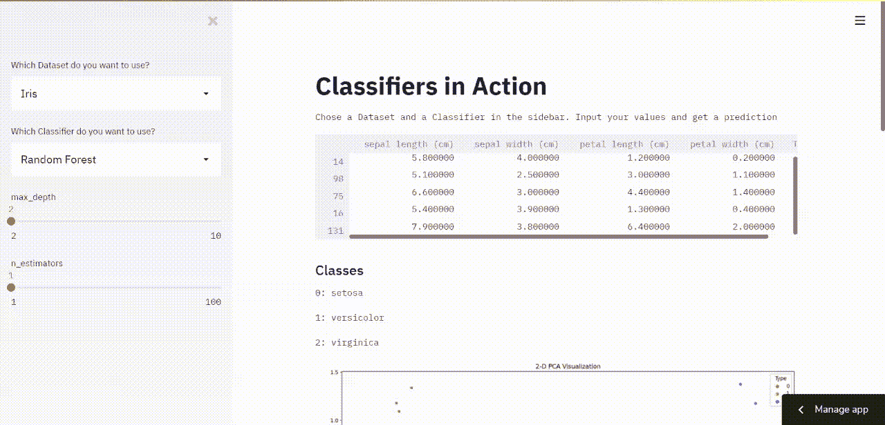
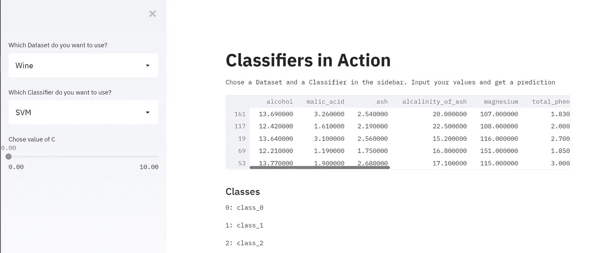
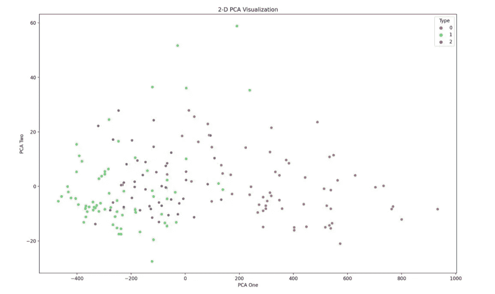
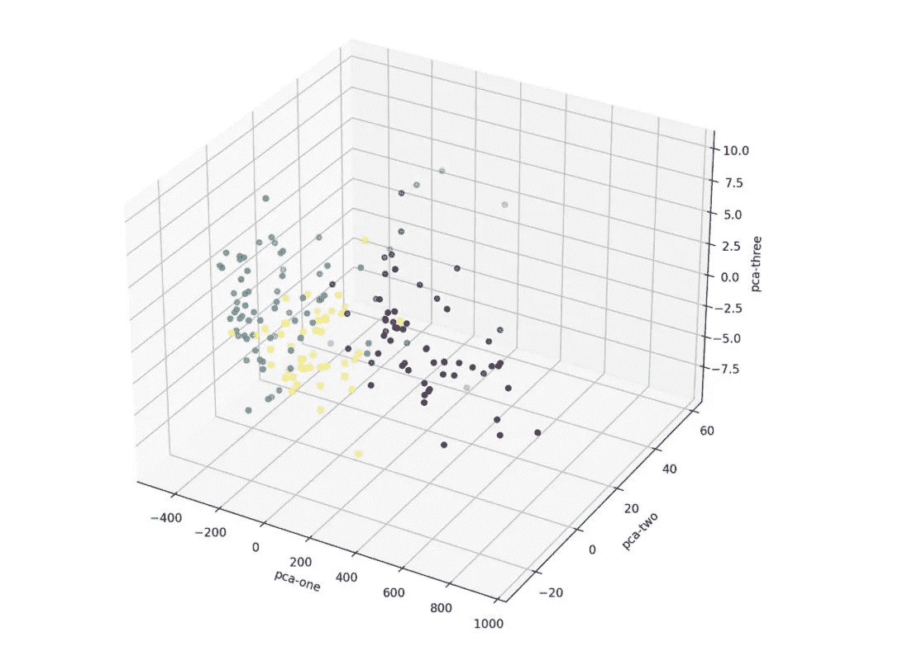

# 如何构建一个 Streamlit UI 来分析葡萄酒、虹膜和乳腺癌数据集上的不同分类器

> 原文：<https://towardsdatascience.com/how-to-build-a-streamlit-ui-to-analyze-different-classifiers-on-the-wine-iris-and-breast-cancer-25c03c482a27?source=collection_archive---------18----------------------->

## 让我们使用 Streamlit 和 sklearn 构建一个 web 应用程序



作者的屏幕截图

在本教程中，我们将使用三个数据集(虹膜、乳腺癌、葡萄酒)

我们将使用 3 种不同的模型(KNN，SVM，随机森林)进行分类，并让用户能够设置一些参数。

# 安装并导入必要的库

## 设置虚拟环境

```
pip install virtualenv  /* Install virtual environment */
virtualenv venv         /* Create a virtual environment */
venv/Scripts/activate   /* Activate the virtual environment */
```

## 安装库

安装库之前，请确保您的虚拟环境已激活

```
pip install streamlit, seaborn, scikit-learn
```

## 导入库

```
import streamlit as st
from sklearn.datasets import load_wine, load_breast_cancer, load_iris
from  sklearn.neighbors import KNeighborsClassifier
from sklearn.ensemble import RandomForestClassifier
from sklearn.svm import SVC
from sklearn.model_selection import train_test_split
from sklearn.decomposition import PCA
import matplotlib.pyplot as plt
import seaborn as sns
import pandas as pd
```

我们导入 streamlit，来自 sklearn 的数据集，来自 sklearn 的各种模型，制作我们的地块和熊猫所需的库。

# 助手功能

## 函数来获取数据集

```
def return_data(dataset):
    if dataset == 'Wine':
        data = load_wine()
    elif dataset == 'Iris':
        data = load_iris()
    else:
        data = load_breast_cancer()
    df = pd.DataFrame(data.data, columns=data.feature_names , index=None)
    df['Type'] = data.target
    X_train, X_test, y_train, y_test = train_test_split(data.data, data.target, random_state=1, test_size=0.2)
    return X_train, X_test, y_train, y_test,df,data.target_names
```

*   该函数接受一个字符串，该字符串包含用户选择的数据集的名称
*   它加载相关的数据集
*   我们创建了一个可以在 UI 中显示的数据帧
*   我们使用 sklearn 的 **train_test_split()** 来创建训练集和测试集
*   该函数返回训练集、测试集、数据帧和目标类

## 函数返回模型

我们将使用 streamlit 的**滑块**组件从用户那里获取参数输入。

**st.sidebar.slider(label = ' '，min_value = 1，max_value = 100)** 在侧边栏中创建一个滑块。

```
def getClassifier(classifier):
    if classifier == 'SVM':
        c = st.sidebar.slider(label='Chose value of C' , min_value=0.0001, max_value=10.0)
        model = SVC(C=c)
    elif classifier == 'KNN':
        neighbors = st.sidebar.slider(label='Chose Number of Neighbors',min_value=1,max_value=20)
        model = KNeighborsClassifier(n_neighbors = neighbors)
    else:
        max_depth = st.sidebar.slider('max_depth', 2, 10)
        n_estimators = st.sidebar.slider('n_estimators', 1, 100)
        model = RandomForestClassifier(max_depth = max_depth , n_estimators= n_estimators,random_state= 1)
    return model
```

*   和前面的函数一样，这个函数接受一个参数，这个参数是一个包含模型名称的字符串。
*   基于所选的模型，我们要求用户给出参数值。
*   对于 SVM，我们将 C 参数作为用户的输入
*   对于 KNN，我们在进行预测时考虑模型的最近邻居的数量
*   对于随机森林，我们取决策树的数目和决策树的最大深度
*   然后，我们创建模型的实例并返回模型

## PCA 的功能

```
def getPCA(df):
    pca = PCA(n_components=3)
    result = pca.fit_transform(df.loc[:,df.columns != 'Type'])
    df['pca-1'] = result[:, 0]
    df['pca-2'] = result[:, 1]
    df['pca-3'] = result[:, 2]
    return df
```

我们用的是 sklearn 的 PCA。我们将 3 个组件添加到数据帧中并返回它。

# 构建用户界面



作者截图

```
# Title
st.title("Classifiers in Action")

# Description
st.text("Chose a Dataset and a Classifier in the sidebar. Input your values and get a prediction")

#sidebar
sideBar = st.sidebar
dataset = sideBar.selectbox('Which Dataset do you want to use?',('Wine' , 'Breast Cancer' , 'Iris'))
classifier = sideBar.selectbox('Which Classifier do you want to use?',('SVM' , 'KNN' , 'Random Forest'))
```

我们使用 streamlit 的 **selectbox** 组件创建一个下拉菜单，供用户选择数据集和模型

```
# Get Data
X_train, X_test, y_train, y_test, df , classes= return_data(dataset)
st.dataframe(df.sample(n = 5 , random_state = 1))
st.subheader("Classes")
for idx, value in enumerate(classes):
    st.text('{}: {}'.format(idx , value))
```

*   我们使用助手函数来获取数据
*   我们使用 streamlit 的 **dataframe** 组件来显示数据集的一个示例
*   我们还使用 helper 函数返回的最后一个变量来显示这些类

我们将使用 seaborn 和 matplotlib 在 2d 和 3d 中可视化 PCA。

streamlit 的 **pyplot** 组件接受一个图形作为参数，并在 UI 中显示该图形。



作者截图

```
# 2-D PCA
df = getPCA(df)
fig = plt.figure(figsize=(16,10))
sns.scatterplot(
    x="pca-1", y="pca-2",
    hue="Type",
    palette=sns.color_palette("hls", len(classes)),
    data=df,
    legend="full"
)
plt.xlabel('PCA One')
plt.ylabel('PCA Two')
plt.title("2-D PCA Visualization")
st.pyplot(fig)
```



作者截图

```
#3-D PCA
fig2 = plt.figure(figsize=(16,10)).gca(projection='3d')
fig2.scatter(
    xs=df["pca-1"],
    ys=df["pca-2"],
    zs=df["pca-3"],
    c=df["Type"],
)
fig2.set_xlabel('pca-one')
fig2.set_ylabel('pca-two')
fig2.set_zlabel('pca-three')
st.pyplot(fig2.get_figure())
```

最后，我们将对模型进行训练，并得到训练、测试的准确率分数。

```
# Train Model
model = getClassifier(classifier)
model.fit(X_train, y_train)
test_score = round(model.score(X_test, y_test), 2)
train_score = round(model.score(X_train, y_train), 2)

st.subheader('Train Score: {}'.format(train_score))
st.subheader('Test Score: {}'.format(test_score))
```

> 你已经成功地建立了一个项目，你可以展示你的投资组合👏 👏 👏

我最近用 WordPress 创建了一个博客，如果你能看看的话，我会很高兴的😃

 [## Python 项目教程-使用这些 Python 项目教程改进您的简历/作品集。

### 使用 Streamlit 共享部署您的机器学习 Web 应用程序在我以前的文章中，我谈到过构建一个…

realpythonproject.com](https://realpythonproject.com/) 

在 LinkedIn 上与我联系

[](https://www.linkedin.com/in/rahulbanerjee2699/) [## Rahul baner JEE——产品工程实习生——EY | LinkedIn

### 查看 Rahul Banerjee 在世界上最大的职业社区 LinkedIn 上的个人资料。拉胡尔有 4 个工作列在他们的…

www.linkedin.com](https://www.linkedin.com/in/rahulbanerjee2699/) 

在 Twitter 上与我联系