# 使用 TensorFlow.js 通用句子编码器的文本相似性

> 原文：<https://towardsdatascience.com/how-to-build-a-textual-similarity-analysis-web-app-aa3139d4fb71?source=collection_archive---------10----------------------->

## 从学者到构建相似句子分组网络应用的旅程


一些布赖顿的沐浴盒比其他的更相似。“给我看看那些红色的”[照片由 [me](https://medium.com/@jinglesnote) 拍摄]

你想知道搜索引擎是如何理解你的查询并检索相关结果的吗？聊天机器人如何从你的问题中提取你的意图，并提供最恰当的回应？

在这个故事中，我将详细介绍构建文本相似性分析 web 应用程序所需的每个部分，包括:

*   单词嵌入
*   句子嵌入
*   余弦相似性
*   构建文本相似性分析网络应用
*   结果分析

试试[文本相似性分析网络应用](https://jinglescode.github.io/demos/nlp-sentence-encoder)，在下面的评论中让我知道它是如何为你工作的！

# 什么是单词嵌入？

单词嵌入**启用** **知识表示，其中向量表示单词**。这提高了神经网络从文本数据集学习的能力。

在单词嵌入成为自然语言处理的事实标准之前，处理单词的一种常见方法是使用一次性矢量化。每个单词代表向量空间中的一列，每个句子是一个由*个 1*和*个 0*组成的向量。*个*表示单词在句子中的存在。

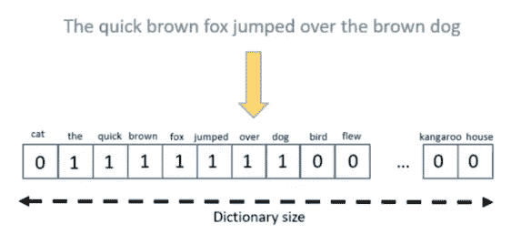

一键矢量化[摘自[文本编码:综述](/text-encoding-a-review-7c929514cccf)

结果，这导致了一个巨大而稀疏的表示，因为零*比一*多得多。当一个词汇表中有很多单词时，它会创建一个很大的单词向量。这可能会成为机器学习算法的一个问题。

一键矢量化也无法捕捉单词的含义。比如“*饮料*”和“*饮料*”，虽然这是两个不同的词，但是定义却差不多。

通过单词嵌入，语义相似的单词具有相似的向量表示。因此，当出现类似“*我想点一杯饮料*”或“*一杯饮料*”的短语时，点餐系统可以以同样的方式解释该请求。

## 过去的单词嵌入

早在 2003 年， [Yoshua Bengio 等人](http://www.jmlr.org/papers/volume3/bengio03a/bengio03a.pdf)引入了语言模型概念。那篇论文的重点是学习单词的表示，这允许模型预测下一个单词。

这篇论文是至关重要的，并导致了单词嵌入的发展和发现。约舒厄与杰弗里·辛顿和扬·勒昆一起获得了图灵奖。

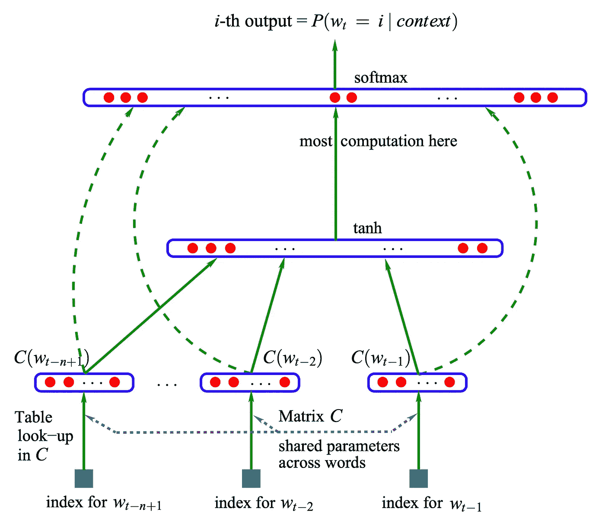

将单词的特征向量序列输入到单词的条件概率分布中，以预测下一个单词[图片取自[论文](http://www.jmlr.org/papers/volume3/bengio03a/bengio03a.pdf)

2008 年，[罗南和杰森](https://thetalkingmachines.com/sites/default/files/2018-12/unified_nlp.pdf)研究了一个可以学习识别相似单词的神经网络。他们的发现为自然语言处理开辟了许多可能性。下表显示了单词列表以及十个最相似的单词。

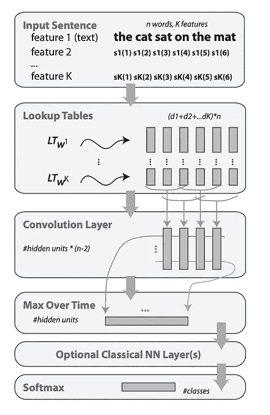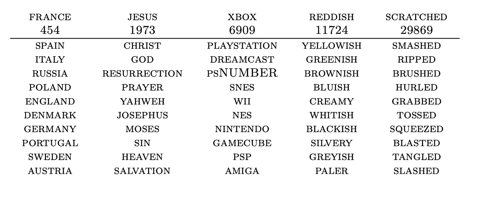

左图:给定输入句子的神经网络结构，输出类别概率。右表:选出的 5 个单词和 10 个最相似的单词。[资料来源于[论文](https://thetalkingmachines.com/sites/default/files/2018-12/unified_nlp.pdf)

2013 年， [Tomas Mikolov 等人](https://arxiv.org/pdf/1301.3781.pdf)介绍了从拥有数十亿单词的数据集学习高质量的单词向量。他们将它命名为 *Word2Vec，*它包含了词汇中的数百万个单词。

Word2Vec 从此开始流行。如今，单词嵌入层在所有流行的深度学习框架中。

## 单词嵌入示例

在谷歌预训练的 Word2Vec 模型上，他们从谷歌新闻数据集中训练了大约 1000 亿个单词。单词“*猫*”与“*猫*”、“*狗*”、“*老鼠*”、“*宠物*”的意思最接近。

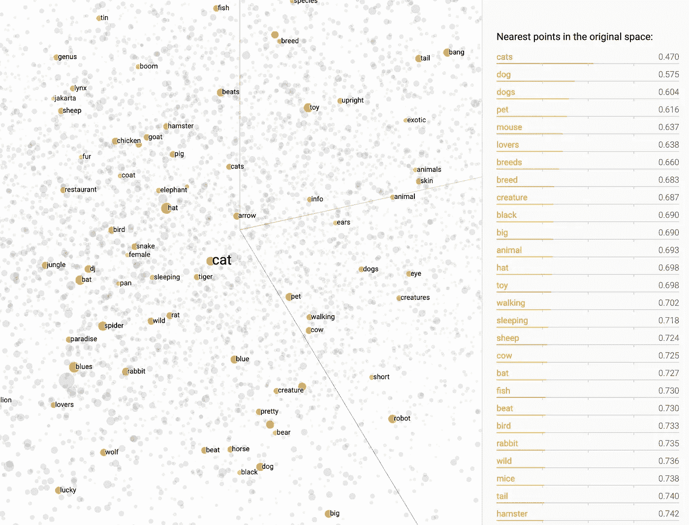

“*猫*这个词在几何上更接近于“*猫*”、“*狗*”、“*老鼠*”、“*宠物*”。【摘自[嵌入式投影仪](http://projector.tensorflow.org/)

单词嵌入还设法识别单词之间的关系。一个经典的例子是单词之间的性别角色关系。比如，“*男*之于“*女*”就好比“*王*”之于“*后*”。

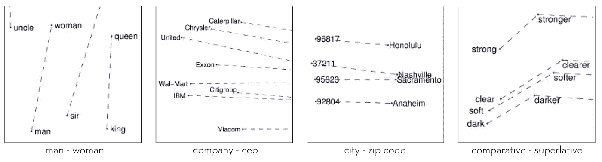

从手套无监督学习算法学习到的单词之间的有趣关系[ [图像源](https://nlp.stanford.edu/projects/glove/)

## 深入挖掘单词嵌入

加利纳·奥莱尼克在描述单词嵌入的动机方面做得非常出色。从一键编码和 TF-IDF 到手套和庞加莱。

[](/word-embeddings-exploration-explanation-and-exploitation-with-code-in-python-5dac99d5d795) [## 单词嵌入:探索、解释和利用(带 Python 代码)

### 单词嵌入讨论是每个自然语言处理科学家都在谈论的话题

towardsdatascience.com](/word-embeddings-exploration-explanation-and-exploitation-with-code-in-python-5dac99d5d795) 

这里有一篇由[迪潘然(DJ)萨卡尔](https://medium.com/u/6278d12b0682?source=post_page-----aa3139d4fb71--------------------------------)撰写的 29 分钟的关于各种语言模型的综合文章。他涵盖了 Word2Vec、GloVe 和 FastText 如果你打算研究单词嵌入，一定要看看这个。

[](/understanding-feature-engineering-part-4-deep-learning-methods-for-text-data-96c44370bbfa) [## 文本数据深度学习方法的直观实践方法— Word2Vec、GloVe 和 FastText

### 驯服非结构化文本数据的更新、高级策略

towardsdatascience.com](/understanding-feature-engineering-part-4-deep-learning-methods-for-text-data-96c44370bbfa) 

## 项目的 Word 嵌入资源

TensorFlow 在这个 [Colab 笔记本](https://colab.research.google.com/github/tensorflow/docs/blob/master/site/en/tutorials/text/word_embeddings.ipynb)中提供了一个关于单词嵌入和代码的[教程](https://www.tensorflow.org/tutorials/text/word_embeddings)。您可以尝试使用这些代码，并用它来训练您在数据集上的单词嵌入。这个绝对可以帮你入门。

对于喜欢动画的人来说，在[嵌入投影仪](http://projector.tensorflow.org/)上有一个很酷的嵌入可视化。每个点代表一个单词，你可以在三维空间中可视化语义相似的单词。

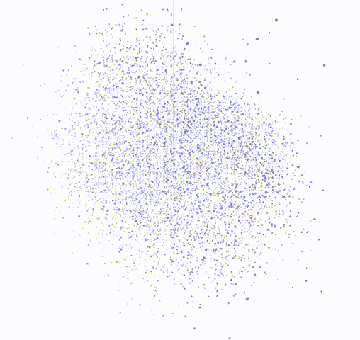

一个截屏[嵌入投影仪](http://projector.tensorflow.org/)。你看到的每个点代表一个单词。

我们有单词向量来代表单词的意思；句子怎么样？

# 什么是通用句子编码器？

像单词嵌入一样，[通用句子编码器](https://arxiv.org/pdf/1803.11175.pdf)是一个通用的句子嵌入模型，它将文本转换成有语义意义的固定长度向量表示。

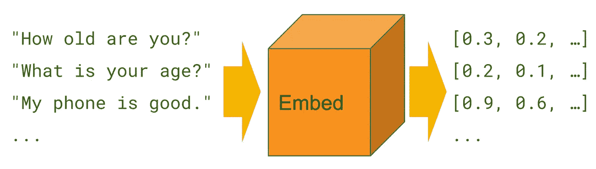

通用句子编码器将文本编码成高维向量[取自 [TensorFlow Hub](https://tfhub.dev/google/universal-sentence-encoder/1)

由通用句子编码器产生的这些向量捕获丰富的语义信息。我们可以将它用于各种自然语言处理任务，训练分类器，如[分类](https://en.wikipedia.org/wiki/Sentiment_analysis)和[文本相似性分析](https://en.wikipedia.org/wiki/Semantic_similarity)。

Google 有两个通用的句子编码器模型。其中一个基于**变压器**架构，另一个基于**深度平均网络**。

**Transformer** ，句子嵌入为每个单词创建上下文感知的表示，以生成句子嵌入。它是为更高的精度而设计的，但是编码需要更多的内存和计算时间。这对于情感分类是有用的，在情感分类中，像‘not’这样的词可以改变意思，并且能够处理像‘不错’这样的双重否定。

**深度平均网络**，单词的嵌入首先一起平均，然后通过一个前馈深度神经网络产生句子嵌入。不幸的是，通过平均向量，我们在这个过程中失去了句子的上下文和句子中的单词序列。它是为了速度和效率而设计的，牺牲了一些准确性(尤其是在讽刺和双重否定上)。一个很好的主题分类模型，将长文章分类。

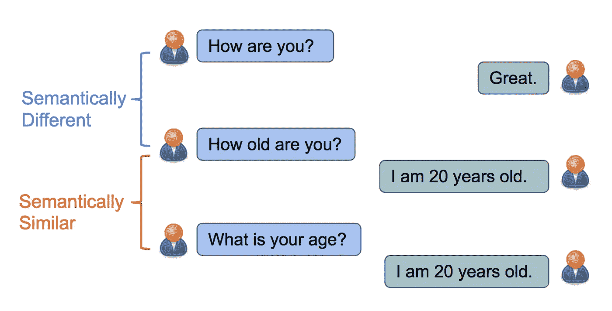

如果句子可以得到相同的回答，那么它们在语义上是相似的。[摘自[论文](https://arxiv.org/pdf/1804.07754.pdf)

[杨等人](https://arxiv.org/pdf/1804.07754.pdf)介绍了一种利用会话数据学习句子表征的方法。

比如，“*你多大了？*、*你多大了？*”，两个问题语义相似，一个聊天机器人可以回复同一个答案“*我 20 岁*”。

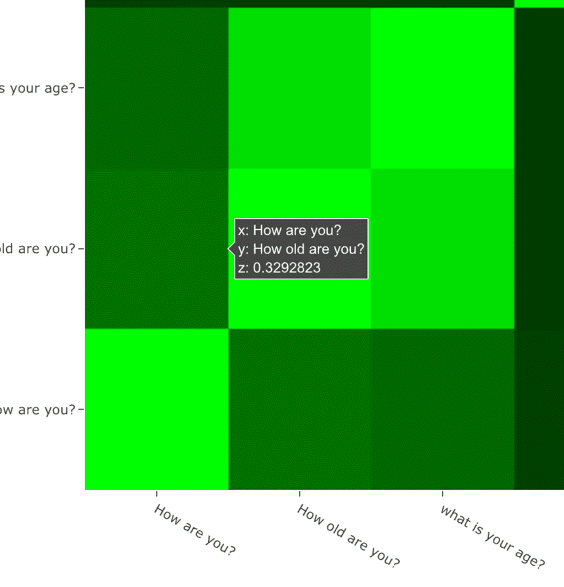

“你好吗？”以及“你多大了？”即使有相同的单词也有 33%的相似度[ [demo](https://jinglescode.github.io/demos/nlp-sentence-encoder)

相比之下，虽然"*你好吗？*、*你多大了？*“包含相同的单词，两个句子有不同的意思。聊天机器人必须理解问题并给出适当的回答。

这是一张显示三个句子相似度的热图“*你多大了？*、*你多大了？*、*你好吗？*”。

“*你好吗？**你多大了？*“即使具有相同的单词，也具有低相似度分数。

[Logeswaran 等人](https://arxiv.org/abs/1803.02893)引入了一个从无标签数据中学习句子表征的框架。在本文中，现有方法中使用的解码器(*橙色框*)被从一组候选句子(*绿色框*)中选择目标句子的分类器所取代；它提高了问答系统的性能。

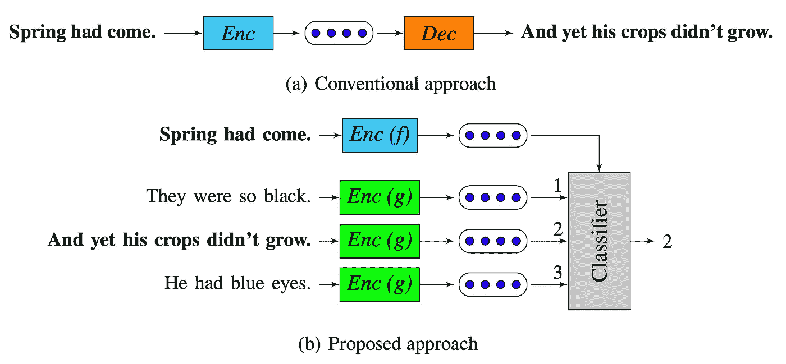

用从一组候选句子中选择目标句子的分类器代替先前方法中的解码器[摘自[论文](https://arxiv.org/pdf/1803.02893.pdf)

## 深入了解通用句子编码器

[Dipanjan (DJ) Sarkar](https://medium.com/u/6278d12b0682?source=post_page-----aa3139d4fb71--------------------------------) 解释了各种嵌入模型的发展。如果您热衷于构建文本分类器，他的文章详细介绍了在电影评论数据集上执行情感分析的每个步骤。

[](/deep-transfer-learning-for-natural-language-processing-text-classification-with-universal-1a2c69e5baa9) [## 面向自然语言处理的深度迁移学习——通用文本分类…

### 揭秘通用句子编码器指南

towardsdatascience.com](/deep-transfer-learning-for-natural-language-processing-text-classification-with-universal-1a2c69e5baa9) 

如果你好奇探索其他语言模型， [Pratik Bhavsar](https://medium.com/u/c0101388583?source=post_page-----aa3139d4fb71--------------------------------) 对比了 BERT、ELMo、USE、Siamese、InferSent 等各种语言模型的性能。学会选择正确的答案会改善你的结果。

[](https://medium.com/modern-nlp/on-variety-of-encoding-text-8b7623969d1e) [## NLP 中的各种编码器

### 文本的主特征工程

medium.com](https://medium.com/modern-nlp/on-variety-of-encoding-text-8b7623969d1e) 

## 为您的项目提供通用句子编码器资源

TensorFlow 提供了关于通用语句编码器的[教程](https://tfhub.dev/google/universal-sentence-encoder/1)，预训练模型和[笔记本](https://colab.research.google.com/github/tensorflow/hub/blob/50bbebaa248cff13e82ddf0268ed1b149ef478f2/examples/colab/semantic_similarity_with_tf_hub_universal_encoder.ipynb)。如果你正在考虑构建自己的文本分类器，一定要看看这个。

有了每个句子的语义向量，我们如何衡量句子之间的相似性呢？

# 余弦相似度是什么？


Photo by [浮萍 闪电](https://unsplash.com/@vsmilelx?utm_source=medium&utm_medium=referral) on [Unsplash](https://unsplash.com?utm_source=medium&utm_medium=referral)

[余弦相似度](https://en.wikipedia.org/wiki/Cosine_similarity)是通过计算**两个向量**之间的余弦角来衡量相似度。如果两个向量相似，则它们之间的角度较小，余弦相似值更接近 1。

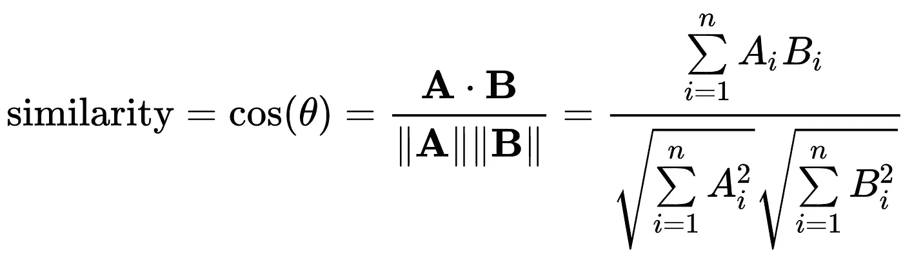

给定两个向量 *A* 和 *B* ，余弦相似度 cos(θ)使用[点积](https://en.wikipedia.org/wiki/Dot_product)和[幅度](https://en.wikipedia.org/wiki/Magnitude_(mathematics)#Euclidean_vector_space)来表示【来自[维基百科](https://en.wikipedia.org/wiki/Cosine_similarity)

在这里，我们将句子输入通用句子编码器，它返回给我们句子嵌入向量。

有了向量，我们就可以得到向量之间的余弦相似性。对于每一个句子对， *A* 和 *B* ，我们可以计算出 *A* 和 *B* 向量的余弦相似度。

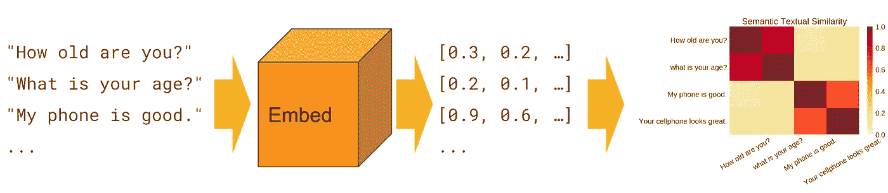

语义相似度是衡量两个文本表达相同意思的程度。[摘自 [TensorFlow Hub](https://tfhub.dev/google/universal-sentence-encoder/1)

我们可以确定将句子分组在一起最小阈值。当相似性得分在 0 到 1 之间时，也许我们可以选择 0.5，在中间点。这意味着任何相似度大于 0.5 的句子都将被聚集在一起。

## 深入挖掘衡量相似性的方法

[Euge Inzaugarat](https://medium.com/u/5515433d5913?source=post_page-----aa3139d4fb71--------------------------------) 介绍了六种度量向量间相似性的方法。每种方法都适用于特定的环境，因此了解它们就像了解您的数据科学工具箱一样。

[](/how-to-measure-distances-in-machine-learning-13a396aa34ce) [## 机器学习中如何测量距离

### 这完全取决于你的观点

towardsdatascience.com](/how-to-measure-distances-in-machine-learning-13a396aa34ce) 

# 文本相似性分析网络应用的构建模块


照片由 [Ryan Quintal](https://unsplash.com/@ryanquintal?utm_source=medium&utm_medium=referral) 在 [Unsplash](https://unsplash.com?utm_source=medium&utm_medium=referral) 上拍摄

在这个项目中，我将使用这些库:

*   TensorFlow.js
*   通用句子编码器
*   有角的

## TensorFlow.js

TensorFlow.js 是 Google 建立的一个框架，支持 JavaScript 的机器学习。我们可以**开发机器学习模型，并将它们部署在网络浏览器和 Node.js** 中。

*因为我喜欢开发 web 应用程序，所以当 TensorFlow.js 在 2018 年发布时，我非常高兴。*

很容易上手，我们可以用 [npm](https://www.npmjs.com/) 安装 TensorFlow.js。

```
$ npm install @tensorflow/tfjs
```

简单线性回归模型的示例如下。

```
import * as tf from '@tensorflow/tfjs';const model = tf.sequential();
model.add(tf.layers.dense({units: 1, inputShape: [1]}));model.compile({loss: 'meanSquaredError', optimizer: 'sgd'});const xs = tf.tensor2d([1, 2, 3, 4], [4, 1]);
const ys = tf.tensor2d([1, 3, 5, 7], [4, 1]);model.fit(xs, ys, {epochs: 10}).then(() => {
  model.predict(tf.tensor2d([5], [1, 1])).print();
});
```

## 通用句子编码器

我将使用的是来自 [TensorFlow.js](https://www.tensorflow.org/js) 的[通用句子编码器包](https://github.com/tensorflow/tfjs-models/tree/master/universal-sentence-encoder)。我们可以使用 [npm](https://www.npmjs.com/) 安装通用语句编码器。

```
$ npm install @tensorflow-models/universal-sentence-encoder
```

这个例子展示了我们如何使用通用句子编码器从每个句子中提取嵌入内容。

```
import * as use from '@tensorflow-models/universal-sentence-encoder';use.load().then(model => {
  const sentences = [
    'Hello.',
    'How are you?'
  ];
  model.embed(sentences).then(embeddings => {
    embeddings.print(true /* verbose */);
  });
});
```

## 有角的

[Angular](https://angular.io/) 是 Google 为创建动态单页应用而构建的 web 应用框架。

对于这个项目，我使用的是 Angular 8.0。我喜欢在 Angular 的[模型-视图-控制器设计模式](https://en.wikipedia.org/wiki/Model%E2%80%93view%E2%80%93controller)的基础上构建。从 Angular 的第一个版本开始，我就一直在使用它，在我的大部分 web 开发中也是如此。但由于他们每半年推出一次主要版本，感觉我的工作会变得过时(也许？我不知道)。React 是一个流行的 UI 框架，所以也许有一天我会改用 React。谁知道呢？

## 余弦相似性

创建一个函数，使用[余弦相似性公式](https://en.wikipedia.org/wiki/Cosine_similarity)计算两个向量的相似性。

```
similarity(a, b) {
  var magnitudeA = Math.sqrt(this.dot(a, a));
  var magnitudeB = Math.sqrt(this.dot(b, b));
  if (magnitudeA && magnitudeB)
    return this.dot(a, b) / (magnitudeA * magnitudeB);
  else return false
}
```

计算每个句子对的相似性得分的另一个函数如下。

```
cosine_similarity_matrix(matrix){
  let cosine_similarity_matrix = [];
  for(let i=0;i<matrix.length;i++){
    let row = [];
    for(let j=0;j<i;j++){
      row.push(cosine_similarity_matrix[j][i]);
    }
    row.push(1);
    for(let j=(i+1);j<matrix.length;j++){
      row.push(this.similarity(matrix[i],matrix[j]));
    }
    cosine_similarity_matrix.push(row);
  }
  return cosine_similarity_matrix;
}
```

## 将一切结合在一起


照片由 [Amélie Mourichon](https://unsplash.com/@amayli?utm_source=medium&utm_medium=referral) 在 [Unsplash](https://unsplash.com?utm_source=medium&utm_medium=referral) 上拍摄

我已经介绍了这个项目所需的所有主要组件。现在我们只需要把它们像乐高积木一样堆叠起来，打包并部署到 Github。

瞧啊。我们得到了一个用于现场演示的 web 应用程序。

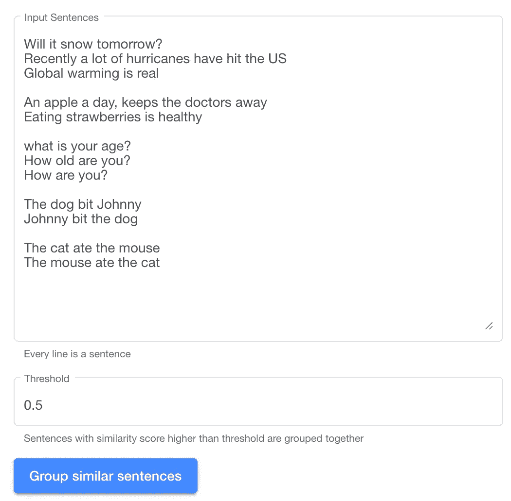

输入语义相似的句子列表[ [演示](https://jinglescode.github.io/demos/nlp-sentence-encoder)

我们有一个句子列表，这些将被输入到通用句子编码器中。它将输出每个句子的嵌入。然后我们计算每个句子之间的相似度。

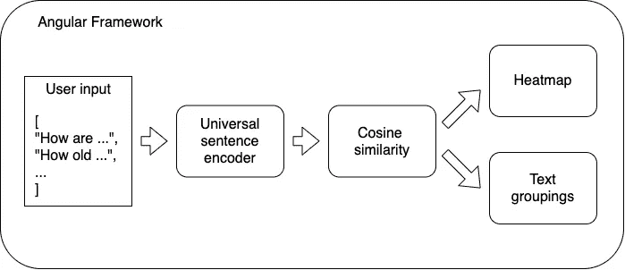

## 结果

这些是我们将测试我们的通用句子编码器的句子。目的是把意思相似的句子组合在一起。我挑了几个比较难的案例，让我们看看它的表现如何。

> 明天会下雪吗？
> 最近许多飓风袭击了美国
> 全球变暖是真的
> 
> 一天一个苹果，医生远离我吃草莓有益健康
> 
> 你多大了？
> 你多大了？你好吗？
> 
> 约翰尼被狗咬了
> 
> 猫吃了老鼠
> 老鼠吃了猫

这张热图显示了每个句子与其他句子的相似程度。绿色越亮，表示相似度越接近 1，这意味着句子之间越相似。

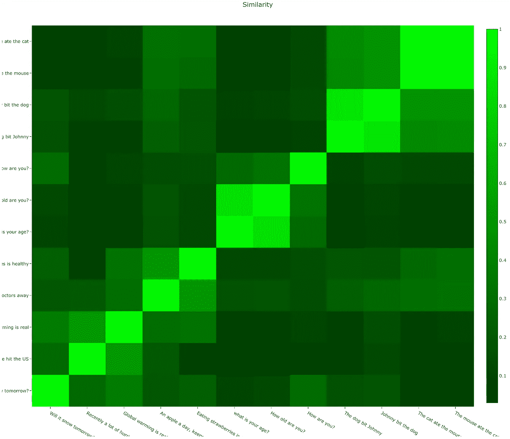

12 个句子对的语义相似度[ [demo](https://jinglescode.github.io/demos/nlp-sentence-encoder)

我们可以调整该值来确定一个最小相似度阈值，以便将句子组合在一起。这些是以大于 0.5 的相似性值分组在一起的句子。

> 最近许多飓风袭击了美国全球变暖是真的
> 
> 每天一个苹果，医生远离我吃草莓是健康的
> 
> **第三组**
> 你多大了？你多大了？
> 
> **第四组**
> 狗咬了约翰尼
> 约翰尼咬了狗
> 
> **第五组**
> 猫吃了老鼠
> 老鼠吃了猫

我们的 web 应用程序出色地识别出了“ *Group 1* ”是*天气相关问题*。即使两个句子没有任何重叠的单词。

它成功地识别出“*飓风*”和“*全球变暖*”与天气有关，但不知何故未能将“*雪*”归入这一类别。

可惜，“*强尼咬了狗”和“狗咬了强尼”有着* 87%的相似度。可怜的约翰尼，我不知道哪个更好。

同样，对于“*猫吃了老鼠*”和“*老鼠吃了猫*”，我希望这两个向量有相反的相似性。

感谢您到目前为止的阅读！

再一次，试试[文本相似性分析网络应用](https://jinglescode.github.io/demos/nlp-sentence-encoder)，在下面的评论中让我知道它是如何为你工作的！

如果您想构建类似的东西，请查看 web 应用程序的[代码](https://github.com/jinglescode/demos/tree/master/src/app/components/nlp-sentence-encoder)。

# 我构建的其他机器学习网络应用

因为我喜欢构建 web 应用程序，所以我开发了这些 web 应用程序来展示 web 上的机器学习能力。一定要跟随我的媒体([广告歌](https://medium.com/u/641197e9ee36?source=post_page-----aa3139d4fb71--------------------------------))，因为我会建立更多这样的。

使用 TensorFlow.js 进行时间序列预测。

[](/time-series-forecasting-with-tensorflow-js-1efd48ff2201) [## 使用 TensorFlow.js 进行时间序列预测

### 从在线 API 中提取股票价格，并使用 RNN 和 LSTM 以及 TensorFlow.js 进行预测(包括演示和代码)

towardsdatascience.com](/time-series-forecasting-with-tensorflow-js-1efd48ff2201) 

一个学习玩井字游戏的强化代理。

[](/reinforcement-learning-value-function-57b04e911152) [## 强化学习价值函数

### 代理使用价值函数学习井字游戏的强化学习算法——带网络演示

towardsdatascience.com](/reinforcement-learning-value-function-57b04e911152) [](https://www.linkedin.com/in/jingles/)[](https://towardsdatascience.com/@jinglesnote)[](https://jingles.substack.com/subscribe)

# 参考

[1] Bengio，Yoshua，等.[一种神经概率语言模型。](http://www.jmlr.org/papers/volume3/bengio03a/bengio03a.pdf)(2003)

[2]科洛波特、罗南和杰森·韦斯顿。"[自然语言处理的统一架构:具有多任务学习的深度神经网络。](https://thetalkingmachines.com/sites/default/files/2018-12/unified_nlp.pdf)(2008)

[3] Mikolov，Tomas，等.[向量空间中单词表示的高效估计。](https://arxiv.org/pdf/1301.3781.pdf)(2013)

[4] Cer，Daniel 等.[通用语句编码器。](https://arxiv.org/pdf/1803.11175.pdf)(2018)

[5]杨，，等.[从会话中学习语义文本相似度.](https://arxiv.org/pdf/1804.07754)(2018)

[6] Logeswaran、Lajanugen 和 Honglak Lee。"[学习句子表征的高效框架。](https://arxiv.org/pdf/1803.02893.pdf)(2018)