# 如何用 RNN 和喀拉斯建立翻译管道

> 原文：<https://towardsdatascience.com/how-to-build-a-translation-pipeline-with-rnn-and-keras-57c1cf4a8a7?source=collection_archive---------27----------------------->

## 你有没有想过一台计算机是如何能够如此快速地学习多种语言的？按照这个逐步指南创建您的第一个翻译模型。

巴别塔，老彼得·布鲁盖尔的画

在上一篇文章中，我们看到了 FFNN 在增益上下文方面的局限性。对于这些情况，更好的方法是 RNN，它可以管理上下文并生成状态，以便更好地理解跨时间步长的数据。**在本文中，我们将通过使用 keras 创建翻译模型来实践我们所学的内容**。

更准确地说，我们将开发一种多对多类型的 RNN，也称为序列对序列或 Seq2Seq。更高级的 Seq2Seq 结构包括编码器-解码器或注意力模型。我们将构建的模型如下所示。

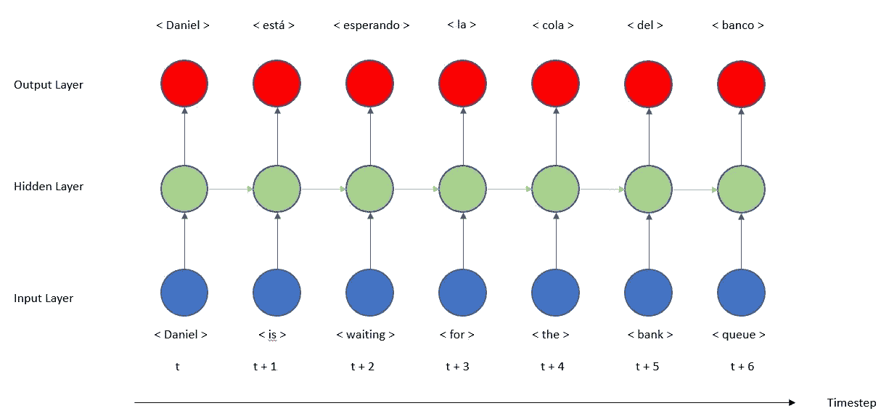

*作者图片*

输入层接收英语句子，每个单词是一个时间步长。然后，隐藏层(RNN)计算每个时间步长的状态，该状态将用于下一个时间步长，输出将用于密集层。

# 数据清理

样本数据可以在[manythings.org](http://www.manythings.org/bilingual/)下载，来自 [Tatoeba](https://tatoeba.org/spa) 。它由你需要的语言中的句子对组成。在我们的例子中，我们将使用西班牙语-英语对。

我们需要做的第一件事是导入库:

然后我们将读取文件并解析数据。

为了不让计算机处理大量的线对并保持例子的简洁，我们将只处理少量的数据。让我们来看看几双。

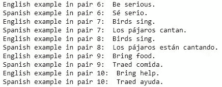

从上一个片段打印。*作者图片*

句子包含有大写字母和标点符号的单词，所以让我们清除它。在本文中，我们将看到每个步骤的代码片段和示例。最后，所有内容都将合并到一个文件中。

它将打印“我今天要冲浪”。

## 标记器

机器学习模型不能阅读单词，只能阅读数字，为了给模型提供数据，我们需要将单词转换成数字。我们从 Keras 导入 Tokenizer 并应用两种方法。首先我们实例化这个类，然后用完整的文本调用方法 *fit_on_texts* 。得益于此，我们将**创建一个字典，我们将一个单词映射到一个索引**，每个唯一的单词都有一个唯一的索引。我们已经创建了一个名为 *text_examples* 的例子列表，我们有 3 个句子。这三个句子是我们的完整数据集，所以当我们调用这个方法时，它会为每个单词创建一个新的索引。让我们看看通过打印 *word_index.items()* 我们创建了什么。

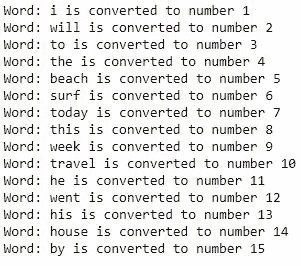

从上一个片段打印。*作者图片*

每个单词都有自己的索引，例如单词“beach”即使出现了两次，也只是在索引为 5 的情况下创建一次，对于索引为 3 的“to”也是如此。**我们已经创建了映射，但是我们还没有将句子转换成那些索引**。为此，我们需要调用方法 *texts_to_sequences* ，它的作用不再是创建映射，而是应用它。它采用句子“我今天将冲浪”，并将“我”更改为 1，“将”更改为 2，“冲浪”更改为 6，“今天”更改为 7。因此，句子“我今天将冲浪”变成了[1，2，6，7]。

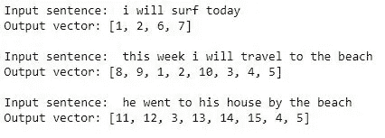

从上一个片段打印。*作者图片*

看起来很奇怪，电脑读数字更舒服，因为它失去了单词的所有意义。当两个单词是同义词时会发生什么？**一个模型如何知道 234 和 67 是否有相似的含义？**它来了**嵌入，不是把一个单词映射到一个索引，而是把一个单词映射到一个向量。**计算这些向量可以保留单词的意思，并创建一个空间表示。当我们表示这些向量时，具有相似意义的单词也将具有相似的坐标。这种技术被称为嵌入，将在下一篇文章中讨论。

我们创建一个函数来返回向量和映射。

让我们把我们到目前为止所看到的应用到句子对而不是例子中，并探索结果。

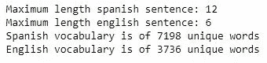

从上一个片段打印

西班牙语有 7198 个独特的单词，而英语只有 3736 个。此外，另一个区别是句子的最大长度，而西班牙语由 12 个单词组成，英语的最大长度是 6 个单词。等等，到目前为止，我们已经看到，两个句子应该是相同的长度，以适应 RNN 结构，我们如何处理不同的长度？

## 填料

为了使所有的句子长度相同，我们使用 Keras 的 T2 填充序列。这个类的作用非常简单，对于那些长度小于最大长度的句子，它会加一个 0。回到我们的列表 *text_examples* ，最大长度是 8，而第一个句子的长度是 4，那么当我们应用填充时，我们有[1 2 6 7 0 0 0 0]。添加了 4 个零，使其长度为 8。其他两个句子的长度已经是 8，则不应用任何更改。

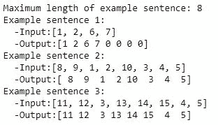

从上一个片段打印。*作者图片*

一个更直观的例子如下。对于时间步长为 8 的 RNN，我们要翻译句子“鸟儿歌唱”它变成了“los pájaros están cantando”

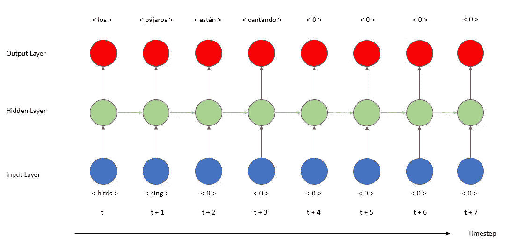

RNN 结构，*作者图片*

我们将在构建模型时参考这个图像。我们将相同的代码应用于西班牙英语对。

我们准备好了，句子已经被清理了，它们也变成了向量，由于填充，它们的长度是一样的。我们的训练数据准备好了。

# 模型创建

我们需要定义的第一层是输入层，图像' *RNN 结构'*中的蓝色层。在 Keras 中，RNN 的**输入形状是 3D(批量大小，时间步长，特征)**。输入层有两个元素(时间步长，特征),我们已经知道时间步长，从我们的最大句子长度 12，和特征是在时间步长的观察数量，在我们的例子中只有一个。然后 batch_size 被定义为对象*模型*的方法 *fit* 的一个参数，Keras 假设它为 1 或更大。

我们添加的第二层是 RNN，更准确地说，在这种情况下，我们处理的是长短期记忆(LSTM)。需要注意的一个重要参数是***return _ sequences***，默认设置为 False，该图层的输出将只是最后一个时间步的矢量，如下图所示。

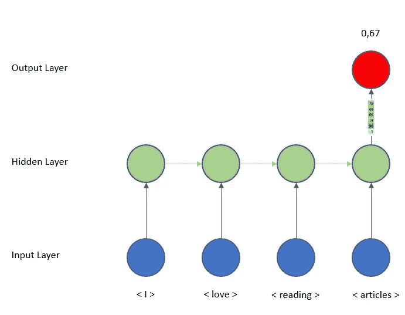

情感分析(多对一)。RNN 在最后一步输出矢量，*作者的图片*

我们不需要在每个时间步获得输出，只需要在最后获得输出，这样密集层就可以做出预测。但是在我们的例子中，正如我们在图像' *RNN 结构* ' **中看到的，在每个时间步**都有一个预测，所以 RNN 层在最后不会输出一个矢量，而是在每个时间步**输出一个矢量。**

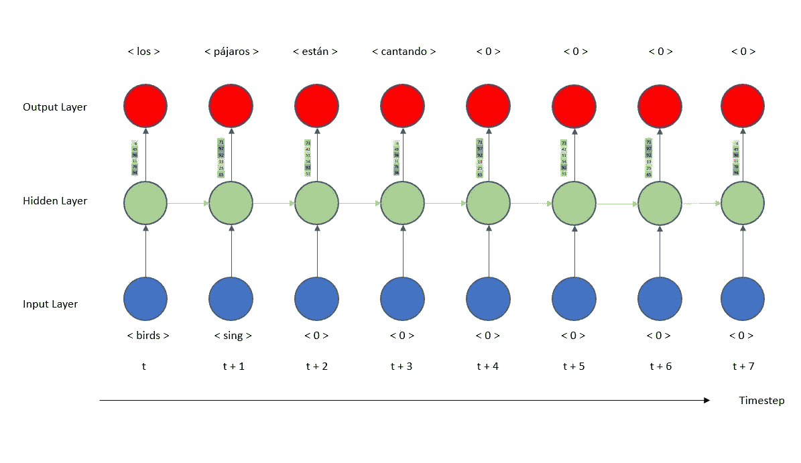

多对多。当 return_sequences=True 时，RNN 层在每个时间步长输出一个矢量

在这个解释之后是介绍时间分布的时候了。尽管概念上非常简单，但当你第一次面对它时，它会引起一些混乱。我们刚刚在 RNN 层中设置了 *return_sequences=True* ，所以我们在每一步都有一个输出向量。那我们该怎么办？**应用一个密集层，**所以最后用一个激活层我们可以做一个预测。这个致密层是什么样子的？

**输入层接收一个形状为 256** 的矢量，它相当于 LSTM 层中的 256 个单位。**输出层有一个 7198** 的形状，代表我们词汇中唯一西班牙语单词的总数( *spanish_vocab* )。**预测字将是 7198 中已经激活的单元**。因此，如果最终向量除了单元 324 之外都是零，其中我们有一个 1，我们将索引 324 映射到标记化器，并获得翻译的单词。这是在每个孤立的时间步完成的。

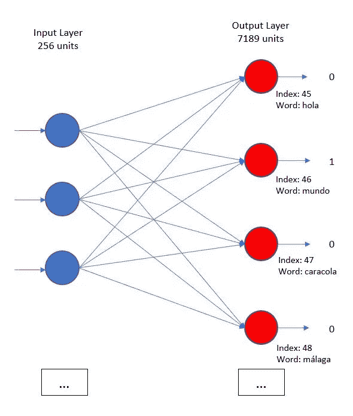

*作者图片*

我们刚刚看到了如何应用密集层，但是**时间分布**有什么用呢？**这仅仅意味着我们在每个时间步**应用先前解释的层。因为我们使用 *return_sequence=True* ，RNN 层在每个时间步输出一个矢量，因此我们需要在每个时间步应用相同的密集层。如果我们放大模型的输出层，它看起来如下。

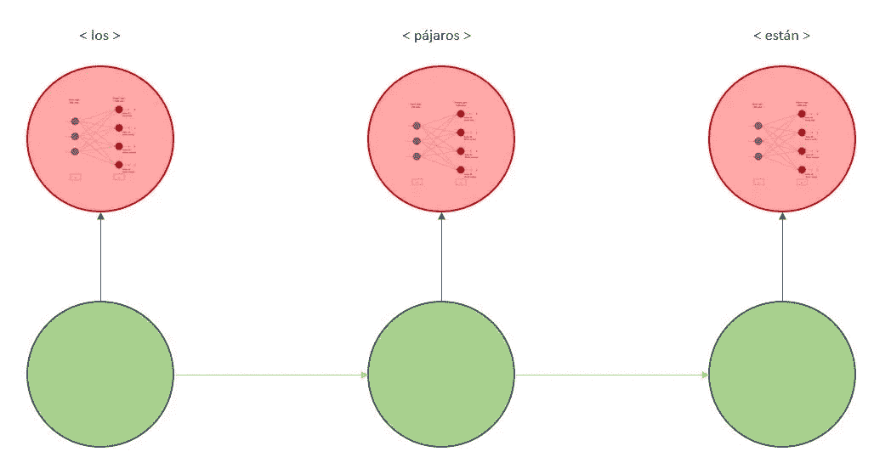

*作者图片*

总而言之，为了创建模型，我们应用以下代码。

该模式的总结是:

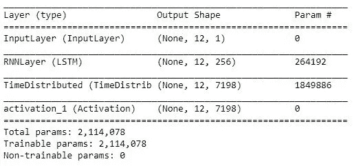

最后，我们训练我们的模型。参数尚未优化，本文的目的是了解和创建管道。

一旦我们完成训练，让我们做一些预测。正如我们之前看到的，模型在每个时间步长的输出是形状 7198 的向量，其中激活的单元是预测的单词，因此例如，如果在我们的第一次预测之后，我们有输出 324，我们需要将索引映射到西班牙语单词。下面的函数将为我们完成这项工作。

为了检查最终的预测，我们使用下面的代码。

*你可以在* [*下面的链接*](https://github.com/NechuBM/rnn_tutorial/tree/feature/simple-rnn/tutorials/simple_rnn) 中找到一个 jupyter 笔记本，里面有完整的代码

## 摘要

在这篇文章中，我们把学到的关于 RNN 的概念付诸实践。

我们让 c **学习数据**，**创建了一个索引**来将每个单词映射到一个向量，并将所有的**句子转换成**那些**向量**，这要感谢*分词器*。然后我们使用 *pad_sequences* 让所有的句子都有**一样的长度。**

为了创建模型，我们定义了输入形状，我们用 *return_sequences=True* 创建了一个 LSTM 层，然后由于 **TimeDistributed** ，在每个时间步应用了一个密集层。

在下一篇文章中，我们将详细阐述模型架构，以创建一个更好的执行翻译。从理论的角度来看，我们将讨论不同类型的 RNN 建筑，如 LSTM，并分析之前介绍的术语，如嵌入。