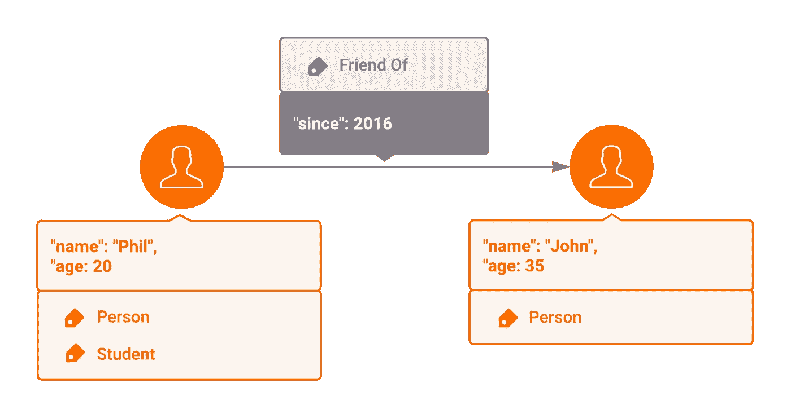
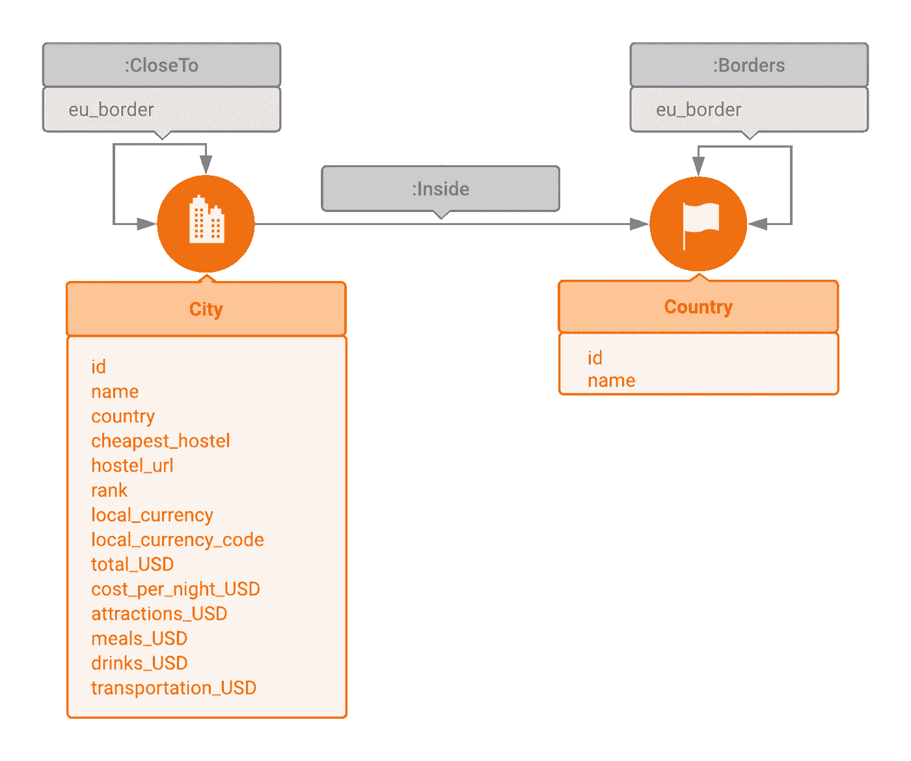

# 如何使用 Memgraph、Cypher 和 Python 构建旅行规划应用程序

> 原文：<https://towardsdatascience.com/how-to-build-a-travel-planning-application-with-memgraph-cypher-python-a1b0b346d529?source=collection_archive---------42----------------------->

## 了解如何利用广度优先搜索(BFS)和 Dijkstra 算法，用 Memgraph、Cypher 和 Python 构建一个简单的旅行规划应用程序。


*Christopher Czermak 在 Unsplash 上拍摄的照片*

# 介绍

背包旅行是一种在预算范围内探索世界的好方法。凭借其良好的交通网络、经济实惠的住宿条件和数以千计的景点，欧洲是背包客的完美旅行目的地。

在本教程中，您将学习如何利用 Memgraph、Cypher 和 Python 构建一个简单的旅行规划应用程序。您将学习如何使用图形数据库，以及如何使用 Python 语言驱动程序查询它。您还将学习如何利用流行的图形算法，包括[广度优先搜索(BFS)](https://en.wikipedia.org/wiki/Breadth-first_search) 和 [Dijkstra 的算法](https://en.wikipedia.org/wiki/Dijkstra%27s_algorithm)。

# 先决条件

要跟进，您需要以下内容:

*   运行 Linux 的机器。
*   Memgraph 的本地安装。您可以参考[Memgraph 文档](https://docs.memgraph.com/memgraph/quick-start)。
*   Python 内存图客户端。
*   Python 编程语言的基础知识。在本教程中，我们将使用 Python 3。
*   Cypher 查询语言的基础知识。

# 步骤 2 —构建数据模型

首先，我们必须定义我们将用来构建您的应用程序的数据模型。用于图形分析的最常见的数据模型之一是标签属性图(LPG)模型。这个模型被定义为一组顶点(即节点)和边(即关系)以及它们的属性和标签。



在本教程中，您将使用欧洲背包客指数(2018)数据集，该数据集包含位于 36 个欧洲国家的 56 个城市的信息。您的模型将包含两个类型为`City`和`Country`的顶点，三个类型为`Inside`、`CloseTo`和`Borders`的边，以及一些属性，如名称、排名、当地货币等。



既然已经定义了数据模型，下一步就是将数据导入 Memgraph。

# 步骤 3—使用 Cypher 和 Python 将数据导入 Memgraph

为了将数据导入 Memgraph，您将通过 Python 客户端`pymgclient`使用 Cypher 查询。

pymgclient 是 Python 编程语言的 Memgraph 数据库适配器，符合 PEP 249 描述的 DB-API 2.0 规范。

Cypher 是一种声明式查询语言，被许多人认为是处理属性图数据库的行业标准。

在开始之前，你必须安装`pymgclient`。这将允许您连接到 Memgraph 并运行您的查询。为此，我们将运行以下命令:

```
pip install pymgclient
```

现在我们已经安装了`pymgclient`，我们准备导入它并连接到 Memgraph 数据库。为此，我们将使用以下 Python 代码:

```
import mgclient# Connect to the database
connection = mgclient.connect(
    host='127.0.0.1',
    port=7687,
    sslmode=mgclient.MG_SSLMODE_REQUIRE)
connection.autocommit = True
```

既然我们的 python 客户机已经连接到 Memgraph，我们就可以开始运行查询了。为了加速数据导入，我们在`City`和`Country`顶点的`id`属性上创建索引。这将有助于 Memgraph 在创建边时快速找到城市和国家。注意，我们可以在另一个属性上创建索引，比如`name`，我们将获得相同的结果。

[注意]数据库索引实质上是创建数据库中某些数据的冗余副本，以提高索引数据的搜索效率。然而，这是以额外的存储空间和更多的写入为代价的，因此决定索引什么和不索引什么是一个重要的决定。

为了创建索引，我们将执行以下查询:

```
connection.cursor().execute("""
CREATE INDEX ON :City (id)
""")
connection.cursor().execute("""
CREATE INDEX ON :Country (id)
""")
```

既然我们的索引已经创建，我们将开始导入我们的，从国家开始。为此，我们将运行下面的[查询](https://download.memgraph.com/dataset/europe-backpacking/python/countries.txt)。

正如您所看到的，这个查询使用了`CREATE`子句来创建一个带有一个标签`Country`和两个属性`id`和`name`的顶点。

接下来，我们将添加`City`节点及其所有属性，如当地货币、餐饮的平均价格、交通费用等。为此，我们将使用下面的[查询](https://download.memgraph.com/dataset/europe-backpacking/python/cities.txt)。

如您所见，该查询使用相同的`CREATE`子句创建标签为`City`的节点，以及 14 个不同的属性。

现在我们已经创建了图表中的所有节点，我们准备开始添加边。为此，我们将运行下面的[查询](https://download.memgraph.com/dataset/europe-backpacking/python/edges.txt)。

在这个查询中，我们首先使用`MATCH`子句获取两个`City`节点，我们将在这两个节点之间创建一条边，然后使用`CREATE`子句创建一条标签为`CloseTo`的边和一个值为`True`或`False`的属性`eu_border`。

恭喜你。现在，您已经将所有数据集导入 Memgraph。现在，您可以开始执行查询和算法了。

# 步骤 4—用 Python 运行简单的密码查询

首先，我们可以运行一些简单的查询，比如获得旅馆最便宜的前 10 个城市。为此，您将运行以下查询:

```
cursor = connection.cursor()
cursor.execute("""
MATCH (n:City)
RETURN n.name, n.cheapest_hostel, n.cost_per_night_USD, n.hostel_url
ORDER BY n.cost_per_night_USD LIMIT 10
""")
print(cursor.fetchall())
```

该查询匹配所有标签为`City`的顶点，并返回城市名称、最便宜的旅馆名称、该旅馆每晚的费用以及旅馆 URL。然后，它根据最便宜的旅馆每晚的费用对结果进行排名，并返回前 10 个结果。

如果你去意大利旅游，想知道哪些城市适合背包客，哪家旅社对他们来说最便宜，该怎么办？要获得答案，您将运行以下查询:

```
cursor = connection.cursor()
cursor.execute("""
MATCH (c:City)-[:Inside]->(:Country {name: "Italy"})
RETURN c.name, c.cheapest_hostel, c.total_USD
ORDER BY c.total_USD;
""")
print(cursor.fetchall())
```

如您所见，该查询类似于我们之前使用的查询，但是我们没有匹配所有城市，而是只匹配通过类型`Inside`的边缘连接到意大利的城市

# 步骤 5—使用广度优先搜索算法查找和过滤路径

尽管这些查询给了我们一些有趣的见解和结果，但它们并不是图数据库特别感兴趣的东西。当我们开始询问涉及遍历任意数量的边的更复杂的问题时，图数据库变得很有价值。这些类型的寻路查询对于传统数据库来说可能会有问题，因为它们通常需要多个连接。

假设您想要从西班牙旅行到俄罗斯，但是您想要选择穿过最少边界的路线。这就是像广度优先搜索(BSF)这样的图算法派上用场的地方。要获得答案，您将使用以下查询:

```
cursor = connection.cursor()
cursor.execute("""
MATCH p = (n:Country {name: "Spain"})
          -[r:Borders * bfs]-
          (m:Country {name: "Russia"})
UNWIND (nodes(p)) AS rows
RETURN rows.name;
""")
print(cursor.fetchall())
```

该查询使用类型为`Borders`的边评估西班牙和俄罗斯之间的所有可能路径，计算每条路径的过境次数，并返回过境次数最少的路径。

如果您想根据特定标准过滤路径，该怎么办？假设您想从布拉迪斯拉发开车到马德里，并想计划您的路线以尽量减少停靠站的数量。你也想只去那些把欧元作为当地货币的国家，因为那是你唯一剩下的货币。为此，您将使用以下查询:

```
cursor = connection.cursor()
cursor.execute("""
MATCH p = (:City {name: "Bratislava"})
          -[:CloseTo * bfs (e, v | v.local_currency = "Euro")]-
          (:City {name: "Madrid"})
UNWIND (nodes(p)) AS rows
RETURN rows.name;
""")
print(cursor.fetchall())
```

如您所见，我们向查询`(e, v | v.local_currency = "Euro")`添加了一个特殊的语法。这被称为过滤λ函数。过滤器λ取一个边符号`e`和一个顶点符号`v`，并通过返回 true 或 false(或 Null)来决定该边和顶点对在广度优先扩展中是否应该被认为是有效的。在本例中，如果城市顶点`v`的类型`v.local_currency`的属性值等于 Euro，lambda 函数返回 true。一旦确定了最佳路径，查询将返回该路径上的城市列表，并且`UNWIND`子句将该列表解包到单独的行中。

# 步骤 6-使用 Dijkstra 算法寻找最短路径

到目前为止，您使用了广度优先搜索算法来查找穿过最少边数的路径。但是，如果你想找到一条最短的路径，并考虑到沿途每个城市的住宿价格，那该怎么办呢？换句话说，如果你想找到最短最便宜的路径呢？这是广度优先搜索算法达到极限的地方。只有当所有的边和顶点都没有权重或者具有相同的权重时，BFS 才会准确地计算最短路径。

当涉及到在图中寻找边和顶点不具有相同权重的最短路径时，您将需要使用 Dijkstra 算法。

例如，假设你想从布鲁塞尔旅行到雅典，而你的预算很紧。为了找到最便宜的路线，您可以使用以下查询:

```
cursor = connection.cursor()
cursor.execute("""
MATCH p = (:City {name: "Brussels"})
          -[:CloseTo * wShortest (e, v | v.cost_per_night_USD) total_cost]-
          (:City {name: "Athens"})
WITH extract(city in nodes(p) | city.name) AS trip, total_cost
RETURN trip, total_cost;
""")
print(cursor.fetchall())
```

如您所见，语法几乎与我们的 BFS 查询相同。我们使用加权最短路径`wShortest`并指定`cost_per_night`属性类型作为我们的权重。权重 lambda 表示使用给定边`v.cost_per_night_USD`扩展到指定顶点的成本，`total cost`符号计算行程成本。extract 函数仅用于显示城市名称。要获得完整的城市信息，您应该返回`nodes(p)`。

# 结论

你有它！您刚刚学习了如何使用图形数据库、Cypher 和 Python 构建一个简单的旅行路线规划应用程序。您还了解了如何使用广度优先搜索算法和 Dijkstra 算法在复杂的互联数据网络中导航，并使用强大而灵活的 lambda 函数过滤结果。