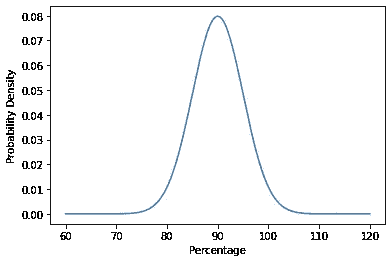
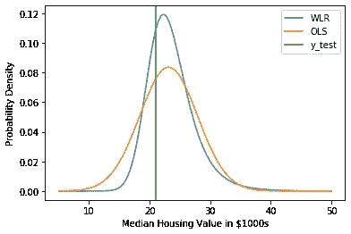
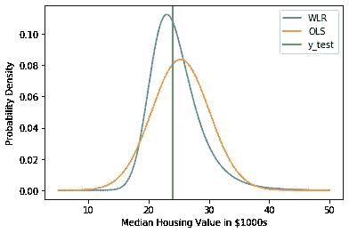
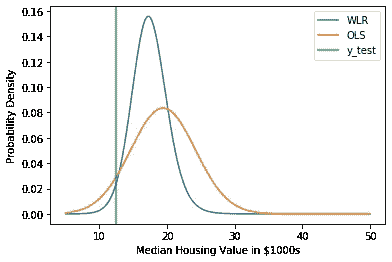
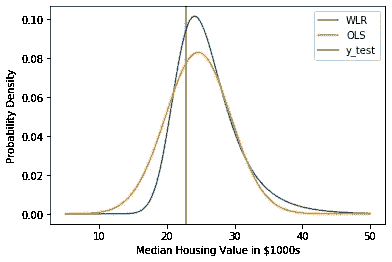

# 如何建立扭曲线性回归模型

> 原文：<https://towardsdatascience.com/how-to-build-a-warped-linear-regression-model-3e778e30a201?source=collection_archive---------49----------------------->

## [优化和机器学习](https://towardsdatascience.com/tagged/optimization-and-ml)

## 我们使用模块[峰值引擎](https://github.com/rnburn/peak-engines)对数据进行单调转换

[普通最小二乘法](https://en.wikipedia.org/wiki/Ordinary_least_squares) (OLS)将线性回归模型拟合到数据集，以便在误差正态分布的假设下最大化似然性。当误差项分解成独立同分布分量的和时，正态性自然会出现，但对许多问题来说，这种假设是不现实的。

例如，考虑一个目标值表示百分比的回归数据集。对于一个给定的特征向量，OLS 可能会预测一个这样的分布



这里怎么了？分布显示目标值可能大于 100%。当目标空间是有界的时，关于末端附近预测的正态分布误差是没有意义的。

如果不满足正态假设，我们有时可以通过转换目标空间来解决问题。假设 *f* 是单调递增函数。让 X 和 y 表示特征矩阵和目标向量。放 *z = f(* y *)。*虽然 OLS 可能无法很好地模拟原始数据集，但它有可能适合 X 和 z

我们如何找到这样一个函数 *f* ？这就是翘曲帮助我们的地方。弯曲从一族参数化单调函数开始。该族足够一般，可以近似任意变换。如果 *ψ* 表示弯曲函数的参数向量，那么我们使用优化器来调整 *ψ* 以最大化训练数据的可能性。

[Peak-engines](https://github.com/rnburn/peak-engines) 是一个 python 模块，用于构建这种扭曲的线性回归模型。我们将使用它为一个示例数据集构建一个模型，并展示我们如何改进 OLS。

我们将使用的示例是波士顿房屋数据集，其任务是根据社会经济和地理属性预测房屋的中值。像百分比一样，房屋价值是有限的(你不会找到免费的房屋)，因此有理由认为目标空间可以从扭曲中受益。

首先，让我们设置数据集。Boston housing 附带 sklearn，便于组装。

在我们建立扭曲线性回归模型之前，我们需要安装峰值引擎

```
pip install peak-engines
```

然后我们可以拟合一个扭曲的线性回归模型。

Peak-engines 在 OLS 之前搜索要应用的扭曲函数空间，直到找到最大化可能性的变换。为了可视化转换的样子，我们将它绘制在目标值的范围内。

翘曲函数在较低的住房价值更陡峭。它在目标空间的低端展开点，在高端压缩点。

为了比较扭曲线性回归和 OLS，让我们运行留一交叉验证。对于每个数据点，我们形成一个去除了该点的训练数据集和一个只包含该点的测试数据集。我们拟合 OLS 和扭曲的线性回归模型，并衡量对数似然性能。

结果显示验证点更有可能是扭曲线性回归。我们将查看一些随机预测示例，以更好地理解为什么它做得更好。



扭曲函数导致概率密度函数在较低的目标值处逐渐变小，从而允许概率质量被重新分配到值更可能出现的区域。

完整示例的代码可从[这里](https://github.com/rnburn/peak-engines/blob/master/example/boston_housing.ipynb)获得。

## 摘要

当面临回归问题时，OLS 通常是我们寻求的第一个模型，然而许多数据集并不满足其对正态分布误差的强假设。扭曲线性回归建立在 OLS 的基础上，通过引入额外的变换步骤来扭曲目标空间，以校正误差中的非正态性。它保留了 OLS 模型的许多简单性，但更通用，并经常导致更好的性能。

参考

[1]: *E .斯尼尔森，CE Rasmussen，Z . Ghahramani。* [*【扭曲高斯】突起*](https://papers.nips.cc/paper/2481-warped-gaussian-processes.pdf) *。神经信息处理系统的进展 16，337–344*

[2]: [当您的模型具有非正态误差分布时该怎么办](https://medium.com/p/what-to-do-when-your-model-has-a-non-normal-error-distribution-f7c3862e475f?source=email-f55ad0a8217--writer.postDistributed&sk=f3d494b5f5a8b593f404e7af19a2fb37)