# 使用 Keras 和 OpenCV 的自定义对象检测

> 原文：<https://towardsdatascience.com/how-to-build-a-weapon-detection-system-using-keras-and-opencv-67b19234e3dd?source=collection_archive---------4----------------------->

## 建立一个可以在给定的图像或画面中识别武器的系统

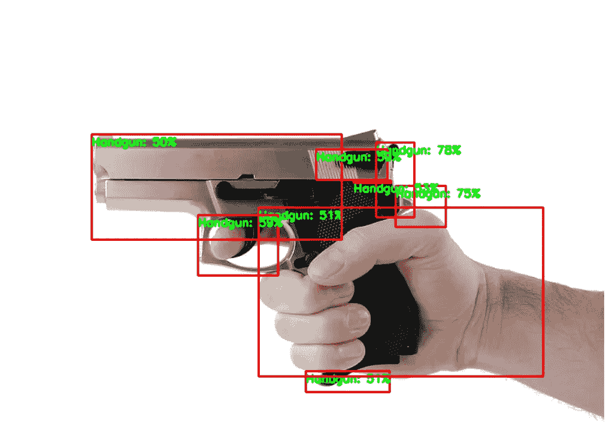

武器探测系统([原图](https://www.pxfuel.com/en/free-photo-ovfsz))

我最近完成了一个令我非常自豪的项目，我想我应该分享它，以防其他人有兴趣实现类似于他们特定需求的东西。在我开始本教程之前，我想对 [PyImageSearch](https://www.pyimagesearch.com/) 的创建者 Adrian Rosebrock 博士表示深深的感谢。我是一个自学成才的程序员，所以没有他的资源，这个项目的大部分是不可能的。他是一个典型的*男人-* 我非常感激他在自己的网站上提供的资源。如果你想学习先进的深度学习技术，但发现教科书和研究论文很枯燥，我强烈建议访问上面链接的他的网站。

在大多数与武器分类相关的项目中，我只能找到最多 100-200 张图片的数据集。这提出了一个问题，因为根据我的经验，很难用这么少的图像得到一个工作模型。为了收集图像，我用我的树莓皮刮了一下[IMFDB.com](http://www.imfdb.org/wiki/Main_Page)——一个枪支爱好者张贴照片的网站，照片中的模型枪出现在一部电影的画面或剪辑中。如果你访问网站，这一点会更清楚。要访问我用过的图片，你可以访问我的 [Google Drive](https://drive.google.com/file/d/1EZZKhCk0DK3S9zB53o3nWhKrZUbmN2Up/view?usp=sharing) 。在这个 zip 文件中，您将找到所有在这个项目中使用的图像和相应的。边界框的 xml 文件。如果你需要一个大数据集的边界框，我强烈推荐 [ScaleOps。AI](https://scaleops.ai/) ，一家专注于机器学习算法数据标注的公司。目前，我有来自 IMFDB 网站的 120，000 张图片，但是由于时间和资金的限制，我只使用了大约 5000 张。

现在，让我们来看看逻辑。这个项目的架构遵循[这个](https://www.pyimagesearch.com/2020/07/13/r-cnn-object-detection-with-keras-tensorflow-and-deep-learning/)网站上显示的逻辑。虽然我们在这里实现了这个逻辑，但是在许多领域它是不同的，因此它可以用于我们的特定问题——检测武器。该项目使用 6 个基本步骤:

1.  使用 OpenCV 选择性搜索分割构建数据集
2.  建立一个 CNN 来检测你想要分类的物体(在我们的例子中，0 =没有武器，1 =手枪，2 =步枪)
3.  在根据选择性搜索分割构建的图像上训练模型
4.  为新图像创建边界框时，通过选择性搜索分割运行图像，然后抓取图片的每一部分。
5.  通过算法运行图像的每一部分，每当算法预测到你要寻找的对象时，用边界框标记位置
6.  如果标记了多个边界框，应用非最大值抑制，只包括具有高置信度/感兴趣区域的框(这部分我还在弄清楚…你将在下面看到我的问题)

下面是展示算法如何工作的 gif。对于给定的图像，每个方块将被输入到神经网络中。如果一个正方形被预测为阳性(手枪或步枪)，我们将标记我们输入到原始图像的区域。

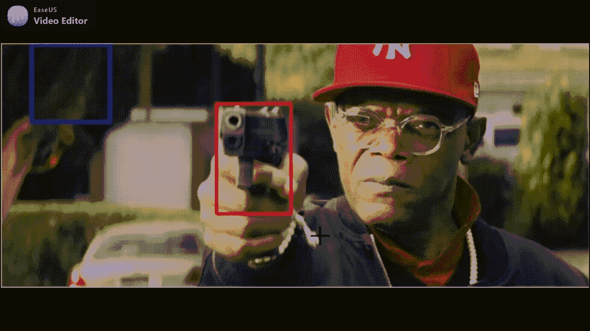

滑动窗口方法:对象检测(作者图片)

如果你想看这个项目的完整代码，请访问我的 GitHub Repo，在那里我会更深入地解释这些步骤。

我上面链接的数据包含了很多文件夹，我需要解释一下，以便理解正在发生的事情。解压文件夹后，这些文件和文件夹对项目很重要:AR、FinalImages、Labels、Pistol、Stock_AR、Stock_Pistol 和 PATHS.csv。所以对于 AR 文件夹，你会发现里面有突击步枪的图片。在标签文件夹中，您会看到。类文件夹中所有图像的 xml 标签。最后，PATHS.csv 将指向算法中使用的每一张图像。出于本教程的目的，这些是您唯一需要担心的文件夹/文件:

1.  最终图像/NoWeapon
2.  最终图像/手枪
3.  最终图像/步枪

这些文件夹中的图像制作方式如下。

*   对于每个有边界框的图像，提取边界框并将其放入相应的类文件夹中。因此，对于一个人拿着手枪的图像，手枪周围的边界框将变成正的，而边界框以外的每个部分都将变成负的(没有武器)
*   在下图中，想象一个包围左侧图像的边界框。在提取边界框内的像素(右边的图像)后，我们将该图像放入另一个文件夹(FinalImages/Pistol)，同时将边界框周围的所有空白区域放入 NoWeapons 文件夹。
*   虽然右边的图像看起来像是左边图像的调整版本，但它实际上是一个分段图像。想象在左边的枪周围有一个边界框。右边的图像是*仅仅是*边界框，没有别的(移除框外的所有东西)。这种技术被称为感兴趣区域(ROI)。

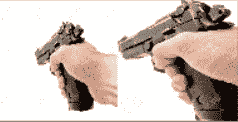

ROI 提取(图片由作者提供)

在收集数据集(可以在 Separated/FinalImages 中找到)后，我们需要为我们的算法使用这些文件，我们需要以这样的方式准备它，我们有一个 RGB 值列表和相应的标签(0=没有武器，1 =手枪，2 =步枪)

如果您运行上面的代码，在当前目录的之外有一个单独的文件夹*，您会看到一个 tqdm 窗口，显示它正在加载图像。该过程完成后，您应该会看到以下内容:*

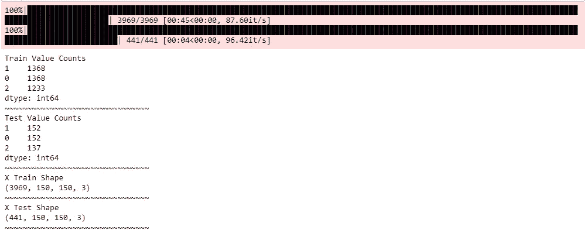

(图片由作者提供)

现在是神经网络的时候了。在下面的代码中，该函数将返回一个给定维度大小的模型。如果您在上面的代码中注意到，照片的尺寸被调整为(150，150，3)。如果您希望使用不同的尺寸，请确保您更改了上面的变量 dim，以及下面函数中的 DIM

上面返回的模型将具有如下所示的体系结构:

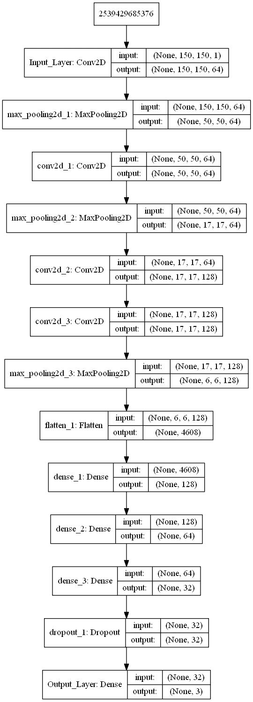

CNN 架构(图片由作者提供)

一旦我们有了训练集和测试集，我们需要做的就是把它放到我们的模型中。运行下面的代码将开始训练过程。

如果运行代码时没有任何错误，您应该会看到如下窗口:

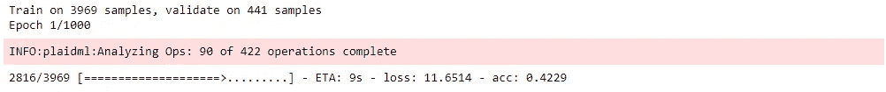

我想指出的是，我将历元设置为 1000，但提前停止将防止算法过度拟合，因此它不应运行超过 30–50 个历元。模型完成后，您应该会在您的目录中看到一个名为 ModelWeights.h5 的. h5 文件。该文件是模型生成的权重，因此将它们加载到模型中会在模型开始溢出之前加载模型。

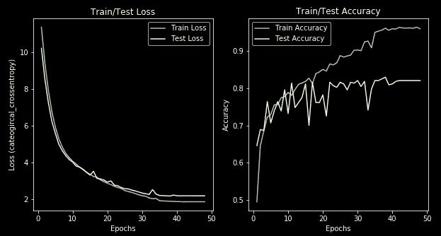

模型的准确性(图片由作者提供)

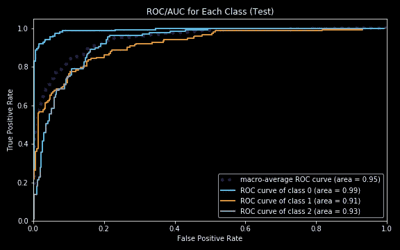

每个班级的 ROC(图片由作者提供)

考虑到一个平衡的数据集，这个精确度是相当不错的。查看 ROC 曲线，我们还可以假设每个类别下的面积非常接近 1，这是一个非常好的分类。

现在是物体探测的时间了！以下逻辑用于创建边界框:

1.  输入视频中的图像或帧并检索基本预测
2.  应用选择性搜索分割来创建数百或数千个包围盒命题
3.  通过训练的算法运行每个边界框，并检索预测与基本预测相同的位置(在步骤 1 中)
4.  检索到算法预测与基本预测相同的位置后，在算法运行的位置上标记一个边界框
5.  如果选择了多个边界框，则应用非最大值抑制来抑制除一个框之外的所有框，留下具有最高概率和最佳感兴趣区域(ROI)的框

*   注意:非最大值抑制仍在进行中。在某些情况下，它只能检测枪的特征，而不是整个枪本身(见下面的模型比较)。

在运行上面的代码之前，创建一个文件夹 Tests，从互联网上下载任何图像，并将该图像命名为您想要预测的类。运行上面的代码将搜索 Tests 文件夹中的每张图片，并使用上面构建的 CNN 通过我们的对象检测算法运行该图片。

我测试的图像如下:

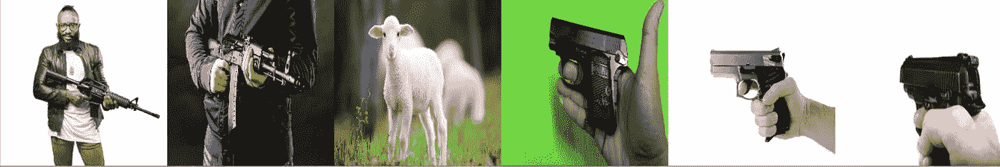

基础图像

运行上面的代码后，这些是算法输出的预测。

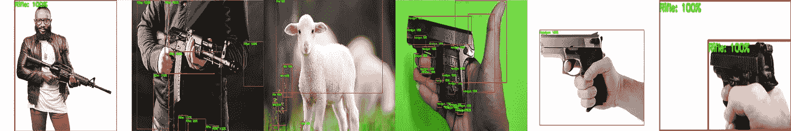

模型结果(图片由作者提供)[点击[此处](https://github.com/HeeebsInc/NN_Weapon_Detection/blob/master/Figures/ModelComparisons/Normal/Normal.png)查看大图]

正如您在上面看到的，非极大值抑制并不完美，但在某种意义上确实有效。我这里的问题是，有多个具有 100%置信度的边界框，所以很难选择哪一个是最好的*。*此外，当帧中没有武器时(绵羊图像)，该算法无法检测非武器。

使用上面实现的逻辑，[这里的](https://www.youtube.com/watch?v=e6tFxT-BpFg&t=1s&ab_channel=SamuelMohebban)是我将代码应用到视频的一个很酷的视觉效果。

演示武器检测(视频由作者提供)

基于上面的例子，我们看到这个算法离完美还有一段距离。这没什么，因为我们仍然创建了一个非常酷的模型，只用了 5000 张图片。就像我之前说的，我从 IMFDB.com 收集了总共 120，000 张图片，所以随着我们在培训期间传递更多的图片，这只会变得更好。

## 石灰:特征提取

构建和测试神经网络的一个困难部分是，它的工作方式基本上是一个黑盒，这意味着你不明白为什么权重是它们的样子，或者算法在图像中使用什么来进行预测。使用 [LIME](https://github.com/marcotcr/lime) ，我们可以更好地理解我们的算法是如何执行的，以及图片中的哪些内容对于预测是重要的。

石灰预测

运行上面的代码将创建一个如下所示的图像:

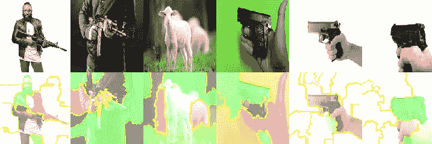

石灰(图片由作者提供)

绿色区域是算法认为“重要”的区域，而红色区域则相反。考虑到我们希望算法检测枪的特征，而不是手或图像的其他部分，我们在上面看到的是好的。

现在我们可以说我们创造了我们自己的有意识的生物…是时候面对现实了。与现有的工具相比，我们制作的模型微不足道。这使我转而学习…我们看到了一些很酷的结果。为了这个教程，我不会把代码放在这里，但是你可以在我的 [GitHub Repo](https://github.com/HeeebsInc/NN_Weapon_Detection) 上找到它

## Mobilenet

*   在下面的例子中，mobilenet 更擅长预测不是武器的物体，并且在正确的区域周围有边界框。

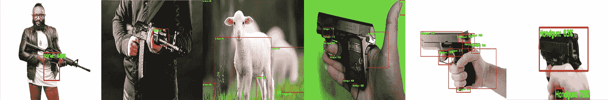

Mobilenet(图片由作者提供)[点击[此处](https://github.com/HeeebsInc/NN_Weapon_Detection/blob/master/Figures/ModelComparisons/Mobilenet/Mobilenet.png)查看大图]

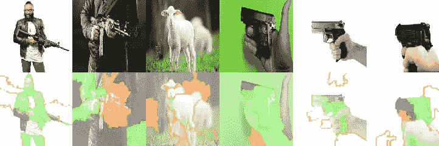

Mobilenet LIME(图片由作者提供)

## VGG16

*   在下面的例子中，VGG16 无法像我们自己构建的架构那样区分非武器。它错误地将 3 张手枪图像中的 1 张归类，而将其余的正确归类为手枪
*   尽管它错误地将手枪归类为无武器(右边第四个)，但边界框并不在枪上，因为它停留在握枪的手上。

VGG16(图片由作者提供)[点击[此处](https://github.com/HeeebsInc/NN_Weapon_Detection/blob/master/Figures/ModelComparisons/VGG16/VGG16.png)查看大图]

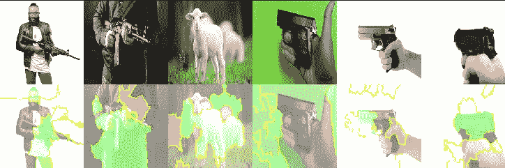

VGG16:石灰(图片由作者提供)

## 结论

*   这个项目的目标是创建一种算法，它可以将自己集成到传统的监控系统中，并比人更快地防止糟糕的情况(考虑到当今社会的不幸情况)。
*   虽然这很酷，但我的电脑中的硬件还没有。分割图像并处理图像的每个部分大约需要 10-45 秒，这对于直播视频来说太慢了。
*   我上面展示的视频演示是一个 30 秒的剪辑，大约需要 20 分钟来处理。
*   然而，尽管使用 RX 580 进行视频直播是不可行的，但使用新的 Nvidia GPU (3000 系列)可能会有更好的效果。
*   此外，这种技术可用于追溯检查事件，如人体摄像机镜头或抗议。

**注意**如果您想了解整个项目，请访问我的 [GitHub](https://github.com/HeeebsInc/WeaponDetection) **