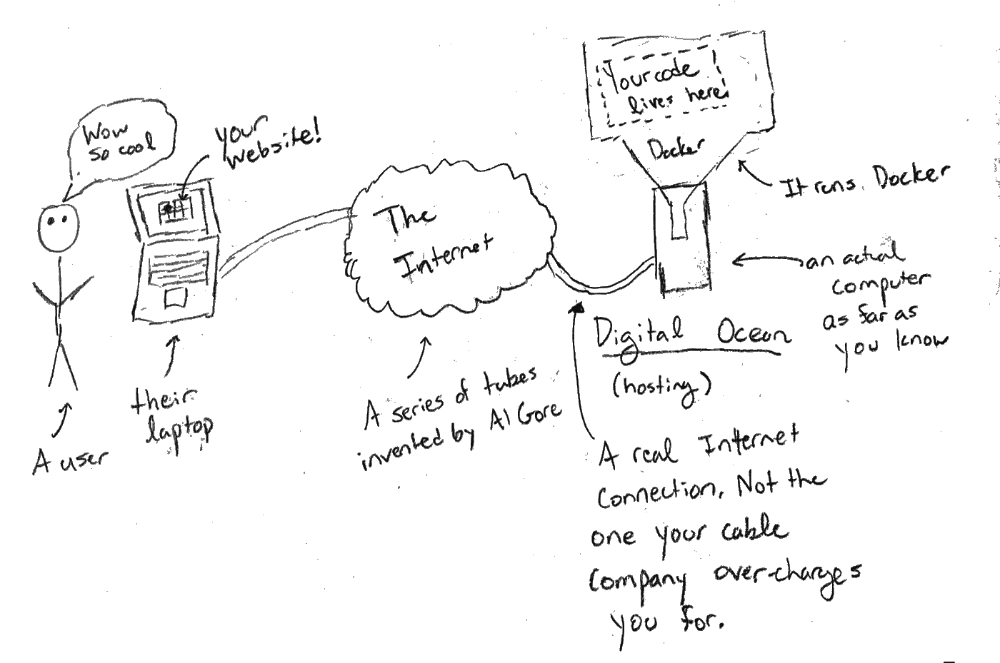
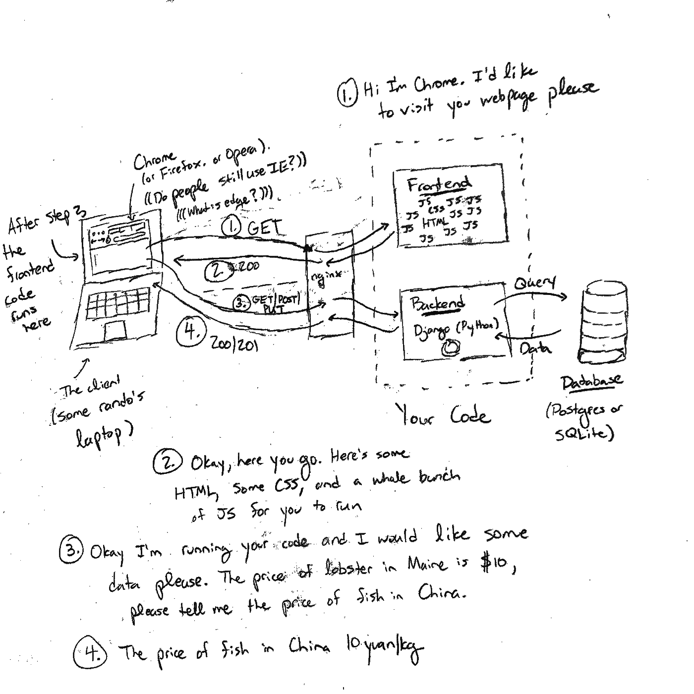

# 如何为您的数据科学项目构建 Web 应用程序

> 原文：<https://towardsdatascience.com/how-to-build-a-web-app-for-your-data-science-project-9b10190d3962?source=collection_archive---------28----------------------->

## 如果你在电脑上处理数字，它会发出声音吗？

我最近使用深度强化学习为哲学家足球建造了一个人工智能球员，以纪念已故的约翰·康威。我想要一种向人们展示结果的方式，所以我创建了一个网站[哲学家。足球](http://philosophers.football/)在那里你可以和机器人或其他人比赛。

你可以在那里和人工智能对战，感受一下它和游戏，尽管人工智能还在训练中——可能需要几个星期才能变好。

一路走来，我不得不处理一个弄清楚大量的技术，让我的模型从 Jupyter 笔记本代码到部署。现在，如果我每读一个“教程”就有一美元，我不能安装谁的软件，我不能运行谁的代码，或者那些没有告诉我如何部署任何东西，我会…嗯，我不会很富有，但是我可以负担更多的硬件来训练我的模型。我的人工智能播放器现在会更好。

我尤其感到沮丧的是，一行一行的代码示例都在做作者所做的事情。一旦你想做一些不同的事情(比如你自己的项目)，他们就不那么有帮助了。(我的意思是，我仍然使用它们)。

所以，我的解决方案是给你写一本一体化的*指南*，作为相关技术的地图，它们做什么的感觉，以及要使用的资源。希望有了这个，你能想象出把你的项目变成一个网络应用的途径。以我的经验，这永远是第一步。

作为奖励，感谢 Docker，我能够保证，如果你克隆我的 [github repo](https://github.com/rcharan/phutball) 并按照指令操作，代码就能保证运行。至关重要的是，这意味着你可以修改它并了解它的功能。

特别是，当我开始的时候，我真的对互联网的运作只有一个粗略的了解，对我的项目如何在互联网上结束没有一个清晰的概念。

所以，说清楚一点，这是*不是*

*   这不是关于工业级部署技术的教程。这是一个业余爱好项目。你将会学到很多关于那些工业级技术解决了什么问题。
*   这不是一个逐行走查的教程。
*   这绝对不包括安全。我的网站肯定有密码和一些内置的安全功能，但只是很好，好吗？
*   这绝对不是开发 web 应用程序的最佳实践。我不是网页设计师或开发人员。我做的东西甚至不能在你的手机上运行。但它肯定能在你的电脑上运行，就像你自己看到的一样。加上你大概(？)不会吐槽你的配色。
*   这不是关于如何创建模型或使用数据库(核心数据科学的东西)。这是关于如何部署您的模型，可能使用数据库。

# “堆栈”

也就是我使用的所有技术的可怕列表。下面我会解释重要的，我保证。这是目录。

## 核心技术

这些是我真正花时间思考和编写代码的事情。

1.  (后端/API) [Django](https://www.djangoproject.com/) ，一个 Python web 框架/包，使得处理数据库和构建 API 变得轻而易举。在这里添加相关但技术上独立的标准 API 的 [Django REST 框架](https://www.django-rest-framework.org/)和支持 WebSocket 连接和异步计算的 [Django 通道](https://channels.readthedocs.io/en/latest/)(模型与服务器并行运行)。
2.  一个来自脸书的 JavaScript web 框架/库，可以在浏览器中制作漂亮的图片。
3.  (机器学习) [PyTorch](https://pytorch.org/) 一个用于神经网络的机器学习框架/Python 包 thingamajig。也来自脸书。
4.  (部署/虚拟化) [Docker](https://www.docker.com/) 一个虚拟机，它通过发誓自己不是虚拟机来定义自己。出于我们的目的，它的功能有点像类固醇(ish)上的 conda(或 pip)——它神奇地解决了安装软件的所有问题。
    非常重要，因为你可能希望以后在服务器上运行你的代码，而重新安装所有的软件将是一件痛苦的事情。(你的服务器运行 Linux，没有鼠标)。

## 其他花哨的词语

我使用过但几乎不用接触的技术

1.  (数据库) [PostgreSQL](https://www.postgresql.org/) :好看，免费，开源，是一个数据库。Python 的内置 [SQLite](https://www.sqlite.org/index.html) 不能做一些稍微不太基本的事情，太糟糕了。
2.  (键值存储) [Redis](https://redislabs.com/) 不完全是 SQL 数据库。在这个应用程序中，它充当一个队列，这样您的模型就可以与面向 web 的服务器应用程序并行运行。当您的模型完成时，它会让实际的服务器知道。
3.  (网络服务器) [nginx](https://www.nginx.com/) 一个免费的开源网络服务器。Django 也是一个 web 服务器；回想起来，我可能会使用 in。
4.  (托管)[数字海洋](https://www.digitalocean.com/)它就像谷歌云或亚马逊网络服务(AWS)或微软 Azure，但复杂性大大降低。非常容易设置。而且(至关重要的)非常便宜。
5.  (培训)[用于 GPU/TPU 访问的 Google Colab](https://colab.research.google.com/) 和用于支持它的持久存储的 [Google Drive](https://www.google.com/drive/) 。同样，比其他选择便宜得多(我已经花了 300 美元在免费的谷歌云(GCP)上)。注意:我确实花了很多时间在这个上面，但是它的功能就像一个没有任何好的键盘快捷键的 Jupyter 笔记本。所以没什么工作量。

## 二等奖；荣誉奖；H 奖

1.  决定事物实际外观的语言。出于某种原因，设计用户界面(比如网站)的准则[最小惊奇原则](https://en.wikipedia.org/wiki/Principle_of_least_astonishment)并不适用于制作用户界面的语言。
2.  来吧，你知道这个。你以前在 Neopets 或 Myspace 上做过主页，对吗？

好了，是时候开始真正的指导了。这个计划是从结束时的样子到如何开始逆向工作

# 完成的应用程序

最后，你的代码将如何与你的用户联系起来，用户会认为你的网站“哇，太酷了”

你要付钱给某人(很便宜，大概 5 美元/月)让他帮你运行一台电脑。据你所知，这是一台真正的电脑。但实际上它是一台虚拟计算机，这是一个运行在具有 Pinnochio 复合体的真实计算机上的程序(它也认为它是一台真实的计算机)。美就美在无所谓；它很擅长伪装。

不像你的电脑，那台电脑将有一个真正的互联网连接，人们可以找到它。而且它会 24/7 全天候开机，足不出户，不出 wifi 范围。

那台计算机将运行 Docker，Docker 将运行你的代码。你也可以不使用 Docker，直接在电脑上运行，但这很麻烦。

客户端-服务器架构，又名互联网

好了，你的代码要做什么？互联网上唯一发生的事情就是电脑获取信息，接收信息。就像使用美国邮政署​(USPS)一样，但它没有破产，它以光速加上交通速度移动(总是有交通)。在互联网上，这些消息被称为“数据包”

数据包大致有不同的类型，称为*协议*，就像 USPS 的东西(第一类，垃圾邮件，认证邮件，包裹，媒体邮件等。).现在我们只担心常规的旧 HTTP。你从像[http://哲学家.足球](http://philosophers.football)这样的网址开始就知道的那个。

当有人访问你的网站时，他们会发送一个 HTTP GET 请求，如下图中的#1 所示。简而言之，他们会发送一封邮件，上面写着“请把你的网页发给我。”返回的是一堆要显示的东西(超文本标记语言——HTML)，如何显示的指令(层叠样式表——CSS)，最重要的是一堆要运行的代码(JavaScript)。浏览器基本上只运行 JavaScript，所以你必须写一些 JavaScript 来运行。

你的网站拿起“收音机”说“罗杰，200，这是网站。”数字(200)表示“好的”你可能在各种场合都遇到过老好人[404](http://google.com/covfefe)(400 和 500 的意思是:事情不妙，请别烦我)。[代码 418](https://developer.mozilla.org/en-US/docs/Web/HTTP/Status/418) “我是一把茶壶”意味着服务器不会煮咖啡，因为它永远是一把茶壶。(说真的。如果是我编的，我现在会站着说话)。

注意到站在你的网站和左边的笔记本电脑之间的那个盒子了吗？这是真正的网络服务器。在工业级应用中，它可以做各种新奇的事情。在我们的例子中，它只是接收消息并决定将它们发送到哪里。就像办公楼里的收发室。我使用了 nginx，但是 Django(见下文)也完全能够做到。我只是不想把所有的前端代码放在后端代码里面。看起来很尴尬。

好了，现在你在别人的笔记本上运行代码了。你被录取了。不要试图对他们的电脑做任何坏事，这是可笑的过度起诉的联邦罪行。(而且浏览器有相当好的安全性；它不会让你*太*做太多坏事)。你的 JavaScript 代码能做什么？它可以在笔记本电脑上渲染动画，当用户点击页面上的某个地方时，它可以决定做任何它想做的事情，*和*它可以自己与你的服务器对话。

# 姜戈

很好，现在你知道你的代码将如何运行了。那密码到底是什么？第一部分是服务器。

Django 是 Python 中的一个 web 框架。Django [教程](https://docs.djangoproject.com/en/3.0/intro/tutorial01/)相当不错，所以我不会深入讲解。它是做什么的？

1.  它处理建立数据库(创建表)以及写入和查询它。它构建的抽象非常好，所以您不需要直接编写 SQL 查询(如果您愿意，也可以编写更复杂的查询)。
2.  它处理“服务器端路由”这意味着，例如，如果有人导航到 www.yoursite.com/page1,，他们会得到你决定的第一页应该是什么。相反，如果他们去 www.yoursite.com/page2,，他们会得到别的东西。
3.  它允许您运行 python 代码来决定页面上的内容。例如，如果有人访问某个页面，您可以在数据库中查询他们的用户名，并显示他们的帐户信息(如他们的生日，如果他们之前告诉过您)。
4.  它处理所有的 HTTP 诡计，比如读取传入的消息并发送适当类型的响应。
5.  它还能做很多其他的事情，比如安全、认证等等。

除了普通的 Django 之外，您可能希望建立一个 api 来返回数据*而不是网页。可以用 [djangorestframework](https://www.google.com/search?q=djangorestframework&oq=djangorest&aqs=chrome.1.69i57j0l6j69i60.2185j0j7&sourceid=chrome&ie=UTF-8) 来做这个(教程也挺好的)。这提供了两个关键的扩展:*

1.  **串行化器。**这些将数据从数据库中的数据结构转换成可以发送给浏览器和客户端应用程序的数据结构(通常是 Javascript-object notation — JSON)。
2.  **API 视图**。一个简单的装饰器，用于处理不同类型的 HTTP 请求，比如 GET ("send me some data ")、POST("这里有一些与数据库中已有内容相关的数据")，或者 PUT(" upload/create a whole record to database。")

最后，你可能希望一些事情快点发生。HTTP 协议被设计成每当客户端发送一条消息时，它应该几乎立即得到响应。如果它不发送信息，它就不能接收信息。如果您需要等待，这是一个问题，因为您的模型需要一点时间来处理传入的数据。Websockets 是这方面的一个解决方案，并得到 Django [频道](https://channels.readthedocs.io/en/latest/)的支持(也有很好的教程)。有了 Websockets，你可以随时发送消息，甚至可以发送多条消息。

# 反应

[React](https://reactjs.org/) ，脸书的一个产品，是另一个用于编写在客户端运行的代码的“网络框架”。同样，它有一个很好的教程，所以我不会进入太多的细节。

基本结构是你看到的一切都是一个“组件”组件可以是无状态的，也可以不是。如果是无状态的，它们就像一个函数:它们接受参数并产生一个输出，即一些将由客户端浏览器显示的 HTML。它们也可以是有状态的。有状态对象可以记住事情。例如，如果你正在构建一个棋盘游戏，状态可以是棋盘的位置以及该轮到谁了。

另一件要记住的事情是 [react-router](https://reacttraining.com/react-router/web/guides/quick-start) 提供的“客户端路由”。这样做是为了让你只需要给你的用户发送一页。然后当他们去 www.yoursite.com/page1,时，你的 React 应用程序查看 URL 并决定呈现第 1 页。同样，对于 www.yoursite.com/page2,，他们得到第二页渲染。但是他们不需要每次都与服务器对话:他们只需要得到一个知道查看 URL 并决定显示什么的页面。

# 码头工人

Docker 是我发现最讨厌缠头的技术。我认为这是因为它坚持使用自己的词汇，并且通过不是虚拟机来定义自己，即使它解决了完全相同的问题。

Docker 的要点是，有了这项技术，你可以用代码定义一个你的代码将在其中运行的环境。有点像类固醇的虚拟环境。用简单的英语来说，这些说明可能是这样的:

1.  创建新的“虚拟”计算机
2.  安装 Python 3.6
3.  从我的 Github 库复制我的 Django 代码
4.  运行命令启动 Django 服务器

这些指令放在 Dockerfile 文件中。Docker 文件被构建到 Docker **映像中。**最后，你可以基于这个图像创建一个**容器**。它是运行代码的容器。

Docker 的关键点是这段代码在每台计算机上都是一样的。让你的主机提供商(比如 Digital Ocean)给你一个已经安装了 Docker 的服务器是非常容易的。然后你所要做的就是根据你想要的图像启动一个 docker 容器。

此外，您可能想要一个以上的图像。例如，一个映像可以运行数据库，一个映像可以运行后端服务器，一个映像可以运行前端服务器。

# **Nginx**

我最终使用 Nginx 作为主要的网络服务器。因此，当你访问客户端时，nginx 首先会查看你试图访问的 URL，然后将它路由到 Django，或者提供一组 React 文件来决定客户端路由呈现的内容。

您也可以用 Django 来完成这个任务，这可能会更容易。

# 结论

如果你心中有一个项目，并通过 Django 和 React 教程来完成，你应该会遇到你需要做的其他事情，并能够泰然自若地处理它们。希望这个路线图能给你一个好主意，告诉你从哪里开始！