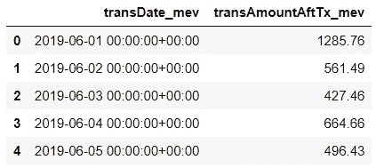
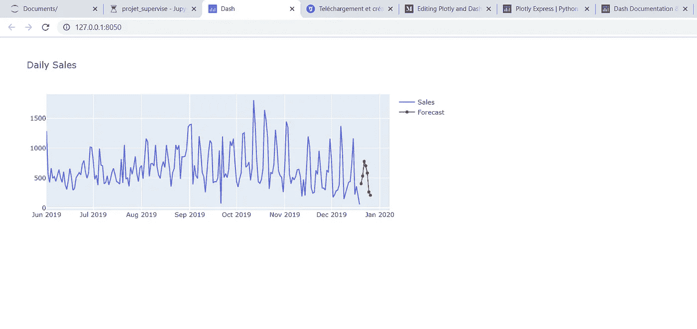

# 如何使用 Plotly 和 Dash 用 50 行代码构建 Web 应用程序

> 原文：<https://towardsdatascience.com/how-to-build-a-web-based-app-in-50-lines-of-code-using-plotly-and-dash-3953f039b217?source=collection_archive---------19----------------------->

## 构建企业级应用从未如此简单


来源:https://unsplash.com/photos/mcSDtbWXUZU

有很多工具可以实现数据可视化。然而，很少有工具能够让您轻松构建基于 web 的交互式高质量绘图应用程序，从而将您的数据可视化游戏提升到一个新的水平。

这就是 Plotly 和 Dash 所提供的，全部用 Python 编写。这就是为什么你要 100%了解它！

在本文中，我将展示如何使用 Plotly 创建基本的交互式绘图，以及如何使用 Dash 将它们集成到基于 web 的应用程序中。

使用的数据将是商店的每日销售额，以及 7 天的预测。每日销售数据如下所示:



# 1.PLOTLY

Plotly 是一个图形库，可以制作高质量的交互式图形。关键词是**互动**。下面是绘制两行的代码，一行用于每日销售额，另一行用于预测。

```
**#Import plotly** import plotly.graph_objects as go**#Initialize the plot** fig_totalsales=go.Figure()**#Add the lines** fig_totalsales.add_trace(go.Scatter(x=sales[sales.columns[0]], y=sales[sales.columns[1]], visible=True, name='Sales'))fig_totalsales.add_trace(go.Scatter(x=fore['Date'],y=fore[fore.columns[0]],visible=True, name='Forecast'))**#Add title/set graph size** fig_totalsales.update_layout(title = 'Daily Sales', width=850, height=400)fig_totalsales.show()
```

很漂亮吧？ ***append.traces*** 函数允许我们轻松地向图形中添加其他线条。

Plotly 提供了更多。在本文中，我将把它留在这里，因为我想更多地关注 Dash。尽管如此，我还是强烈推荐你查看 Plotly 文档:[https://plotly.com/python/](https://plotly.com/python/)。

# 2.破折号

Dash 平台允许我们这些新手开发高质量的企业级分析应用程序，而不需要开发人员、JavaScript 或任何超出基本 Python 技能的东西。

有了 Dash 开源(免费版)，Dash 应用可以在本地工作站上运行。你不能分享应用程序本身，但你可以分享代码。

每个完整的 Dash 应用程序都有三个部分:

1.  **布局**，它描述了应用程序的外观。
2.  **Dash 核心组件**(称为 dcc)，基本就是应用的内容(图形、下拉菜单、复选框等)。).
3.  **回调**，通过组件之间的交互，使应用程序具有交互性。

下面是创建包含我们之前创建的表的 Dash 应用程序所需的所有代码:

```
**#Import libraries** import dash
import dash_core_components as dcc
import dash_html_components as html**#Create the app** app = dash.Dash()
app.layout = html.Div([
    dcc.Graph(figure=fig_totalsales)
])

app.run_server(debug=True, use_reloader=False)
```

仅此而已！越简单越好。我们看到这个应用程序包含一个布局和一个核心组件，即图。

**html.div** 标签定义了应用程序中的一个新部分，我们可以在其中添加任何我们想要的 Dash 核心组件(dcc。图在这里)。下面是这个“应用程序”现在的样子:



当然，如果有人想创建一个应用程序，这并不是展示一个单独的情节。任何 python 库都可以做到这一点。Dash 的伟大之处在于，你可以让不同的组件相互交互。这就是 Dash 的第三部分，回调，发挥作用的地方。

回调请求一个输入，让它通过一个函数并给出一个输出。让我们看看如何改进我们当前的应用程序(我们可以做一百万件事情，这里有一些)。

## 最终应用创意

> ***1。添加标题。***
> 
> **2*。添加过滤我们的数字的功能，以便只显示特定日期范围的数据点。***
> 
> ***3。添加一个交互式文本框，显示所选期间的销售总额。***

Dash 有一个核心组件叫做 **DatePickerRange** 。我们所需要的只是一个回调，将图形和文本与这个新的核心组件链接起来。

下面是实现这一点的完整代码。

下面是对代码的逐块描述:

*   第一个 html.div 用于创建标题为应用程序的部分。
*   第二个 html.div 添加了 DateRangePicker 组件以及将通过回调链接到它的两个输出(一个文本元素和一个图形)。
*   最后一部分是回调。它要求两个输入，即两个日期，并给出两个输出，即图形和文本。在 update_output 函数中，根据提供的日期选择数据。然后，计算销售总额并创建数字。

下面是一个简短的视频，展示了这个应用程序现在的样子:

现在你有了它，一个不到 50 行代码的体面的基于 web 的应用程序！查看更多关于 Dash 的信息:[https://dash.plotly.com/](https://dash.plotly.com/)。

非常感谢你的阅读！