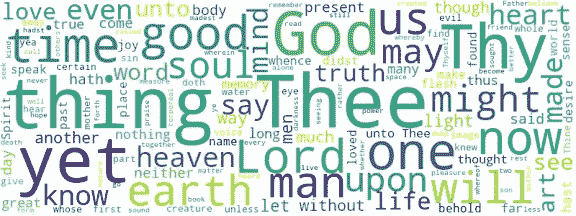

# 如何用 Python 构建 wordcloud

> 原文：<https://towardsdatascience.com/how-to-build-a-wordcloud-in-python-2f9222414fc6?source=collection_archive---------39----------------------->

## 一个简单快速的建立文字云的教程



图片由安吉莉卡·洛·杜卡(作者)提供

在本教程中，我将向你展示如何使用`wordcloud`包在 Python 中构建文本的单词云。

在示例中，我将构建圣奥古斯丁的*忏悔*的词云，可以从[Gutenberg 项目页面](https://www.gutenberg.org/files/3296/3296-h/3296-h.htm)下载。这部杰作被分成 13 本书。我们将每本书存储在不同的文件中，名为 number.text(例如 1.txt 和 2.txt)。每个文件的每一行只包含一个句子。

本教程的源代码可以从[我的 Github 资源库](https://github.com/alod83/papers/tree/master/aiucd2021)下载。

# 入门指南

## 安装并熟悉 wordcloud 软件包

创建 word cloud 的第一步是通过命令`pip install wordcloud`安装 [wordcloud](https://pypi.org/project/wordcloud/) 包。然后你可以导入`WordCloud`这个类以及`STOPWORDS`的列表。

```
from wordcloud import WordCloud, STOPWORDS
```

如果需要，您可以将其他停用字词添加到列表中。

```
stopwords = set(STOPWORDS) 
stopwords.add('thou')
```

`Wordcloud`函数需要一个句子作为输入，其中包含应该计算单词云的所有单词。在我们的例子中，我们应该将杰作的所有文本存储到一个变量中。我们可以通过打开相关文件来读取每本书的文本，并将其存储到一个全局变量中，这个变量叫做`all_text`。

```
all_text = ""
for book in range(1,14):
    file = open('sources/' + str(book) + '.txt')
    lines = file.readlines()

    for line in lines:
        all_text += " " + line
```

# 构建单词云

## 为你的文本创建世界云

现在我们已经准备好构建 wordcloud 了。我们可以创建一个`WordCloud`对象，向它传递单词云的大小、停用词列表、背景颜色和最小字体大小。

```
wordcloud = WordCloud(width = 800, height = 300, stopwords = stopwords,background_color ='white',  min_font_size = 10)
```

一旦构建了`WordCloud`对象，我们就可以调用方法`generate()`来计算作为参数传递的文本的 worcloud。

```
wordcloud.generate(all_text)
```

# 绘图结果

## 将单词云保存到图片中

最后，我们准备绘制结果。我们可以利用`matplotlib`库提供的`imshow()`函数。

```
import matplotlib.pyplot as plt

plt.figure(figsize = (8, 3), facecolor = None) 
plt.imshow(wordcloud) 
plt.axis("off") 
plt.tight_layout(pad = 0) 
plt.savefig('plots/word_cloud.png')
plt.show()
```

# 吸取的教训

用 Python 构建一个文本的单词云非常简单。这可以通过`wordcloud`包完成

*   第一步是定义一个字符串变量，它包含所有需要计算单词云的文本。
*   然后，`Wordcloud`对象可以通过指定一些参数作为实参以及向其方法`generate()`传递文本来定义
*   最后，利用`matplotlib`包可以完成一个 wordcloud 的情节。