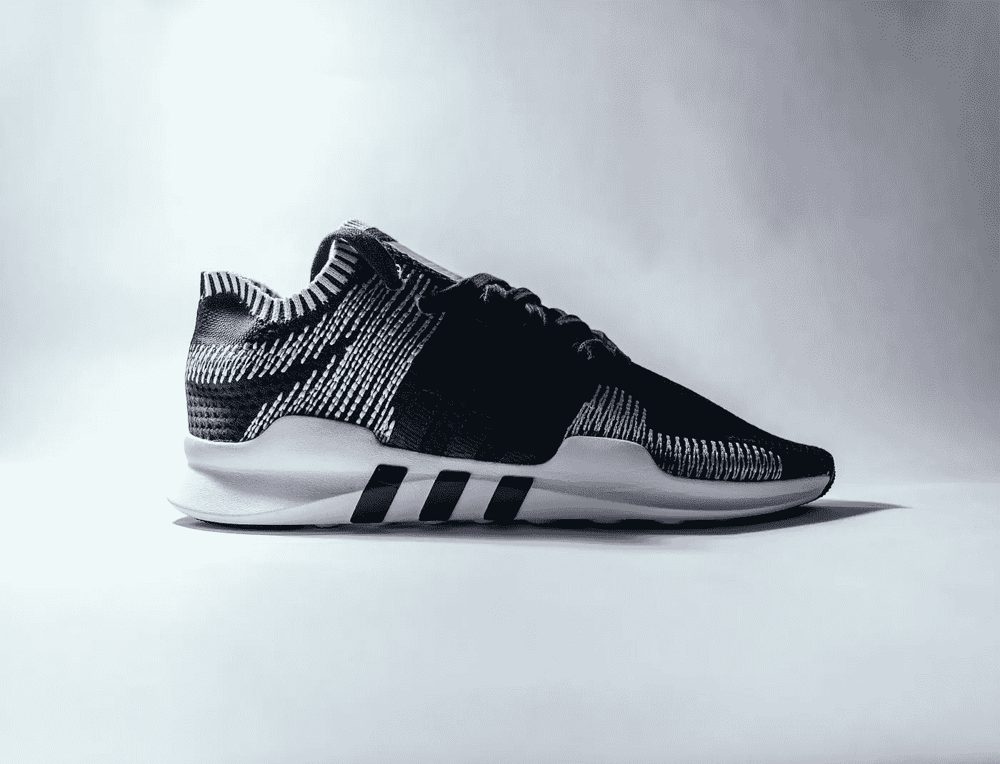
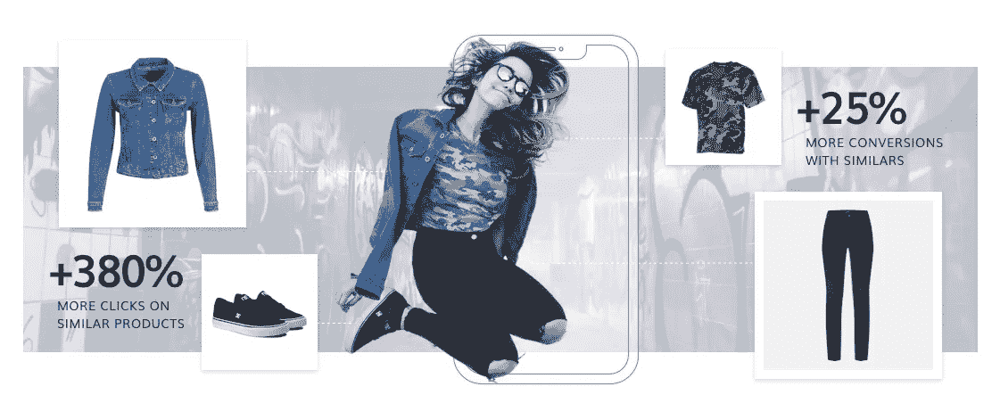
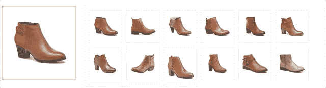
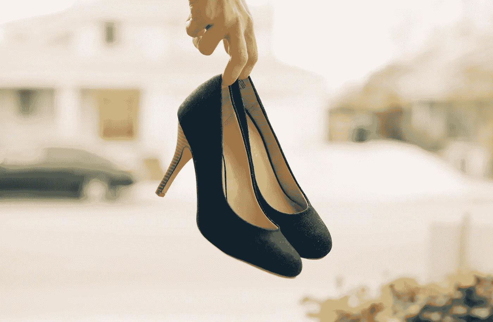
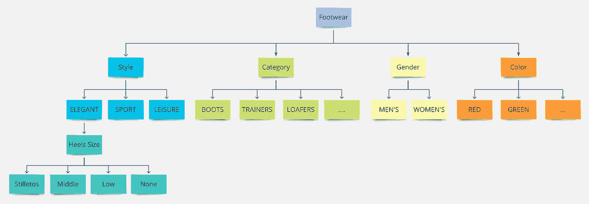
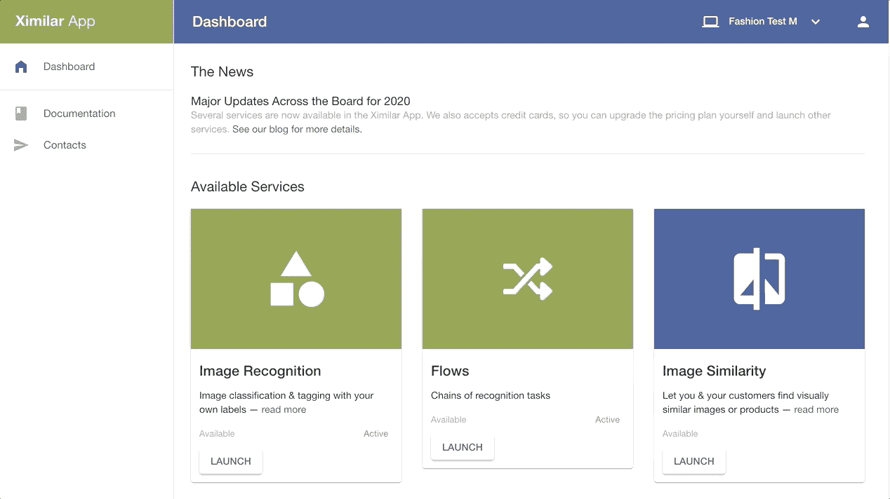
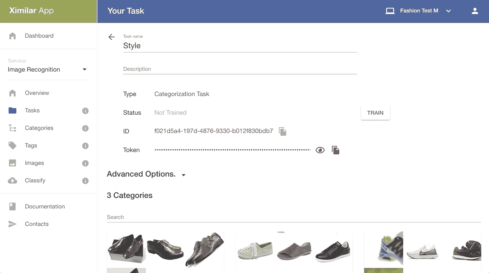
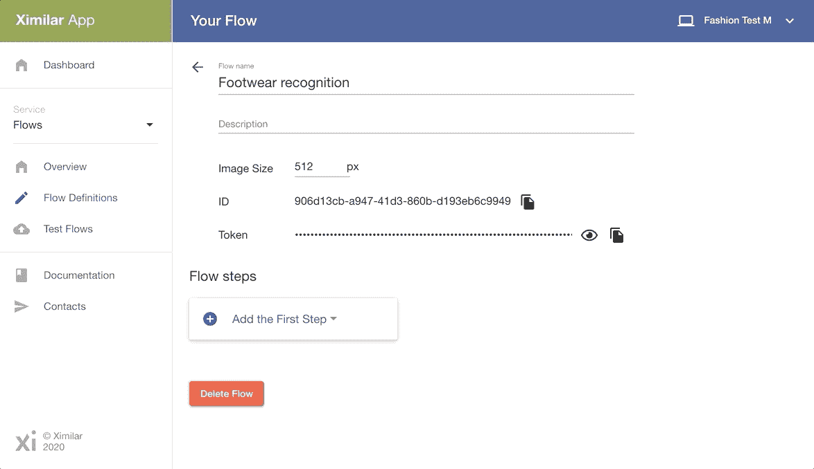
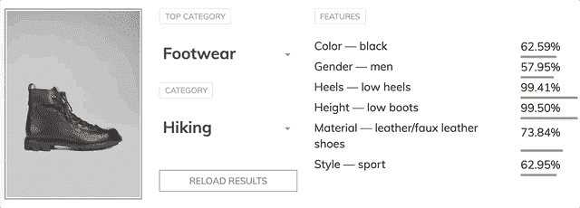

# 如何为时尚图像构建人工智能

> 原文：<https://towardsdatascience.com/how-to-build-ai-for-fashion-images-b081311fa099?source=collection_archive---------24----------------------->

## 现实世界中的数据科学

## **为什么每个时尚网站都应该接受机器学习，如何使用分类法和数据，以及如何使用 Flows 构建图像识别系统**

由[托马斯·塞勒](https://unsplash.com/@jesusance?utm_source=unsplash&utm_medium=referral&utm_content=creditCopyText)在 [Unsplash](https://unsplash.com/s/photos/shoes?utm_source=unsplash&utm_medium=referral&utm_content=creditCopyText) 上拍摄的照片

在这篇文章中，我将向你展示如何建立你的时尚识别系统。我将重点介绍**鞋类**，不过这种方法也适用于其他服装。这种方法不仅适用于时尚领域。好消息是这个教程是免费的！

**为什么机器学习和时尚？**

有几个原因:更好的用户体验，不断增加的点击率，参与度，收入…这里有一个大的研究，在时尚零售中，每个商店都应该具备的最重要的特征是什么:

*   [https://www.fashion-research.com/top-features](https://www.fashion-research.com/top-features)

正如你所看到的，一些功能纯粹基于机器学习和视觉 AI。因为新冠肺炎的隔离，世界上大多数的时装店都关门了，所以电子商务现在是零售业最重要的部分。如果你有一个时装店网站，那么考虑采用一些机器学习功能。它也可以帮助您的业务！这是改进您的数字产品的最佳时机。

插图由[维塔·瓦尔卡](https://vitavalka.com/)创作

**视觉人工智能在时尚领域最常见的使用案例:**

*   **搜索** : *向你的客户展示最相似的产品*
*   **标记** : *通过更好的分类，让您的产品集合更易于搜索*
*   **抓拍&获取** : *允许您的顾客拍摄服装照片，并在您的店铺中找到它*
*   **虚拟试衣间** : *我穿这件衣服怎么看？*
*   **测脚** : *这双鞋适合我吗？*
*   和许多其他人

最好的功能之一是向您的客户展示视觉上相关的备选方案。这些备选方案可以由预测的标签生成/过滤。

# **分类学**

> 思考分类是最重要的步骤之一！这是一个非常困难的问题！

在开始之前，我们应该定义鞋类识别系统的分类->换句话说，我们想要识别哪种标签。当我们在做鞋的时候，有数千种款式，数百种不同的图案。例如，有适合休闲时间的运动鞋，也有适合跑步的运动鞋。整个鞋类分类可能很复杂，因为我们可以识别**的款式、颜色、品牌、图案、鞋跟尺寸**、…。我们之前说过，仅仅是风格本身就可以有很多选择。**总是从简单的事情开始！**

每当你在有成千上万种选择的领域工作时(时尚、房地产等等)，要非常小心。 ***时尚分类的问题在于没有统一的标准*** 。每家服装店都使用不同的名称和分类。看看 urbanoutfitters.com 的 [ASOS](https://www.asos.com/) 网站或者[就知道了。我的建议是不要发明轮子。只要看看一些最著名的服装店，看看他们是怎么做的，就会受到启发。](https://www.urbanoutfitters.com/?ref=logo)

优雅的蓝色高跟鞋。[安德鲁·唐劳](https://unsplash.com/@andrewtanglao?utm_source=unsplash&utm_medium=referral&utm_content=creditCopyText)在 [Unsplash](https://unsplash.com/?utm_source=unsplash&utm_medium=referral&utm_content=creditCopyText) 上的照片

**风格**:可以说我们可以识别优雅、休闲、运动。如果我们认可优雅，那么我们可以根据性别来划分这个类别。大多数时候，女人优雅的鞋子看起来和男人的有点不同。在休闲类中很难说，在运动/教练类中就更难说了。大多数女性优雅的鞋子也可以通过鞋跟的高度来识别。

**子类**:如果我们认出了优雅的鞋类，那么我们可以说是否有休闲鞋、靴子或高跟鞋。如果我们谈论运动，那么我们可以把它们分为运动鞋，跑步，徒步旅行。

**颜色**:红色、绿色、蓝色、黄色、黑色、白色、橙色……我建议只预测基本颜色。你引入的颜色越多，你的标签和图片就越不一致。用颜色给产品贴标签可能会很棘手！每张图片在不同的屏幕上都会有一点不同。新的 MacBooks 拥有 true tone 技术，可以根据环境照明将显示器的颜色调整为暖色。如果你在一个团队中工作，人们看到的颜色会有点不同。

**品牌**:品牌在一些运动鞋中很容易辨认。阿迪达斯、耐克、彪马运动鞋大部分时间都含有大的标志或其他视觉特征。穿优雅的鞋子会困难得多。也许来自汤米·席尔菲格的优雅的鞋类可能更容易，因为品牌标志几乎总是可以在鞋上看到。

把所有这些放在一起，我们简单的鞋类分类可以写成层次结构，并通过**层次分类**来解决。分级分类意味着我们将调用多个模型，如果我们预测一些标签，我们也可以根据预测的标签调用另一个模型。例如，如果我们预测优雅的标签，那么我们将调用预测鞋跟尺寸的模型。如果我们预测运动品牌，那么我们可以调用其他模型。

我们对鞋类的简单分类。您可以根据需要以任何方式扩展或调整它。在 Miro 应用程序中绘制。

# **数据和机器学习**

> 机器学习系统对他们看到的数据有偏见。

简单地说，机器学习是一种优化技术，它试图从你的数据中学习重要的知识。

在使用人工智能/机器学习时，思考这一点也是另一个关键步骤。你的系统将仅用于产品照片:背景大部分时间是清晰的，还是照片由专业相机拍摄？那么您的数据集应该包含类似的图像。

如果你正在使用一个移动应用程序来拍摄真实背景下的鞋子图片，那么就在你的数据集中包含这种图片。*获得"* ***真实世界*** *"图片可能会困难得多，但是，如果您的产品能够在"质量较差"的图片上表现良好，它可能会更有价值*。您的应用程序应该在所有可能的环境中工作吗？那么你应该有高质量和平衡的数据集。

我们需要下载我们的数据。我们可以使用谷歌或必应搜索并从图片页面手动下载一些数据。如果你知道如何编程，那么你可以写一个从 google 或 bing 下载图片的脚本。例如，您可以使用 [scrapy](https://scrapy.org/) 库从商店页面抓取图像。对于非编码人员来说，使用 Chrome 或 Firefox 插件从网站上获取图片也是一个很好的选择。

**我们应该为每个标签下载多少张图片？**

关注迭代方法，如果你正在使用[迁移学习](https://www.tensorflow.org/tutorials/images/transfer_learning)技术，每个标签 50 张图像对于开始训练你的模型是相当不错的。如果效果不好，那么继续增加图像的数量。你的分类法越复杂，你需要的图像就越多。有时每个标签需要数百张图像。

# **创建你的模型**

因为这是针对没有机器学习和编程经验的人的教程，所以我们准备用 Ximilar 平台创建一个识别系统。别担心，做起来很容易。

登录 [**Ximilar App**](https://app.ximilar.com/) 然后点击图像识别服务。转到“任务”页面，创建一个新任务。然后选择分类任务，并为该任务创建和连接标签。Task 代表了一个机器学习/深度学习模型。

创建标签为优雅、休闲和运动的识别任务/模型。

下一步是训练你的模型。只需点击火车按钮。

您的鞋型模型包含三个需要识别的标签/类别。

这样，我们可以为颜色、材料、图案等创建其他任务

**通过流程将您的任务/模型连接到层级**

现在，我们将使用一个创新的功能，允许您通过几次点击将机器学习模型连接到分类/层次结构中。从仪表板转到流服务并创建新的流。然后创建一个“列表操作”作为第一步。然后在带跟任务的*样式*识别任务上添加“分支选择器”。最后，将颜色、类别、性别和品牌任务添加到列表中。

建立具有流程的鞋类分级分类系统

**展开**

您的整个系统都部署在一个易于使用的 API 端点和流之后！您可以将移动应用程序或网站连接到 API。**最终的 app 可以是这样的**:

这是一个[示例](https://demo.ximilar.com/fashion/fashion-tagging)，展示了鞋类产品的图像识别是如何工作的。

**总结**

机器学习在零售业无处不在，有助于增加收入和改善用户体验。

*   在构建机器学习系统时，请始终考虑您的分类法和标签。
*   与您的数据和标签保持一致。进行增量开发，从简单的开始，然后继续开发更复杂的解决方案。
*   你可以使用[流](https://www.ximilar.com/flows-the-game-changer-for-next-generation-ai-systems/)来构建一个层次分类系统。

查看我们的视觉时尚人工智能系统的 [**演示**](https://demo.ximilar.com/fashion/fashion-tagging) 。如果你想创造一个时尚服装探测器，请看下一篇博文(关于微控制器，但同样适用于时尚):

 [## 用 CNN 检测微控制器

### 根据 Kaggle 竞赛数据检测微控制器的简单教程

towardsdatascience.com](/detecting-microcontrollers-with-cnn-ced688a8a144)