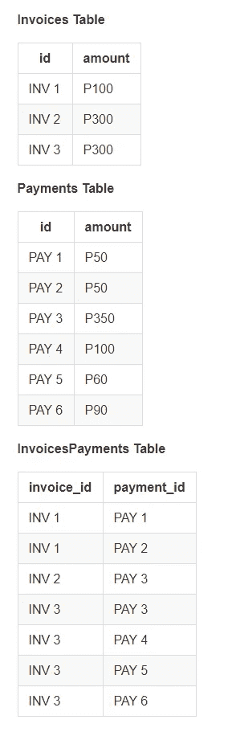
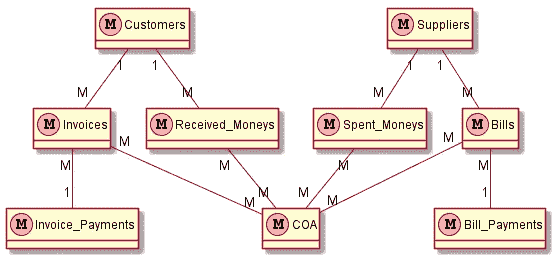
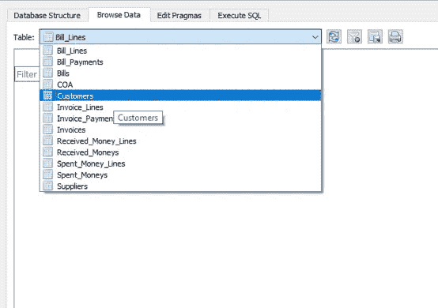
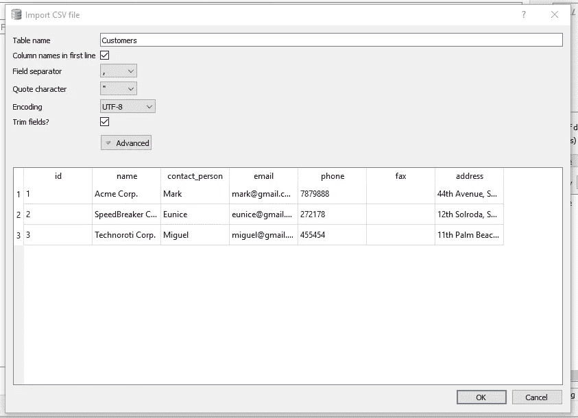
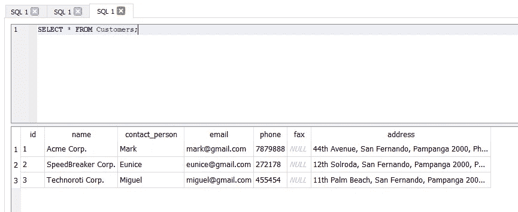
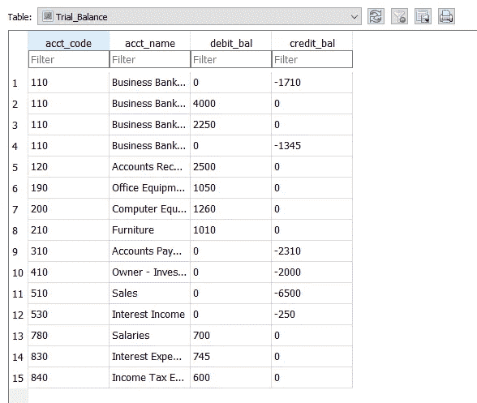

# 如何使用 SQLite 构建会计系统

> 原文：<https://towardsdatascience.com/how-to-build-an-accounting-system-using-sqlite-2ce31f8b8652?source=collection_archive---------3----------------------->

## 逆向工程 Xero 教 SQL


在 [Unsplash](https://unsplash.com?utm_source=medium&utm_medium=referral) 上[科学高清](https://unsplash.com/@scienceinhd?utm_source=medium&utm_medium=referral)拍摄的照片

***搔自己的痒处。***

这是每当有人问我如何学习编程时，我总是给出的建议。实际上，这意味着你必须解决与你相关的事情或选择与你相关的项目——无论是在你的工作还是个人生活中。

盲目地去 Youtube 上的教程，阅读编程书籍，从 Reddit 帖子上复制代码等等。如果你开始学习编程，将一事无成。

# 学习 SQL 的最好方法

在这篇文章中，我将向您展示如何使用 SQLite 构建一个简单的会计数据库。

> 那么，为什么要创建一个会计数据库呢？为什么不直接复制公共数据，把它们推到 SQLite 中，然后从那里开始练习呢？

原因是创建一个会计数据库已经足够先进，可以涵盖数据库和 SQL 的所有方面——从查询到连接到视图和 cte。

作为一名会计出身的人，我认为这是学习 SQL 的最佳项目。毕竟编程是解决问题的工具。因此，不妨“解决”一个难点来全面学习 SQL。

通过观察 Xero 的工作方式，我获得了使用 SQL 创建会计系统的灵感。对于不熟悉的人来说，Xero 是一款起源于新西兰的云记账软件。它现在已经扩展到澳大利亚、美国、加拿大和英国。

Xero 的好处是它有一个漂亮干净的界面和许多可供选择的应用程序来扩展它的功能。

*免责声明:我不是 Xero 的工程师或开发人员，这些观察可能不完全符合系统的工作方式，因为它总是在更新。当然，这里给出的 SQL 并不是 Xero 使用的 SQL 设计，因为他们的系统需要扩展。但这是一个非常有趣的项目，所以让我们做吧！*

# 会计 101

在你兴奋过度之前，我们先来上一堂会计速成课。

基本的会计等式是

***资产=负债+权益***

这个等式基本上有三个部分

*   资产是实体的所有资源。
*   负债是公司所欠的。
*   而股权，是所有所有者的投资、图纸、盈利或亏损的积累。

右边描述了资产的融资方式——通过负债或权益。

我们可以扩展上面的等式来分解股权

***资产=负债+期初权益+收入—费用***

这 5 个账户——资产、负债、权益、收入和费用——是会计系统中常见的账户类型。

然后是借贷的概念。我可以继续深入讨论这两个问题，但在这篇文章中，你需要知道的是，在每笔交易中:

***借方=贷方***

这两个等式通常支配着整个会计周期中发生的事情。这两个等式也将作为创建我们自己的会计数据库的指南。

> 作为一名会计出身的人，我认为这是学习 SQL 的最佳项目。毕竟编程是解决问题的工具。因此，不妨“解决”一个难点来全面学习 SQL。

# Xero 的会计实现

需要记住的重要一点是，Xero 的设计是为了让它在企业的日常运营中对企业主(而不是会计)有用。

*因此，它围绕交易周期和内部控制进行设计。*

## 交易周期

基本交易周期如下

*   销售周期
*   采购周期
*   资金周转周期

Xero 按如下方式实现这些循环

**销售周期** 销售使用发票输入 Xero。想象一下企业为销售(现金销售或赊账)开具实际的纸质发票。这正是 Xero 想要复制的东西。

发票可以直接从软件中打印出来，并按升序自动编号。

*在引擎盖下，发票增加销售账户和应收账款(AR)账户。*

**采购周期** 票据进入 Xero 使用票据。再一次，想象企业为购买(现金购买或赊账)出具实际的账单。这是公用事业和库存的通常情况。这也是 Xero 想要复制的东西。

这些账单可以直接从软件中打印出来，并可用于补充企业完成的任何审批程序。

*在这个引擎盖下，账单增加了采购账户和应付账款(AP)账户。*

**现金周期** 这涉及所有与现金有关的交易。有 4 种类型

*   **发票付款** —未付发票的付款
*   **账单支付** —未支付账单的支付
*   **收到的款项** —不是发票付款的现金收据。这可能涉及现金销售，但如果你要开发票，请使用发票功能。
*   **支出款项** —不属于票据支付的现金支出。这可能涉及现金购买，但如果你要开账单，使用账单功能。

这是关于交易周期的部分。

## 内部控制

对于内部控制，你需要了解**系统账**的概念。

Xero 有一篇理解系统账户的综合文章[在这里](https://central.xero.com/s/article/Locked-and-system-accounts-in-your-chart-of-accounts)。但出于我们的目的，我们将只讨论以下系统帐户

*   应收帐款
*   应付账款
*   银行账户(链接到银行馈送)

这些科目不能用在手动日记帐中。这意味着 Xero 希望您使用发票、账单和现金交易(发票支付、账单支付、收到的钱和花费的钱)来支持这些账户的余额。如果你愿意，这是 Xero 内部控制的实施。

当然，您可以通过在会计科目表(COA)中创建 AR、AP 和银行帐户来使用它们的非系统版本。但是，您不能对它们使用 AR、AP 和银行帐户类型。

> 需要记住的重要一点是，Xero 的设计是为了让它在企业的日常运营中对企业主(而不是会计)有用。

# 警告:我们不会掉进兔子洞

设计一个账户是非常复杂的。光是这个话题就需要多篇博文。因此，为了简单起见，我们将创建以下假设(不完全是 Xero 如何实现这些)

*   **发票和账单支付** 发票支付可以一次性支付两张或多张发票*。也就是说，我们不允许部分付款。账单支付也是如此。*
*   ***库存** 我们不打算在这里使用库存项目。对于销售或采购，我们将直接使用库存帐户，而不是创建映射到库存帐户的库存项目。*

*我们的假设就是这样。设计完我们的数据库后，读者可以解除这些假设，尽可能多地模仿 Xero。*

# *SQL 基础知识*

*现在，在重建我们版本的 Xero 数据库结构之前，让我们先来上一堂数据库速成课。*

***数据库是表的集合。**每个表都由称为**记录**的数据行组成。这些列被称为**字段**。*

*处理数据库的程序被称为数据库管理系统或 DBMS。打个简单的比方，DBMS 之于 Excel 程序，数据库之于 Excel 工作簿，表格之于 Excel 工作表。*

*数据库和 Excel 工作簿有两个主要区别。*

## *数据表示与数据存储是分开的。*

*也就是说，您不能通过直接查看数据并对其进行编辑来编辑数据库中的数据。(其他 DBMS 程序有 GUI，允许您直接访问数据库中的数据，并像编辑电子表格一样编辑它。但是在幕后，该操作发出一个 SQL 命令)。*

## *表通常相互链接以形成关系。*

*关系可以是一对一、一对多或多对多。*

***一对一**关系意味着“一个表中的一行只与另一个表中的一行相关，反之亦然”。一个例子是雇员姓名到纳税标识号。*

*这种类型通常包含在单个表 Employees 中，因为将数据分成两个表并没有什么好处。*

***一对多**表示“一个表格中的一行只与另一个表格中的一行或多行相关，而不是相反”。一个例子是发票到发票行。一张发票可以有多个行，但一个发票行只属于一张特定的发票。*

*您可能已经猜到了，**多对多**意味着“一个表行只与另一个表中的一行或多行相关，反之亦然”。实现部分支付的系统就是一个例子。*

*一张发票可以通过不同的付款交易来部分支付，并且一次付款可以部分支付不同的发票。*

***数据库如何知道这些关系？** 很简单。它是通过使用主键和外键实现的。*

***主键**是区分不同行所必需的。它们唯一地标识表中的每一行数据。*

***另一方面，外键**是另一个表的主键。因此，通过关联主键和外键，数据库关系得以保持。*

**对于一对多,“一”方包含主键,“多”方包含该主键作为其外键。*在上面的例子中，为了获得属于一张发票的所有行，我们查询 InvoiceLines 表，其中外键等于特定的发票号。*

**对于多对多，通过使用称为“联接”表的第三个表，关系被分解为两个一对多关系。*例如，我们的部分付款系统将发票表、付款表和 InvoicePayments 表作为连接表。InvoicePayments 表的主键将是一个组合键，由 Invoices 和 Payments 表的主键组成，如下所示*

**

*用于实施部分发票付款的表*

*请注意，连接表不包含任何其他数据，因为除了连接发票和付款表之外，它没有任何其他用途。*

*为了获得某个支付交易支付的发票，比如说`PAY 1`，我们通过连接表连接发票和支付表，并查询`payment_id = “PAY 1”`。*

*这就是数据库的基础知识。我们现在准备设计我们的数据库。*

> *打个简单的比方，DBMS 之于 Excel 程序，数据库之于 Excel 工作簿，表格之于 Excel 工作表。*

# *设计我们的 Xero 实现*

*现在我们对 Xero 有了基本的了解，可以开始创建它的数据库结构的草图了。请注意，我将使用`Table_Name`格式。这是由下划线分隔的首字母大写单词。我还将对表名使用复数名称。*

*对于销售周期，我们将有以下表格*

*   ***发票***
*   ***客户** —一个客户可以有多张发票，但一张发票不能属于多个客户*
*   ***Invoice_Payments** —记住我们现在的假设，Invoice_Payments 和 Invoices 分别是一对多的关系(没有部分付款)*
*   ***Invoice_Lines** —这是发票和 COA 之间的连接表。一个账户可以出现在多张发票中，一张发票可以有多个账户。*
*   ***会计科目表(COA)***

*对于购买周期，我们将有以下表格*

*   ***票据***
*   ***供应商** —一个供应商可以有多个票据，但是一个票据不能属于多个供应商*
*   ***Bill_Payments** —记住我们现在的假设，Bill_Payments 和 Bill 之间分别是一对多的关系*
*   ***Bill_Lines** —这是票据和 COA 的连接表。一个账户可以出现在多张票据中，一张票据可以有多个账户。*
*   ***COA** —与销售周期中的上述内容相同。这里只是为了完整性。*

*对于现金周期，我们将有下面的表(我们已经在上面创建的付款表)*

*   ***Received _ money**——可能有一个可选客户*
*   ***Received_Money_Lines** —这是 Received_Money 和 COA 之间的连接表*
*   ***spend _ money**—可能有一个可选的供应商*
*   ***支出款项行** —这是支出款项和 COA 之间的连接表*

*从概念上讲，我们的数据库结构如下*

**

*会计数据库模型*

*这个图用数据库的说法叫做**实体关系图**或者 **ERD** 。一对多关系由*1-M*指定，多对多关系由*M-M*指定。*

*上图中没有显示连接表，因为它们隐含在具有多对多关系的表中。*

# *用 SQL 实现我们的版本*

*现在是时候用 SQL 实现我们的模型了。我们先从定义一些约定开始。*

*主键的字段/列名为`id`，外键的格式为`table_id`，其中`table`是单数形式的“多”方的表名。例如，在发票表中，外键将是`customer_id`。*

*SQL 代码的时间到了。在这里。*

```
*DROP TABLE IF EXISTS `COA`;CREATE TABLE IF NOT EXISTS `COA` (
    id INTEGER PRIMARY KEY,
    name TEXT
);DROP TABLE IF EXISTS `Customers`;CREATE TABLE IF NOT EXISTS `Customers` (
    id INTEGER PRIMARY KEY,
    name TEXT NOT NULL,
    contact_person TEXT,
    email TEXT,
    phone TEXT,
    fax TEXT,
    address TEXT
);DROP TABLE IF EXISTS `Invoice_Payments`;CREATE TABLE IF NOT EXISTS `Invoice_Payments` (
    id INTEGER PRIMARY KEY,
    tran_date DATE NOT NULL,
    description TEXT,
    reference TEXT,
    total DECIMAL(20,2) NOT NULL,
    coa_id INTEGER NOT NULL, -- automatically Bank
    FOREIGN KEY(`coa_id`) REFERENCES `COA`(`id`)
);DROP TABLE IF EXISTS `Invoices`;CREATE TABLE IF NOT EXISTS `Invoices` (
    id INTEGER PRIMARY KEY,
    tran_date DATE NOT NULL,
    due_date DATE,
    description TEXT,
    reference TEXT,
    total DECIMAL(10,2) NOT NULL,
    status BOOLEAN,
    customer_id INTEGER,
    invoice_payment_id INTEGER,
    coa_id INTEGER NOT NULL, -- automatically AR
    FOREIGN KEY(`customer_id`) REFERENCES `Customers`(`id`),
    FOREIGN KEY(`invoice_payment_id`) REFERENCES `Invoice_Payments`(`id`),
    FOREIGN KEY(`coa_id`) REFERENCES `COA`(`id`)
);DROP TABLE IF EXISTS `Received_Moneys`;CREATE TABLE IF NOT EXISTS `Received_Moneys` (
    id INTEGER PRIMARY KEY,
    tran_date DATE NOT NULL,
    description TEXT,
    reference TEXT,
    total DECIMAL(20,2) NOT NULL,
    customer_id INTEGER,
    coa_id INTEGER NOT NULL, -- automatically Bank
    FOREIGN KEY(`customer_id`) REFERENCES `Customers`(`id`),
    FOREIGN KEY(`coa_id`) REFERENCES `COA`(`id`)
);DROP TABLE IF EXISTS `Invoice_Lines`;CREATE TABLE IF NOT EXISTS `Invoice_Lines` (
    id INTEGER PRIMARY KEY,
    line_amount DECIMAL(20,2) NOT NULL,
    invoice_id INTEGER,
    line_coa_id INTEGER NOT NULL,
    FOREIGN KEY(`invoice_id`) REFERENCES `Invoices`(`id`),
    FOREIGN KEY(`line_coa_id`) REFERENCES `COA`(`id`)
);DROP TABLE IF EXISTS `Received_Money_Lines`;CREATE TABLE IF NOT EXISTS `Received_Money_Lines` (
    id INTEGER PRIMARY KEY,
    line_amount DECIMAL(20,2) NOT NULL,
    received_money_id INTEGER,
    line_coa_id INTEGER NOT NULL,
    FOREIGN KEY(`received_money_id`) REFERENCES `Received_Moneys`(`id`),
    FOREIGN KEY(`line_coa_id`) REFERENCES `COA`(`id`)
);DROP TABLE IF EXISTS `Suppliers`;CREATE TABLE IF NOT EXISTS `Suppliers` (
    id INTEGER PRIMARY KEY,
    name TEXT NOT NULL,
    contact_person TEXT,
    email TEXT,
    phone TEXT,
    fax TEXT,
    address TEXT
);DROP TABLE IF EXISTS `Bill_Payments`;CREATE TABLE IF NOT EXISTS `Bill_Payments` (
    id INTEGER PRIMARY KEY,
    tran_date DATE NOT NULL,
    description TEXT,
    reference TEXT,
    total DECIMAL(20,2) NOT NULL,
    coa_id INTEGER NOT NULL, -- automatically Bank
    FOREIGN KEY(`coa_id`) REFERENCES `COA`(`id`)
);DROP TABLE IF EXISTS `Bills`;CREATE TABLE IF NOT EXISTS `Bills` (
    id INTEGER PRIMARY KEY,
    tran_date DATE NOT NULL,
    due_date DATE,
    description TEXT,
    reference TEXT,
    total DECIMAL(10,2) NOT NULL,
    status BOOLEAN,
    supplier_id INTEGER,
    bill_payment_id INTEGER,
    coa_id INTEGER NOT NULL, -- automatically AP
    FOREIGN KEY(`supplier_id`) REFERENCES `Suppliers`(`id`),
    FOREIGN KEY(`bill_payment_id`) REFERENCES `Bill_Payments`(`id`),
    FOREIGN KEY(`coa_id`) REFERENCES `COA`(`id`)
);DROP TABLE IF EXISTS `Spent_Moneys`;CREATE TABLE IF NOT EXISTS `Spent_Moneys` (
    id INTEGER PRIMARY KEY,
    tran_date DATE NOT NULL,
    description TEXT,
    reference TEXT,
    total DECIMAL(20,2) NOT NULL,
    supplier_id INTEGER,
    coa_id INTEGER NOT NULL, -- automatically Bank
    FOREIGN KEY(`supplier_id`) REFERENCES `Suppliers`(`id`),
    FOREIGN KEY(`coa_id`) REFERENCES `COA`(`id`)
);DROP TABLE IF EXISTS `Bill_Lines`;CREATE TABLE IF NOT EXISTS `Bill_Lines` (
    id INTEGER PRIMARY KEY,
    line_amount DECIMAL(20,2) NOT NULL,
    bill_id INTEGER,
    line_coa_id INTEGER NOT NULL,
    FOREIGN KEY(`bill_id`) REFERENCES `Bills`(`id`),
    FOREIGN KEY(`line_coa_id`) REFERENCES `COA`(`id`)
);DROP TABLE IF EXISTS `Spent_Money_Lines`;CREATE TABLE IF NOT EXISTS `Spent_Money_Lines` (
    id INTEGER PRIMARY KEY,
    line_amount DECIMAL(20,2) NOT NULL,
    spent_money_id INTEGER,
    line_coa_id INTEGER NOT NULL,
    FOREIGN KEY(`spent_money_id`) REFERENCES `Spent_Moneys`(`id`),
    FOREIGN KEY(`line_coa_id`) REFERENCES `COA`(`id`)
);*
```

*这里有几件事:*

*   *SQL 命令不区分大小写，`CREATE TABLE`与`create table`相同*
*   *`IF EXISTS`和`IF NOT EXISTS`是可选的。我只是用它们来防止我的 SQL 命令中的错误。例如，如果我删除一个不存在的表，SQLite 会给出一个错误。此外，我将`IF NOT EXISTS`放在 create table 命令上，这样我们就不会意外地覆盖任何现有的表。*
*   *小心使用`DROP TABLE`命令！它将删除一个现有的表，而不发出警告，即使它有内容。*
*   *表名也可以全部大写或不大写。如果表名有空格，应该用反斜杠(`)括起来。它们不区分大小写。`SELECT * FROM Customers`与`select * from customers.`相同*

*尽管 SQL 在语法方面有些宽松，但是您应该努力保持 SQL 代码一致性。*

*还要注意上面 ERD 中显示的关系。还要记住，外键位于多侧。*

*顺序很重要，因为由于外键的存在，一些表会成为另一个表的依赖项。例如，您必须先在发票表之前创建 first Invoice_Payments，因为前者是后者的依赖项。这里的技巧是从 ERD 的边缘开始，因为这些边缘具有最少的外键。*

*您还可以下载一个 SQLite 中的示例数据库，这个[链接](https://github.com/kennethjhim/medium_acctg_database_design/blob/master/db_blank.db)中没有任何内容。*

*要查看它，您可以使用免费的开源 SQLite 浏览器。在这里下载！*

# *向我们的数据库添加内容*

*现在我们有了示例数据库，让我们向它输入数据。样本数据可以从[这里](https://github.com/kennethjhim/medium_acctg_database_design/blob/master/new_data-services.xlsx)下载——只需根据需要将其分解为 CSV。*

*请注意，学分显示为正数，学分显示为负数。*

*对于这篇文章，我只是使用了 DB Browser 的导入功能从上面的 Excel 文件中导入 CSV。例如，导入 *Customers.csv**

*   *选择“客户”表*

**

*   *转到文件>导入> CSV 文件中的表格，并选择*客户. csv**

**

*   *对于所有后续提示，单击“确定/是”以导入数据。*

*如果您发出下面的 SQL 命令，它应该显示我们数据库中的所有客户*

**

# *从我们的数据库创建财务报告*

*为了证明我们的数据库作为一个粗略的会计系统工作，让我们创建试算平衡表。*

*第一步是为我们的发票、账单、Received _ Moneys 和 Spent _ Moneys 事务创建事务视图。代码将如下所示*

```
*DROP VIEW IF EXISTS Invoice_Trans;CREATE VIEW IF NOT EXISTS Invoice_Trans ASwith recursiveitrans as (SELECT
    'INV'||i.id as `tran_id`,
    i.tran_date,
    i.coa_id as ar_account,
    -- ABS(total) as `total`,
    'Accounts Receivable' as `coa_name`,
    i.total,
    il.id  as `line_id`,
    il.line_coa_id,
    il.line_amount,
    ip.id,
    ip.coa_id as bank_account,
    'Business Bank Account' as `bank_name`,
    i.status
from Invoices as i
left join Invoice_Lines as il on i.id = il.invoice_id
left join COA as c on i.coa_id = c.id
left join Invoice_Payments as ip on i.invoice_payment_id = ip.id
)select
itrans.*,
c.name as `line_coa_name`
from itrans
left join COA as c on itrans.line_coa_id = c.id;SELECT * from Invoice_Trans;********************************************************************DROP VIEW IF EXISTS Bill_Trans;CREATE VIEW IF NOT EXISTS Bill_Trans ASwith recursivebtrans as (SELECT
    'BILL'||b.id as `tran_id`,
    b.tran_date,
    b.coa_id as ap_account,
    -- ABS(total) as `total`,
    'Accounts Payable' as `coa_name`,
    b.total,
    bl.id  as `line_id`,
    bl.line_coa_id,
    bl.line_amount,
    bp.id,
    bp.coa_id as bank_account,
    'Business Bank Account' as `bank_name`,
    b.status
from Bills as b
left join Bill_Lines as bl on b.id = bl.bill_id
left join COA as c on b.coa_id = c.id
left join Bill_Payments as bp on b.bill_payment_id = bp.id
)select
btrans.*,
c.name as `line_coa_name`
from btrans
left join COA as c on btrans.line_coa_id = c.id;SELECT * from Bill_Trans;********************************************************************DROP VIEW IF EXISTS Received_Money_Trans;CREATE VIEW IF NOT EXISTS Received_Money_Trans AS
SELECT
    'RM'||rm.id as `tran_id`,
    tran_date,
    coa_id,
    'Business Bank Account' as `coa_name`,
    total,
    rml.id  as `line_id`,
    rml.line_coa_id,
    c.name as `line_coa_name`,
    rml.line_amount
from Received_Moneys as rm
left join Received_Money_Lines as rml on rm.id = rml.received_money_id
left join COA  as c on c.id = rml.line_coa_id;SELECT * from Received_Money_Trans;********************************************************************DROP VIEW IF EXISTS Spent_Money_Trans;CREATE VIEW IF NOT EXISTS Spent_Money_Trans AS
SELECT
    'SM'||sm.id as `tran_id`,
    tran_date,
    coa_id,
    'Business Bank Account' as `coa_name`,
    total,
    sml.id  as `line_id`,
    sml.line_coa_id,
    c.name as `line_coa_name`,
    sml.line_amount
from Spent_Moneys as sm
left join Spent_Money_Lines as sml on sm.id = sml.spent_money_id
left join COA  as c on c.id = sml.line_coa_id;SELECT * from Spent_Money_Trans;*
```

*在前两条语句中，我使用了 CTE(带有关键字`recursive`)。cte 很有用，因为我将 4 个表组合在一起，以获得发票交易和相应付款的单一视图。你可以在 SQLite [这里](https://sqlite.org/lang_with.html)了解更多关于 CTEs 的内容。*

*执行上述命令后，您的数据库应该有以下 4 个视图。*

**

*交易视图*

*最后，我们创建试算平衡表(简称 TB)的代码。请注意，TB 只是我们的交易余额的集合，记录了我们在设计数据库时制定的规则。*

*代码如下所示*

```
*DROP VIEW IF EXISTS Trial_Balance;
CREATE VIEW IF NOT EXISTS Trial_Balance as
-- CREATE TB
-- select all sales
select
    line_coa_id as acct_code,
    line_coa_name as acct_name,
    (case when sum(line_amount) > 0 then sum(line_amount) else 0 end) as debit_bal,
    (case when sum(line_amount) < 0 then sum(line_amount) else 0 end) as credit_bal
from Invoice_Trans
group by line_coa_id-- select all purchases
union allselect
    line_coa_id as acct_code,
    line_coa_name as acct_name,
    (case when sum(line_amount) > 0 then sum(line_amount) else 0 end) as debit_bal,
    (case when sum(line_amount) < 0 then sum(line_amount) else 0 end) as credit_bal
from Bill_Trans
group by line_coa_id-- select all received money
union allselect
    line_coa_id as acct_code,
    line_coa_name as acct_name,
    (case when sum(line_amount) > 0 then sum(line_amount) else 0 end) as debit_bal,
    (case when sum(line_amount) < 0 then sum(line_amount) else 0 end) as credit_bal
from Received_Money_Trans
group by line_coa_id-- select all spent money
union allselect
    line_coa_id as acct_code,
    line_coa_name as acct_name,
    (case when sum(line_amount) > 0 then sum(line_amount) else 0 end) as debit_bal,
    (case when sum(line_amount) < 0 then sum(line_amount) else 0 end) as credit_bal
from Spent_Money_Trans
group by line_coa_id-- select all AP
union allselect
    ap_account as acct_code,
    coa_name as acct_name,
    -(case when sum(line_amount) < 0 then sum(line_amount) else 0 end) as debit_bal,
    -(case when sum(line_amount) > 0 then sum(line_amount) else 0 end) as credit_bal
from Bill_Trans
where status = "0"-- select all AR
union allselect
    ar_account as acct_code,
    coa_name as acct_name,
    -(case when sum(line_amount) < 0 then sum(line_amount) else 0 end) as debit_bal,
    -(case when sum(line_amount) > 0 then sum(line_amount) else 0 end) as credit_bal
from Invoice_Trans
where status = "0"-- select all bill_payments
union allselect
    bank_account as acct_code,
    bank_name as acct_name,
    -(case when sum(line_amount) < 0 then sum(line_amount) else 0 end) as debit_bal,
    -(case when sum(line_amount) > 0 then sum(line_amount) else 0 end) as credit_bal
from Bill_Trans
where status = "1"-- select all invoice_payments
union allselect
    bank_account as acct_code,
    bank_name as acct_name,
    -(case when sum(line_amount) < 0 then sum(line_amount) else 0 end) as debit_bal,
    -(case when sum(line_amount) > 0 then sum(line_amount) else 0 end) as credit_bal
from Invoice_Trans
where status = "1"-- select all received_money
union allselect
    coa_id as acct_code,
    coa_name as acct_name,
    -(case when sum(line_amount) < 0 then sum(line_amount) else 0 end) as debit_bal,
    -(case when sum(line_amount) > 0 then sum(line_amount) else 0 end) as credit_bal
from Received_Money_Trans-- select all spent_money
union allselect
    coa_id as acct_code,
    coa_name as acct_name,
    -(case when sum(line_amount) < 0 then sum(line_amount) else 0 end) as debit_bal,
    -(case when sum(line_amount) > 0 then sum(line_amount) else 0 end) as credit_bal
from Spent_Money_Transorder by acct_code*
```

*上面的代码包含由命令`union all`连接的多个 SQL 查询。我已经对每个查询进行了注释，以显示每个查询试图实现的目标。*

*例如，第一个查询试图获取发票交易的所有信用(主要是销售额)。第二个用于账单交易(主要是购买)的借项等等。*

*执行它应该会产生下面的 TB。*

**

*你可以把它放入 Excel 来检查借贷是否相等(我就是这么做的)。借项和贷项合计分别为 14115 和-14115。*

# *万岁！你成功了*

*创建一个会计系统是非常复杂的。我们基本上探索了数据库设计的整个领域——从概念到 ERD 到创建再到查询。为自己走到这一步感到自豪。*

*请注意，我们故意限制了我们的数据库，以便更多地关注概念。你可以解除这些，并尝试建立另一个没有限制。*

*就是这样！你现在是 SQL 忍者了！恭喜你！*

**

*Ian Stauffer 在 [Unsplash](https://unsplash.com?utm_source=medium&utm_medium=referral) 上拍摄的照片*

****查看我的第二本书*** [***会计数据库设计***](https://leanpub.com/accountingdatabasedesign) ***即将在 Leanpub 上出版！****

****还我第一本书*** [***PowerQuery 熊猫指南***](https://leanpub.com/powerqueryguidetopandas) ***上***[***Leanpub***](https://leanpub.com/powerqueryguidetopandas)***。****

****跟我上***[***Twitter***](https://twitter.com/iamkennethcpa)***和***[***Linkedin***](https://www.linkedin.com/in/kennethinfante/)***。****