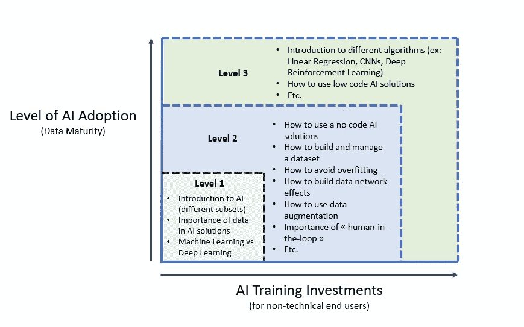
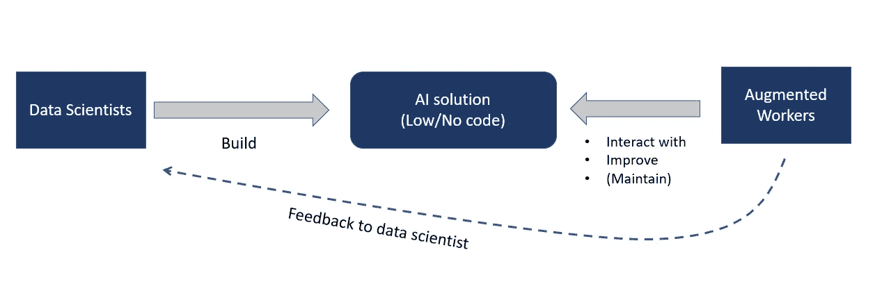
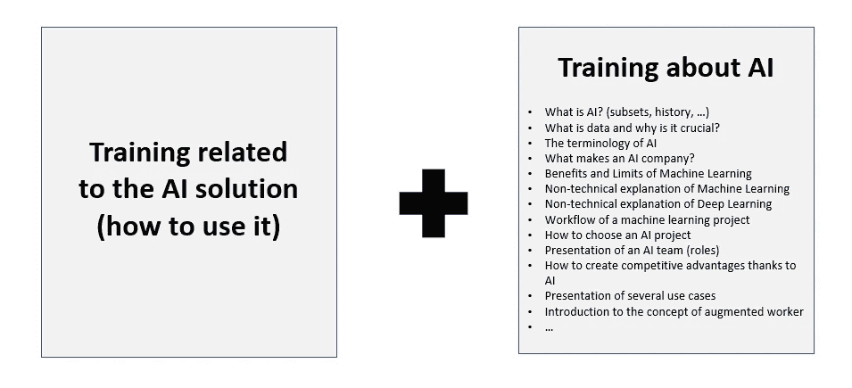
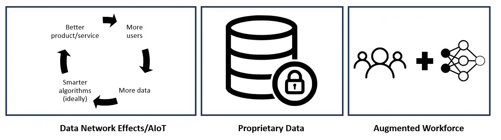
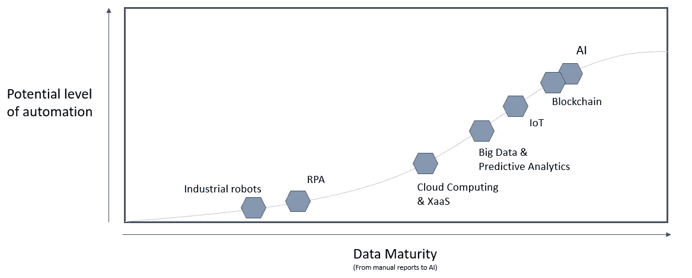
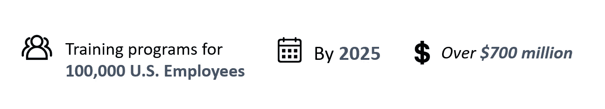

# 如何建立人工智能增强的劳动力

> 原文：<https://towardsdatascience.com/how-to-build-an-ai-augmented-workforce-c922c315f3c2?source=collection_archive---------64----------------------->

## 如何成为一名“增强工作者”的指南

Alex Kotliarskyi 在 [Unsplash](https://unsplash.com/s/photos/open-space?utm_source=unsplash&utm_medium=referral&utm_content=creditCopyText) 上的照片

大多数与人工智能有关的公司都处于根本性的转变之中。事实上，自动化将深刻影响劳动力，这主要归功于人工智能解决方案。**因此，如何实现人机协作的问题成了当务之急**。

不幸的是，许多决策者继续低估调整他们的劳动力的需要和复杂性。另一方面，许多工人(包括经理)仍然不觉得有必要了解人工智能，尽管自动化也会影响他们。

在我最近的任务中，我们实施了一个与我们众多的人工智能计划和长期愿景相关的“增强劳动力”战略。

在这篇文章中，我将解释为什么人工智能培训对长期自动化战略的成功至关重要，以及如何可能将你自己转变为“增强的工人”或者将你的团队转变为“增强的劳动力”。**我将介绍我们创建的一些指导原则以及一个使用案例。**

# 今天的情况

由于预先构建的算法和开源机器学习库，自动化重复任务和获得新见解变得“更容易”。出于多种原因，如定制需求、短产品周期、降低成本计划等，自动化正成为优先考虑的问题。然而，大量可以自动化的任务仍然需要**人工参与**。

事实上，达到 80%的准确率很容易，但达到 99%却非常复杂吗？最好的机器学习策略是让人类来处理剩下的那部分。这就是为什么计算机和人类之间的关系对于准确的结果和可扩展的人工智能解决方案至关重要。

> **80%的准确率**对于大多数现实世界的商业应用来说是不可接受的。

我们的主要目标是创造人类和机器之间的共生关系。为了达到这个战略水平，你需要重新想象工人角色和业务流程，使人和人工智能能够协作。**这种人与机器的完美融合，是一种“增强的劳动力”。**

> *“增强”这个词和 AI 没有必然联系。它可以作为帮助员工更安全、更高效地工作的任何辅助系统的参考。*

事实上，创造一个“增强的劳动力”需要新的战略以及一个准备好接受变化的内部文化。

人工智能培训策略提案(取决于行业、策略和使用案例)

## 人工智能的最新发展

几个“新”元素让人工智能培训对公司来说变得有趣。AI 厂商、AIaaS 的激增，AI PoCs(概念验证)的高失败率等等。然而，我确实相信**低/无代码人工智能平台**的发展凸显了快速更好地理解人工智能如何工作的需要。

> **营销经理可以轻松构建概念验证来测试一个新想法的想法可能会改变游戏规则。**

我相信工人可以简单地使用人工智能来改善它，成为某种程度上的人工智能培训师，一个教人工智能如何执行和迭代的角色。这种转变将要求人力资源领导考虑定义“基本的人类技能和可以由机器管理的非必要任务”之间的区别。

许多员工将不得不发展不同的技能组合来保持相关性，而不是被取代。我们将从仅仅根据正式学位来招聘员工，转变为更加注重通过持续培训来培养技能和能力。

> **预测:**在不久的将来，无法与 AI 共生的管理者将被新一代管理者所取代。“增强的”经理将更加了解人工智能，并有使用低代码/无代码人工智能工具的经验。

需要人机共生的另一个原因可能与机器学习模型缺乏可解释性有关。像人类一样，神经网络也会犯错误，而且很难理解它们为什么会失败，因为人工智能本身无法沟通决策过程。人类(专家)必须参与进来，定期检查人工智能解决方案背后的准确性和逻辑，同时帮助数据科学家改进他们的模型。

在最好的情况下，数据科学家和设计师需要密切合作，创建以人为中心的共生人工智能系统，使人类专家/工人能够训练、互动和持续改进系统，而无需自己进行大量培训。

理想情况下，数据科学家将利用他们的时间从事更复杂的项目，或(与经理一起)在组织的流程中识别额外的商业机会，而不是运营和维护现有的人工智能系统。

# 适应的需要

如果没有人理解或知道如何使用人工智能解决方案，那么实现这些解决方案是没有用的。因此，员工/用户必须在这些新的基于人工智能的工具方面接受适当的培训。

这意味着重新思考工人的角色，重新定义工作场所，使其变得更加数字化和协作化，“事实上，重新设计工作职能本身，使其更适合人类特有的技能**(******)****关键的想法是从自动化过渡到人机协作。****

**这种转变对所有公司都非常重要，因为自动化也会影响中小型公司。他们可能会发现让员工为自动化做好准备的任务比大公司更困难，因为他们的管理层可能没有完全预见到自动化的使用方式。**

**自动化策略可能是一项昂贵的投资。因此，如果一家公司对使用哪种人工智能解决方案做出了错误的决定，这不仅意味着浪费任何资源，还可能导致本可避免的失业。**

> ****预测:**我预计会有越来越多的咨询公司试图在人工智能培训/劳动力适应以及决策者在线培训方面发展独特的专业知识。在人工智能工具和“增强工人”之间建立完美共生关系的能力将成为竞争优势的主要来源之一。**

****此外，我认为不向员工提供再培训或跳槽机会的企业可能会损害他们的形象(雇主品牌)。****

**针对经理(针对最近部署了人工智能解决方案的公司)的人工智能培训应包括:**

****

# **竞争优势**

**如前所述，我认为，只有公司设法在人类智能和人工智能之间找到正确的平衡，人工智能战略才能成功。不愿扩张或无法找到正确平衡点的公司将面临风险。根据我的经验，未来 AI 相关的主要竞争优势有:**

****

**成功的长期人工智能自动化战略的支柱**

**我还预计，公司的劳动力将成为机器人、人工智能和自由职业者的混合体，这些人根据需要从世界各地参与项目。因此，我们可能会转向在线的劳动力即服务。**

# **指导方针**

**根据我在实施扩大劳动力战略方面的经验，我列出了以下一些关键步骤。**

1.  **公司必须确定他们应该自动化什么过程(战略决策)。此外，我建议公司建立一个内部自动化工作组(由经理、最终用户和高管组成)，负责监督自动化战略的执行。**
2.  **检查有助于任务自动化的所有类型的技术。它包括机器人技术、认知技术和人工智能技术。人工智能并不总是完美的解决方案。机器人流程自动化可能是启动您的“扩大劳动力”战略的理想解决方案。**
3.  **确定哪些员工需要再培训或提高技能。基于您的自动化策略，识别哪些角色需要再培训将会更加容易。**
4.  **一旦你确定了人和人工智能可以共生的过程，确保所有的利益相关者从一开始就一起工作和实验。关键是要确保人类员工完全参与到你的人工智能/自动化解决方案中来。如果可能的话，我建议让设计师和数据专家尽早合作，创建用户友好的系统。在部署之前和之后，评估人们如何使用该解决方案，不仅测量生产力，还测量体验的质量方面。**
5.  **一旦实施了第一批自动化工具，您应该创建一个长期战略和年度运营劳动力路线图和规划。将人力资源、It、采购和财务等几个部门结合起来，制定一个“增强劳动力”路线图是非常关键的。**

****不考虑人力投入的自动化战略在短期内将会失败。**对于人工智能应用程序，将人排除在外会妨碍您获得丰富的增值资源和专业知识。为了建立一个扩大的劳动力队伍，决策者需要投资于三到五年后**的角色和职责。****

## **技术成熟度**

**即使这篇文章主要与人工智能有关，我还是建议公司用其他技术开始他们的自动化战略。事实上，人工智能需要一定程度的数据成熟度，而大多数公司仍未达到这一水平。因此，像机器人流程自动化(RPA)这样的技术在自动化战略的开始阶段更容易实施。**

> **RPA:模仿人类动作的软件机器人，而 AI 是机器对人类智能的模拟。([**X**](https://medium.com/@cfb_bots/the-difference-between-robotic-process-automation-and-artificial-intelligence-4a71b4834788)**)**
> 根据我的经验，RPA 解决方案无法自动适应流程变化(RPA 无法从新数据中学习/自行检测模式)。此外，RPA 解决方案只适用于不需要人工判断的重复性、基于规则的任务**

**此外，通过人工智能解决方案实现自动化通常只能归功于其他技术。例如，涉及制造业的公司需要物联网基础设施(wifi、云等)。)来建立灵活性并收集将由增加的劳动力使用的数据。传感器收集的数据通过物联网进行通信，从而产生一个人类和机器可以提高效率的工厂。**

****

**可能会因行业/使用情形的不同而有很大差异**

# **扩充工作人员—使用案例**

**您将在下面找到一个用例，它说明了自动化和增强劳动力的战略重要性。**

****用例——亚马逊&机器学习培训**
最近，亚马逊宣布计划对其三分之一的员工进行再培训，以帮助减轻自动化的影响。这个大胆的计划包括六个程序，亚马逊任何一个地方的员工都可以使用。**

**亚马逊技术学院(Amazon Technical Academy)将向非技术员工传授向软件工程师角色过渡所需的技能。**一个叫做机器学习大学的实体会给有一些技术背景的员工增加机器学习技能的能力(** [**4**](https://www.businesswire.com/news/home/20190711005341/en/Amazon-Pledges-Upskill-100000-U.S.-Employees-In-Demand) **)。****

****

**基于这篇[文章](https://www.businesswire.com/news/home/20190711005341/en/Amazon-Pledges-Upskill-100000-U.S.-Employees-In-Demand)**

**总的来说，我认为对于那些愿意获得新技能，愿意加入人工智能解决方案的工作，与它一起工作，管理它，或者做一些他们不能做的事情的员工来说，有一个光明的未来。**

## **要了解更多信息，我推荐以下链接:**

*   **[创造未来共生的人工智能劳动力](https://sloanreview.mit.edu/article/creating-the-symbiotic-ai-workforce-of-the-future/)**
*   **[人+机器:重新想象人工智能时代的工作](https://www.goodreads.com/book/show/36465763-human-machine)**
*   **[智能自动化的兴起:如何利用增加的劳动力](https://enterprise-cio.com/news/2019/oct/17/rise-intelligent-automation-how-take-advantage-augmented-workforce/)**
*   **[协作智能:人类和人工智能正在联手](https://hbr.org/2018/07/collaborative-intelligence-humans-and-ai-are-joining-forces)**
*   **未来的改进:未来十年人类和人工智能将如何共同进化**