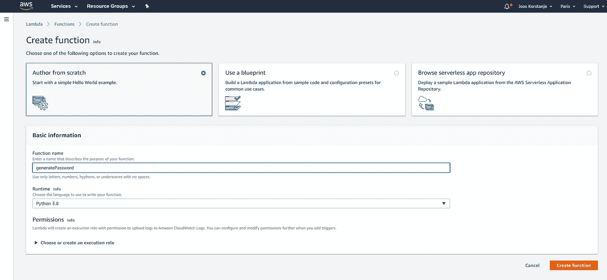
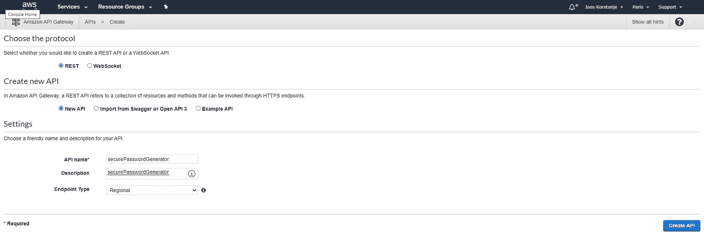
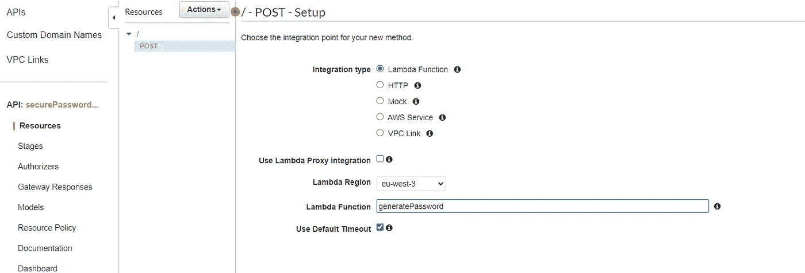

# 如何在 AWS 中构建 API—使用 AWS Lambda 和 API Gateway

> 原文：<https://towardsdatascience.com/how-to-build-an-api-in-aws-using-aws-lambda-and-api-gateway-22a8dee7c8e1?source=collection_archive---------13----------------------->

## 因为 API 就是未来！

如何在 AWS 中构建 API—使用 Lambda 和 API Gateway。Emile Perron 在 [Unsplash](https://unsplash.com/s/photos/api-programming?utm_source=unsplash&utm_medium=referral&utm_content=creditCopyText) 上的照片

API 是应用编程接口的缩写，是允许不同(部分)计算机程序交换数据的连接点。使用 API 来交付软件服务可以使您的代码组织得更好，更容易重用。

在本文中，我将介绍使用 AWS Lambda 和 API Gateway 创建 API 的基本步骤。

该示例是一个非常短的代码示例，它将根据给定的长度、一些大写字母和一些数字字符创建一个随机密码。其他字符将是小写字母。您可以让 API 背后的服务变得尽可能大和先进，从出售数据到使用先进的人工智能模型进行预测。

让我们开始吧:

# 1.创建 lambda 函数

在 AWS 管理控制台上，转到 Lambda:

创建新功能:

选择*“作者从零开始”*，给你的函数起个名字。在这种情况下，api 将生成安全的密码。

# 2.编写 lambda 函数

在新创建的 lambda 函数中，转到函数代码:

并编写您的函数:

我使用的代码如下:

# 3.配置测试

进入测试菜单，点击配置测试。

单击 create new test event，并在单击 create 之前在字典中为您的测试指定输入:

通过点击测试来测试你的 Lambda 函数:

您会看到它在字典(或 json)的“主体”中发回了一个密码。

# 4.构建 API 网关

通过 AWS 管理控制台转到 API 网关。点击 REST API。

单击新建 API 并选择一个名称:

创建一个 POST 方法，并选择集成类型“Lambda Function”。然后选择 Lambda 函数的名称。

您现在应该会看到:

最后一步，部署您的 API:

可以命名为“ *prod* ”例如:

API 网关现在应该告诉您找到 API 的 URL:

# 5.真正测试你的 API

现在，您可以使用 Python 笔记本或任何您喜欢的东西来测试您的 API。

如果你把它复制粘贴到一个笔记本上，API 会给你发送一个新的密码！