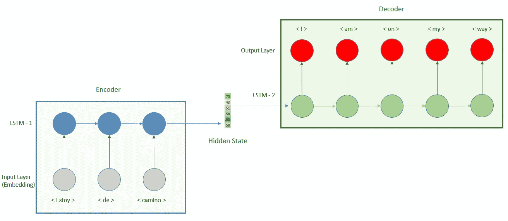

# 如何通过 Python 和 Keras 使用 LSTM 构建一个编码器解码器翻译模型

> 原文：<https://towardsdatascience.com/how-to-build-an-encoder-decoder-translation-model-using-lstm-with-python-and-keras-a31e9d864b9b?source=collection_archive---------4----------------------->

## *按照这个逐步指南建立一个编码器解码器模型，并创建自己的翻译模型*

由[迈克尔·泽兹奇](https://unsplash.com/@lazycreekimages?utm_source=unsplash&utm_medium=referral&utm_content=creditCopyText)在 [Unsplash](https://unsplash.com/@lazycreekimages?utm_source=unsplash&utm_medium=referral&utm_content=creditCopyText) 上拍摄的照片

*先决条件:理解本文之前关于*[*【RNN】*](https://medium.com/swlh/introduction-to-recurrent-neural-networks-rnn-c2374305a630)*[*编码器解码器*](/what-is-an-encoder-decoder-model-86b3d57c5e1a) *的知识是有价值的。**

*本文是关于如何使用 Python 和 Keras 开发编码器/解码器模型的实用指南，更准确地说是 Seq2Seq。在上一个教程中，我们开发了一个类似于下图的多对多翻译模型:*

**

*多对多 RNN。作者提供的图片*

*这种结构有一个**重要的限制，**序列长度。正如我们在图中看到的，**输入序列和输出序列必须具有相同的长度。如果我们需要不同的长度怎么办？例如，具有不同序列长度的模型是接收单词序列并输出数字的情感分析，或者输入是图像而输出是单词序列的图像字幕模型。***

*如果我们想要开发输入和输出长度不同的模型，我们需要开发一个编码器解码器模型。通过本教程，我们将看到如何开发模型，将其应用于翻译练习。模型的表示如下所示。*

**

*编码器解码器结构。作者图片*

***我们将模型分成两部分，**首先，我们有一个**编码器**，它输入西班牙语句子并产生一个隐藏向量。编码器由一个嵌入层和一个递归神经网络(RNN)构成，嵌入层将单词转换为矢量，递归神经网络计算隐藏状态，这里我们将使用长短期记忆(LSTM)层。*

*然后编码器的输出将被用作**解码器**的输入。对于解码器，我们将再次使用 LSTM 层，以及预测英语单词的密集层。*

# *亲自动手*

*样本数据可以在[manythings.org](http://www.manythings.org/bilingual/)下载，来自[塔图埃巴](https://tatoeba.org/spa)。它由你需要的语言中的句子对组成。在我们的例子中，我们将使用[西班牙语-英语组合](http://www.manythings.org/anki/spa-eng.zip)。*

*为了建立模型，我们需要做的第一件事是预处理数据，并获得西班牙语和英语句子的最大长度。*

## *1-预处理*

**先决条件:理解 Keras 中的类“tokenizer”和“pad_sequences”。如果你想详细回顾它们，我们在* [*之前的教程中已经讨论过这个主题。*](/how-to-build-a-translation-pipeline-with-rnn-and-keras-57c1cf4a8a7)*

*首先，我们将导入库，然后读取下载的数据。*

*一旦我们读取了数据，我们将保留第一个例子，以便更快地训练。如果我们想开发一个更高性能的模型，我们需要使用完整的数据集。然后，我们必须通过删除大写字母和标点符号来清理数据。*

*接下来，我们对句子进行分词并分析数据。*

*创建完函数后，我们可以进行预处理:*

*上面的代码打印出以下结果*

**

*根据之前的代码，西班牙语句子的最大长度为 12 个单词，英语句子的最大长度为 6 个单词。在这里，我们可以看到使用编码器/解码器模型的优势，以前我们有处理等长句子的限制，所以我们需要对多达 12 个英文句子应用填充，**现在是一半。**因此，更重要的是，它还减少了 LSTM 时间步长的数量，从而降低了计算需求和复杂性。*

*我们应用填充以使每种语言中句子的最大长度相等。*

*现在我们已经准备好数据，让我们建立模型。*

# *双模型开发*

*在接下来的部分中，我们将创建模型，并解释我们在 python 代码中添加的每一层。*

## *2.1-编码器*

*正如我们在模型图像中看到的，要定义的第一层是嵌入层。为此，我们首先必须添加一个**输入层，**这里要考虑的唯一参数是**“形状”，**这是西班牙语句子的最大长度**，在我们的例子中是 12。***

*然后我们将它连接到[嵌入层](/introduction-to-word-embedding-and-word2vec-652d0c2060fa)，这里要考虑的参数是**‘input _ dim’**，它是西班牙语词汇的**长度，以及**‘output _ dim’**，它是嵌入向量**的**形状。该层会将任何西班牙语单词转换为输出维度形状的矢量。***

*这背后的概念是以空间表示的形式提取单词的含义，其中每个维度将是定义单词的特征。例如，世界“sol”将被转换成形状为 128 的矢量。输出维度越高，从每个单词中提取的语义就越多，但所需的计算和处理时间也就越长。**需要在速度和性能之间找到平衡。***

***接下来我们将添加大小为 64 的 LSTM 图层**。尽管 LSTM 的每个时间步都输出一个隐藏向量，我们将注意力集中在最后一个上，因此参数 **return_sequences 为‘False’。**我们将看到解码器在 return_sequences=True 的情况下 LSTM 层是如何工作的。*

**

*当 return_sequences 为“假”时，输出是最后一个隐藏状态。作者图片*

## *2.2-解码器*

*编码器层的输出将是最后一个时间步长的隐藏状态。然后我们需要将这个向量输入解码器。让我们更精确地看看解码器部分，了解它是如何工作的。*

**

*解码器在每个时间步长接收相同的输入。作者图片*

*正如我们在图像中看到的，隐藏向量重复了 n 次，因此 LSTM **的每个时间步长都接收到相同的向量**。为了让每个时间步都有相同的矢量，我们需要使用层 RepeatVector，顾名思义，它的作用是重复它接收的矢量，我们需要定义的唯一参数是 n，即重复的次数。这个数等于解码器部分的时间步长数，换句话说，等于最大英语句子长度 6。*

*一旦我们准备好输入，我们将继续与解码器。这也是用 LSTM 层构建的，不同的是参数 **return_sequences，在这种情况下为“真”。**这个参数是干什么用的？在编码器部分，我们期望在最后一个时间步只有一个向量，忽略所有其他的，这里**我们期望在每个时间步**有一个输出向量，这样密集层可以进行预测。*

**

*解码器:LSTM 计算密集层的输入。作者图片*

*我们还有最后一步，预测翻译的单词。为此，我们需要使用一个密集层。我们需要定义的参数是单位的数量，这个单位的数量是输出向量的形状，它需要与英语词汇的长度相同。为什么？**向量将是所有接近零的值，除了接近 1** 的一个单位。然后，我们需要将输出 1 的单元的索引映射到一个字典中，我们将每个单元映射到一个单词。例如，如果输入是单词“sol ”,输出是一个向量，其中所有都是零，那么单元 472 是 1，我们将这个索引映射到包含英语单词的字典，并且我们得到值“sun”。*

*我们刚刚看到了如何应用密集层并预测一个单词，但我们如何对整个句子进行预测呢？因为我们使用 return_sequence=True，LSTM 层在每个时间步输出一个向量，所以我们需要在每个时间步应用前面解释的密集层，一次预测一个单词。为了做到这一点，Keras 开发了一个名为时间分布的特定层，**它将相同的密集层应用于每个时间步。***

*最后，我们堆叠这些层来创建模型并添加功能损失。*

*一旦我们定义了模型，我们只需要训练它。*

*当模型被训练后，我们可以进行第一次翻译。您还会发现将密集层的输出与英语词汇进行映射的函数“logits_to_sentence”。*

## *结论*

*编码器解码器结构允许**不同的输入和输出序列长度**。首先，我们使用一个**嵌入层来创建单词**的空间表示，并将其输入输出隐藏向量的 LSTM 层，因为**我们只关注最后一个时间步骤**的输出，我们使用 return_sequences=False。*

*这个输出向量需要重复与解码器部分的时间步长相同的次数，为此我们使用 RepeatVector 层。解码器将使用 LSTM 图层和参数 return_sequences=True 构建，因此时间步长的每个输出都由密集图层使用。*

*尽管这个模型已经是对之前教程的一个很好的改进，我们仍然可以提高精确度。我们可以增加模型中 LSTM 层的数量，而不是编码器中只有一层，解码器中只有一层。我们也可以使用预先训练的嵌入层，如 word2vec 或 Glove。最后，我们可以使用注意机制，这是自然语言处理领域的主要改进之一。我们将在下一个教程中介绍这个概念。*

****附录:不使用重复矢量的编码器-解码器****

*在本教程中，我们已经看到了如何使用 RepeatVector 层构建一个编码器解码器。还有第二个选项，我们使用模型的输出作为下一个时间步的输入，而不是重复隐藏向量**，正如我们在这个图像中看到的。***

**

*作者图片*

*实现这个模型的代码可以在 [Keras 文档](https://blog.keras.io/a-ten-minute-introduction-to-sequence-to-sequence-learning-in-keras.html)中找到，它需要对 Keras 库有更深的理解，开发也相当复杂。*