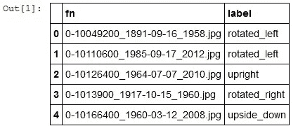
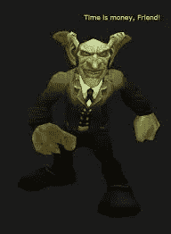
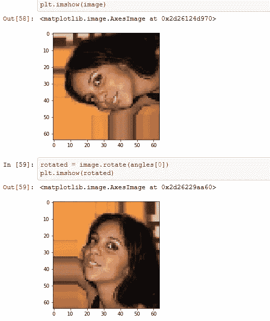
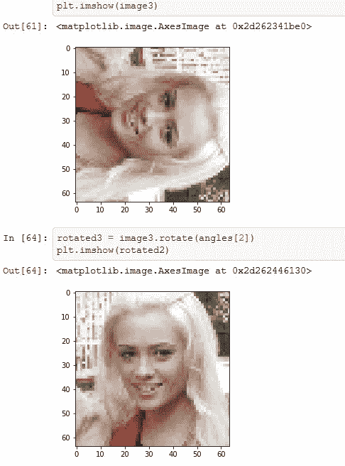
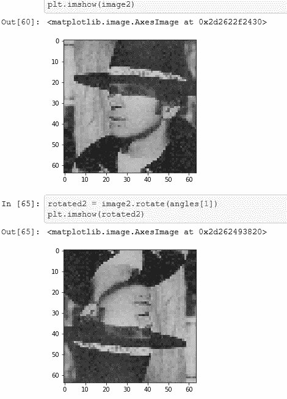

# 如何在 24 小时内建立一个图像自动旋转器

> 原文：<https://towardsdatascience.com/how-to-build-an-image-automatic-rotator-in-24-hours-3137769f240c?source=collection_archive---------46----------------------->

## 神经网络和 Keras 工具的简单性


由[乌列尔 SC](https://unsplash.com/@urielsc26) 在 [Unsplash](https://unsplash.com/) 上拍摄的照片

最近，我接受了这个[任务](https://gist.github.com/csaftoiu/9fccaf47fd8f96cd378afd8fdd0d63c1)的挑战，主要是要求使用神经网络来预测图像的方向(垂直、上下颠倒、向左或向右)，并根据预测将图像旋转到正确的位置(垂直)，所有这一切都要在 24 小时内完成！

到目前为止，我在神经网络方面的经验是使用 Scikit-learn 内部的多层感知器，我从未处理过图像处理。这意味着是时候把我的头往墙上撞了！

训练集由大约 5 万幅图像组成，它们的标签存储在 csv 中，如下所示:



在挑战描述中，暗示使用 CIFAR10 模型和 Keras 上的相应示例。因此，对于像我这样的神经网络初学者来说，这是一个巨大的飞跃。

神经网络的有利一面是，没有必要重新发明轮子，已经有许多用于不同目的的预训练网络，它们可供任何人使用。

随着一个问题的解决，但仍然与时间赛跑，我把注意力集中在图像处理上。



来源[got 魔兽](https://gotwarcraft.com/ten-tips-earning-more-gold-wow/)

好了，几个小时后，stackoverflow 发布了图像处理测试函数，我终于能够将这些图像转换成矢量，但是我仍然需要给每个矢量贴上标签。此时，绝望占据了我的心头。

我需要一个过程:读取文件，将文件名转换为字符串，读取与文件匹配的条目的 csv，然后读取标签并将其添加到图像转换向量中。

然而，即使缩小到 32x32 的图像也代表 3072 大小的向量(32x32x3，你必须记住每个像素都有一个绿色、红色和蓝色的值)，这意味着在每大约 50，000 行矩阵的 3073 个特征(向量+标签)中重复上述过程，这足以让我的普通本地机器在角落里哭泣。这只会增加绝望。

但我决定，至少我要在剩下的 16 个小时里学会如何解决这个问题。经过进一步的调查和几次失败的测试后，我找到了 Keras 的图像数据生成器，让我告诉你:这是一个多么令人愉快的工具！

由于图像处理的规模和复杂性，它有一系列的含义，但是使用这个工具，一切都可以用正确的参数来解决。

我们可以简单地转换带有图像标签的文件，并将其存储到 pandas dataframe 中，设置图像的路径，设置图像转换的大小，设置它是训练集还是验证集，我们甚至可以为此过程设置批处理大小，从而解决我们的本地机器问题。这是许多其他选项中的一个，比如通过不同的文件夹读取图像的标签，或者将图像转换成灰度。

我们对训练集和验证集重复这一过程，我们只需要十几行代码就可以训练一个神经网络，如下所示。

```
import keras
from keras.preprocessing.image import ImageDataGenerator

# create a data generation with the train truth images and dataframe
datagen = ImageDataGenerator(validation_split=0.2)

train_generator=datagen.flow_from_dataframe(
dataframe=train_truth,
directory="train/",x_col="fn",y_col="label",                                           subset="training",batch_size=32,seed=42,shuffle=True,                                         class_mode="categorical",target_size=(32,32)
)

validation_generator=datagen.flow_from_dataframe(
dataframe=train_truth,
directory="train/",x_col="fn",y_col="label",                                         subset="validation",batch_size=32,seed=42,shuffle=True,                                      class_mode="categorical",target_size=(32,32)
)
```

这时我终于看到了隧道尽头的光明。

还有 10 个小时，但我仍然不得不运行模型，评估它，并用它来校正测试集中的图像(没有标签)。

在设置了历元和每个历元的步骤之后，就到了用神经网络和图像处理来“睡眠”做梦的时候了，同时模型在运行。

还剩 3 个小时，准确率 95.94%是时候开始包装东西，建立一个图像旋转器，一个存储库，记录一切以完成挑战。

离比赛结束还有 1.5 个小时，检验旋转器的关键时刻到了:



很好，看起来很有效！💪



不仅如此，它是完美的！✨



好吧，没那么多！😅

之后，我保存了修改过的图片，组织了知识库，并在只剩 3 分钟的时候提交了挑战。

直到今天，没有人回复我，告诉我模型在测试集中的表现，但有一点是肯定的，我学到了两个重要的教训:

首先，Keras 的图像数据生成器是一个优秀的工具，其次，在数据科学挑战的解决过程中，很大一部分是找到解决该问题的正确工具。

我对这个挑战的解决方案可以在这里找到。