# 如何以神经网络的思维方式使用逻辑回归构建图像分类应用程序

> 原文：<https://towardsdatascience.com/how-to-build-an-image-classification-app-using-logistic-regression-with-a-neural-network-mindset-1e901c938355?source=collection_archive---------21----------------------->

## 在这个循序渐进的教程中，您将学习使用 Streamlit 构建一个带有交互式 web 应用程序的 Cat 分类器。一切从零开始。

# 介绍

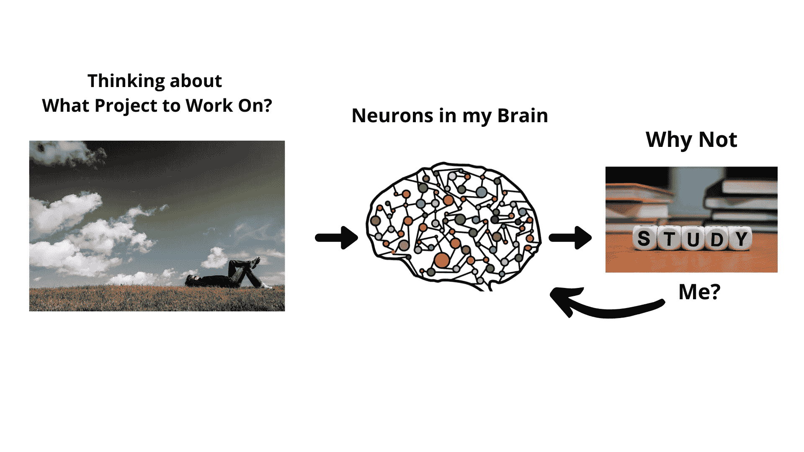

图片由作者设计，左图由来自 [Pixabay](https://pixabay.com/) 的 [Pexels](https://pixabay.com/users/Pexels-2286921/) ，中间图由来自 [Pixabay](https://pixabay.com/) 的 [Ahmed Gad](https://pixabay.com/users/ahmedgad-9403351/) ，右图由来自 [Pixabay](https://pixabay.com/) 的 [Wokandapix](https://pixabay.com/users/Wokandapix-614097/)

前几天，我在想我应该做什么项目？为我写下一篇辅导博客。过了一段时间，我想我大脑中的一群神经元做了一些计算并发出了一个信号，这让我想到了👇

用神经网络算法做一个项目怎么样？

所以我们设定了目标:

1.  了解神经网络
2.  用它创建一个项目
3.  写一篇关于它的教程，并与在线社区分享

所以现在的关键问题是:

## 应该从哪里了解神经网络？

作为一个基于项目的学习者，我正在寻找一个关于神经网络的一些基本理论知识的实践课程/教程。所以我选择报读神经网络和深度学习课程。

只是想让你知道，这是通过 Coursera 提供的 deeplearning.ai 专业化的第一门课程，由吴恩达教授讲授。Coursera 的联合创始人，斯坦福大学计算机科学的兼职教授。

最近，我完成了这门课程，还写了一篇文章，分享我对这门课程的全面见解。所以，如果你对学习神经网络感兴趣，那么看看这个👇

[](https://medium.com/datadriveninvestor/are-you-also-interested-in-learning-about-neural-networks-356a6592662) [## 你也对学习神经网络感兴趣吗？

### 这是吴恩达教授讲授的神经网络和深度学习课程的综合指南。

medium.com](https://medium.com/datadriveninvestor/are-you-also-interested-in-learning-about-neural-networks-356a6592662) 

所以我完成了课程，学习了解决图像分类问题，现在是时候写一个初学者友好的教程了！

# 你会学到什么？

## 1)对问题的理解

首先，我们将通过提出以下问题来理解图像分类的问题👇

*   什么是图像？
*   图像中的特征是什么？
*   图像在计算机上是如何表现的？
*   为什么图像分类很重要？…

## 2)学习并实现学习算法的构建模块

其次，在这个主要部分，我们将学习带有神经网络思维的逻辑回归算法。此时，我们将开始编码并实现学习算法的基本构件。

经过这一步，你将能够使用自己的图像来分类它是否包含猫。

我们将实现的一些功能有:

*   初始化参数
*   向前和向后传播
*   最佳化
*   主模型…

最后，我们将所有的功能合并到我们的主模型中。

在本教程中，我们将使用 **Python 编程语言**。是的，所有的代码都包括了全面的解释！

## 3)使用 Streamlit 制作交互式 Web 应用程序

最后，在最终确定模型后，我们将了解:

*   什么是 Streamlit？
*   使用 Streamlit 构建一个简单的交互式 Cat 分类器 web 应用程序
*   你还可以玩 Heroku 平台上的猫图像分类应用程序

这不是最后一步，但还有一个更有趣的东西👇

## 4)试验参数并分析结果

这是我最喜欢的部分，因为我们将通过尝试不同的值来玩我们的模型参数，如学习率，迭代次数。并将分析我们模型的性能。

在这一部分，我还将分享一些额外的步骤，通过这些步骤，你可以发挥、发现和分析你的学习算法的结果。

现在让我们开始吧！

# 目标

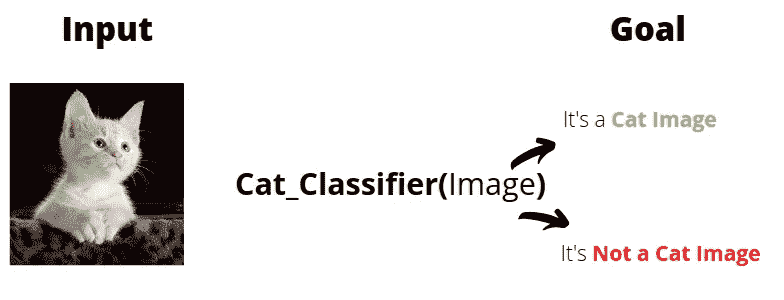

作者的形象设计。左猫照片由 [Ty_Swartz](https://pixabay.com/users/Ty_Swartz-617282/) 在 [Pixabay](https://pixabay.com/) 上拍摄

我们的目标是解决图像分类问题。具体来说，在输入中我们有一个图像，我们需要找出某种方法来分类它是猫的图像还是非猫的图像。

要实现我们的目标，首先，我们来了解一下什么是形象？

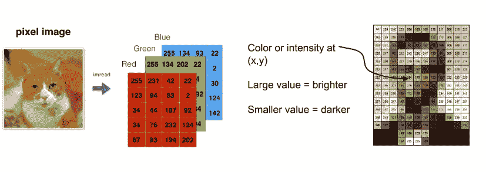

2D 阵列的三维和一维通道示例

图像不过是一个 2D 数字阵列，这些数字代表颜色的强度值。如果它是一个灰度图像，那么只有一个 2D 数组的一维通道，其中包含代表黑色和白色阴影的值。

如果它是一个彩色图像，就像你在上面看到的，那么 2D 数组总共有 3 维通道，包含代表红、绿、蓝颜色的值。

在本教程中，我们将使用彩色图像！

你可以了解更多关于 i [法师和计算机如何存储图像的知识？](https://www.youtube.com/watch?v=EXZWHumclx0)在 Youtube 上传的教程里。

## 为什么图像分类很重要？

你一定听说过人工智能在机器人、计算机视觉、医疗诊断、商业和许多其他领域的应用。

在这里，我想分享两个图像分类发挥重要作用的例子。

1.  **医学诊断** 图像分类可用于检测疾病，例如
    从胸部 x 光图像预测新冠肺炎病例，…
2.  **自动驾驶汽车** 在计算机视觉的应用中，解决图像分类的相关问题在自动驾驶汽车中起着重要的作用。例如
    行人检测，交通信号，…

# 实现学习算法的构建模块

## 逻辑回归

我们的目标是建立一个模型/算法/函数，可以对猫和非猫图像进行分类。具体来说，这是一个二元分类问题。

给定一幅图像，如果模型预测“这是一幅猫的图像”，那么输出应该是 1，如果模型预测“这不是一幅猫的图像”，那么输出应该是 0。

那么有没有什么函数可以给我们想要的输出呢？

是的，这个函数被称为**逻辑/Sigmoid** 函数。

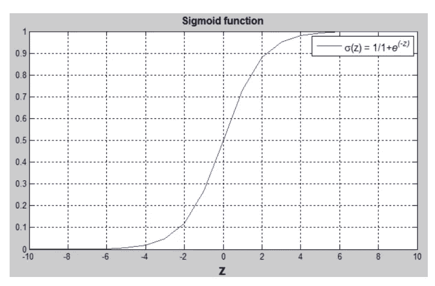

Sigmoid 函数的图形

如上图所示，sigmoid 函数的属性如下:

*   如果 z 值是大的正数，那么输出越来越接近 1
*   如果 z 值是很小或很大的负数，那么输出越来越接近 0
*   如果 z=0，则输出为 0.5

逻辑回归算法将评估猫
在作为输入的给定图像中的概率。首先，如果 sigmoid 函数的输出为> 0.5，我们可以在算法中设置一个阈值来预测 cat 图像，反之亦然。

顺便说一下，选择一个好的阈值是玩机器学习算法的许多事情之一！

嘿，但是等一下！。这个教程的标题是不是:

“如何用神经网络的思维模式，使用逻辑回归构建一个图像分类应用？”

**神经网络在哪里？**

是的，我们将使用带有神经网络思维的逻辑回归来建立我们的图像分类模型。别担心！(安德鲁教授的对话)

首先，我们来谈谈神经网络！

## 什么是神经网络？

神经网络是另一种学习算法，但它与其他机器学习算法非常不同。受大脑结构的启发，人工神经网络试图模拟人脑中的神经元网络。ANN 是一种基于层的架构，由输入层、隐藏层和输出层组成。

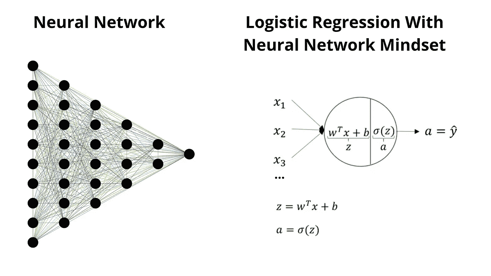

图片由作者设计，左侧神经网络图片由 [Gordon Johnson](https://pixabay.com/users/GDJ-1086657/) 来自 [Pixabay](https://pixabay.com/)

在上述神经网络中，总共有 4 个隐藏层和 20 个隐藏单元/人工神经元，并且每个单元与下一层单元连接。因此，为了开始并更好地理解神经网络过程，我们将使用逻辑回归和神经网络思维来构建我们的 cat 分类器。

神经网络应用于计算机视觉、自然语言处理、推荐系统等领域

## 只是猜测👇

也许你正在阅读的这篇教程是由 medium articles 推荐系统背后的某个神经网络推荐给你的！

## 神经网络思维下的逻辑回归方法

使用这种方法有两个好处:

1.  我们将学习逻辑回归模型
2.  我们还将学习和实现神经网络编程的基本过程和构建模块

现在，在开始编码之前，让我与您分享这个过程的概述，然后我们将一步一步地处理学习算法的每个构建模块。

## 构建 Cat 分类器概述

**特征** 如果我们需要在任何照片中认出一只猫，我们将能够很快识别它，我认为这是因为我们学会了区分猫和其他动物的特征。

但是让计算机在任何照片中识别一只猫是非常困难的。因为在图像中，我们只有一串数字，代表不同深浅的红、蓝、绿颜色。这些数字被称为图像的特征，这就是猫分类器的输入。

因此，我们需要建立一个系统，能够识别一只猫在照片中可能的不同样子，这就是**学习算法**的由来👇

顾名思义，学习算法的工作是学习图像中猫的特征，但我们不希望我们的模型只预测单一/特定类型照片中的猫，而是希望我们的模型以这样一种方式进行推广，即我们的模型考虑猫在不同照片中可能出现的各种可能性。

为了使我们的模型一般化，我们需要给出许多不同类型的猫和非猫图像作为学习算法的输入。以便我们的学习算法可以学习猫图像与非猫图像之间的特征！

**但是一个学习算法学什么呢？**

好问题。在我的理解中，学习算法只是使用数学方程进行一些计算，并给出参数值。我们的模型需要这些参数值来以最小的误差正确地对猫进行分类。

我们将在这个过程中使用的算法被称为**梯度下降**。
你将在本教程的后半部分优化算法标题下了解到更多信息！

下图解释了我们将要实现的过程和数学表达式！

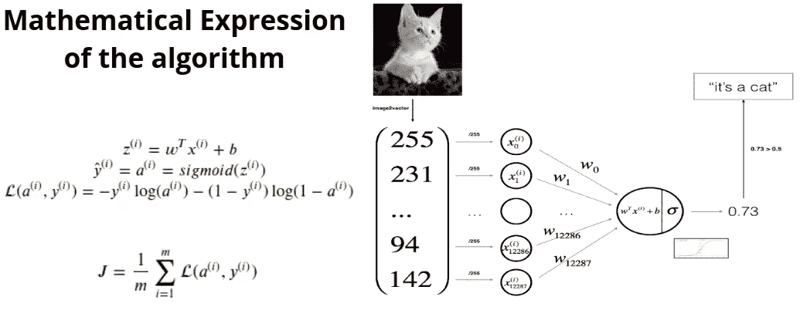

作者形象设计， [Ty_Swartz](https://pixabay.com/users/Ty_Swartz-617282/) 在 [Pixabay](https://pixabay.com/) 上的猫咪照片

变量的表示:

*   z 方程
    x 表示图像的特征， **w** 和 **b** 是我之前说的优化算法学习到的参数。
*   yhat=a=sigmoid(Z)
    Z 可以是任意实值，所以 sigmoid(Z)会给我们一只猫在图像中的概率。介于 0 和 1 之间的值。
*   L(a，y)
    这是一个损失函数，给出了预测值和实际值之间的误差量。
*   J
    这是计算所有训练示例/图像的预测值和实际值之间的误差量的成本函数。

我知道在上述过程中发生了很多事情。那么首先让我们通过单个训练例子来了解这个过程！

让我们用 **m** 来代表一个训练的例子。所以现在 **m** =1。

考虑到我们在算法中输入了猫的图像。

1.  首先，我们将参数值 w 和 b 初始化为 0，然后将图像的输入特征传递给 z 方程。
2.  z 表达式将任意实数值计算为 sigmoid 函数。比方说，sigmoid(z)计算出猫出现在该图像中的概率为 0.73。
3.  现在，损失函数计算了我们的模型预测和图像的实际值之间的误差量。然后，它开始计算总成本函数，但由于我们只有单个训练示例，因此损失函数和 J 值是相同的。

现在观察模型预测依赖于参数 w 和 b 的值，对吗？

因此，对**训练集**中的所有其他图像重复上述过程，然后优化算法尝试调整正确的参数值，以使我们的模型预测误差最小！

现在让我们开始编码


[免费照片](https://pixabay.com/users/Free-Photos-242387/)在 [Pixabay](https://pixabay.com/) 上拍摄的照片

## 推荐的开发环境

*   Jupyter 笔记本

**注意:**你可以在我的 [Github 仓库](https://github.com/jalalmansoori19/Cat-Classifier)中找到所有必要的文件和代码

# 1.包装

首先，让我们导入所有对实现我们学习算法的构建模块非常有帮助的包。

这些包装就像你在制作某种食物的过程中需要的不同配料！

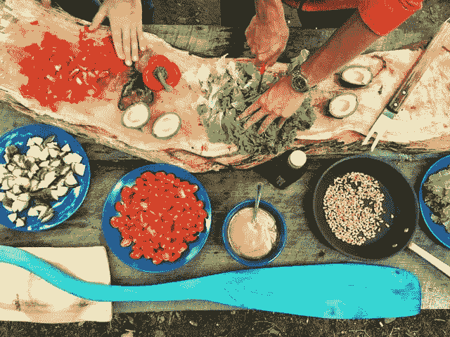

马丁·范·登·霍维尔在 [Unsplash](https://unsplash.com/s/photos/cooking?utm_source=unsplash&utm_medium=referral&utm_content=creditCopyText) 上的照片

*   [**numpy**](http://www.numpy.org) 是使用 python 进行科学计算的基础包，我们将使用一些高效的内置函数，如 np.log、np.exp、…
*   [**h5py**](http://www.h5py.org/) 是一个通用包，用于与存储在 H5 文件中的数据集进行交互。[数据集文件上传到 Github](https://github.com/jalalmansoori19/Cat-Classifier/tree/master/datasets) 上。
*   [**matplotlib**](http://matplotlib.org/) 是 python 中著名的图形绘制库。
*   [**PIL**](http://www.pythonware.com/products/pil/) 和 [**scipy**](https://www.scipy.org/) 这里用你自己的图最后来测试你的模型。

如果你正在使用 Jupyter 笔记本，然后导入上述软件包，如果你面临任何问题，然后确保软件包安装正确。

现在按下 **Shift +回车键**运行 Jupyter 笔记本中的单元格。

# 2.数据集的加载和概述

让我们更熟悉数据集！

在下面的代码中，我们加载了由猫和非猫图像组成的数据集。

**训练集** 我们的猫分类器模型将使用这个训练集来学习猫与非猫特征之间的差异。

train_set_x_orig:这是一个存储猫和非猫图像特征值的矩阵。这些值介于 0-255 之间，代表红色、蓝色和绿色的不同色调。

train_set_y:这是一个向量，它存储了 train_set_x_orig 中图像特征的相应输出值。
1 表示它是一个猫图像。0 表示它不是猫的形象。

**测试设置**

在我们的模型在训练集上训练后，我们将使用测试集检查我们的模型性能，这是我们的模型没有看到的数据！

## 数据集输出概述:

```
**Number of training examples**: m_train = 209
**Number of testing examples**: m_test = 50
**Height/Width of each image**: num_px = 64
**Each image is of size**: (64, 64, 3)
**train_set_x shape**: (209, 64, 64, 3)
**train_set_y shape**: (1, 209)
**test_set_x shape**: (50, 64, 64, 3)
**test_set_y shape**: (1, 50)
```

因此，我们有 209 个训练示例和 50 个猫与非猫图像的测试示例。每幅彩色图像的尺寸都是 64 X 64。

## 可视化训练集中的图像示例

train_set_x_orig 和 test_set_x_orig 的每一行都是代表一个图像的数组。随意更改**索引值**并重新运行以查看其他图像。

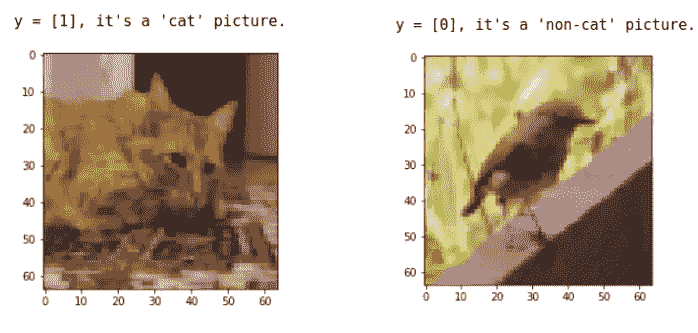

训练集中的猫和非猫图片示例

## 重塑训练和测试集

为了方便起见，现在我们需要在形状(num_px*num_px*3，1)的 numpy 数组中对形状(num_px，num_px，3)的图像进行整形。在这之后，我们的训练(和测试)数据集是一个 numpy 数组，其中每一列代表一个展平的图像。

**输出:**

```
train_set_x_flatten shape: (12288, 209)
train_set_y shape: (1, 209)
test_set_x_flatten shape: (12288, 50)
test_set_y shape: (1, 50)
```

现在，我们的训练和测试集处于计算目的的正确维度。train_set_x_flatten 和 test_set_x_flatten 中的每一列都表示图像的特征。

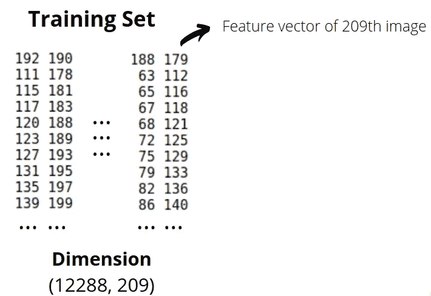

整形后存储在训练集中的数据的可视化。(图片由作者提供)

例如:
train_set_x_flatten[:，209]将输出存储训练数据集中最后一幅图像的 12288 个值的特征向量。

test_set_x_flatten 也一样！

# 3.预处理步骤

机器学习中的一个常见步骤是预处理/标准化数据集。

> "具有相似尺度的特征可以帮助梯度下降更快地向最小值收敛. "

简而言之，这意味着当数据集中的要素具有相似的比例时，优化算法将更容易了解那些有效的参数 **w** 和 **b** 值。有许多不同种类的技术可用于此目的。

但对于图片数据集，更简单、更方便的方法是将数据集的每一行除以 255(像素通道的最大值)，效果几乎一样好。

在预处理之前，训练和测试集中的特征值在 0 和 255 之间。

预处理后，现在训练和测试集中的特征值在 0.0 和 1.0 之间。

## 到目前为止我们做了什么👇

*   算出问题的维度和形状(m_train，m_test，num_px，…)
*   重塑数据集，使每个示例现在都是一个大小为(num_px * num_px * 3，1)的向量
*   将数据“标准化”

现在是时候设计一个简单的算法来区分猫图像和非猫图像了。

# 4.构建我们算法的各个部分


作者图像设计，猫的照片由 [Ty_Swartz](https://pixabay.com/users/Ty_Swartz-617282/) 在 [Pixabay](https://pixabay.com/) 上拍摄

首先，我们将实现 sigmoid 之类的辅助函数，初始化参数，…然后我们将这些函数合并到我们的主 cat 分类器模型中。

## 4.1 Sigmoid 和初始化参数功能

如上图所示，首先我们需要计算𝑠𝑖𝑔𝑚𝑜𝑖𝑑(z 来进行预测。

首先，我们将参数 w 和 b 初始化为零。您还可以用随机值初始化这些参数，以检查零和随机初始化之间的差异！

## 4.3 向前和向后传播

现在我们已经准备好 sigmoid 和初始化函数，下一个任务是计算学习参数的向前和向后传播步骤。

我们将在名为 **propagate()** 的函数中实现以下等式，该函数计算成本函数及其梯度。

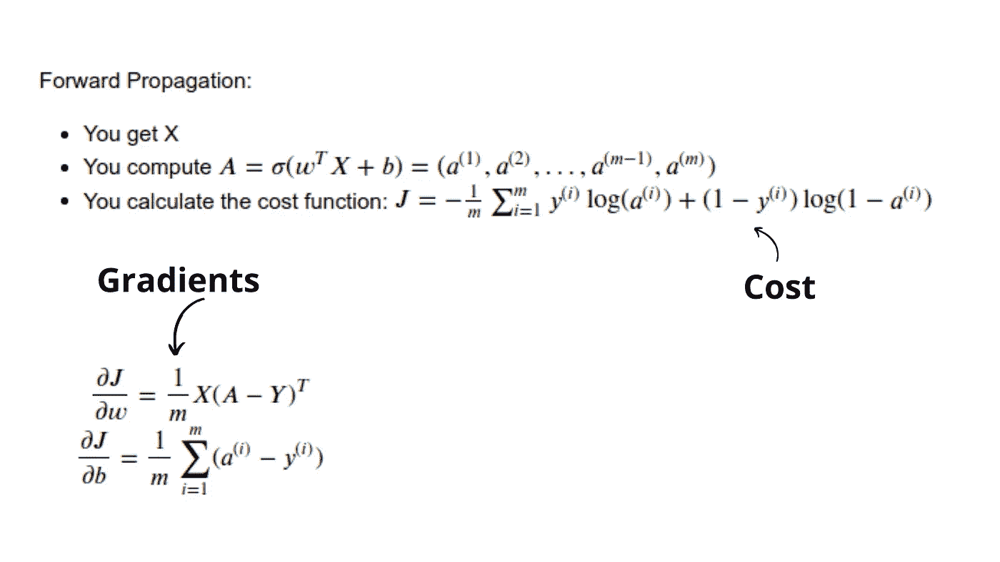

计算梯度和成本的方程式

成本函数将给出代表我们的模型预测和实际值之间的误差量的值。

我们的目标是最小化成本函数，这就是为什么我们需要计算关于参数 **w** 和**b**的成本梯度或变化

## 4.4 优化算法

是时候实现一个函数了，它将为我们的模型提供有效的参数，以最小的误差做出预测。

这里的目标是通过最小化成本函数𝐽.来学习𝑤和𝑏使用梯度下降算法，更新规则是:

*   *w*=*w*−𝛼𝑑*w*
*   *b*=*b*−𝛼𝑑*b*

其中，𝛼是学习率， *dw，db* 是我们在 propagate()函数中计算的梯度。

梯度下降给了我们两个超参数来玩，**学习速率**和**迭代次数。**我们将使用这些2 超参数做进一步的分析，并改进我们模型的性能。

## 4.5 预测功能

前面的优化函数将给出 w 和 b 参数。然后，我们可以使用这些参数来预测图像 X 是否包含一只猫。

# 5.将所有功能合并到一个模型中

最后，我们现在将了解如何按照正确的顺序将所有的构建模块(在前面的部分中实现的功能)组合在一起，从而构建整个模型。

让我们使用 num_iterations 和 learning_rate 中的随机值来观察我们的 cat_classifier 模型的性能:

```
d = model(train_set_x, train_set_y, test_set_x, test_set_y, num_iterations = 1000, learning_rate = 0.005, print_cost = True)
```

输出:

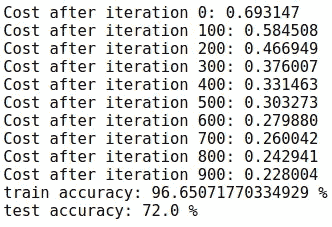

模型的训练和测试精度

因此，我们的模型能够正确分类训练数据集中大约 96%的图像和测试数据集中 72%的图像。我希望你知道，我们的模型是在训练数据集上训练的，这就是为什么训练集的精度比测试精度高得多。

但是，72%的测试准确率还是不错的。让我们绘制学习曲线图，以便更好地了解培训过程！

# 学习曲线图

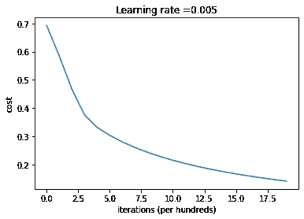

学习曲线图

你可以看到成本在下降。这表明参数正在学习中。尝试增加上面单元格中的迭代次数，然后重新运行这些单元格。您可能会看到，训练集的准确性提高了，但测试集的准确性却降低了。这叫做过度拟合。

以下是通过更改 num_iterations 值得到的模型结果:

```
# **num_iterations = 2000**d = model(train_set_x, train_set_y, test_set_x, test_set_y, num_iterations = 2000, learning_rate = 0.005, print_cost = False)**Output:****train accuracy**: 99.04306220095694 %
**test accuracy**: 70.0 %# **num_iterations = 3000**d = model(train_set_x, train_set_y, test_set_x, test_set_y, num_iterations = 3000, learning_rate = 0.005, print_cost = False)**Output:****train accuracy**: 99.52153110047847 %
**test accuracy**: 68.0 %
```

上述性能结果表明，当我们增加 num_iterations 值时，我们的模型训练精度会增加，但测试精度会略有下降！

在这里，我们看到模型过度拟合训练数据，这意味着模型将只能根据它正在训练的数据进行正确预测。称为正则化的技术用于减少过拟合。

提高模型性能的可能性有很多，因此在本教程中，我将使用训练精度约为 100%且测试精度为 70%的 cat 分类器模型，这对于我们正在使用的这个小数据集来说是不错的！

# 让我们研究一下学习率参数，并做一些进一步的分析

过去，我也写过一篇关于梯度下降算法中学习率分析的深入教程👇

[](https://medium.com/towards-artificial-intelligence/effect-of-learning-rate-in-gradient-descent-algorithm-using-python-bb45eb0f26bf) [## Python 中梯度下降算法的学习速率分析

### 在本教程中，你将学习，实施，通过尝试不同的梯度下降的性能可视化…

medium.com](https://medium.com/towards-artificial-intelligence/effect-of-learning-rate-in-gradient-descent-algorithm-using-python-bb45eb0f26bf) 

让我们进一步分析我们的猫分类器模型，并检查学习率𝛼.的可能选择

**学习率的选择**

为了让梯度下降有效，你必须明智地选择学习率。学习率𝛼决定了我们更新参数的速度。

*   如果学习率太大，我们可能会“超过”最佳值。
*   同样，如果它太小，我们将需要太多的迭代来收敛到最佳值。

这就是为什么使用一个合理的学习率是至关重要的。

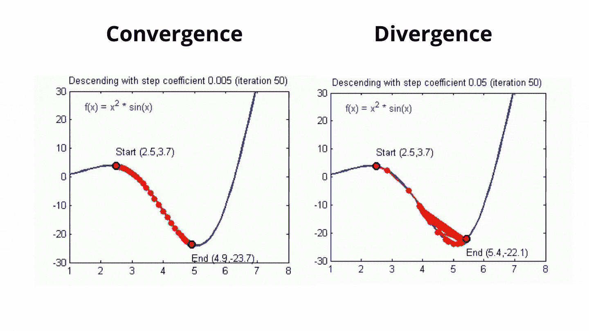

收敛和发散的直观可视化。图片由[亚当哈雷](https://www.cs.ryerson.ca/~aharley/neural-networks/)

让我们比较一下我们模型的学习曲线和几种学习率的选择。

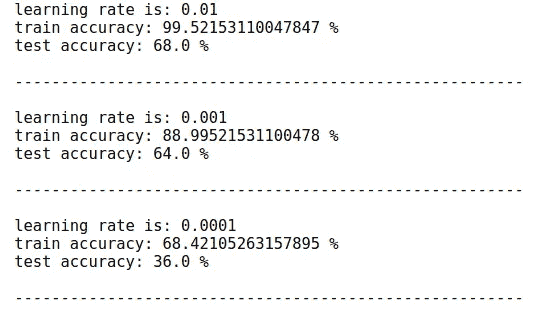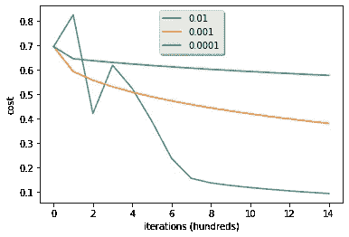

学习率的输出选择

观察结果:

*   不同的学习率给出不同的成本，从而得到不同的预测结果。
*   如果学习率过大(0.01)，成本可能会上下振荡。它甚至可能会发散(尽管在这个例子中，使用 0.01 最终仍然是物有所值的)。
*   更低的成本并不意味着更好的模式。你必须检查是否有可能过度配合。当训练精度大大高于测试精度时，就会发生这种情况。

# 可选:可以用来改进模型的东西

我们只玩了一个超参数学习率，所以如果你想通过尝试不同的东西来获得更好的理解，我鼓励你玩以下东西，并观察你的模型性能的变化:

*   如果您记得我们用零初始化参数，您可以尝试不同的初始化方法并比较结果。
*   玩弄学习率和迭代次数
*   测试其他预处理方法，优化算法，…

# 6.用你自己的图像测试

恭喜你建立了你的第一个图像分类模型。现在，您可以使用自己的图像并查看模型的输出。

*   将您的图像添加到 Jupyter 笔记本的“图像”文件夹中
*   在下面的代码中更改图像的名称
*   运行代码，检查算法是否正确(1 =猫，0 =非猫)

Cat 分类器预测:

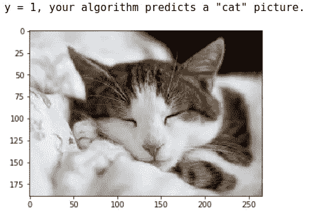

亚历山德鲁·兹德罗布在 [Unsplash](https://unsplash.com/) 上拍摄的照片

让我们检查算法是否正确预测非猫图像👇

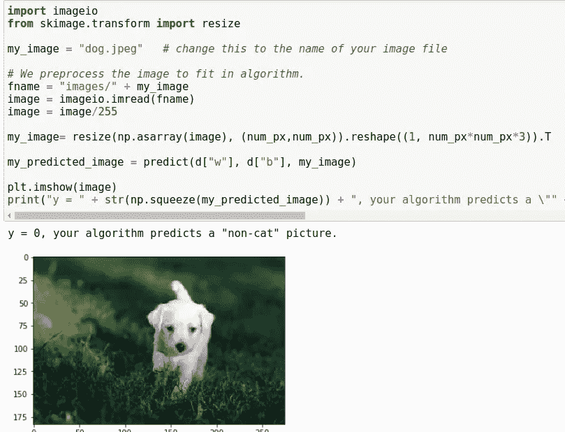

(图片由[ale ha va](https://pixabay.com/users/Ale%C5%A1H%C3%A1va-5318775/)在 [Pixabay](https://pixabay.com/) 上拍摄)。我们的模型预测正确:这不是一只猫的形象

是时候使用 streamlit 制作一个交互式 web 应用程序了！

但是在开始使用 streamlit 之前，首先，我们需要完成并保存我们的 cat 分类器模型。

## 如何最终确定并保存 Cat 分类器模型？

> 在进行预测之前，必须训练一个最终模型。
> 
> 您可能已经使用 k-fold 交叉验证或数据的**训练/测试分割**训练了模型。这样做是为了让您对模型在样本外数据(如新数据)上的技巧有一个估计。
> 
> 这些模型已经达到了它们的目的，现在可以丢弃了。
> 
> 现在，您必须根据所有可用数据训练最终模型。

由(杰森·布朗利)创办的[机器学习大师](https://machinelearningmastery.com/)

运行以下代码，在整个数据集(而不是在定型集和测试集)上定型最终模型👇

## 如何保存猫分类器模型？

使用 Joblib，我们可以轻松地保存我们的模型，现在我们可以在 streamlit 应用程序中使用它。

```
import joblib# Save the final Cat classifier model as a pickle in a file
joblib.dump(cat_clf, "Cat_Clf_model.pkl")
```

# 使用 Streamlit 的交互式猫图像分类应用程序

在开始使用我们的 app 编码之前，您还可以使用 Heroku 平台上的一个
[猫图像分类 app。](https://cat-clf-app.herokuapp.com/)

现在让我们了解一下 streamlit！

## 什么是 Streamlit？

Streamlit 是一个开源框架，用于创建一个交互式的、漂亮的可视化应用程序。全部用 python！

Streamlit 提供了许多有用的特性，对数据驱动项目的可视化非常有帮助。

## 为什么我应该使用 Streamlit？

*   创建交互式用户界面的简单易行的方法
*   不需要开发经验
*   在数据驱动的项目中使用不同的功能很有趣
*   全面的文档

## 使用 Streamlit 的 Face-GAN explorer 示例

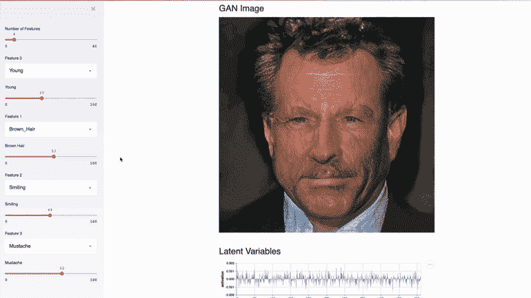

这个 Streamlit 应用程序使用[关的 TL-GAN](https://blog.insightdatascience.com/generating-custom-photo-realistic-faces-using-ai-d170b1b59255)【6】演示了 [NVIDIA 名人脸 GAN](https://research.nvidia.com/publication/2017-10_Progressive-Growing-of)【5】模型。

我们的[猫图像分类应用](https://cat-clf-app.herokuapp.com/)的最终版本将会是这样的👇

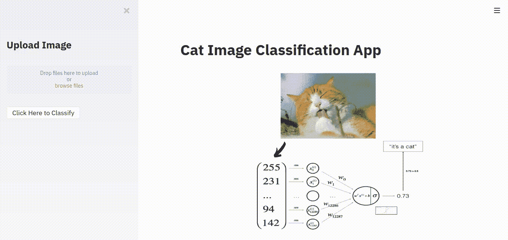

使用 Streamlit 的交互式猫图像分类应用程序

我们开始吧！

## 安装程序

## **针对 Linux 的**

你只需要在你的终端中写下下面的命令来安装 Streamlit 包。

```
pip install streamlit
```

## **用于 Windows**

你可以在他们的[官方文档页面](https://docs.streamlit.io/en/latest/troubleshooting/clean-install.html#install-streamlit-on-windows)找到 Windows 的安装程序

现在，创建一个新文件，键入下面几行代码，并将其另存为**。py** 扩展。

下面是[猫图像分类 app](https://cat-clf-app.herokuapp.com/) 的代码👇

## app 怎么运行？

打开一个终端，并确保您位于保存文件的同一个工作目录中。

键入以下命令，然后按 enter 键:

```
streamlit run nameofyourfile.py
```

祝贺您使用 Streamlit 构建了您的第一个图像分类应用程序！


照片由 [StartupStockPhotos](https://pixabay.com/users/StartupStockPhotos-690514/) 在 [Pixabay](https://pixabay.com/) 上拍摄

# 源代码和必要的文件

你可以在我的 Github
[Cat-Classifier 资源库中找到所有必要的文件/文件夹和源代码。](https://github.com/jalalmansoori19/Cat-Classifier)

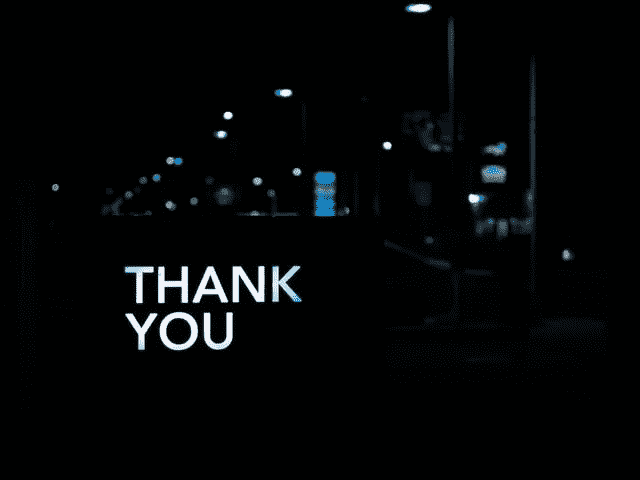

[皮特·佩德罗萨](https://unsplash.com/@peet818)在 [Unsplash](https://unsplash.com/) 上的照片

# 结论

在本教程中，首先我们分别实现了每个函数:sigmoid()、propagate()、optimize()、…然后构建 Cat 分类器模型。最后，我们使用 streamlit 库构建了一个交互式猫图像分类应用程序。

我希望你喜欢从本教程中学习！

如果您在本教程中遇到任何问题或有任何疑问，请随时联系我们！

Gmail:jalalmansoori19@gmail.com
Twitter:[https://twitter.com/JalalMansoori19](https://twitter.com/JalalMansoori19)LinkedIn:[https://www.linkedin.com/in/jalal-mansoori-44584a177/](https://www.linkedin.com/in/jalal-mansoori-44584a177/)Github:[https://github.com/jalalmansoori19](https://github.com/jalalmansoori19)

# 参考

1.  通过 Coursera 提供的 deeplearning.ai 专业化的神经网络和深度学习课程，
    [https://www . Coursera . org/learn/neural-Networks-Deep-Learning](https://www.coursera.org/learn/neural-networks-deep-learning)
2.  揭秘深度卷积神经网络， [https://www.cs.ryerson.ca/~aharley/neural-networks/](https://www.cs.ryerson.ca/~aharley/neural-networks/)
3.  deepai.org，什么是神经网络，
    [https://deepai . org/machine-learning-glossary-and-terms/Neural-network](https://deepai.org/machine-learning-glossary-and-terms/neural-network)
4.  机器学习的特征缩放:了解规范化与标准化的区别，
    [https://www . analyticsvidhya . com/blog/2020/04/feature-Scaling-Machine-Learning-Normalization-Standardization/](https://www.analyticsvidhya.com/blog/2020/04/feature-scaling-machine-learning-normalization-standardization/)