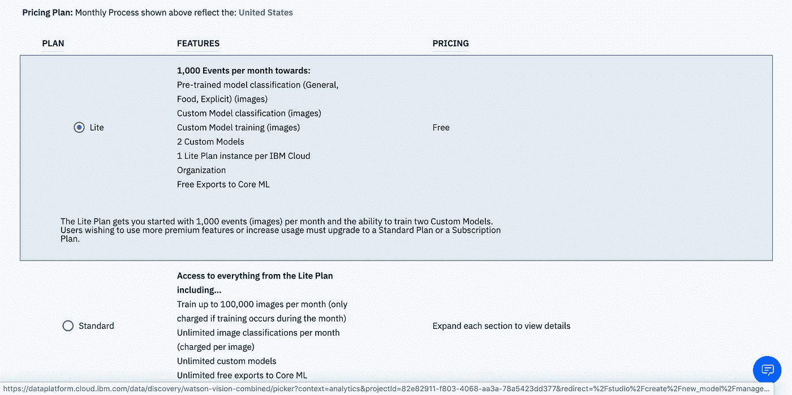

# 如何使用 IBM Watson NLC 服务构建图像分类器

> 原文：<https://towardsdatascience.com/how-to-build-an-image-classifier-using-watson-autoai-ab1ffda25bab?source=collection_archive---------45----------------------->

## 建立一个没有编码的图像分类模型

图片由 [ipet photo](https://unsplash.com/@ipet_photo) — Unsplash 提供

## 图像分类

图像分类是计算机视觉中的任务之一，其目标是根据图像的内容对图像进行分类。例如，给定下图，预期输出是“*狗”*(例如，如果训练数据集是针对狗和猫的)。

由[贾斯汀·维内玛](https://unsplash.com/@justinveenema)拍摄的图片——Unsplash

## 让我们建立分类器

我们将使用包含来自世界各地的 120 种狗的图片的斯坦福狗数据集。

首先，转到 Watson AutoAI 并创建一个项目。

单击项目名称，您应该会被定向到项目主页。点击*“添加到项目”*

然后选择*【视觉识别模式】*

如果是第一次，您需要创建一个服务。点击*【此处】*

选择一个符合你需求的计划。

您可以选择更改区域、计划、资源组等。我更喜欢默认设置。

点击*“分类图像”*创建分类模型

这是构建模型的主页。单击右侧的“浏览”上传数据集(zip 文件，其中文件夹的名称是类名)。

我上传了三个数据集(澳洲野狗、大丹犬和西伯利亚哈士奇)，每个数据集有 50 张图片。

单击“训练”开始训练模型。

培训完成后，您将收到通知。单击“此处”可重定向至项目概述。

将提供关于该模型的信息列表。

点击“测试”来推断模型。上传一张图片，模型会预测该图片的类别。您可以从左侧选择显示的类别及其可信度。

最后，单击“Implementation ”,您将获得远程推断模型的 API。

资源

*   [IBM Watson AutoAI 文档](https://dataplatform.cloud.ibm.com/docs/content/wsj/analyze-data/autoai-overview.html)
*   [Youtube 上的 IBM Watson 学习中心](https://www.youtube.com/watch?v=DBRGlAHdj48&list=PLzpeuWUENMK3u3j_hffhNZX3-Jkht3N6V&index=1)
*   [斯坦福狗数据集](http://vision.stanford.edu/aditya86/ImageNetDogs/)