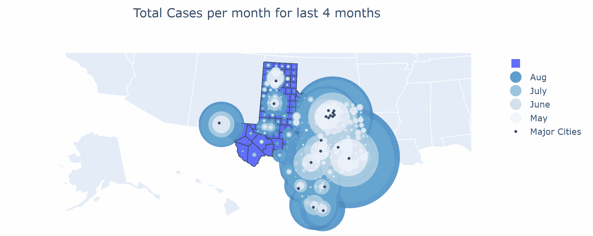
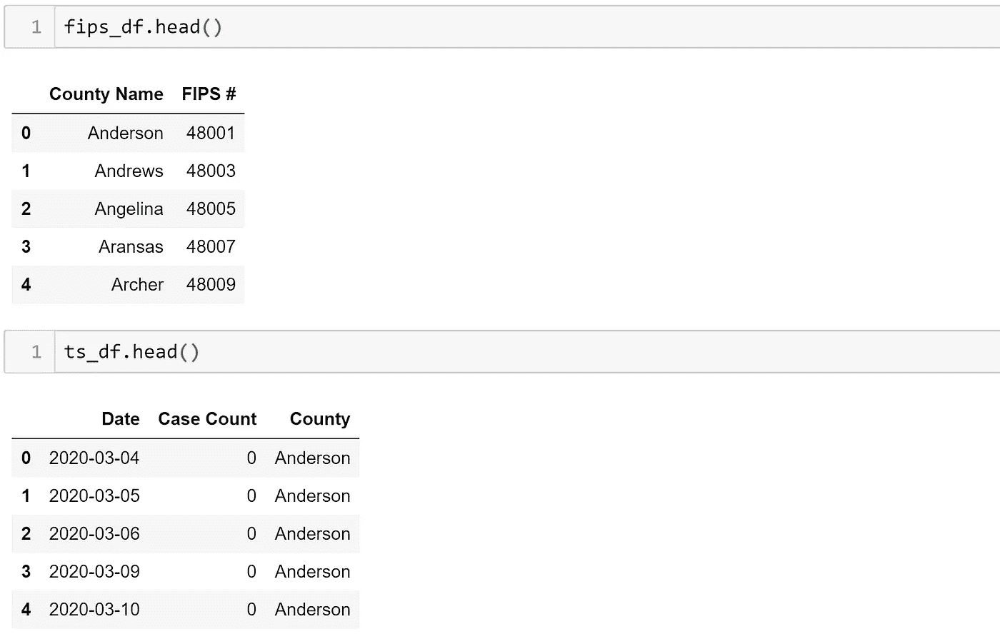
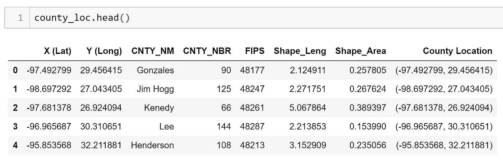
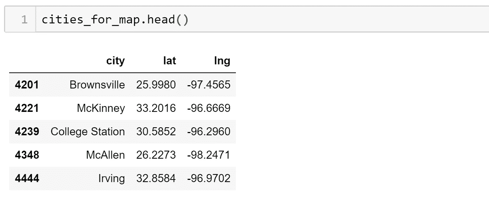
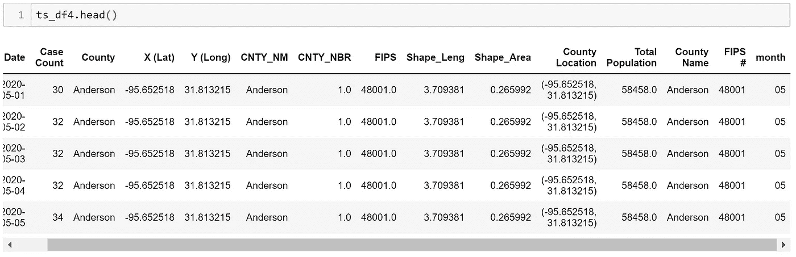
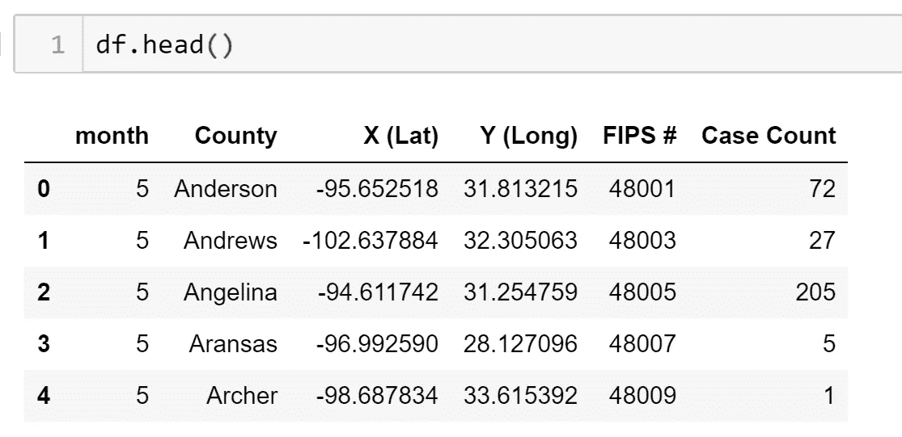
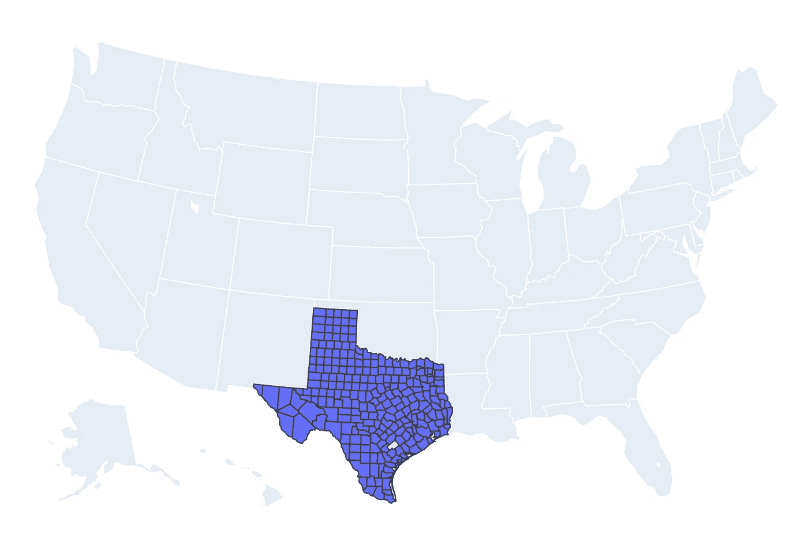
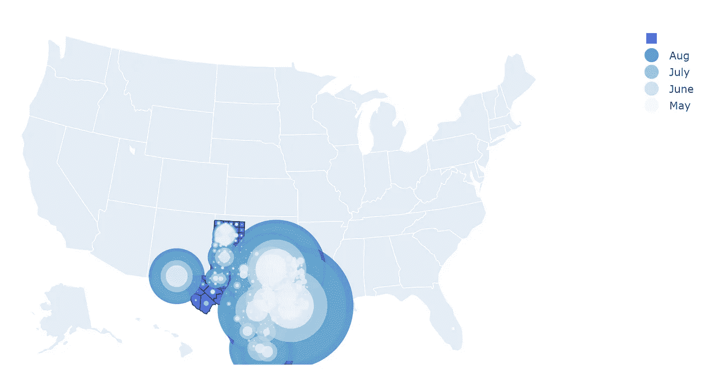
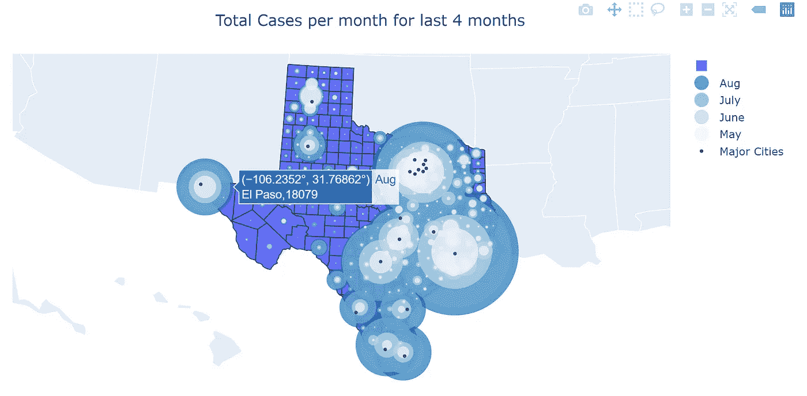

# 如何:使用 Plotly 构建身临其境的地理气泡图

> 原文：<https://towardsdatascience.com/how-to-build-an-immersive-geo-bubble-map-with-plotly-bb20eb70414f?source=collection_archive---------24----------------------->



gif 由你真诚地

在本教程中，我将使用 Plotly 创建得克萨斯州新冠肺炎案例的县级地理气泡图。以上 gif 中的情节可以在我的[网站](http://tsbloxsom.pythonanywhere.com/)底部找到。我的网站最好用笔记本电脑而不是移动设备访问。我还制作了另一个教程，讲述我如何使用 dash [在这里](/creating-and-automating-an-interactive-dashboard-using-python-5d9dfa170206)创建另一个交互式 plotly 图形和网站。我用来创建这张地图的所有代码和数据都可以在我的 [Github](https://github.com/tsbloxsom/Texas-census-county-data-project/tree/master/county%20map%20notebooks%20and%20data) 上找到。[。ipynb](https://github.com/tsbloxsom/Texas-census-county-data-project/blob/master/county%20map%20notebooks%20and%20data/medium_tutorial_for_geo_map.ipynb) 文件包含了所有的代码和图形，但是您必须拥有所有的。csv 和。下载 xlsx 文件，自行创建图形以及相关的 plotly 库。我将假设你有一些关于 python、熊猫和 plotly 的知识。让我们回顾一下我创建这张漂亮地图的步骤:

1.  加载数据并用熊猫清理数据
2.  将相关数据框合并在一起并清理
3.  用 groupby()格式化要输入到 plotly 图形中的数据
4.  使用 plotly.express.chorograph()和 plotly.graph_objects 创建图形。散点图()

关于代码片段需要注意的一点是，在运行代码之前，您可能需要更改数据文件所在的目录。好了，我们开始吧！

1.  **加载数据，并使用熊猫清理数据**

```
import pandas as pd
import plotly.express as px
from urllib.request import urlopen
import json
import plotly.graph_objects as go# read in data
fips_data = pd.read_excel("PHR_MSA_County_masterlist.xlsx", dtype={'FIPS #': str}) #need this to plot counties on map, source: [https://www.dshs.texas.gov/chs/info/info_txco.shtm](https://www.dshs.texas.gov/chs/info/info_txco.shtm)
fips_df = fips_data[["County Name", "FIPS #"]]#add 48 to end of each county fips so it can be input into plotly to geo graph data
def add_48(s):
    return "48" + str(s)
fips_df["FIPS #"] = fips_df["FIPS #"].map(add_48)cities_df = pd.read_csv("uscities.csv") #need for plotting texas cities, source: [https://simplemaps.com/data/us-cities](https://simplemaps.com/data/us-cities)# for plotting major texas cities
mask = cities_df["state_id"] == "TX"
texas_cities = cities_df[mask]
mask2 = texas_cities["population"] > 200000
big_texas_cities = texas_cities[mask2]
cities_for_map = big_texas_cities[["city", "lat", "lng"]]# load in additional data with long and lat of each county as well as covid-19 case counts for new bubble graph
ts_df = pd.read_csv("time_series_plotly.csv").drop("Unnamed: 0", axis = 1) # I created this data from a previous medium post
county_loc = pd.read_csv("Texas_Counties_Centroid_Map.csv") #source: [https://data.texas.gov/dataset/Texas-Counties-Centroid-Map/ups3-9e8m/data](https://data.texas.gov/dataset/Texas-Counties-Centroid-Map/ups3-9e8m/data)
```

第 1 步非常简单明了，但如果能看到我加载的所有 4 个数据框是什么样子就更好了。



真实的你的形象



真实的你的形象



真实的你的形象

fips_df 仅包含德克萨斯州每个县的所有 fips 代码，可以使用 plotly 绘制每个县的图形。ts_df 是一个长格式的数据帧，包含自 3 月以来每个县每天的所有新冠肺炎病例计数。county_loc 具有每个县的经度和纬度，但是它们是颠倒的:Y (Long)列具有纬度而不是县的经度，这在绘图时很容易解决。city _ for _ map 具有德克萨斯州人口超过 200，000 的城市的经度和纬度数据。

**2。将相关数据帧合并在一起并清理**

```
#merge covid-19 case counts with county longitude and latitude data
ts_df2 = ts_df.merge(county_loc, how = "left", left_on = "County", right_on = "CNTY_NM")#merge above df with fips data
ts_df3 = ts_df2.merge(fips_df,how = "left", left_on = "County", right_on = "County Name")
def extract_month(s):
    return s[5:7]
ts_df3["month"] = ts_df3["Date"].map(extract_month)# only extract last 4 months of data
mask = ts_df3["month"].astype(int) > 4
ts_df4 = ts_df3[mask]
```

关于上面的代码，需要注意一些事情:

1.  我使用县名作为主键/外键来合并所有三个数据框
2.  我也不必合并 fips_df，但是在使用 county_loc 数据框 fips 列来绘制图表时遇到了问题。
3.  我将只使用最近 4 个月的数据，因为这是最重要的



真实的你的形象

因此，现在数据中每天都有一行，得克萨斯州每个县在过去 4 个月都有新冠肺炎病例计数。

**3。用 groupby()** 格式化要输入到 plotly 图形中的数据

```
df = (ts_df4.groupby(["month", "County", "X (Lat)", "Y (Long)", "FIPS #"])["Case Count"].max()).reset_index()df["month"] = df["month"].astype(int)
```

好了，这就是事情变得有点复杂的地方。我需要按月、县、经度、纬度和 FIPS 分组，然后获得最大案例数。这将为我提供一个数据框，其中包含每个县每个月的总病例数。数据框如下所示。



真实的你的形象

**4。使用 plotly.express.chorograph()和 plotly.graph_objects 创建图形。散射地理()**

这个图表的绘制需要大量的编码和理解，所以我将分块进行。

```
with urlopen('[https://raw.githubusercontent.com/plotly/datasets/master/geojson-counties-fips.json'](https://raw.githubusercontent.com/plotly/datasets/master/geojson-counties-fips.json')) as response:
    counties = json.load(response)fig = px.choropleth(df, geojson=counties, locations='FIPS #',
                           hover_name = "County",
                           scope = "usa",
                           title = "Total Cases"
                          )
```

首先，我们将从绘制德克萨斯州所有县地图的基础数据开始。为此，我们使用 plotly.express.chorograph()函数并输入我们刚刚创建的数据框。然后指定我们希望使用 geojson 库来映射使用 df 中的 FIPS #列的县。Plotly 有关于这个[的很棒的文档。如果我们只是用 fig.show()绘制它，它看起来会像下面的图像。](https://plotly.com/python/choropleth-maps/)



```
colors = ['rgb(189,215,231)','rgb(107,174,214)','rgb(33,113,181)','rgb(239,243,255)']
months = {5: 'May', 6:'June',7:'July',8:'Aug'} #plot the bubble cases for each month and each county
for i in range(5,9)[::-1]:
    mask = df["month"] == i
    df_month = df[mask]
    #print(df_month)
    fig.add_trace(go.Scattergeo(
            locationmode = 'USA-states',
            lon = df_month['X (Lat)'],
            lat = df_month['Y (Long)'],
            text = df_month[['County','Case Count']],
            name = months[i],
            mode = 'markers',
            marker = dict(
                size = df_month['Case Count'],
                color = colors[i-6],
                line_width = 0,
                sizeref = 9,
                sizemode = "area",
                reversescale = True
            )))
```

好了，最难的部分来了。首先，我们创建一个颜色列表，其中包含每个月要使用的颜色。我们还为图表的图例创建了一个月份字典。

接下来是 for 循环，每个月循环 4 次。对于每个月，它使用 plotly.graph_objects 根据位置为每个县绘制一个气泡图。Scattergeo()函数。您会注意到 lon 和 lat 变量被交换了，但那是因为我导入的数据有这个问题。我使用变量 sizeref 来归一化气泡点，因为有些县的案例数非常大，如果不进行归一化，这些案例数将在地图上占主导地位。Plotly 建议使用 sizeref:

```
sizeref = 2\. * max(array of size values) / (desired maximum marker size ** 2)
```

但是我发现这个函数并不好用，他们甚至没有在他们的文档示例中使用它。我发现 9 最适合我，但数字非常敏感，我尝试了 0-10 的范围，在选择 9 之前，许多数字使图不可读。以下是当前形式的图:



真实的你的形象

所以我们离最终产品越来越近了，但是我们还需要一些东西。

```
# to show texas cities on map
fig.add_trace(go.Scattergeo(
    locationmode = 'USA-states',
    lon = cities_for_map['lng'],
    lat = cities_for_map['lat'],
    hoverinfo = 'text',
    text = cities_for_map['city'],
    name = "Major Cities",
    mode = 'markers',
    marker = dict(
        size = 4,
        color = 'rgb(102,102,102)',
        line = dict(
            width = 3,
            color = 'rgba(68, 68, 68, 0)'
        )
    )))fig.update_geos(fitbounds="locations")
fig.update_layout(title_text='Total Cases per month for last 4 months', title_x=0.5)
fig.show()
```

在上面的代码块中，我们使用经度/纬度数据和 plotly.graph_objects 绘制了德克萨斯州的主要城市。Scattergeo()函数，但没有 for 循环。然后我们更新图表的方向，这样德克萨斯州就很好地适合图表的框架。然后我们更新图表的标题并使其居中。最后，我们可以可视化它的完整形式！



感谢阅读并可能跟随我的教程！如果你想在 medium 或 LinkedIn 上关注我，请随意。我也一直在寻找对我的帖子和编码的反馈，所以如果你有任何给我，我会非常感谢。