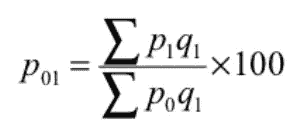

# 如何建立一个强大的商业指数？

> 原文：<https://towardsdatascience.com/how-to-build-an-index-452f5018d5aa?source=collection_archive---------19----------------------->

## 经济学

## 避免阅读中最常见的陷阱

指数是全球和特定国家经济的有力指标。政府和商人大量使用它们来制定经济政策、完善对外贸易和衡量货币价值的变化。

指数旨在反映一个变量(或一组变量)在时间或地理位置等方面的变化。这就是为什么它们通常被用来比较某一天某一现象的水平与前一天**或**同一天不同地方某一现象的水平。

*ex。将 2020 年 3 月的石油价格与 2019 年 3 月的价格相比较作为基准年。*

那么，为什么索引如此重要呢？他们的主要功能是提供一个基准来衡量你的业绩/投资组合或其他人的选股。这通常被称为“基准”。

照片由[亚当·诺瓦克斯基](https://unsplash.com/@adamaszczos?utm_source=medium&utm_medium=referral)在 [Unsplash](https://unsplash.com?utm_source=medium&utm_medium=referral) 上拍摄

# 如何构建它们？

*让我们举一个例子:考虑到 2020 年新冠肺炎的情况，您预计汽车的使用率会比往年有所下降。你想建立一个反映这些变化的指数。*

**1-时间基线的选择**

建立指数的第一步是选择一个合适的年份作为基线。

> **基线**是一个已知值，可以用来比较以后的测量和性能。

基线应该反映“常规和常规”条件。换句话说，它应该没有像战争、饥荒、洪水、政治不稳定……新冠肺炎这样的异常情况！

基准年有两种选择方式:
(a) [**固定基准法**](https://www.emathzone.com/tutorials/basic-statistics/fixed-base-method.html) 基准年不变
(b) [**链基法**](https://www.emathzone.com/tutorials/basic-statistics/chain-base-method.html) 基准年不断变化

来源:[丹亚尔·艾哈迈德](https://www.slideshare.net/DanyalAhmad10/index-number-79783201)

在该示例中，2007 年的基准年将是 2006 年，2006 年的基准年将是 2005 年，依此类推。

在选择基准年时要特别小心，因为所有的结果都取决于此。从对数据的探索性分析开始并回顾过去是一个好主意。寻找趋势和模式，因为它们包含了你正在寻找的常规和常规条件。避免出现太多异常值或极端“事件”的年份，因为它们可能无法反映正常情况。

**2-变量选择**

建立索引的第二步是选择变量。仅应选择代表性变量 ***，注意指数的用途和类型。*** 代表变量应该是:

> -可识别，
> -随着时间的推移质量稳定，
> -数量相当大，
> -最后反映您想要衡量变化的习惯、习俗或功能。

*(来源:*[Gab Pili](https://unsplash.com/@gabpili?utm_source=medium&utm_medium=referral)on[Unsplash](https://unsplash.com?utm_source=medium&utm_medium=referral))

*在我们的例子中，我们可以使用燃料消耗量或发动机总小时数作为汽车利用率的代表变量*

**3-平均值的选择**

由于指数是一个特殊的平均数，选择一个合适的平均数是建立一个准确指数的重要一步。

> 平均值有多种类型，如算术平均值、调和平均值、几何平均值、平均值、中间值、众数。

数据分布对不同平均方法的影响的可视化(来源: [Minitab 博客)](https://blog.minitab.com/blog/quality-business/common-assumptions-about-data-part-2-normality-and-equal-variance)

显然，根据数据的分布，它们很可能产生不同的结果。 ***因此，非常谨慎地选择方法*** 至关重要。从理论上讲，几何平均值最适合这个目的。但是，在实践中，算术平均值是最常用的，因为它最容易遵循和理解。一般将算术方法与基于链的方法相结合，使索引更加一致。

**4-重量的选择**

大多数情况下，指数构建中包含的变量并不具有同等的重要性。因此，应根据变量的相对重要性为其分配适当的权重。权重应该是无偏的，不能任意选取。使用了两个常用的加权指数:
- **基于每个变量价格的价格加权指数**。对于这个指数，价格最高的变量(股票)会比价格较低的变量对指数的走势产生更大的影响。
- **基于各变量数量的价值加权指数**。

最受欢迎的价格加权指数之一是道琼斯工业平均指数(DJIA)

*在我们的例子中，燃料消耗可以用汽车总数来加权。*

**5-方法选择**

选择合适的方法是建立索引的最后一步。有很多方法可以计算指数，所以让我们来看看这 3 种流行的方法。

> **简单聚合方法**

在这种方法中，指数等于目标年遵循的变量之和除以基准年的变量之和:

> 指数=[总和(目标年的变量值)/总和(基准年的变量值)] x 100

我们举这个例子来说明一下:

> **综合指数的简单平均值**

在这种方法中，指数等于综合指数的平均值:

> 指数=总和(综合指数)/变量计数

> **加权聚合方法**

前两种方法实现起来既简单又快速。但是他们没有考虑到每一项的相对重要性。每个项目在全局索引中具有相同的权重。但是如果公共汽车比卡车多得多呢？为什么卡车会对全球指数产生同样的影响？

在那种情况下，我们宁愿使用加权方法。这些方法允许根据项目的相对重要性分配不同的权重。已经开发了许多方程来根据数量权重估计指数。以下是一些最受欢迎的:

*   *拉斯派尔斯指数是以基准年(q0)的固定权重建立的。*

**

*来源:作者*

*   ****帕舍指数*** 以当年(q1)的固定权重构建。*

**

*来源:作者*

*   ****Dorbish 和 Bowley 指数*** 是上述两种方法的平均值，因此考虑了这两年的影响。使用算术平均值。*

**

*来源:作者*

*   ****费雪理想指数*** 也是拉佩尔指数和帕舍指数的平均值，但使用几何平均值。*

**

*来源:作者*

*因此，用同样的例子我们得到:*

**

*来源:作者*

# *选择哪个指数？*

*下表汇总了上述方法的结果和主要优缺点。*

**

*来源:作者*

*作为选择使用哪个指数的指导方针，确保:
——它反映了目标市场或细分市场的全面代表性；
-它响应不断变化的市场
-它反映数据质量、分布和随时间的变化(趋势、季节性、变化……)
-它的构建方式是透明和客观的；
-您可以根据您的可用计算时间和机器性能定期重新平衡并轻松维护它。*

# *结论*

*在评估一个指数的适当性时，分析师应该采取一种全面的方法，研究数据，以便建立一个适合其目标的指数，并尽可能地捕捉最大范围的趋势。*

*记住 4 个关键步骤:*

*   ***选择合适的基准年:**一切都取决于此。基线应能捕捉到您想要追踪的特征的季节性和所有常规事件。*
*   ***选择适当的变量**:确保变量反映了您想要测量的变化。*
*   ***选择权重参数和平均法:**很多时候我们分别挑数量和算术平均值。*
*   ***选择索引方法:**这一步取决于您的数据探索结果以及您必须对资源做出的妥协。*

**感谢阅读！如果你喜欢这篇文章，一定要按住按钮鼓掌支持我的写作。我总是愿意聊天和喝杯“虚拟”咖啡，所以来关注我的*[*Linkedin*](https://www.linkedin.com/in/aureliegiraud9000/)*。**

* [## 不要错过我接下来的文章！

### 不要错过我接下来的文章！我写了关于如何使用数据科学的文章——侧重于提供可操作的见解给…

agiraud.medium.com](https://agiraud.medium.com/subscribe)* 

***参考文献:***

* [## SQL Server 的性能基线和基准

### 进行数据库性能测试以建立基线测量和工作负载性能的能力…

www.sentryone.com](https://www.sentryone.com/white-papers/performance-baselines-and-benchmarks-for-microsoft-sql-server)  [## 价格、价值和未加权指数之间的差异

### 许多交易所交易基金(ETF)使用指数作为其基础基准，因此了解…

www.thebalance.com](https://www.thebalance.com/different-types-of-weighted-indexes-1214780)  [## 指数是如何加权的？

### 领先的基准、分析和数据解决方案全球提供商，具有多种资产能力

www.ftserussell.comom](https://www.ftserussell.com/education-center/how-are-indexes-weighted)  [## 指数:特征，公式，例子，类型，重要性和局限性

### 广告:在本文中，我们将讨论:- 1。索引号 2 的含义。索引号 3 的特征…

www.economicsdiscussion.net](http://www.economicsdiscussion.net/price/index-number/index-numbers-characteristics-formula-examples-types-importance-and-limitations/31211)*