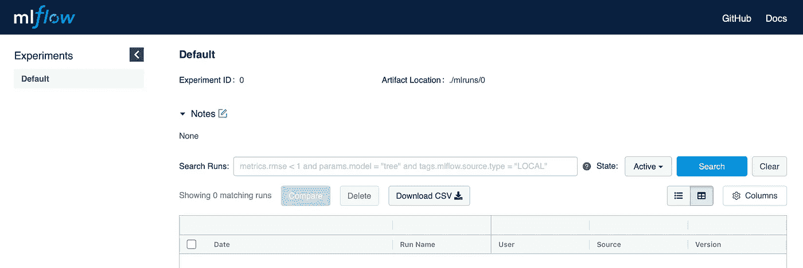
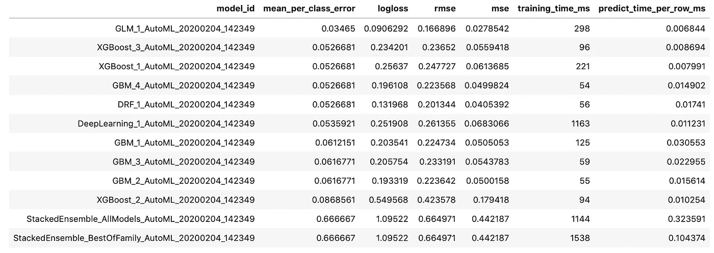
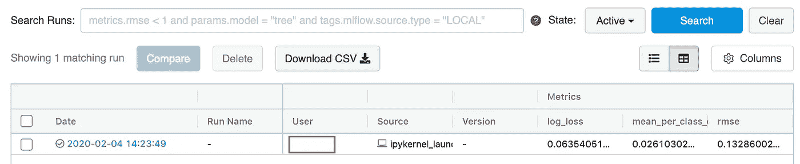

# 如何在 AutoML 和 MLFlow 之间建立集成

> 原文：<https://towardsdatascience.com/how-to-build-an-integration-between-automl-and-mlflow-6d66d4bdc4d1?source=collection_archive---------30----------------------->

## 一个关于如何自动运行 MLFlow 的追踪和 H2O 的 AutoML 的教程


unspash.com

在本文中，我们将回顾 AutoML 的概念，它如何提高您的生产力，以及如何跟踪它的性能指标。

我们将使用以下技术:

*   Python 3
*   [H2O 汽车](http://docs.h2o.ai/h2o/latest-stable/h2o-docs/automl.html)
*   [MLFlow](https://www.mlflow.org)

## 什么是 AutoML，我为什么要使用它？

顾名思义，它是自动化机器学习管道的过程。我们可以自动化过程的各个阶段，如数据准备、特征工程、模型选择和超参数选择。在本教程中，我们将主要关注模型选择。

使用这种方法有许多好处，例如:

*   通过提高数据科学家的工作效率来降低成本
*   减少他们必须做的重复性工作和无聊任务的数量
*   模型选择的性能可用作基准，并确定哪些模型最适合由数据科学家进一步研究

**什么是 MLFlow？**

MLFlow 是一个开源平台，用于在训练后监控和保存机器学习模型。它的伟大之处在于，它可以与 H2O 或 Spark 等其他框架集成，构建一个统一且易于使用的环境。

现在让我们深入到在实践中使用 AutoML 的步骤。

**TL；DR:代码存储在**[**Github**](https://github.com/BogdanCojocar/medium-articles/tree/master/mlflow-automl)**中。**

## **第一步:准备好环境**

要准备好环境，我们需要安装项目文件夹中的新依赖项:

```
pip install -r requirements.txt
```

我们还需要通过在终端中键入以下命令来启动 MLFlow 服务器:

```
mlflow ui
```

我们现在可以通过在浏览器中运行来查看 MlFlow ui 了`[http://127.0.0.1:5000](http://127.0.0.1:5000):`



现在我们应该能够可视化我们运行的所有实验(训练步骤)。我们还可以启动`Jupyter lab`笔记本，这是我们编写代码的环境:

```
jupyter lab
```

## **第二步:启动 AutoML 框架**

H2O 是一个分布式框架，为了在本地使用它，我们需要启动一个服务器。根据您的设置，这可能需要一分钟左右的时间:

```
h2o.init()
```

## **第三步:创建 MLFlow 实验**

MLFlow 使用实验的概念来跟踪机器学习模型的进展。

```
try:
    experiment = mlflow.create_experiment(experiment_name)
except:
    experiment = client.get_experiment_by_name(experiment_name)
mlflow.set_experiment(experiment_name)
```

如果已经创建了实验，我们就重用它。

## 第四步:进行培训

我们已经到了最有趣的部分，使用 auto ml 来做训练。使用数据的独立子集并行训练和验证多个模型(6 重交叉验证)。每次新的训练运行都会保存一些验证指标和表现最好的模型(leader)。

```
with mlflow.start_run():
    model = H2OAutoML(max_models=10, max_runtime_secs=300, seed=24, nfolds=6)
    model.train(x=x_cols, y=y_cols, training_frame=train, validation_frame=valid) mlflow.log_metric("rmse", model.leader.rmse())
    mlflow.log_metric("log_loss", model.leader.logloss())
    mlflow.log_metric("mean_per_class_error", model.leader.mean_per_class_error()) mlflow.h2o.log_model(model.leader, "model")

    lb = model.leaderboard
    lb = get_leaderboard(model, extra_columns='ALL')
    print(lb.head(rows=lb.nrows))
```

我们已经决定运行 10 个模型。使用`get_leaderboard`函数，我们可以看到已经运行了哪些机器学习算法:



训练被记录在 MLFlow 中，我们可以与未来的实验进行比较:



## 第五步:做预测

最后一步是和新当选的领导人一起实际做预测。出于本教程的目的，我们将只使用验证数据，但实际上我们需要使用新的数据。

```
all_mlflow_runs = client.list_run_infos(experiment.experiment_id)
if len(all_mlflow_runs) > 0:
    run_info = all_mlflow_runs[-1]
    model = mlflow.h2o.load_model("mlruns/{exp_id}/{run_id}/artifacts/model/".format(exp_id=experiment.experiment_id,run_id=run_info.run_uuid))
    result = model.predict(valid)
else:
    raise Exception('Run the training first')
```

我们再次使用 MLFlow 读取实验中的最新运行，并加载`GLM`模型。如果我们从来没有运行过训练，我们可以抛出一个异常来通知用户他必须先这样做。

我们已经看到，通过几个简单的步骤，我们可以实现模型选择、跟踪和加载/保存给定数据集的最佳机器学习模型的自动化过程。虽然在 Kaggle 这样的比赛中，我们可以看到人类仍然可以轻松击败 AutoML 框架，但我们仍然可以将它们作为我们数据科学工具包中的另一个工具，来提高和改善我们的性能。