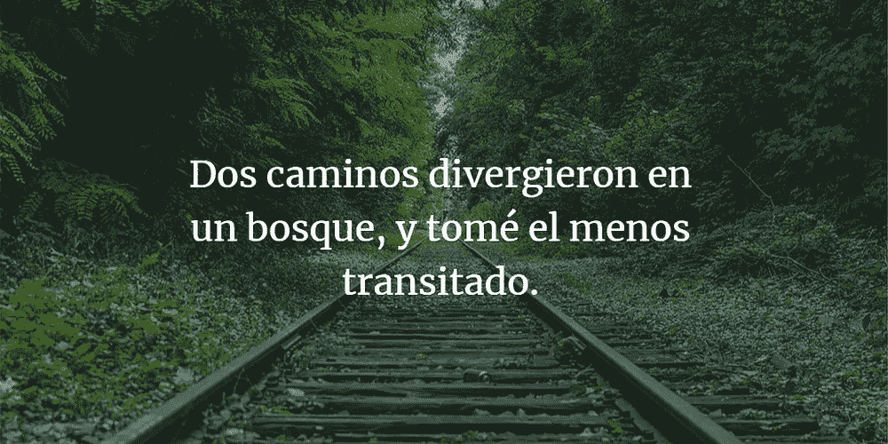
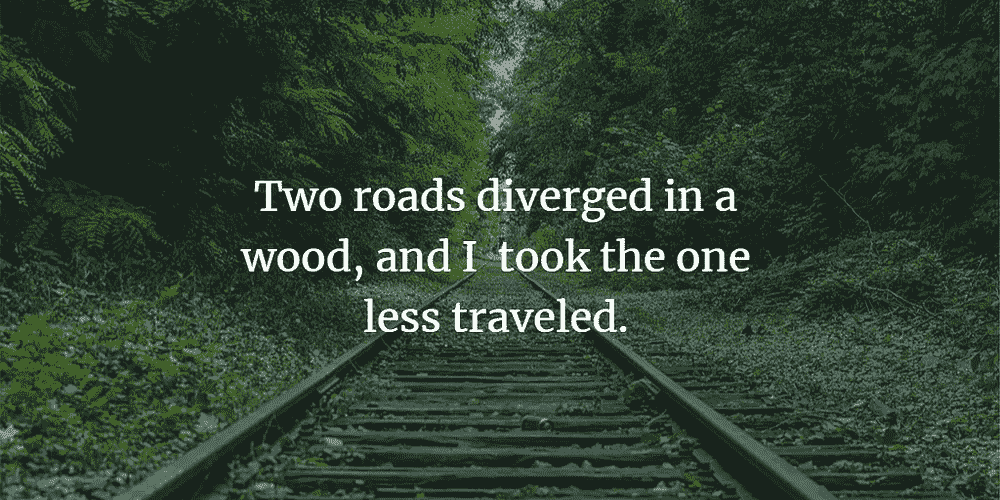
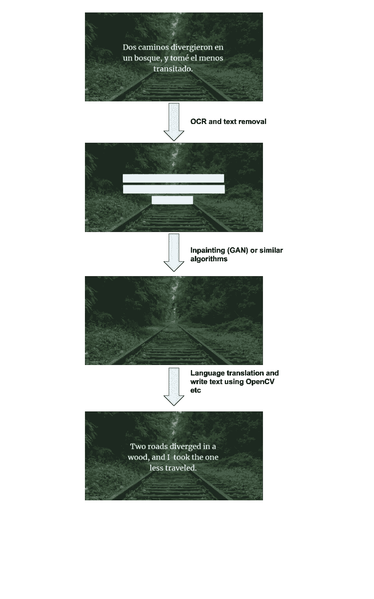

# 作为数据科学初学者如何建立在线投资组合？

> 原文：<https://towardsdatascience.com/how-to-build-an-online-portfolio-as-a-beginner-in-data-science-12b7a345a561?source=collection_archive---------13----------------------->

## 为数据科学家建立在线投资组合的技巧。

图片来自 [Pixabay](https://pixabay.com/) 并由 [AiArtist Chrome 插件](https://chrome.google.com/webstore/detail/aiartist/odfcplkplkaoehpnclejafhhodpmjjmk)风格化(由我构建)

作为一个数据科学的初学者，你很难凭借你的简历和大学项目在人群中脱颖而出。因此，越来越多的初级数据科学家有兴趣通过博客或 Youtube 视频建立在线投资组合，以便获得更多的关注。

但是作为一个初学者，如何为数据科学社区提供价值呢？他们能想到的每一个数据科学项目似乎都已经完成了，并且可以通过代码在线获得。还有，初学者通常没有任何繁重的计算资源来训练深度学习算法。

在这篇文章中，我们将看到一些增加价值和建立投资组合的方法，尽管我是数据科学的绝对初学者

## 1.像企业家一样思考

不要考虑一个项目，而是考虑一个产品。如果没有数据收集和培训，您能否将多种现有的预训练算法结合起来，构建一个满足需求的解决方案？

我们举个例子来理解这一点。如果你想到 GAN(生成对抗网络)的项目，网上有从生成人脸到生成动漫角色的项目。如果考虑光学字符识别(OCR)项目，有几个在线项目可以将 OCR 应用于法律、医疗、银行文档和提取文本。如果你想到一个语言翻译项目，那么有几个代码示例可以使用不同的序列到序列(seq2seq)技术进行训练，如 LSTM 的，transformers 等。

如果你正在考虑一个项目，那么你会遇到上述每个例子的障碍。相反，考虑一个产品。

你能建立一个图像转换器，将图像中的文本转换成不同的语言，并替换原始文本吗？例: [Word lens 被谷歌收购](https://www.youtube.com/watch?v=h2OfQdYrHRs)

你可以使用同样的技术来构建一个迷因或引语翻译器。或者您可以使用相同的技术将一种语言的演示幻灯片转换成另一种语言。

引自罗伯特·弗罗斯特，图片由西班牙语翻译成英语。

结合上面讨论的三种算法 OCR，图像修复(GAN)和翻译，我们可以创建一个如下的管道来获得最终的翻译图像。

管道结合了所有算法，如 OCR、GAN 和翻译。

这可能是一个展示你的技能组合的项目。它是用预训练的模型开发的，不像 GPU 那样使用任何繁重的计算资源来训练。到今天为止，我在网上找不到任何有同样代码的项目。也许你可以构建一个 chrome 插件来翻译迷因和引语的图片，这样也能获得人气。

如果你正在 NLP 中寻找一个类似的例子，看看我的[对或错问题生成](https://medium.com/swlh/practical-ai-automatically-generate-true-or-false-questions-from-any-content-with-openai-gpt2-9081ffe4d4c9)算法，它完全是使用预先训练的 GPT2、句子 BERT 和选区分析器模型构建的。

应用创新技术，你可以建立一个引人注目的项目组合，而无需训练 AI 算法，只停留在应用的 AI 层。

## 2.利用该领域的前沿进展

如果你是初学者，你会觉得很难跟上前沿研究。虽然这是真的，但对于初学者来说，也有一个增加价值的稳赚不赔的方法。

由于这项研究是新的，通常文档很差，并且当其他初学者遇到困难时，没有在线资源可供他们搜索。你可以很容易地为一个新图书馆写**入门**指南，或者为一篇新发表的论文写**研究总结**等等。您还可以将现有技术应用到新发布的算法中，并展示您的结果。

一些例子是-

斯坦福大学的 NLP 中有一个新的图书馆叫做 [Stanza](https://stanfordnlp.github.io/stanza/) 。因为这个库是新的，所以没有太多的资源来开始使用它。你可以探索图书馆，写一些初学者指南，获得在线流量。

**ii)** 在训练中，大量使用任何 NLP 分类算法，如情感分析或摘要、Glove 或 Word2vec 嵌入向量。如果一个新的单词/句子嵌入(例如:BERT)发布了，你可以用新的嵌入尝试相同的算法，并在线发布你的结果/表现。

## 3.微调或迁移学习

如果你的技能处于微调(NLP)或迁移学习(计算机视觉)的中级水平，那么你可以利用一些时间来收集和清理一个小数据集。然后，您可以使用数据集来微调预训练的 NLP 或计算机视觉模型，并将其用于更新的用例。

示例 1:您可以收集或创建一个真/假对数据集，并训练/微调任何序列以对 transformer 模型进行排序。

示例 2:您可以针对给定主题收集一些学生论文答案，并微调 BERT 模型来自动给论文评分。

如果你有时间收集数据并有一些计算资源，这些是你可以做的事情。

提示:有免费的计算资源来在线训练深度学习模型，如 Google Colab 和 [Paperspace](https://www.paperspace.com/) 。只要你的模型训练在几个小时内完成，你就可以利用这些。

## 4.核心培训或研究

如果你的技能属于这一类，那么你可以做以下事情来建立一个更深层次的专业知识组合。

1.  计算——要解决计算资源问题，您可以在网上找到开发者倡导者和社区构建者，并解释您正在做什么来获得一些计算积分。例如:AWS 的员工(开发者倡导者)围绕 AI/ML 建立开发者社区，他们利用 AWS Sagemaker 和其他 AI 服务。你可以在 LinkedIn 上找到他们，试试运气:)
2.  如果你对核心研究感兴趣，并对算法有更深的理解，那么就利用这一点来写关于给定主题的深度文章。**例:**写一写“文本摘要算法综述——过去现在和未来”。您可以讨论给定总结算法的优缺点，写下您认为该算法在未来将如何发展，等等。这显示了你对某一主题的理解，并帮助你作为该领域的专家建立一个稳固的投资组合。

祝人工智能探索愉快，如果你喜欢它的内容，请随时在[推特上找到我。](https://twitter.com/ramsri_goutham)

如果你想学习使用变形金刚的现代自然语言处理，看看我的课程[使用自然语言处理生成问题](https://www.udemy.com/course/question-generation-using-natural-language-processing/?referralCode=C8EA86A28F5398CBF763)