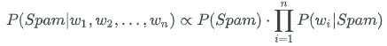
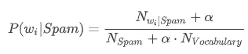
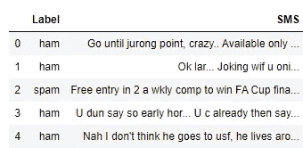
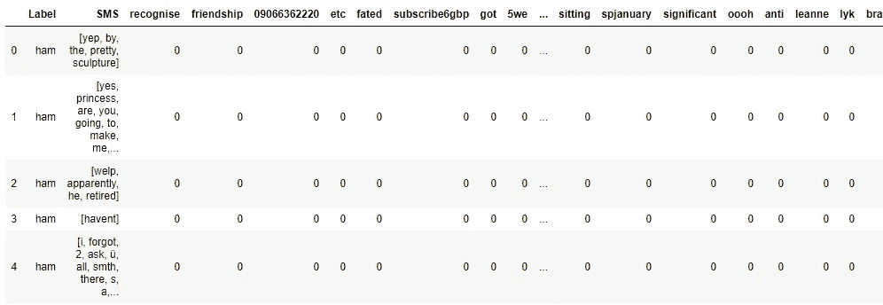
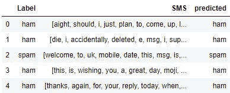
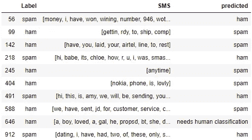

# 如何建立和应用朴素贝叶斯分类进行垃圾邮件过滤

> 原文：<https://towardsdatascience.com/how-to-build-and-apply-naive-bayes-classification-for-spam-filtering-2b8d3308501?source=collection_archive---------7----------------------->

## 数据科学模型

## 有效模型的简单实现


Mathyas Kurmann 在 [Unsplash](https://unsplash.com?utm_source=medium&utm_medium=referral) 上拍摄的照片

我相信，今天几乎每个人都有一部智能手机，很多人都留有一两封电子邮件。这意味着你必须熟悉大量的信息，包括大笔的钱、美妙的彩票中奖、精美的礼物和生活的秘密。我们每天都会收到几十条垃圾短信，除非你使用训练有素的过滤器。它们可能是有害的，只是令人讨厌或占用空间，但它们也可能包含病毒或钓鱼企图。无论如何，都不是我们要处理的内容。所以对好的垃圾邮件过滤器的需求总是很高。

让我告诉你(或者提醒你，如果你已经熟悉的话)一个非常有效的垃圾邮件过滤算法:朴素贝叶斯分类。虽然在 [scikit-learn 包](https://scikit-learn.org/stable/modules/naive_bayes.html)中已经有了实现，但我想从头开始重新创建算法。首先，我想揭示隐藏在实现背后的逻辑。其次，我想展示与数据集准备相关的算法。

# 1.一点理论

朴素贝叶斯分类是一种简单的概率算法，它基于这样一个事实，即模型的所有特征都是独立的。在垃圾邮件过滤器的上下文中，我们假设消息中的每个单词都独立于所有其他单词，并且我们在忽略上下文的情况下对它们进行计数。

我们的分类算法根据当前单词集的条件产生邮件是垃圾邮件还是非垃圾邮件的概率。概率的计算基于贝叶斯公式，并且公式的组成部分基于单词在整个消息集中的频率来计算。

那么，算法是如何工作的呢？

# 2.一点数学知识

首先，我们采用条件概率的贝叶斯公式，并将其应用于我们的任务:



包含单词(w1、w2、w3、…)的消息是垃圾邮件的概率与得到垃圾邮件的概率乘以消息中每个单词属于垃圾邮件消息的概率的乘积成比例。这是什么意思？对于邮件中的每个单词，我们计算它在垃圾邮件中被发现的概率。在我们的环境中:

*   P_spam —我们数据集中的垃圾邮件部分
*   P_wi_spam —在垃圾邮件中找到某个单词的概率。

根据同样的逻辑，我们定义:

*   P_not_spam —数据集中非垃圾邮件的一部分
*   P_wi_non_spam —单词在非垃圾邮件中出现的概率。

但是我们仍然不知道如何计算每个单词的概率。不过，我们有另一个公式:



我们这里有什么:

*   N_vocabulary —整个数据集中唯一单词的数量。
*   N_spam —垃圾邮件中的总字数。
*   N_wi_spam —一个单词在所有垃圾邮件中重复出现的次数。
*   Alpha —当消息中的某个单词在我们的数据集中不存在时的系数。

简而言之:一个单词属于垃圾邮件的概率是这个单词在我们的数据集的“垃圾邮件部分”中的出现频率。

同样，相同的公式(但是具有其他值)对于单词属于非垃圾邮件的概率是正确的。

数学已经结束，但是不要担心，我将显示数据集示例中的所有值和公式。

# 3.资料组

出于我们的目的，我们将使用 Tiago A. Almeida 和 José María Gómez Hidalgo 收集的短信。它是免费的，可以从 UCI 机器学习库下载。

数据集结构很简单。它包含两列——一列用于标签“spam/ham ”,另一列用于邮件文本。



它包含 5572 条不同消息的记录以及 747 条垃圾消息。

```
sms_data.groupby('Label').count()Out[6]:
ham 4825
spam 747
```

我们有足够的数据开始分析。

# 4.准备

在算法应用之前，我们需要准备数据。首先，我们将去掉标点符号。然后，我们将把所有的文本转换成小写字母，并把它分成独立的单词。

接下来的事情是将数据集拆分为训练和测试数据。但是我们还需要保持垃圾邮件和非垃圾邮件的分布。

最后，我们必须准备词汇，并计算每条信息中独立单词的数量。

将单词计数的结果表连接到我们的训练数据:



数据准备好了。

# 5.履行

我们将遵循上述公式并定义主要值:

*   邮件是垃圾邮件的概率

```
Pspam = train_data[‘Label’].value_counts()[‘spam’] / train_data.shape[0]
```

*   非垃圾邮件的概率

```
Pham = train_data[‘Label’].value_counts()[‘ham’] / train_data.shape[0]
```

*   垃圾邮件中的字数

```
Nspam = train_data.loc[train_data[‘Label’] == ‘spam’, 
                       ‘SMS’].apply(len).sum()
```

*   非垃圾邮件中的字数

```
Nham = train_data.loc[train_data[‘Label’] == ‘ham’,
                      ‘SMS’].apply(len).sum()
```

*   词汇量的大小

```
Nvoc = len(train_data.columns - 3)
```

*   设置 alpha = 1

# 6.结果呢

为了完成公式，我们将定义函数来确定给定单词属于垃圾邮件和非垃圾邮件的概率:

我们的分类功能:

函数应用后，我们在测试数据上看到了令人印象深刻的结果:99.1%的数据被成功分类。



出于兴趣，我们来看看未被正确识别的消息:



现在，您已经熟悉(或记忆犹新)了一种最有效的垃圾邮件分类算法。我希望它是有帮助的和描述性的。您可以在我的 GitHub 上找到带有工作示例的 Jupyter 笔记本:

[](https://github.com/Midvel/medium_jupyter_notes/blob/master/naive_bayes_filter/bayes-classificator.ipynb) [## 中级/中等 _jupyter_notes

### 此时您不能执行该操作。您已使用另一个标签页或窗口登录。您已在另一个选项卡中注销，或者…

github.com](https://github.com/Midvel/medium_jupyter_notes/blob/master/naive_bayes_filter/bayes-classificator.ipynb) 

欢迎您分享其他呼吁与垃圾邮件斗争的算法。