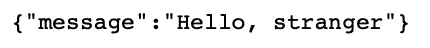
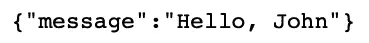
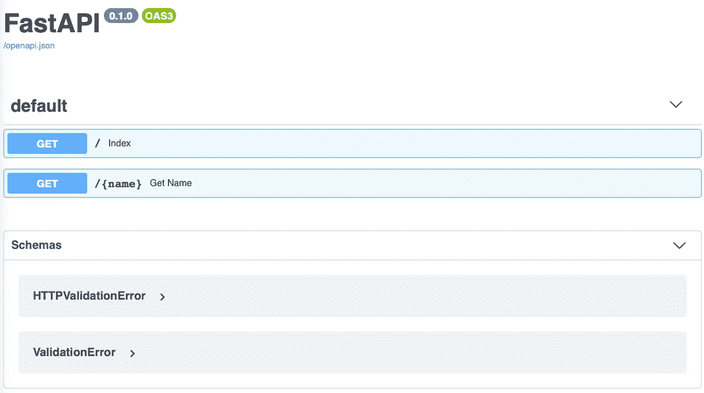
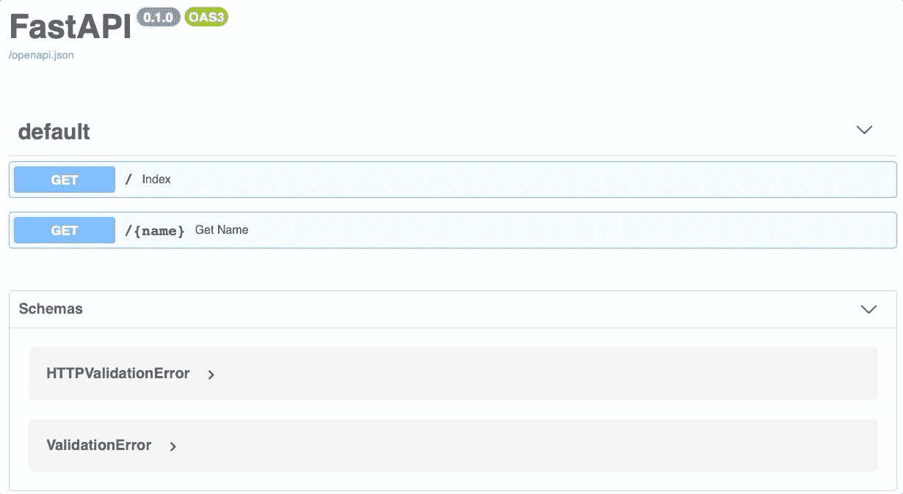
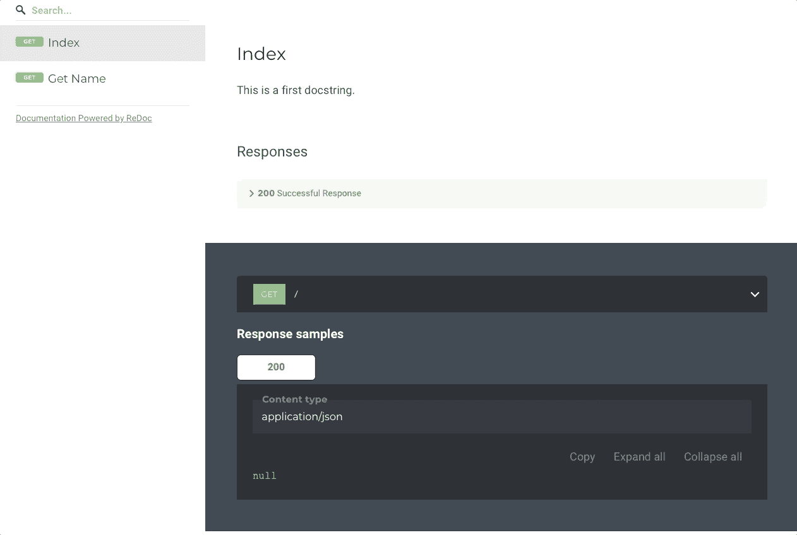
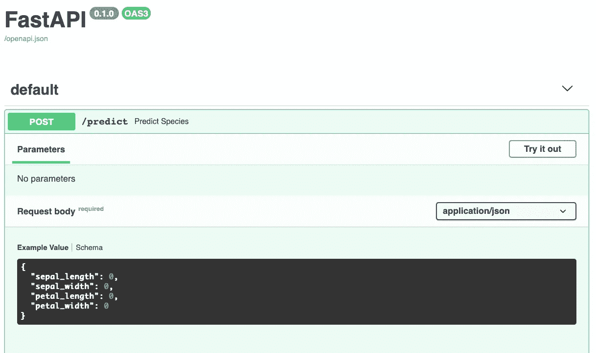
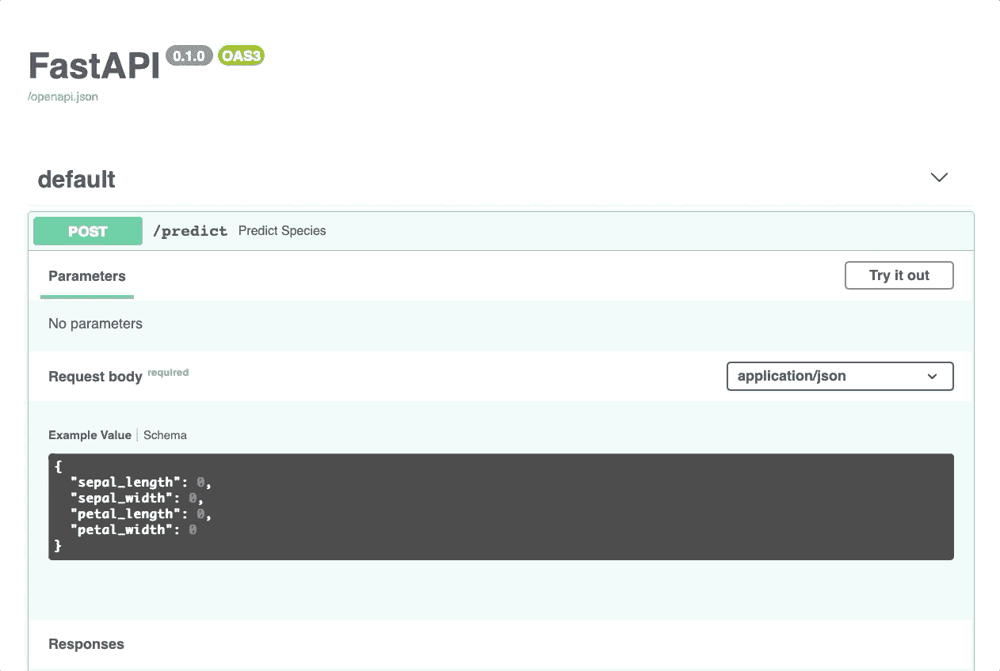
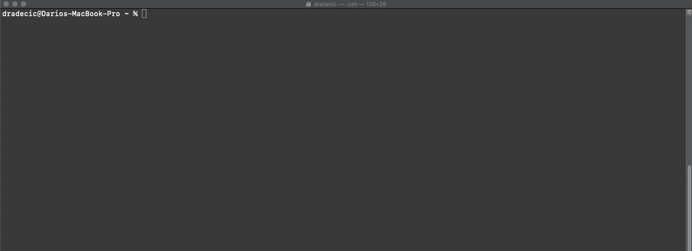

# 如何用 FastAPI 构建和部署机器学习模型

> 原文：<https://towardsdatascience.com/how-to-build-and-deploy-a-machine-learning-model-with-fastapi-64c505213857?source=collection_archive---------4----------------------->

## 保证在 10 分钟内部署您的第一个模型

建立机器学习模型只是其中的一部分。要在现实世界中发挥作用，用户和开发人员必须能够访问它。部署机器学习模型的最简单和最广泛使用的方法是将它们包装在 REST API 中。这正是我们今天要做的，用一个趋势库— *FastAPI* 。


在 [Unsplash](https://unsplash.com/s/photos/server?utm_source=unsplash&utm_medium=referral&utm_content=creditCopyText) 上[科普高清](https://unsplash.com/@scienceinhd?utm_source=unsplash&utm_medium=referral&utm_content=creditCopyText)照片

*那么，FastAPI 是什么？*根据[官方文档](https://fastapi.tiangolo.com/)，它是一个用 Python 3.6+构建 API 的现代快速 web 框架。就性能而言，它与 *NodeJS* 和 *Go* 在一起，这说明了一些问题。它也很容易学习，并带有自动交互文档，稍后会有更多介绍。

本文旨在涵盖足够多的库，以便从模型部署的角度帮助您入门。这不是一个明确的指南，因为这需要关于更高级主题的多篇文章，比如异步编程。阅读后，您将知道如何部署机器学习模型，并使用它从 Python、命令行或其他编程语言进行预测。

这篇文章的结构如下:

*   FastAPI 安装和构建第一个 API
*   交互式文档探索
*   训练机器学习模型
*   构建完整的 REST API
*   测试
*   结论

# FastAPI 安装和构建第一个 API

首先，你必须安装这个库和一个 ASGI 服务器——uvicon 和 Hypercorn 都可以。从终端执行这一行可以达到目的:

```
pip install fastapi uvicorn
```

现在，您可以为 API 创建一个文件夹，并在您喜欢的代码编辑器中打开它。要继续，创建一个名为`app.py`的 Python 脚本。您可以随意给自己的文件起不同的名字，但是在整篇文章中我将把这个文件称为`app.py`。

下面是为了创建一个具有两个端点的简单 API 而必须做的事情的列表:

1.  导入库——包括 *FastAPI* 和*uvicon*
2.  创建 FastAPI 类的实例
3.  声明第一个路由—在索引页面上返回一个简单的 JSON 对象(http://127.0.0.1:8000 —这是在步骤 5 中配置的)
4.  声明第二条路线——返回一个包含个性化消息的简单 JSON 对象。name 参数直接来自 URL(例如[http://127 . 0 . 0 . 1:8000/John](http://127.0.0.1:8000/John)
5.  用*uv icon*运行 API

以下代码片段演示了如何实现这五个步骤:

就是这样！现在让我们运行我们的 API。为此，在`app.py`所在的位置打开一个终端窗口。现在键入以下内容:

```
uvicorn app:app --reload
```

并点击*进入*。在继续之前，让我们揭开这个说法的神秘面纱。第一个 *app* 指的是你的 Python 文件的名字，不带扩展名。第二个*应用*必须与您命名 FastAPI 实例的方式相同(参见上面列表中的步骤 2 或代码片段中的注释 2)。- *reload* 表示您希望 API 在您保存文件时自动刷新，而无需重新启动整个文件。

现在打开您选择的浏览器并转到[http://127 . 0 . 0 . 1:8000](http://127.0.0.1:8000)—您应该会看到以下输出:



作者图片

第一个端点按照广告的方式工作。现在让我们检查另一个。转到以下 URL:[http://127 . 0 . 0 . 1:8000/John](http://127.0.0.1:8000/John)—应该会出现以下消息:



作者图片

你可以输入任何一个名字来代替约翰，一切仍然可以工作。

现在你知道如何用 FastAPI 创建一个简单的 API 了——在进入机器学习之前，让我们看看还包括什么。暂时不要关闭终端窗口。

# 交互式文档探索

下面是使 FastAPI 成为 API 库之王的一个(或两个)特性——内置的交互式文档。我的意思是。打开下面的 URL:[http://127 . 0 . 0 . 1:8000/docs](http://127.0.0.1:8000/docs)—您会立即看到您的 API 的文档页面！它应该是这样的:



作者图片

您可以单击任何一个端点来进一步探索它，甚至执行实时的浏览器内测试。方法如下:


作者图片

这不是很神奇吗？您也可以使用这个文档页面来记录您的 API 端点。这是通过将文档字符串放在函数声明的正下方来实现的。以下代码片段演示了如何操作:

您的 API 文档现在看起来像这样:



作者图片

如果你不喜欢 *Swagger UI* (到目前为止你所看到的)的外观和感觉，还有另一个内置选项。要进行探索，请打开以下 URL:[http://127 . 0 . 0 . 1:8000/redoc](http://127.0.0.1:8000/redoc)—将会出现此页面:



作者图片

现在您知道了如何构建和研究 API 文档。接下来让我们关注一个机器学习 API。

# 训练机器学习模型

这篇文章越来越长，所以我们不要在这部分浪费时间。我们将训练一个简单的模型，不需要任何数据准备和探索。这些不是今天主题的核心，也与模型部署无关。基于 Iris 数据集部署模型的过程与基于神经网络的过程相同。

我们就这么做——下载[虹膜数据集](https://raw.githubusercontent.com/uiuc-cse/data-fa14/gh-pages/data/iris.csv)并训练模型。嗯，没那么容易。首先，创建名为`Model.py`的文件。在其中，您将执行以下步骤:

1.  imports——您需要`pandas`、`scikit-learn`中的`RandomForecastClassifier`、`pydantic`中的`BaseModel`(您将在下一步中看到原因)，以及【T6——用于保存和加载模型
2.  声明一个继承自`BaseModel`的类`IrisSpecies`。该类仅包含用于预测单一花卉种类的字段(下一节将详细介绍)
3.  声明一个类`IrisModel`-用于模型训练和进行预测
4.  在`IrisModel`内部，声明一个名为`_train_model`的方法。它用于通过随机森林算法执行模型训练。该方法返回训练好的模型
5.  在`IrisModel`内部，声明一个名为`predict_species`的方法。它用于根据 4 个输入参数(花朵测量)进行预测。该方法返回预测值(花卉种类)和预测概率
6.  在`IrisModel`内部，修改构造函数，这样它会加载 Iris 数据集，如果文件夹中不存在该数据集，则会训练该模型。这解决了每次训练新模型的问题。`joblib`库用于保存和加载模型。

下面是完整的代码:

这需要编写相当多的代码，但是我希望上面的列表和注释能让它容易理解。现在让我们基于这个模型创建一个 REST API，并公开它的预测功能。

# 构建完整的 REST API

让我们回到`app.py`文件并删除所有内容。我们应该从一个空白文件重新开始，尽管样板文件将或多或少与您之前的文件相同。

这一次，您将只声明一个端点，用于预测花卉种类。这个端点通过调用前面部分声明的`IrisModel.predict_species()`方法来执行预测。另一个显著的变化是请求类型。POST 是机器学习 API 所需要的，因为用 JSON 而不是 URL 发送参数被认为是更好的做法。

如果你是一名数据科学家，上面这段话可能听起来像是胡言乱语，但没关系。构建和部署模型不需要精通 REST APIs 和 HTTP 请求。

`app.py`的待办事项列表很短:

1.  导入——您将需要前面编写的`Model.py`文件中的`uvicorn`、`FastAPI`、`IrisModel`和`IrisSpecies`
2.  制作`FastAPI`和`IrisModel`的实例
3.  声明一个用于进行预测的函数，位于`http://127.0.0.1:8000/predict`。该函数接受一个类型为`IrisSpecies`的对象，将其转换为一个字典，并将其传递给`IrisModel.predict_species()`方法。返回预测类别和预测概率
4.  使用`uvicorn`运行 API

同样，这里是这个文件的完整代码和注释:

这就是你要做的。让我们在下一节测试 API。

# 测试

要运行 API，再次在终端中输入以下文本:

```
uvicorn app:app --reload
```

文档页面如下所示:



作者图片

同样，我们可以直接在浏览器中测试 API:



作者图片

这难道不会使测试变得容易吗？您可以从终端执行同样的操作:



作者图片

或者甚至通过任何编程语言(Python 示例):

今天到此为止。让我们在下一部分总结一下。

# 离别赠言

今天，您已经通过一个玩具 API 示例和一个玩具机器学习示例了解了什么是 FastAPI 以及如何使用它。此外，您还学习了如何为您的 API 编写和研究文档，以及如何测试它。对于一篇文章来说，这已经很多了，所以如果需要几篇阅读才能完全消化，不要沮丧。

FastAPI 还有更多的内容要介绍，比如它的异步功能，但这是另一天的主题。

*你对 FastAPI 有什么看法？比起烧瓶你更喜欢它吗，为什么？*在评论区告诉我。

[**加入我的私人邮件列表，获取更多有用的见解。**](https://mailchi.mp/46a3d2989d9b/bdssubscribe)

*喜欢这篇文章吗？成为* [*中等会员*](https://medium.com/@radecicdario/membership) *继续无限制学习。如果你使用下面的链接，我会收到你的一部分会员费，不需要你额外付费。*

[](https://medium.com/@radecicdario/membership) [## 通过我的推荐链接加入 Medium-Dario rade ci

### 作为一个媒体会员，你的会员费的一部分会给你阅读的作家，你可以完全接触到每一个故事…

medium.com](https://medium.com/@radecicdario/membership) 

*原载于 2020 年 10 月 28 日 https://betterdatascience.com*[](https://betterdatascience.com/deploy-a-machine-learning-model-with-fastapi/)**。**