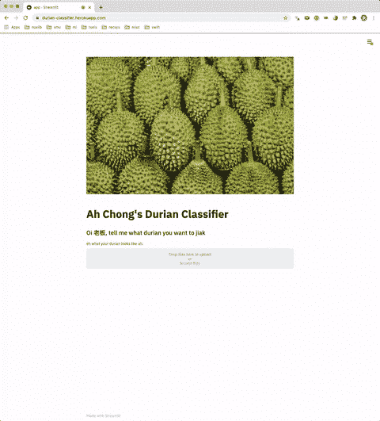
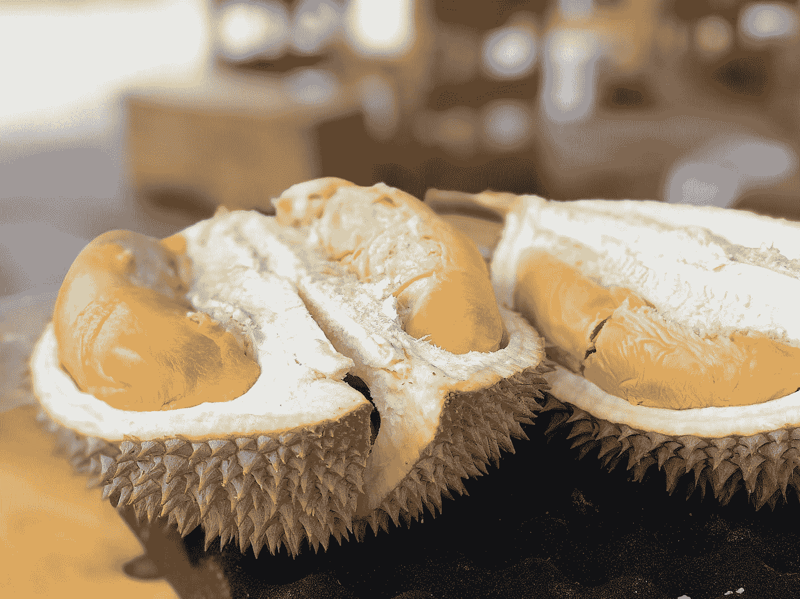
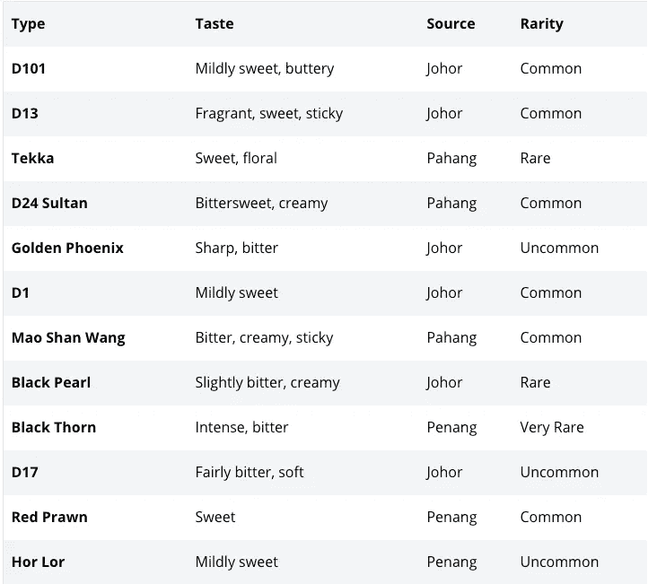
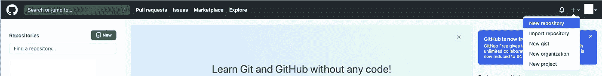
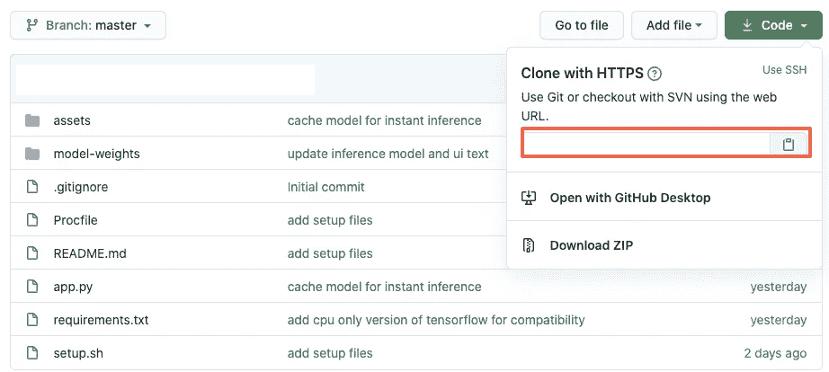

# 如何在一天内构建和部署一个机器学习 web 应用程序

> 原文：<https://towardsdatascience.com/how-to-build-and-deploy-a-machine-learning-web-application-in-a-day-f194fdbd4a5f?source=collection_archive---------21----------------------->

## 构建 durian 分类器的一步一步的端到端指南(包括代码)

因此，我决定构建一个 web 应用程序来对榴莲进行分类，因为嘿，为什么不呢？点击查看[。](https://durian-classifier.herokuapp.com/)



网络应用[演示](https://durian-classifier.herokuapp.com/) (GIF 由作者创建)

对于我所有的国际读者来说，如果你不知道榴莲是什么，它是一种水果(在新加坡我们称它为*水果之王*),它有着奶油般的质地，刺鼻的气味(*见下图*)和尖尖的外表。这种说的刺鼻的气味，让人要么讨厌，要么绝对喜欢(我属于后一类，*明显是*)。如果你觉得它闻起来不错，那么它的味道可能会更好。



榴莲长什么样(照片由 [Jim Teo](https://unsplash.com/@jimteo?utm_source=medium&utm_medium=referral) 在 [Unsplash](https://unsplash.com?utm_source=medium&utm_medium=referral) 上拍摄)

## 问题陈述

是的，这个项目的动力源于我对榴莲的热爱。你一定想知道，我们到底在分类什么？

你看，榴莲有很多种，它们的味道、质地和颜色都不一样。对于这个项目，我们将对四种不同类型的榴莲进行分类，即:

*   猫山王
*   金凤(金凤凰)
*   D24
*   红对虾

这些榴莲的差异可以总结在下表中:



来源:[https://www . you . co/SG/blog/types-of-durians-how-to-pick-the-best-durian/](https://www.you.co/sg/blog/types-of-durians-how-to-pick-the-best-durian/)

那里有更多种类的榴莲(在这个[链接](https://www.shape.com.sg/food/the-ultimate-guide-to-identifying-your-favourite-durian-types-in-singapore/#:~:text=To%20distinguish%20them%2C%20look%20out,base%20of%20the%20durian%20fruit.)中找到更多)但是我认为这些榴莲的细微差别可能已经证明我们的模型很难学习。

## 数据收集

每个项目都从数据收集开始。由于我们将部署的模型将用于个人和教育目的，我们将从 *Google Images 获取图像。如果您将图像用于其他目的，请检查版权。*

我们将使用这个 [API](https://github.com/ultralytics/google-images-download) 来获取我们的图像。只需按照回购上的说明安装软件包。在说明的步骤 3 中，我们将针对我们的特定用例运行该命令(替换到 *chromedriver* 的路径):

```
python3 bing_scraper.py --url 'https://www.bing.com/images/search?q=mao+shan+wang' --limit 100 --download --chromedriver <path_to_chromedriver>
```

在这里，我们将下载的图片数量限制为 100 张，因为没有多少特定的“*茅山王*”图片。我们重复上述步骤三次以上，用其他品种的榴莲代替搜索。请注意，由于我们正在 API 中修改搜索 URL，查询中的*空格*将被替换为“+”(即`mao+shan+wang`、`red+prawn+durian`等)。

当然，您可以对任何想要分类的图像执行此步骤。

## 数据清理

在我们的使用案例中，由于公开可用的榴莲图像不多，许多下载的图像可能与正确的榴莲品种不对应(例如，在搜索“猫山王”时，您可能会找到一种普通的“未标记”榴莲)。因此，我需要手动检查所有下载的图像，以确保颜色和背景是正确的。毕竟，拥有高质量(即标签正确)的数据胜过数量，对吗？

这一步确实需要一些领域知识，可能会稍微费时。(*但当然，数据清理是机器学习管道中的一个基本步骤，反映了数据科学家和人工智能工程师的现实。*)

清理完数据后，我们剩下的是 **55** D24、39 金凤、 **59** 毛山王和 **68** 红对虾的图像。

## 训练我们的榴莲分类器

我选择了使用 TensorFlow 框架，我相信大多数从业者都已经习惯了(当然，可以随意使用 *Pytorch* )。由于我们只有很少的图像，我们无疑必须使用预训练的模型，并在我们的数据集上对其进行微调。

首先，确保你有下面的文件夹结构，这是稍后`flow_from_directory`所需要的。

```
train
|-- d24
|-- golden-phoenix
|-- mao-shan-wang
|-- red-prawn
valid
|-- d24
|-- golden-phoenix
|-- mao-shan-wang
|-- red-prawn
```

让我们开始构建我们的分类器！

```
# Import relevant libraries we will be using
import numpy as npfrom tensorflow.keras.initializers import glorot_uniform
from tensorflow.keras.regularizers import l2
from tensorflow.keras.preprocessing.image import ImageDataGenerator
from tensorflow.keras.applications import Xception
from tensorflow.keras.layers import (
    Flatten,
    Dense,
    AveragePooling2D,
    Dropout
)
from tensorflow.keras.optimizers import SGD
from tensorflow.keras.preprocessing import image
from tensorflow.keras import Model
from tensorflow.keras.preprocessing.image import img_to_array
from tensorflow.keras.callbacks import (
    EarlyStopping,
    ModelCheckpoint,
    LearningRateScheduler
)
```

如上所述，我们将使用的基本模型是**异常**。让我们实例化这一点，并添加一些密集层。我们将使用较小的批量 8，因为我们有许多图像。我们还需要警惕过度适应我们的小数据集。

```
SHAPE = 224
BATCH_SIZE = 8model = Xception(
    input_shape=(SHAPE, SHAPE, 3),
    include_top=False,
    weights='imagenet'
)x = model.output
x = AveragePooling2D(pool_size=(2, 2))(x)
x = Dense(32, activation='relu')(x)
x = Dropout(0.1)(x)
x = Flatten()(x)
x = Dense(4, activation='softmax',
          kernel_regularizer=l2(.0005))(x)model = Model(inputs=model.inputs, outputs=x)opt = SGD(lr=0.0001, momentum=.9)
model.compile(loss='categorical_crossentropy',
              optimizer=opt,
              metrics=['accuracy'])
```

之后，让我们使用 TensorFlow 的`ImageDataGenerator`和`flow_from_directory`创建我们的图像生成器对象。由于我们没有足够的训练图像，图像增强比以往任何时候都更加重要。

```
train_datagen = ImageDataGenerator(
    rescale=1./255,
    rotation_range=15,
    width_shift_range=0.1,
    height_shift_range=0.1,
    horizontal_flip=True
)valid_datagen = ImageDataGenerator(
    rescale=1./255,
    rotation_range=0,
    width_shift_range=0.0,
    height_shift_range=0.0,
    horizontal_flip=False
)train_generator = train_datagen.flow_from_directory(
    'train/',
    target_size=(SHAPE, SHAPE),
    shuffle=True,
    batch_size=BATCH_SIZE,
    class_mode='categorical',
)valid_generator = valid_datagen.flow_from_directory(
    'valid/',
    target_size=(SHAPE, SHAPE),
    shuffle=True,
    batch_size=BATCH_SIZE,
    class_mode='categorical',
)>>> Found 178 images belonging to 4 classes.
>>> Found 42 images belonging to 4 classes.
```

在我们的模型之前，让我们定义一些回调函数。

```
earlystop = EarlyStopping(monitor='val_loss',
                          patience=4,
                          verbose=1)checkpoint = ModelCheckpoint(
    "model-weights/xception_checkpoint.h5",
    monitor="val_loss",
    mode="min",
    save_best_only=True,
    verbose=1
)
```

最后，让我们开始训练我们的模型！

```
history = model.fit_generator(
    train_generator,
    epochs=30,
    callbacks=[earlystop, checkpoint],
    validation_data=valid_generator
)# Save our model for inference
model.save("model-weights/xception.h5")
```

不幸的是，由于我们拥有的图像数量有限，我们的模型在验证集上没有达到很好的准确性。然而，由于模型微调不是本文的主要焦点，我们不会过多地讨论这个问题。

## 选择我们的 Web 框架

对于这个项目，我选择了使用[***streamlit***](https://www.streamlit.io/)因为它可以实现机器学习应用程序的超级快速可视化，而且方便，它也是用 Python 编写的。在我们构建好之后，我们剩下要做的就是部署它。

首先，导入我们需要的库，并指定模型权重的路径。此外，由于我们使用了`flow_from_directory`，TensorFlow 按字母顺序分配类号。照此，D24 将是 0 类，以此类推。

```
import numpy as npfrom PIL import Image
from tensorflow.keras.models import load_model
from tensorflow.keras.preprocessing.image import img_to_array
from tensorflow.keras.preprocessing import image
import streamlit as stPATH = "model-weights/"
WEIGHTS = "xception.h5"
CLASS_DICT = {
    0: 'D24',
    1: 'JIN FENG',
    2: 'MAO SHAN WANG',
    3: 'RED PRAWN'
}
```

接下来，我们创建一个函数，将上传的图像转换成模型可以使用的格式。我们特别使用来自`PIL`的`Image`类，因为上传的图像是`BytesIO`格式的。

```
def load_img(input_image, shape):
    img = Image.open(input_image).convert('RGB')
    img = img.resize((shape, shape))
    img = image.img_to_array(img)
    return np.reshape(img, [1, shape, shape, 3])/255
```

*Streamlit* 的工作方式是，给定用户指定的参数的每一个变化，脚本从上到下重新运行(因此其交互式 UI)。因此，它以`st.cache`的形式提供了一个`cache`装饰器来缓存加载的对象。缓存通常用于数据加载步骤或任何需要长时间计算/处理的步骤。请记住，我们使用`allow_output_mutation=True`参数，因为默认情况下这是`False`，如果输出对象以任何方式发生变化，应用程序将被重新加载。

在我们的例子中，模型对象在每次预测时都会发生变异。因此，我们将这个`allow_output_mutation`参数设置为`True`。我们想要缓存我们的模型的原因是因为我们不想在每次用户选择不同的图像时加载它(即模型加载只进行一次)。

```
[@st](http://twitter.com/st).cache(allow_output_mutation=True)
def load_own_model(weights):
    return load_model(weights)
```

最后，我们只需要一些代码添加到 UI 中:

```
if __name__ == "__main__":
    result = st.empty()
    uploaded_img = st.file_uploader(label='upload your image:')
    if uploaded_img:
        st.image(uploaded_img, caption="your sexy durian pic",
                 width=350)
        result.info("please wait for your results")
        model = load_own_model(PATH + WEIGHTS)
        pred_img = load_img(uploaded_img, 224)
        pred = CLASS_DICT[np.argmax(model.predict(pred_img))] result.success("The breed of durian is " + pred)
```

这就对了。我们的 web 应用程序是用 Python 创建的，代码不多。您可以通过在命令行中输入以下命令来确保它(假设它将被称为`app.py`)能够在本地运行:

```
streamlit run app.py
```

## 将我们的模型部署到 Heroku

就我个人而言，部署不是我最喜欢的部分，但是，嘿，如果它不在网络上，那它是什么呢？所以让我们开始吧。

有许多方法可以为 web 应用程序提供服务，也有许多云服务提供商来托管它。在这种情况下，我选择与 [*Heroku*](http://www.heroku.com) 合作主要是因为我以前没有尝试过。

**什么是 Heroku？***Heroku*是一个云平台即服务(PaaS)，支持多种编程语言，允许开发人员完全在云端构建、运行和操作应用。这篇[文章](https://devcenter.heroku.com/articles/how-heroku-works)解释的很清楚。

为了部署一个应用程序，我们总是需要某种版本控制来确保我们的应用程序运行在本地机器之外的另一个服务器上。为此，许多人使用 Docker 容器，指定所需的可运行的应用程序和包。

使用 Heroku 进行部署类似于同时使用 Docker 容器和 web 托管服务。但是，它使用 Git 作为部署应用程序的主要手段。我们不需要将所有需要的文件打包到 Docker 容器中，而是必须创建一个 git 存储库来进行版本控制，然后我们可以使用熟悉的`git push`，但是要使用`heroku`遥控器。

Heroku 然后使用相同的容器技术，但是以一个 **dyno** 的形式。每个应用程序都放在一个 dyno(或容器)中，每个应用程序消耗“dyno-hours”(更多信息[请点击](https://www.heroku.com/dynos#:~:text=Dynos%3A%20the%20heart%20of%20the,simplify%20development%20and%20enhance%20productivity.&text=The%20containers%20used%20at%20Heroku,on%20a%20user%2Dspecified%20command.))。每个 Heroku 帐户都有一些可用的免费小时数，消耗的小时数取决于应用程序的活动/流量。首先，如果你没有预见到应用程序的大流量，你应该对免费层非常满意。

同样值得注意的是，当 Heroku 收到应用程序源代码时，它会启动应用程序的构建(如在`requirements.txt`中检索依赖项，创建必要的资产等)，然后组装成 **slug。**

> **术语**:slug 是您的源代码、获取的依赖项、语言运行时和编译/生成的构建系统输出的捆绑包——准备执行。

要在 Heroku 上部署，我们需要以下文件:

(1) *setup.sh* —创建必要的目录并将一些信息(如端口号)写入一个`.toml`文件

```
mkdir -p ~/.streamlit/echo "\
[server]\n\
headless = true\n\
port = $PORT\n\
enableCORS = false\n\
\n\
" > ~/.streamlit/config.toml
```

(2) [Procfile](https://devcenter.heroku.com/articles/procfile) —类似于 Dockerfile，包含我们想要执行的指令。我们将首先在`setup.sh`中执行一些 bash 命令，然后执行`streamlit run app.py`命令。

```
web: sh setup.sh && streamlit run app.py
```

(3) *requirements.txt* —包含我们的应用程序所需的所有包依赖关系。请注意，这些是我正在使用的版本。您可以通过终端中的`conda list`或者使用`pip freeze > requirements.txt`来获得您的环境当前使用的软件包的详细列表，从而找到您正在使用的软件包版本。

```
numpy==1.18.1
spacy==2.2.4
pandas==1.0.1
Pillow==7.1.2
streamlit==0.61.0
tensorflow-cpu==2.2.0
```

我们的文件夹目录应该如下所示:

```
app.py
Procfile
README.md
requirements.txt
setup.sh
model-weights
|-- xception.h5
```

如果您以前没有创建过 Github 存储库，以下是一些简单的步骤:

1.  创建新的存储库<repo_name></repo_name>



2.复制红色框中的 URL



3.从终端运行以下命令:

```
# Clone the repository into our local machine
git clone <repo URL in step 2># Enter the directory we just cloned
cd <repo_name>
```

4.将之前创建的文件复制到该文件夹中，并在终端中运行以下命令:

```
# Add all the files we just copied over to be committed
git add .# Commit the files, along with a commit message
git commit -m "deploy app"# Push to master branch on our github repo
git push origin master
```

我们快到了！这是最后的步骤。

(1)创建一个 *Heroku* 账户并验证

(2)在这里安装 *Heroku* CLI

(3)通过终端登录您的 *Heroku* 账户。将会打开一个浏览器窗口进行身份验证。

```
heroku login
```

(4)创建一个 *Heroku* app

```
heroku create <project-name>
```

完成此步骤后，您将能够在终端中看到指向您的项目的链接。

(5)将我们的 git 回购推送到 Heroku remote。从 github repo 的同一个目录中，运行以下命令:

```
git push heroku master
```

我们完了！构建完成后，您应该能够在上面的链接中看到您的应用程序已部署！

# 结束语

希望这对每个试图从头到尾创建自己的迷你 ML 项目的人有用！请随时留下任何意见:)

***支持我！*** —如果你喜欢我的内容并且*没有*订阅 Medium，请考虑支持我并通过我在这里的推荐链接[订阅](https://davidcjw.medium.com/membership) ( *注意:你的一部分会员费将作为推荐费*分摊给我)。