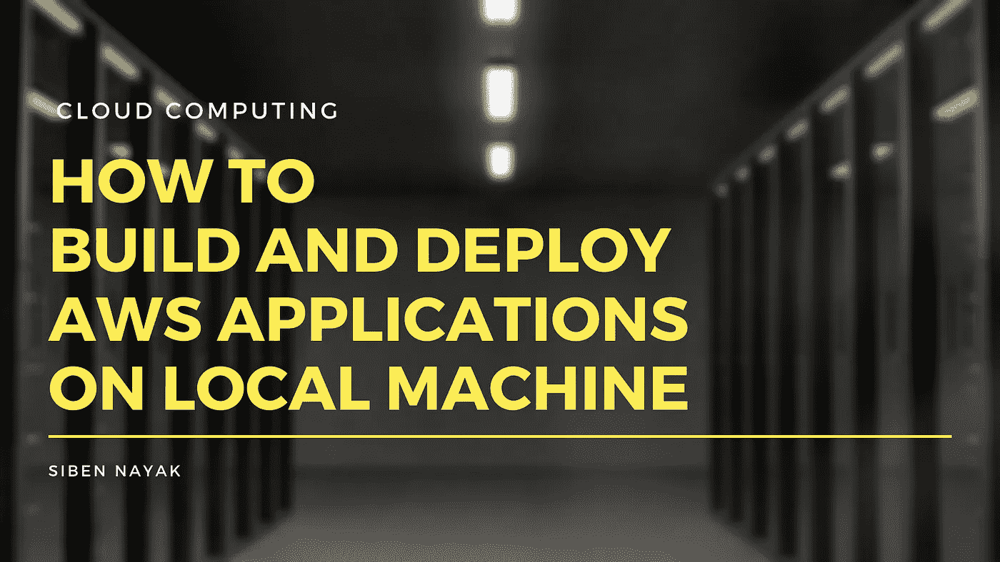
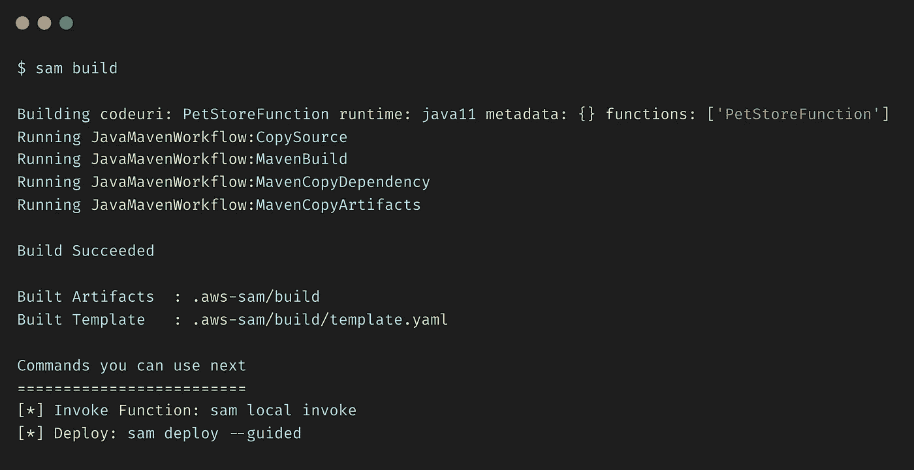
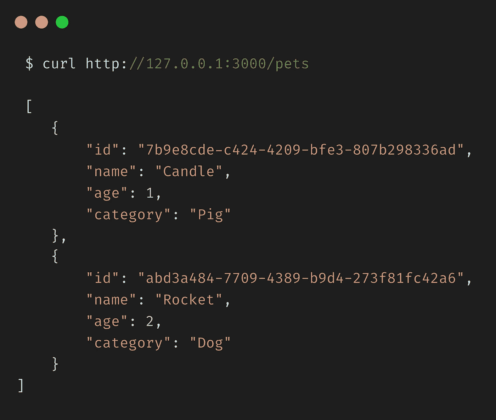

# 如何在本地机器上构建和部署 AWS 应用程序

> 原文：<https://towardsdatascience.com/how-to-build-and-deploy-aws-applications-on-local-machine-562b112ecfb7?source=collection_archive---------23----------------------->

## [动手教程](https://towardsdatascience.com/tagged/hands-on-tutorials)，云计算系列

## 在本地机器上构建和部署基于 AWS 的云应用程序



图片作者。由 [Pixabay](https://www.canva.com/p/pixabay/) 通过 [Canva](https://www.canva.com/media/MADQ4_ajPZc) 生成的原始图像

在我以前的文章中，我谈到了使用 [Chalice](/how-to-build-a-serverless-application-using-aws-chalice-91024416d84f) 和 [SAM](/how-to-build-a-serverless-application-using-aws-sam-b4d595fe689f) 在 AWS 上构建和部署无服务器应用程序。这些是快速有趣的项目，利用了无服务器计算的能力，让我们在几分钟内就可以在 AWS 上部署无服务器应用程序。

但是由于没有 AWS 帐户，许多人不能完全利用这样的教程。设置 AWS 帐户和配置开发环境可能非常耗时，有时还会导致不必要的费用(如果配置不当)。

在本文中，我将带您完成构建和部署无服务器应用程序所需的步骤，而无需创建和设置实际的 AWS 帐户。

这一次，我们将使用 Amazon API Gateway、AWS Lambda 和 Amazon DynamoDB 创建一个样本宠物商店应用程序。这个应用程序将有 API 来添加一个新的宠物和获取可用宠物的列表。

# 先决条件

在本教程中，我们将使用 AWS SAM。您可以按照之前的[文章](/how-to-build-a-serverless-application-using-aws-sam-b4d595fe689f)中的指导来安装和配置 SAM。

# 如何创建项目

运行`sam-init`命令创建一个新项目。这将在当前目录下创建一个`pet-store`文件夹。

```
sam init -r java11 -d maven --app-template pet-store -n pet-store
```

关于传递的参数的更多细节，请参考之前的[文章](/how-to-build-a-serverless-application-using-aws-sam-b4d595fe689f)。

让我们更改`pom.xml`，将模块名称更新为`PetStore`，并使用`Java 11`而不是`Java 8`。

现在让我们创建一个`Pet`类来包含宠物的属性。我们将从简单的属性开始，如`name`、`age`和`category`。

因为我们将使用 Amazon DynamoDB 作为我们的数据存储，所以让我们在`pom.xml`中添加相应的 SDK 依赖项。

这将引入 AWS SDK for DynamoDB 和 Apache HTTP Client 的依赖项，这些依赖项将用于创建同步 DynamoDB 客户端。

# 如何读写项目

我们需要创建一个数据访问类来与 Amazon DynamoDB 交互，并运行我们的读/写查询。创建一个`PetStoreClient`类并添加对`DynamoDbClient`的依赖。

我们现在将在`PetStoreClient`类中创建两个函数来从 DynamoDB 中读取和写入项目。

## 写一个项目

在 DynamoDB 中添加一个条目是一个`PUT`请求。我们将创建一个`PutItemRequest`，并指定要添加的表名和项目属性。

然后我们将使用`DynamoDbClient`把这个项目放到 DynamoDB 中。

## 阅读项目

读取 DynamoDB 中的项目列表是一个`SCAN`请求。我们将创建一个`ScanRequest`并指定要扫描的表名。

然后我们将使用`DynamoDbClient`来扫描 DynamoDB 中的表，并返回一个条目列表。

**注意:**扫描请求会遍历表中的所有项目，因此不建议在真实情况下使用。

# 如何解决依赖关系

我们已经在我们的`PetStoreClient`类中添加了`DynamoDbClient`作为依赖项。作为一般的最佳实践，代码中的所有此类依赖都应该使用依赖注入(DI)来解决。

说起 DI，春天是我们脑海里第一个蹦出来的名字。然而，Spring 生态系统是巨大的，我们最终会引入很多它的框架，即使我们只想使用 DI 部分。喷射也在运行时完成，使得 Lambda 的冷启动时间更长。

Guice 是另一个很好的依赖注入框架，比 Spring 轻得多。但是就像 Spring 一样，它在运行时进行注入，因此也不适合 DI。

然后是 Dagger，一个纯 DI 框架，在编译时注入依赖项！！它的小尺寸和编译时注入使它成为在 Lambdas 中实现 DI 的完美选择。

我将更深入地研究 DI 的细节，并在另一篇文章中介绍 Dagger 的使用。然而在本文中，我们将使用静态工厂方法的永恒风格来提供依赖关系。

让我们创建一个类`DependencyModule`，并在其中声明我们所有的依赖项。

在这个类中，我们正在创建一个新的`DynamoDbClient`实例，并将其注入到我们的`PetStoreClient`中。我们还创建了一个`ObjectMapper`的实例来帮助我们处理 JSON 对象的序列化和反序列化。

# 如何更新 Lambda 和 API 端点

接下来，我们需要更新 Lambda 函数的入口点，并为添加和检索宠物添加特定的端点。

将下面的代码片段添加到`template.yaml`文件的`Resources`部分。

这更新了我们的函数来使用来自`App`类的`handleRequest`方法，并且还添加了两个 API 端点来添加和检索宠物。

更新`Outputs`部分以反映新的函数名。

# 如何整合客户端

既然我们已经准备好了与 DynamoDB 交互的代码，并且对依赖项进行了排序，那么我们需要在 Lambda 处理程序中进行一些更改来调用这些代码。

更新`App.java`中的代码，以调用`PetStoreClient`中的函数，并根据 API 请求执行动作。

由于我们使用静态工厂进行依赖注入，我们将不能有效地测试我们的代码。我将在另一篇文章中介绍云应用程序的单元测试。现在，我们需要删除单元测试来构建项目。

# 如何构建项目

从`pet-store`文件夹中，运行`sam build`命令。



作者图片

这将编译您的源代码并构建您在应用程序中拥有的任何依赖项。然后，它将所有文件移动到`.aws-sam/build`文件夹中，这样它们就可以打包和部署了。

# 如何进行本地测试(第 1 部分)

在之前的[文章](/how-to-build-a-serverless-application-using-aws-sam-b4d595fe689f)中，我们讨论了 SAM CLI 如何提供`sam local`命令来本地运行您的应用程序。这在内部使用 Docker 来模拟 Lambda 的执行环境。如果没有安装 Docker，可以从[这里](https://docs.docker.com/get-docker/)获取。

这对 Daily News API 来说很好，因为它从互联网上获取数据，并且不依赖于任何其他 AWS 组件。然而，在当前的项目中，我们依赖 Amazon DynamoDB 作为我们的数据存储，并且需要访问它以便我们能够成功地运行我们的应用程序。

本质上，我们需要一种方法在本地机器上模拟 AWS 提供的服务，这样我们就可以在本地测试它们，而不需要使用实际的 AWS 帐户。

# 如何在本地运行 AWS

[LocalStack](https://localstack.cloud/) 就是为了解决这个问题而产生的。用它自己的话说:

> LocalStack 为开发云应用程序提供了一个易于使用的测试/模拟框架。它在您的本地机器上构建了一个测试环境，提供与真正的 AWS 云环境相同的功能和 API。

简而言之，LocalStack 将 AWS cloud 的所有功能都集成到一个 docker 容器中，该容器在我们的机器上本地运行。这使开发人员能够构建和测试他们的云应用程序，而不必在实际的 AWS 云帐户上部署它们。

对一个开发者来说意味着什么？

1.  无需提供 AWS 帐户。
2.  不需要设置开发环境和考虑安全性和其他配置。
3.  不需要在开发期间产生不必要的 AWS 成本。
4.  完全模拟实际 AWS 环境的透明本地环境。

# 如何设置本地堆栈

LocalStack 非常容易设置和开始使用。我们将使用 Docker 获取 LocalStack 的最新映像，并启动一个运行 Amazon DynamoDB 模拟版本的容器。

在`pet-store`文件夹中创建一个`docker-compose.yaml`文件，并添加以下内容。

让我们来看看我们正在使用的一些配置:

*   服务——因为我们只依赖 Amazon DynamoDB，所以我们将只启用这个特定的服务
*   DEFAULT_REGION —我们将使用 us-west-1 作为我们的 AWS 区域
*   LAMBDA _ EXECUTOR——将它设置为 local 意味着我们所有的 LAMBDA 函数都将在本地机器上的一个临时目录中运行
*   DATA_DIR —为 Amazon DynamoDB 等服务保存持久数据的位置

**注意:**所有的 LocalStack 服务都是通过端口 4566 上的 edge 服务公开的。这是我们需要使用的唯一端口。

现在，我们可以使用`docker-compose`在它自己的容器中启动我们本地版本的 Amazon DynamoDB。


作者图片

# 如何创建表格

既然我们已经运行了 Amazon DynamoDB 的本地设置，我们应该能够为我们的应用程序创建一个表。

我们在代码中使用了`pet-store`作为表名，所以让我们继续创建它。我们将使用 AWS CLI 访问运行在本地机器上的 Amazon DynamoDB，并创建所需的表。

运行下面的命令创建一个名为`pet-store`的表，并将属性`id`作为主键。

```
aws --endpoint-url "[http://localhost:4566](http://localhost:4566)" dynamodb create-table \
    --table-name pet-store \
    --attribute-definitions AttributeName=id,AttributeType=S \
    --key-schema AttributeName=id,KeyType=HASH \
    --billing-mode PAY_PER_REQUEST
```

注意，我们使用了`endpoint-url`参数来指定我们指向本地运行的 AWS 实例，而不是实际的实例。

# 如何进行本地测试(第 2 部分)

对 DynamoDbClient 代码进行以下更改，使其指向本地运行的 Amazon DynamoDB 实例。

接下来，使用`sam build`构建项目，并运行以下命令在本地启动 API。

```
sam local start-api
```

这在内部创建了一个本地服务器，并公开了一个复制 REST API 的本地端点。


作者图片

现在，让我们通过添加一只新宠物来测试我们的应用程序。运行下面的命令，通过调用我们之前指定的`/pets`端点来添加一个新的宠物。

```
curl --location --request PUT '[http://127.0.0.1:3000/pets'](http://127.0.0.1:3000/pet') \
--header 'Content-Type: application/json' \
--data-raw '{
    "name": "Rocket",
    "age": 2,
    "category": "Dog"
}'
```

这创建了一个新的宠物记录，将其添加到我们的本地 Amazon DynamoDB，并在响应中返回生成的 UUID。

我们店里再添一只宠物吧。

```
curl --location --request PUT '[http://127.0.0.1:3000/pets'](http://127.0.0.1:3000/pet') \
--header 'Content-Type: application/json' \
--data-raw '{
    "name": "Candle",
    "age": 1,
    "category": "Pig"
}'
```

现在，让我们调用我们的`/pets` API 来获取数据存储中可用的宠物列表。我们应该会得到一个包含`Rocket`和`Candle`的宠物列表。



作者图片

# 结论

恭喜你！！您刚刚在本地机器上构建并部署了一个完全使用 AWS DynamoDB 的无服务器应用程序。

现在您可以继续对您的`App.java`文件进行任何修改。重新运行`sam deploy`来重新部署您的更改，运行`sam local start-api`来启动本地服务器并测试更改。

一旦您为部署做好准备，您只需要删除端点覆盖，就万事大吉了。在理想情况下，这将由环境变量控制，并且绝对不需要修改代码就可以投入生产。

本教程的完整源代码可以在[这里](https://github.com/theawesomenayak/pet-store)找到。