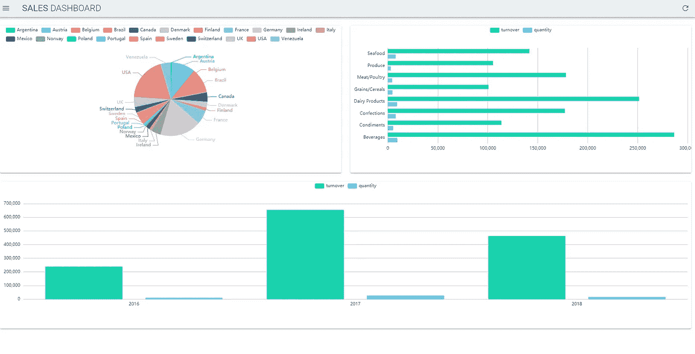

# 如何使用 Python、Google Sheets 和 Vue.js 构建和部署您的仪表板

> 原文：<https://towardsdatascience.com/how-to-build-and-deploy-your-dashboard-with-python-google-sheet-and-vue-js-c34140c1afc8?source=collection_archive---------5----------------------->

## [实践教程](https://towardsdatascience.com/tagged/hands-on-tutorials)

## 部署仪表板的实用指南，无需服务器。

Stephen Dawson 在 [Unsplash](https://unsplash.com?utm_source=medium&utm_medium=referral) 上拍摄的照片

数据的可视化让我们能够快速洞察。但是，部署数据可视化解决方案可能会很困难，因为大多数时间都需要购买许可证或服务器。

在本文中，我们将看到如何使用免费工具构建一个仪表板来呈现一些虚假销售，您可以下载数据[这里](https://drive.google.com/file/d/1fuQXmQkYx3t8QIjBcLTZCeINjlV5zwoU/view?usp=sharing)以便遵循教程。

首先，我们将使用 Python 来填充一个 Google sheet。然后，我们将使用 Vue.js 创建一个使用 [apache Echart](https://echarts.apache.org/en/) 和 [Vuetify](https://vuetifyjs.com/en/) 的仪表板。最后，我们将使用 Github action 在 GitHub 页面上部署这个仪表板。

## 要求

要遵循本指南，您需要具备以下条件:

*   一个谷歌账户
*   gcloud 命令行工具
*   Python 3.7 或更高版本
*   Github 账户

## 设置 Google cloud 帐户

我将使用 google cloud 命令行工具来设置 google cloud 帐户。如果你不熟悉 google cloud SDK，你可以在这里找到适合你平台的快速入门。

让我们来配置我们的谷歌云项目:

1.  使用`gcloud create project <project_id>`创建新项目
2.  将新创建的项目设置为其他命令的默认项目:`gcloud config set project <project_id>`
3.  启用 google sheet API 和 Drive API:
    `gcloud services enable sheets.googleapis.com`
    
4.  为 python 脚本创建一个服务帐户:`gcloud iam service-accounts <name_of_service_account>`
5.  从服务帐户:
    `gcloud iam service-accounts keys create <local_path_to_download.json> --iam-account <name_of_service_account>@<project_id>.iam.gserviceaccount.com`创建并下载凭证
6.  为 Vue.js 应用程序创建 API 密钥:

*   导航到云控制台中的[API&服务→凭证](https://console.cloud.google.com/apis/credentials)面板
*   选择**创建凭证**，然后从下拉菜单中选择 **API key** 。
*   **API 密钥创建**对话框显示您新创建的密钥，**保存它以备后用。**
*   然后点击“编辑”,在“限制 API”部分选中“限制关键字”选项，选择“Google 工作表 API ”,然后点击“保存”。

接下来，我们将创建一个脚本，使用 Python 将仪表板数据推送到 Google sheets。

## 将数据框架推送到 Google sheets

Python 脚本将需要一些依赖关系，以便将数据推送到 Google。用:`pip install pandas pygsheets`安装它们，然后创建一个目录和一个 Python 文件，并复制下面的脚本。

将数据框上传到新的谷歌工作表来源:作者

在这个脚本中，我们首先用前面创建的凭证文件初始化 Google sheets 客户机。然后，我们创建一个全新的谷歌表，我们与我们的谷歌帐户共享它，这样我们就可以在谷歌驱动可视化它。我们还公开了我们的工作表，以便 Vue 应用程序可以访问它。接下来，我们创建 3 个工作表，并为每个工作表上传一个熊猫数据框。最后，我们打印**工作表 id，保存它**，因为我们将在下一部分中需要它来构建 Vue.app。

## 构建仪表板

为了简单起见，我们将使用 Vue.js 构建仪表板，不使用任何构建工具。首先，在根目录下创建一个`dist`文件夹，在里面创建一个**index.html**文件，内容如下。

仪表板代码来源:作者

我们来破个码，Vue app 是从 161 行到 245 行定义的。首先，有一个数据部分，其中我们声明了包含来自 Google sheet 的数据的对象，以及一个包含与 Google sheet 数据匹配的指标的数组。

接下来，我们有一个允许我们通过 Google sheets API 恢复数据的函数。这个方法使用从第 80 行到第 160 行定义的类。这个类是在 mounted 部分初始化的，它在参数中接受工作表的 id 和您的 API 键，**，所以请确保用您自己的**替换这些值。

然后在计算部分，我们声明我们的图表变量。如你所见，它们都遵循相同的模式。我们首先引用数据所在的工作表，然后为每个图表声明列、行和不同的设置。

最后，我们使用 HTML 格式的数据可视化库[电子图表](https://echarts.apache.org/en/),从第 26 行到第 45 行，根据我们声明的变量来呈现我们的图表。现在，如果你打开你的**index.html**文件，你应该会看到这样一个仪表板:

index.html 仪表板来源:作者

## 在 GitHub 页面上部署

我们现在将使用 Github 操作在 GitHub 页面上部署我们的仪表板。为此，您必须在您的 GitHub 帐户上创建一个新目录。然后，您将需要创建一个 **GitHub 个人访问令牌**以便能够使用 GitHub 操作，点击 [**此处**](https://docs.github.com/en/github/authenticating-to-github/creating-a-personal-access-token) 查看如何生成一个。

您需要选择您想要授予这个令牌的作用域，确保选择`repo`复选框以便能够在 GitHub 页面上部署。

现在，您需要在 GitHub 存储库中创建一个秘密，以便部署操作可以使用您创建的令牌。查看官方文档[此处](https://docs.github.com/en/actions/configuring-and-managing-workflows/creating-and-storing-encrypted-secrets)了解如何继续。命名秘密访问令牌。

一旦你配置好了，你就可以在你的项目的根文件夹中创建一个目录树`.github/worflows`，它将包含下面的`main.yml`文件。

GitHub 工作流来源:作者

现在您已经定义了您的工作流，在您的 GitHub 远程 repo 上推送您的项目。如果一切正常，你可以在以下网址看到仪表盘:
https:/<**your-github-username**>. github . io/<**repo-name**>/。

最后，转到[您在谷歌云控制台上的凭证](https://console.cloud.google.com/apis/credentials)点击编辑您的 API 密钥，并在应用程序限制部分:

*   选中选项:HTTP 推荐人(网站)
*   点击添加一个项目
*   在输入表单中输入你的 Github 页面的 URL:
    https:/<**your-Github-username**>. Github . io/<**repo-name**>/。

## 缺点和限制

API 密钥在这里被用作调用 Google APIs 的认证方法。这个方法只允许你读取公开的工作表，所以不要使用本教程来部署敏感数据。

对于这种用法，您必须通过本指南 中的 [**所示的 **oauth2 认证协议。****](https://developers.google.com/sheets/api/guides/authorizing)

## 结论

在本文中，我们看到了如何部署一个由 Google sheet 支持的简单仪表板。该仪表板读取引用工作表中的数据。如果您想更新数据，您只需更新 Google sheet 工作簿，单击刷新按钮，它就会反映在仪表板上。最后，由于 GitHub action，仪表板的部署是自动化的。

如果您有兴趣通过电子邮件发送您的仪表板或报告，请查看这篇文章。

 [## 使用 Python、Vue.js 和 Gmail 自动化您的报告流程

### 一个具体的一步一步的例子，自动化您的报告，而不需要服务器。

medium.com](https://medium.com/swlh/automate-your-reporting-with-python-and-vue-js-15ef130fff8)