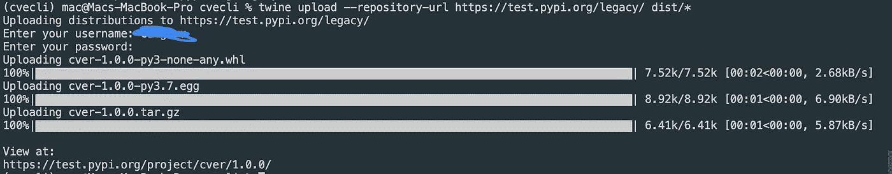

# 如何用 Python 构建和发布命令行应用程序

> 原文：<https://towardsdatascience.com/how-to-build-and-publish-command-line-applications-with-python-96065049abc1?source=collection_archive---------9----------------------->


戴维·克洛德在 [Unsplash](https://unsplash.com?utm_source=medium&utm_medium=referral) 上的照片

## *关于如何用 Python 构建和发布命令行应用程序的全面指南。*

命令行应用程序基本上是您在终端上运行的程序，并且您很可能已经尝试或考虑过构建一个。

构建命令行应用程序是一回事，将它发布到像 PyPI 这样的开放公共代码库是另一回事，不应该被视为一项困难的任务或过程。

我以前写过一篇[文章](https://codeburst.io/building-beautiful-command-line-interfaces-with-python-26c7e1bb54df)，其中我深入解释了用 Python 构建命令行应用程序的各种方式和方法。

在本文中，我将解释如何用 Python 构建一个简单的 CLI 并将其发布到 PyPI。

# 入门指南

最近我一直在做一些关于[开源漏洞](https://www.darkreading.com/edge/theedge/the-truth-about-vulnerabilities-in-open-source-code/b/d-id/1335187)的研究，我想有一个命令行工具，我可以用它来搜索和查找终端上的漏洞。开源漏洞通常发布在公共数据库中，可以在类似 [CVE](https://cve.mitre.org/) 、 [NVD](https://nvd.nist.gov/) 、[白源漏洞](http://vuln.whitesource.com)等网站上找到。

在本文中，我们将构建一个简单的刮刀来搜索和查找 CVE 网站上的漏洞，将其包装成一个简单的命令行应用程序，并将其发布到 PyPI。

酷吧？

要开始，您需要设置您的[开发环境](https://siitgo.com/pages/lpythontz-3/1511/python-3-environment-setup)并安装所需的模块。我建议建立一个虚拟环境，因为它使事情变得更容易，并有助于避免模块版本的冲突。

要创建一个虚拟环境，你可以使用 python3 命令`python -m venv <path/name>`或者使用`pip install virtualenvwrapper`安装`virtualenvwrapper`并使用`mkvirtualenv -p /path/topython <path/name>`创建一个虚拟环境

设置并激活 virtualenv 后，您可以创建项目文件夹并安装所需的模块:

```
mkvirtualenv -p /usr/bin/python cvecli-env
mkdir cvecli && cd cvecli
mkdir cver && touch setup.py && touch README.md && touch cver/__init__.py && touch .gitignore
pip install requests beautifulsoup4 lxml twine click
pip freeze > requirements.txt
```

一旦一切运行成功，您可以在任何代码编辑器中打开该项目，您应该会看到如下所示的结构:


# 编写我们的网页抓取器

为了能够在 CVE 网站上搜索和查找漏洞，我们需要一个网页抓取器来帮助抓取漏洞细节。我们将根据要求制造铲运机和 Beautifulsoup，铲运机能够:

1.  搜索漏洞
2.  使用漏洞的 CVE 名称获取漏洞详细信息

现在在`cver`文件夹中，创建一个名为`cve_scraper`的文件，基本设置如下:

```
import requests
from bs4 import BeautifulSoupSEARCH_URL = "[https://cve.mitre.org/cgi-bin/cvekey.cgi?keyword=](https://cve.mitre.org/cgi-bin/cvekey.cgi?keyword=python)"CVE_URL = "[https://cve.mitre.org/cgi-bin/cvename.cgi?name=](https://cve.mitre.org/cgi-bin/cvename.cgi?name=CVE-2020-8492)"def get_html(url):
    request = requests.get(url)
    if request.status_code == 200:
        return request.content
    else:
        raise Exception("Bad request")def search(s):
    passdef lookup_cve(name):
    pass
```

## 搜索漏洞

在 CVE 网站上搜索漏洞，URL 格式如下:`[https://cve.mitre.org/cgi-bin/cvekey.cgi?keyword](https://cve.mitre.org/cgi-bin/cvekey.cgi?keyword=python)=<keyword>`。这样，您应该能够用关键字，

例如，我们可以使用 URL 来获取所有与 python 相关的漏洞:


为了提取数据，让我们打开开发人员控制台，检查呈现上述数据的 DOM 元素。您可以右键单击页面的任何部分，然后单击`inspect element`或按 Ctrl + F12。


如果您看一下上图中的 DOM 结构，您会注意到结果显示在一个表格中，每个结果都是表格下的一行。数据可以很容易地提取如下:

```
def search(s): url = f"{SEARCH_URL}{s}"
    results=[]    
    html = get_html(url)
    soup = BeautifulSoup(html, "lxml")
    result_rows = soup.select("#TableWithRules table tr") for row in result_rows: 
        _row = {}    
        name = row.select_one("td a")
        description = row.select_one("td:nth-child(2)") if all([name, description]): _row["name"] = name.text
            _row["url"] = name.get("href")
            _row["description"] = description.text results.append(_row)

    return results
```

在上面的代码中，我们:

1.  使用请求向 SEARCH_URL 发送请求并获取 DOM 内容
2.  将 dom 内容转换成漂亮的组对象，我们可以使用 CSS 选择器和其他类似 XPATH 的方法来选择 DOM 元素。
3.  选择`#TableWithRules`表格下的所有`tr`，选择该行的第一列作为名称，第二列作为描述，然后提取文本。

## 查找漏洞详细信息

要查找漏洞详细信息，您需要提供漏洞的 CVE ID，并将其传递到以下 URL:[https://cve.mitre.org/cgi-bin/cvename.cgi?name=CVE-](https://cve.mitre.org/cgi-bin/cvename.cgi?name=CVE-2020-8315)ID


打开您的开发人员控制台，让我们检查一下 DOM 结构。


查看上面的结构有点复杂，因为表行没有用类名或 id 标识。我们需要遍历每一行，检查它是否是一个副标题，如果是，那么我们把下一个元素作为子内容。每个字幕在`th`中呈现，而内容在`td`中呈现

```
def lookup_cve(name):
    url = f"{CVE_URL}{name}"
    html = get_html(url)
    soup = BeautifulSoup(html, "lxml")
    result_rows = soup.select("#GeneratedTable table tr")subtitle = ""
    description = ""raw_results = {}for row in result_rows:
        head = row.select_one("th")
        if head:
           subtitle = head.text
        else:
            body = row.select_one("td")
            description = body.text.strip().strip("\n")
            raw_results[subtitle.lower()] = description   

    return raw_results
```


Tada！我们已经成功地创建了我们的 CVE 网络刮刀。你现在可以用两个函数(search 和 lookup_sve)来搜索漏洞，并使用漏洞的 CVE ID 来获取漏洞的详细信息。

# 构建我们的命令行应用程序

下一步是使用 Click 库构建我们的命令行应用程序。

Click 是一个 Python 包，用于以可组合的方式用尽可能少的代码创建漂亮的命令行界面。这是创建 CLI 的最佳 python 包之一，并且易于入门

使用 Click，您可以构建任何类型的简单或企业级 CLI，如 Heroku CLI。

在我们的 CLI 中，我们将实现两个命令:

1.  搜索漏洞
2.  查找漏洞

在`cver`文件夹中创建一个名为`__main__.py`的文件，并输入以下基本代码:

```
import sys
import click[@click](http://twitter.com/click).group()
[@click](http://twitter.com/click).version_option("1.0.0")
def main():
    """A CVE Search and Lookup CLI"""
    print("Hye")
    pass[@main](http://twitter.com/main).command()
[@click](http://twitter.com/click).argument('keyword', required=False)
def search(**kwargs):
    """Search through CVE Database for vulnerabilities"""
    click.echo(kwargs)
    pass[@main](http://twitter.com/main).command()
[@click](http://twitter.com/click).argument('name', required=False)
def look_up(**kwargs):
    """Get vulnerability details using its CVE-ID on CVE Database"""
    click.echo(kwargs)
    passif __name__ == '__main__':
    args = sys.argv
    if "--help" in args or len(args) == 1:
        print("CVE")
    main()
```

## 搜索漏洞

为了实现这一点，我们将从 web scraper 导入搜索功能，并从命令行向其传递关键字参数，以搜索与该关键字匹配的漏洞:

```
from scraper import search as cve_search, lookup_cve[@main](http://twitter.com/main).command()
[@click](http://twitter.com/click).argument('keyword', required=False)
def search(**kwargs):
    """Search through CVE Database for vulnerabilities"""
    results = cve_search(kwargs.get("keyword"))
    for res in results:
        click.echo(f'{res["name"]} - {res["url"]} \n{res["description"]}')
```

要运行此命令:

```
python cver/__main__.py search python
```


## 查找漏洞

同样的事情在这里，我们将使用来自 web scraper 的`lookup_cve`,并从`look_up`命令传递给它 name 参数。

```
[@main](http://twitter.com/main).command()
[@click](http://twitter.com/click).argument('name', required=False)
def look_up(**kwargs):
    """Get vulnerability details using its CVE-ID on CVE Database"""
    details = lookup_cve(kwargs.get("name"))
    click.echo(f'CVE-ID \n\n{details["cve-id"]}\n')
    click.echo(f'Description \n\n{details["description"]}\n')
    click.echo(f'References \n\n{details["references"]}\n')
    click.echo(f'Assigning CNA \n\n{details["assigning cna"]}\n')
    click.echo(f'Date Entry \n\n{details["date entry created"]}')
```

要运行此命令:

```
python cver/__main__.py look-up CVE-2013-4238
```


Tada！我们已经成功构建了 CVE 查找命令行工具。

# 向 PyPI 发布我们的命令行应用程序

现在我们已经成功地构建了命令行应用程序，一切都运行良好，我们可以将它发布到 PyPI 供公众使用和安装。

PyPI 是 python 包的软件仓库，它保存了我们使用`pip`命令工具安装的大多数 Python 包。要在 PyPI 上发布一个包，你需要[创建一个账户](https://pypi.org/account/register/)，这样你就可以去网站创建一个新账户，如果你已经有了一个，那么你就可以开始了。

## 配置我们的包

一旦你完成了这些，下一件事就是使用`setup.py`配置我们的 Python 包。为了将您的包上传到 PyPI，您需要提供一些关于包的基本信息。该信息通常在 setup.py 文件中提供。

因此，打开项目基本目录中的`setup.py`,并将它放在文件的开头:

```
from setuptools import setup, find_packages
from io import open
from os import pathimport pathlib
# The directory containing this file
HERE = pathlib.Path(__file__).parent# The text of the README file
README = (HERE / "README.md").read_text()# automatically captured required modules for install_requires in requirements.txt and as well as configure dependency links
with open(path.join(HERE, 'requirements.txt'), encoding='utf-8') as f:
    all_reqs = f.read().split('\n')install_requires = [x.strip() for x in all_reqs if ('git+' not in x) and (
    not x.startswith('#')) and (not x.startswith('-'))]
dependency_links = [x.strip().replace('git+', '') for x in all_reqs \
                    if 'git+' not in x]
```

在上面的例子中，我们将`README.md`文件的内容转换成字符串供以后使用。我们还从`requirements.txt`中捕获了所有需要的模块，并生成了它们的依赖链接。

您的 requirements.txt 文件应该如下所示:

```
click
requests
beautifulsoup4
lxml
twine
```

现在让我们看看我们的设置配置:

```
setup (
 name = 'cver',
 description = 'A simple commandline app for searching and looking up opensource vulnerabilities',
 version = '1.0.0',
 packages = find_packages(), # list of all packages
 install_requires = install_requires,
 python_requires='>=2.7', # any python greater than 2.7
 entry_points='''
        [console_scripts]
        cver=cver.__main__:main
    ''',
 author="Oyetoke Toby",
 keyword="cve, vuln, vulnerabilities, security, nvd",
 long_description=README,
 long_description_content_type="text/markdown",
 license='MIT',
 url='[https://github.com/CITGuru/cver'](https://github.com/CITGuru/cver/'),
 download_url='[https://github.com/CITGuru/cver/archive/1.0.0.tar.gz'](https://github.com/CITGuru/cver/archive/1.0.0.tar.gz'),
  dependency_links=dependency_links,
  [author_email='oyetoketoby80@gmail.com](mailto:author_email='oyetoketoby80@gmail.com)',
  classifiers=[
        "License :: OSI Approved :: MIT License",
        "Programming Language :: Python :: 2.7",
        "Programming Language :: Python :: 3",
        "Programming Language :: Python :: 3.7",
    ]
)
```

在上面的代码中，我们添加了一些选项，这里我们将只介绍设置中可用的一些选项。[设置工具文档很好地研究了所有细节。](https://setuptools.readthedocs.io/en/latest/)

1.  name:将出现在 PyPI 上的包的名称
2.  版本:您的软件包的当前版本
3.  包:包含源代码的包和子包。我们正在使用设置中的`find_packages`模块来帮助我们自动找到我们的子包。
4.  install_requires:这是用来列出你的包拥有的任何依赖项或第三方库。在`cver`中，我们使用了 requests、beautifulsoup4 和 click。它们必须包含在 install_requires 安装程序中。我们不需要手动放置它，因为我们已经阅读了`requirements.txt`来获取它们。
5.  entry_points:这用于创建调用包内函数的脚本。在我们的设置中，我们创建了一个新的脚本`cver`，它在 cver/__main__ 中调用 main()。py 文件。我们的主入口是`__main__.py`，它调用`main()`函数来启动 click。

在向 PyPI 或公众发布您的包之前，您应该添加一些文档。如何记录包取决于您的项目。这可能是一个简单的`README.md`文件或`Readme.rst`文件，完全取决于你。

这里有一个典型的好听的`README.md`:

```
# CVERA simple commandline app for searching and looking up opensource vulnerabilities# Installation## Using Pip```bash
  $ pip install cver
```## Manual```bash
  $ git clone [https://github.com/citguru/cevr](https://github.com/citguru/cevr)
  $ cd cver
  $ python setup.py install
```# Usage```bash
$ cver
```## Search`search <keyword>````bash
$ cver search python
```
## Lookup`search <name>````bash
$ cver look-up CVE-2020-2121
```
```

另外，创建一个`.gitignore`文件:

就是这样。

## 发布到 PyPI

一旦一切都成功完成，这个包就可以公开发布了，并发布在 [PyPI](https://pypi.org) 上。确保你已经创建了一个我前面提到的帐户，你还需要在 [PyPI 测试服务器](https://test.pypi.org)上创建一个测试帐户，以便在发布到实时服务器之前测试包。

我们将使用一个叫做 [Twine](https://packaging.python.org/tutorials/packaging-projects/) 的工具来上传你的 python 包到 PyPI。它应该在前面的步骤中安装，但是如果你没有安装，你可以只做`pip install twine`。

## 在本地和测试服务器上构建和测试包

PyPI 上发布的 Python 包不是以普通源代码的形式发布的，而是被打包成发布包。Python wheels 和源代码档案是分发 Python 包时最常见的格式。

Python wheels 本质上是一个包含您的代码的 zip 存档，并且包括任何可以使用的扩展。Source Archives 由您的源代码和任何支持文件组成，打包到一个 tar 文件中。

为了在本地测试我们的包，我们只需要运行:

```
python setup.py install
```

那么我们现在可以把它当作:

```
cver search python
```

为了在 [PyPI](https://pypi.org) 测试服务器上测试我们的包，我们需要为本地测试生成一个构建。创建一个构建将同时生成 python wheel 和源档案。

要创建构件:

```
python setup.py sdist bdist_wheel
```

这将在`dist`目录中生成两个文件:

```
cvecli/
│
└── dist/
    ├── cver-1.0.0-py3-none-any.whl
    └── cver-1.0.0.tar.gz
```

然后使用 twine，我们现在可以上传到服务器:

```
twine upload --repository-url https://test.pypi.org/legacy/ dist/*
```

这将要求您输入用户名和密码，因此请确保输入正确。



如果上传成功，没有任何问题，这意味着我们可以在服务器上发布。你可以在这里查看。

要从 [TestPyPI](https://test.pypi.org) 安装，运行以下命令:

```
pip install -i [https://test.pypi.org/simple/](https://test.pypi.org/simple/) cver==1.0.0
```

从这里你可以尝试所有的命令，看看在我们发布到服务器之前是否一切顺利。

测试完所有命令并准备好发布到 live server 后:

```
twine upload dist/*
```

出现提示时，输入您的用户名和密码。就是这样！


您现在可以使用以下方式安装它:

```
pip install cver
```

恭喜你！你的包发布在 PyPI 上，你可以在这里查看！

# 结论

在本文中，我解释了如何用 Python 构建和发布下一个命令行应用程序的逐步过程。