# 如何使用 BigQuery ML 利用网站数据构建受众群

> 原文：<https://towardsdatascience.com/how-to-build-audience-clusters-with-website-data-using-bigquery-ml-6b604c6a084c?source=collection_archive---------15----------------------->

## [理解大数据](https://towardsdatascience.com/tagged/making-sense-of-big-data)

## 收集受众见解和建立客户细分的技术指南

一个常见的营销分析挑战是理解消费者行为并开发客户属性或原型。随着组织更好地解决这个问题，他们可以激活营销策略，将更多的客户知识融入到他们的活动中。使用一种叫做聚类的技术，使用 BigQuery ML 构建客户档案比以往任何时候都容易。在这篇文章中，你将学习如何创建细分市场，以及如何利用这些受众进行营销活动。

# 为什么聚类算法如此重要？

聚类算法可以将相似的用户行为分组在一起，以建立用于营销的细分。随着我们进入个性化时代，聚类算法可以帮助公司通过基于网站行为的广告向现有客户或潜在客户发送专门的信息。

# 聚类算法是如何工作的？

在本教程中，我将提供对聚类算法的简单理解，然而，大部分内容将涵盖过程和实现，而不是幕后发生的事情。一般来说，聚类属于无监督机器学习的范畴。我们正在运行一个算法，具体来说，在这个过程中，我们将使用 k-means，在不给算法一个目标变量来训练的情况下，找出数据如何逻辑地分组在一起。例如，假设我们想根据年龄和估计收入这两个特征对您的受众进行分类。聚类是自动为您完成这一任务的过程。我们面临的唯一输入是我们的数据中存在多少个聚类。在下面的例子中，三个集群“感觉”正确。这个例子可能看起来很简单，但是您可以看到这个问题是如何变得无法手工处理更多的特性的。

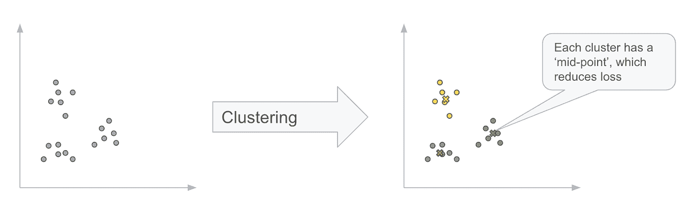

作者图片

聚类的数量通常更难确定，并且通常是执行分析的人的主要挑战。我们将花时间给出一个示例工作流和流程来帮助应对这一挑战。现在，考虑将操作集群化，以自动将我们的数据分组在一起。

# 数据

我们将使用公开可用的 [Google Analytics 360 样本数据集](https://support.google.com/analytics/answer/7586738?hl=en)，它托管在 BigQuery 上，包含来自 [Google 商品商店](https://shop.googlemerchandisestore.com/)的 12 个月(2016 年 8 月至 2017 年 8 月)模糊的 Google Analytics 360 数据，这是一家销售 Google 品牌商品的真实电子商务商店。我们还将构建合成的 CRM 数据来展示线下+线上数据的力量，这将提供一个更加全面的用户行为视图。


来自谷歌商品商店的截图

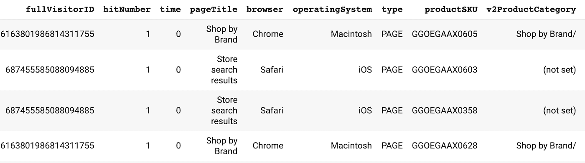

这是来自谷歌分析 360 的一些原始数据的样本

# 处理数据

为聚类构建特征(我们关心的个人属性)完全取决于我们试图解决的问题。在花太多时间处理数据集之前，您应该首先确定业务挑战。为了做到这一点，请咨询您的业务利益相关者，以确定您想要解决的问题。例如，您可能会假设人口统计和地理数据、SKU 或产品类别、重复购买者或首次购买者以及当前客户价值之间的关系。你会注意到这包括了分类特征和连续特征的混合。通常，如果您使用 scikit-learn、statsmodels 或其他软件包，这意味着需要时间来规范化和在数据中创建一个热编码。BigQuery ML 的一个直接优势是这个需求不存在！您可以以原始格式传递要素，而无需预处理。当然，花时间做探索性的数据分析并理解您的数据集，但是享受使用 BigQuery ML 节省的时间。

*本教程的一些问题和注意事项:*

在本教程中，我们将做一些假设。例如，我们将简化方法，并假设当 pagetype = "EVENT "时发生购买。您的 Google Analytics 360 设置可能会有所不同，因此您可能需要进行相应的调整。我们还使用 fullVisitorID 作为我们的 cookie 标签。虽然这是正确的，但我们建议您将 clientID 设置为自定义维度，其中 clientID 只是 fullVisitorID 的哈希版本。当你想在以后的道路上激活观众时，这是一个要求。我们还假设您有可以映射到 fullVisitorID 的离线数据。我们将创建 3 个 BigQuery 视图。第一个视图是聚合 GA360 数据，第二个视图是聚合 CRM 数据，最后是连接在一起，最终用于建模。这样，我们就可以创建我们的第一个视图了(注意，SQL 很长，所以我会在这篇博客中将其缩短，但是完整的代码可以在这个 [github repo](https://github.com/GoogleCloudPlatform/analytics-componentized-patterns/blob/master/retail/clustering/bqml/bqml_scaled_clustering.ipynb) 中找到)

```
*# We start with GA360 data, and will eventually build synthetic CRM as an example.* 
*# This block is the first step, which is just working with GA360
# I am cutting this code short for formatting.  See github for full code.*ga360_only_view = 'GA360_View'
shared_dataset_ref = client.dataset(DATA_SET_ID)
ga360_view_ref = shared_dataset_ref.table(ga360_only_view)
ga360_view = bigquery.Table(ga360_view_ref)ga360_query = '''
SELECT
  fullVisitorID,
  ABS(farm_fingerprint(fullVisitorID)) AS Hashed_fullVisitorID, 
  MAX(device.operatingSystem) AS OS, 
  SUM (CASE
       WHEN REGEXP_EXTRACT (v2ProductCategory, 
                           r'^(?:(?:.*?)Home/)(.*?)/') 
                           = 'Apparel' THEN 1 ELSE 0 END) AS Apparel,...
FROM
  `bigquery-public-data.google_analytics_sample.ga_sessions_*`,
  UNNEST(hits) AS hits,
  UNNEST(hits.product) AS hits_product
WHERE
  _TABLE_SUFFIX BETWEEN '20160801'
  AND '20160831'
  AND geoNetwork.country = 'United States'
  AND type = 'EVENT'
GROUP BY
  1,
  2
'''ga360_view.view_query = ga360_query.format(PROJECT_ID)
ga360_view = client.create_table(ga360_view)  *# API request*
```

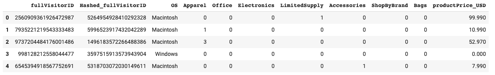

视图以这种格式创建数据

现在我们有了利用网站行为的基线数据集，我们希望将它与我们可能也了解的用户的离线数据结合起来。为了最好地展示这一点，我们将简单地生成合成数据。如果您有更好的数据源，请随意用您自己的流程替换这一部分。如果没有，请遵循以下步骤:

```
*# Create synthetic CRM data in SQL*CRM_only_view = 'CRM_View'
shared_dataset_ref = client.dataset(DATA_SET_ID)
CRM_view_ref = shared_dataset_ref.table(CRM_only_view)
CRM_view = bigquery.Table(CRM_view_ref)*# Query below works by hashing the fullVisitorID, which creates a random distribution.* 
*# We use modulo to artificially split gender and hhi distribution.*CRM_query = '''
SELECT
  fullVisitorID,
IF
  (MOD(Hashed_fullVisitorID,2) = 0,
    "M",
    "F") AS gender,
  CASE
    WHEN MOD(Hashed_fullVisitorID,10) = 0 THEN 55000
    WHEN MOD(Hashed_fullVisitorID,10) < 3 THEN 65000
    WHEN MOD(Hashed_fullVisitorID,10) < 7 THEN 75000
    WHEN MOD(Hashed_fullVisitorID,10) < 9 THEN 85000
    WHEN MOD(Hashed_fullVisitorID,10) = 9 THEN 95000
  ELSE
  Hashed_fullVisitorID
END
  AS hhi
FROM (
  SELECT
    fullVisitorID,
    ABS(farm_fingerprint(fullVisitorID)) AS Hashed_fullVisitorID,
  FROM
    `bigquery-public-data.google_analytics_sample.ga_sessions_*`,
    UNNEST(hits) AS hits,
    UNNEST(hits.product) AS hits_product
  WHERE
    _TABLE_SUFFIX BETWEEN '20160801'
    AND '20160831'
    AND geoNetwork.country = 'United States'
    AND type = 'EVENT'
  GROUP BY
    1,
    2)
'''CRM_view.view_query = CRM_query.format(PROJECT_ID)
CRM_view = client.create_table(CRM_view)  *# API request*
```

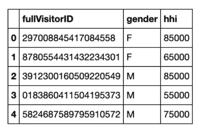

综合 CRM 数据的输出

运行上面的作业后，我们现在有了前两个视图。要将两者结合在一起，并创建我们的最终视图，过程非常简单:

```
*# Build a final view, which joins GA360 data with CRM data*final_data_view = 'Final_View'
shared_dataset_ref = client.dataset(DATA_SET_ID)
final_view_ref = shared_dataset_ref.table(final_data_view)
final_view = bigquery.Table(final_view_ref)final_data_query = f'''
SELECT
    g.*,
    c.* EXCEPT(fullVisitorId)
FROM **{**ga360_view.full_table_id.replace(":", ".")**}** g
JOIN **{**CRM_view.full_table_id.replace(":", ".")**}** c
ON g.fullVisitorId = c.fullVisitorId
'''final_view.view_query = final_data_query.format(PROJECT_ID)
final_view = client.create_table(final_view)  *# API request*print(f"Successfully created view at **{**final_view.full_table_id**}**")
```

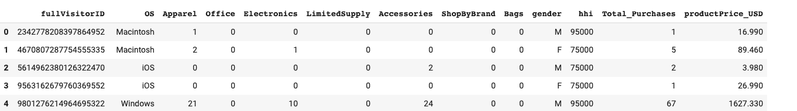

用于建模的最终数据集就是这个形状。我们现在可以开始建模了。

# 创建我们的初始模型

在这一节中，我们将建立我们的初始 k 均值模型。我们不会关注最优 k(我们构建的集群数量)或其他超参数。

一些附加要点:

1.  我们删除了作为输入的 fullVisitorId，因为它不是一个有用的特性。请记住，高基数数据对分组没有用处。
2.  我们既有分类特征，也有数字特征。
3.  我们不需要规范化任何数字特征，因为 BigQuery ML 会自动为我们做这件事。
4.  我们不为分类特征构建一个热编码，因为 BigQuery ML 也会为我们做这件事。

# 构建一个函数来构建我们的模型

我们将构建一个简单的 python 函数来构建我们的模型，而不是用 SQL 做所有的事情。这种方法意味着我们可以异步启动几个模型，让 BQ 并行运行。另一种方法是使用 [BigQuery 脚本](https://cloud.google.com/bigquery/docs/reference/standard-sql/scripting)(虽然串行完成，因此速度较慢)。

我们将从构建一个简单的模型开始，确保一切看起来都是正确的，然后改进我们的流程。第一步如下:

```
**def** makeModel (n_Clusters, Model_Name):
    sql =f'''
    CREATE OR REPLACE MODEL `**{**PROJECT_ID**}**.
                             **{**DATA_SET_ID**}**.
                             **{**Model_Name**}**` 
    OPTIONS(model_type='kmeans',
    kmeans_init_method = 'KMEANS++',
    num_clusters=**{**n_Clusters**}**) ASSELECT * except(fullVisitorID, Hashed_fullVisitorID) 
    FROM `**{**final_view.full_table_id.replace(":", ".")**}**`
    '''job_config = bigquery.QueryJobConfig()
    client.query(sql, job_config=job_config)  *# Make an API request.*
```

这创建了一个函数，将为我们建立一个模型，并允许用户定义 k(我们将建立多少个集群)。为了测试，让我们调用 k=3 的函数。

```
makeModel(3, "test")
```

一旦训练完成，您现在就有了一个存储在 BigQuery 中的模型对象，您可以通过单击模型在 Bigquery UI 中查看和引用它。我们建议您在开始时回顾一下您的模型对象的细节、训练、评估和模式，以理解我们刚刚做了什么。在后面的小节中，我们将向您展示如何以编程方式检索最终模型的统计数据。

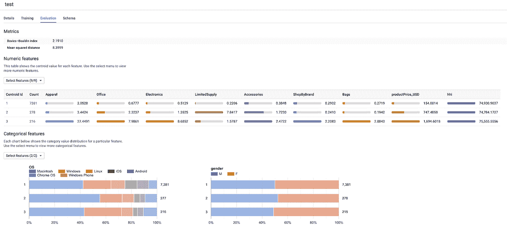

“模型评估”选项卡提供汇总统计数据

# 建立一个更好的模型

尽管我们刚刚完成了第一个 k-means 模型的构建，但我们仍然没有解决实现聚类过程时的主要问题——我们应该构建多少个聚类(k )?确定 k 的正确值完全取决于用例。有一些简单明了的例子可以告诉您需要多少个集群。假设您正在预处理手写数字——这告诉我们 k 应该是 10。或者，也许你的企业利益相关者只想开展三种不同的营销活动，并需要你识别三个客户群，那么设置 k=3 将是有意义的。但是，使用案例有时更加开放，您可能想要探索不同数量的聚类，以查看如何在每个聚类内以最小的误差将数据分组在一起。为此，我们可以使用肘方法，这是简单的图表损失对 k，以及[戴维斯-波尔丁分数](https://en.wikipedia.org/wiki/Davies%E2%80%93Bouldin_index)。

下面我们将创建几个模型来执行肘法并得到戴维斯-波尔丁评分。您可以更改 low_k 和 high_k 等参数。我们的流程将在这两个值之间创建模型。还有一个名为 model_prefix_name 的参数。我们建议您保留其当前值。它用于为我们的模型生成命名约定。

```
*# Define upper and lower bound for k, then build individual models for each k.* 
*# After running this loop, look at the UI to see several model objects that exist.*low_k = 3
high_k = 15
model_prefix_name = 'kmeans_clusters_'lst = list(range (low_k, high_k+1)) *#build list to iterate through k values***for** k **in** lst:
    model_name = model_prefix_name + str(k)
    makeModel(k, model_name)
    print(f"Model started: **{**model_name**}**")
```

现在我们可以开始分析我们的模型了。这样做的目的是为我们的用例确定正确的模型。

```
*# This will create a dataframe with each model name, the Davies-Bouldin Index, and Loss.* 
*# It will be used for elbow method and to help determine optimal K*df = pd.DataFrame(columns=['davies_bouldin_index',           'mean_squared_distance'])
models = client.list_models(DATA_SET_ID)  *# Make an API request.*
**for** model **in** models:
    full_model_id = f"**{**model.dataset_id**}**.**{**model.model_id**}**"
    sql =f'''
        SELECT 
            davies_bouldin_index,
            mean_squared_distance 
        FROM ML.EVALUATE(MODEL `**{**full_model_id**}**`)
    '''job_config = bigquery.QueryJobConfig()*# Start the query, passing in the extra configuration.*
    query_job = client.query(sql, job_config=job_config)  
    df_temp = query_job.to_dataframe()  
    df_temp['model_name'] = model.model_id
    df =  pd.concat([df, df_temp], axis=0)
```

现在，我们将绘制我们的值与聚类数的关系图，并得到一些值得分析的东西！

```
*# Plot the dataframe above*df['n_clusters'] = df['model_name'].str.split('_').map(**lambda** x: x[2])
df['n_clusters'] = df['n_clusters'].apply(pd.to_numeric)
df = df.sort_values(by='n_clusters', ascending=**True**)
df.plot.line(x='n_clusters', y=['davies_bouldin_index', 'mean_squared_distance'])
```

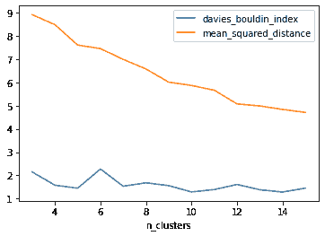

作者图片

如果您选择了自己的数据，或者如果您使用了一组不同的初始化标准，那么您可能会得到一些不同的值。如果您希望一致地返回相同的集群进行延伸运行，您可以[通过超参数选择](https://cloud.google.com/bigquery-ml/docs/reference/standard-sql/bigqueryml-syntax-create#kmeans_init_method)明确选择您的初始化。

上图中有几个标注值得讨论。首先从我们的橙色线开始(loss vs n_clusters)。我们看到，一般来说，随着集群的增加，我们的损失会减少，这是意料之中的。该线也以相对稳定的速度下降。这很常见，也是为什么用肘法不够的原因。偶尔，你可能会惊喜地发现，在某个点上，损耗变平了，形成了肘部形状。如果是这样，这表明连续的集群没有提供额外的价值。

因为我们看不到这个形状，我们可以继续看蓝线，戴维斯-波尔丁指数。一个简单的描述是，您可能希望使用该得分最低的聚类数。我们看到，在 k=5 时，我们有一个相对较低的分数，直到 k=10 时才被击败。我们决定评估 10 个独立的消费者群是没有意义的，因此我们将在 k=5 处结束。

# 分析我们最后的集群

如前所述，您可以在前端检查模型性能。我们建议您从这里开始，但是，有些用例需要以编程方式检索结果。为了做到这一点，使用 ML.CENTROIDS。

```
model_to_use = 'kmeans_clusters_5' *# User can edit this*
final_model = DATA_SET_ID+'.'+model_to_usesql_get_attributes = f'''
SELECT
  centroid_id,
  feature,
  categorical_value
FROM
  ML.CENTROIDS(MODEL **{**final_model**}**)
WHERE
  feature IN ('OS','gender')
'''job_config = bigquery.QueryJobConfig()*# Start the query*
query_job = client.query(sql_get_attributes, job_config=job_config) 
df_attributes = query_job.result()
df_attributes = df_attributes.to_dataframe()
df_attributes.head()
```

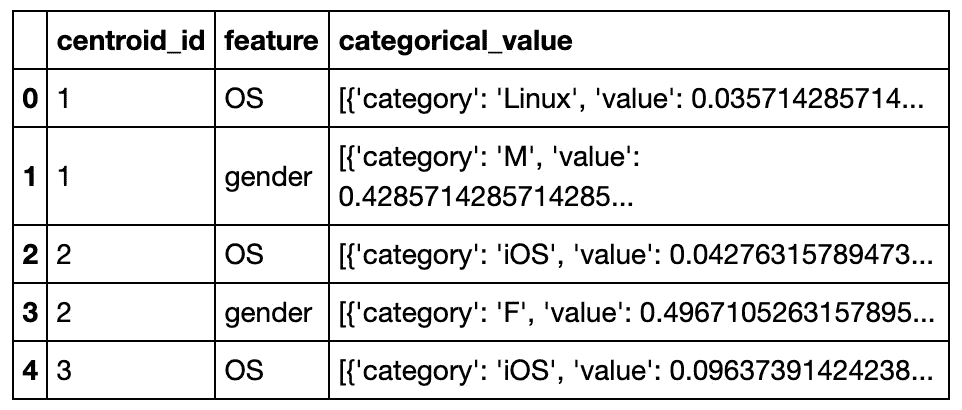

我们还可以使用下面更多的 SQL 来计算额外的汇总统计数据。两种 ML 的组合。预测和 ML。质心是有帮助的。

```
*# get numerical information about clusters*sql_get_numerical_attributes = f'''
WITH T AS (
SELECT 
  centroid_id,
  ARRAY_AGG(STRUCT(feature AS name, 
                   ROUND(numerical_value,1) AS value) 
                   ORDER BY centroid_id) 
                   AS cluster
FROM ML.CENTROIDS(MODEL **{**final_model**}**)
GROUP BY centroid_id
),Users AS(
SELECT
  centroid_id,
  COUNT(*) AS Total_Users
FROM(
SELECT
  * EXCEPT(nearest_centroids_distance)
FROM
  ML.PREDICT(MODEL **{**final_model**}**,
    (
    SELECT
      *
    FROM
      **{**final_view.full_table_id.replace(":", ".")**}**
      )))
GROUP BY centroid_id
)SELECT
  centroid_id,
  Total_Users,
  (SELECT value from unnest(cluster) WHERE name = 'Apparel') AS Apparel,
  (SELECT value from unnest(cluster) WHERE name = 'Office') AS Office,
  (SELECT value from unnest(cluster) WHERE name = 'Electronics') AS Electronics,
  (SELECT value from unnest(cluster) WHERE name = 'LimitedSupply') AS LimitedSupply,
  (SELECT value from unnest(cluster) WHERE name = 'Accessories') AS Accessories,
  (SELECT value from unnest(cluster) WHERE name = 'ShopByBrand') AS ShopByBrand,
  (SELECT value from unnest(cluster) WHERE name = 'Bags') AS Bags,
  (SELECT value from unnest(cluster) WHERE name = 'productPrice_USD') AS productPrice_USD,
  (SELECT value from unnest(cluster) WHERE name = 'hhi') AS hhiFROM T LEFT JOIN Users USING(centroid_id)
ORDER BY centroid_id ASC
'''job_config = bigquery.QueryJobConfig()*# Start the query*
query_job = client.query(sql_get_numerical_attributes, job_config=job_config) *#API Request*
df_numerical_attributes = query_job.result()
df_numerical_attributes = df_numerical_attributes.to_dataframe()
df_numerical_attributes.head()
```

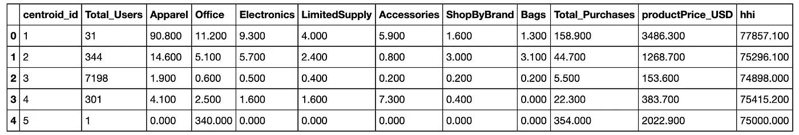

我们现在可以开始理解集群是如何基于上面提供的值构建的。我们看到以下内容:

第一类:服装购物者，他们也比平常购买得更多。这一部分(尽管是合成数据)偏向女性。

集群 2:最有可能按品牌购物，并对包感兴趣。该细分市场的平均购买量低于第一个集群，但是，这是价值最高的客户。

集群 3:人口最多的集群，这个购买量小，平均花费少。这部分人是一次性购买者，而不是品牌忠诚者。

群组 4:对配件最感兴趣，购买频率不如群组 1 和群组 2，但购买频率高于群组 3。

群组 5:这是一个异常值，因为只有 1 个人属于这个群组。

通过单击模型，还可以从 BigQuery 的 UI 中获得简单的输出。输出如下所示。

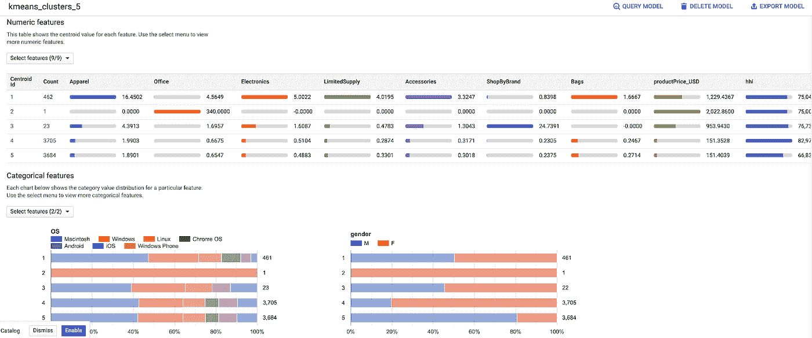

“模型评估”选项卡提供汇总统计数据

# 使用模型对新网站行为进行分组，然后将结果推送到 Google Analytics 360 进行营销激活

在我们有了一个最终确定的模型后，我们想用它来进行推理。下面的代码概述了如何对用户进行评分或将其分配到集群中。这些被标记为质心 ID。虽然这本身是有帮助的，但我们也推荐一个将这些分数吸收回 GA360 的过程。将您的 BigQuery ML 预测导出到 Google Analytics 360 的最简单方法是使用调制解调器(营销模型部署，[https://github.com/google/modem](https://github.com/google/modem))。MoDeM 帮助您将数据加载到 Google Analytics 中，以便最终在 Google Ads 中激活，显示&视频 360 和搜索广告 360。

```
sql_score = f'''
SELECT * EXCEPT(nearest_centroids_distance)
FROM
  ML.PREDICT(MODEL **{**final_model**}**,
    (
    SELECT
      *
    FROM
      **{**final_view.full_table_id.replace(":", ".")**}**
      LIMIT 1))
'''job_config = bigquery.QueryJobConfig()*# Start the query*
query_job = client.query(sql_score, job_config=job_config) *#API Request*
df_score = query_job.result()
df_score = df_score.to_dataframe()df_score
```

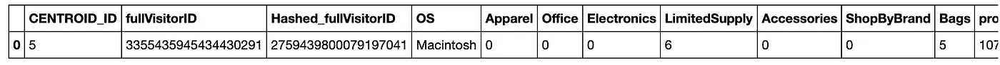

新的得分用户

# 清理:删除模型和表

下面的简单过程将删除所有模型和表格

```
*# Are you sure you want to do this? This is to delete all models*models = client.list_models(DATA_SET_ID) *# Make an API request.*
**for** model **in** models:
    full_model_id = f"**{**model.dataset_id**}**.**{**model.model_id**}**"
    client.delete_model(full_model_id)  *# Make an API request.*
    print(f"Deleted: **{**full_model_id**}**")*# Are you sure you want to do this? This is to delete all tables and views*tables = client.list_tables(DATA_SET_ID)  *# Make an API request.*
**for** table **in** tables:
    full_table_id = f"**{**table.dataset_id**}**.**{**table.table_id**}**"
    client.delete_table(full_table_id)  *# Make an API request.*
    print(f"Deleted: **{**full_table_id**}**")
```

# 把一切都包起来

在这个练习中，我们用 BigQuery ML 中的 k-means 完成了一些很酷的事情。最值得一提的是，我们能够将在线和离线用户级别的信息结合起来，以便更深入地了解我们客户的整体情况。我们已经对用户行为进行了建模，并详细介绍了一种确定最佳集群数量的方法。我们能够通过推理将这种洞察力应用到未来的行为中。最后，我们可以将这个推断分数导入 GA360，用于未来的营销活动。

# 想要更多吗？

请留下您的意见和任何建议或更正。

我是 Tai Conley，谷歌云平台的 AI/ML 专家客户工程师。你可以在 [LinkedIn](https://www.linkedin.com/in/taiconley/) 上找到我。

**感谢审稿人** : Abhishek Kashyap，Polong Lin 和 Oly Bhaumik。