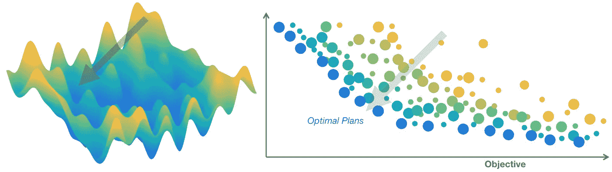
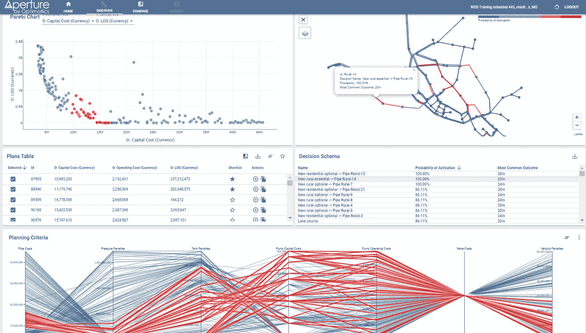
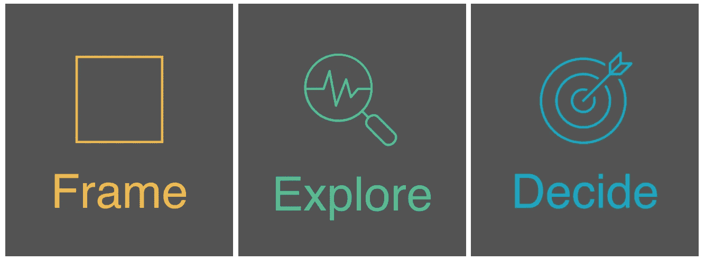
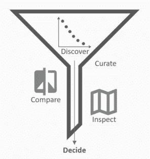

# 如何构建决策智能软件

> 原文：<https://towardsdatascience.com/how-to-build-decision-intelligence-software-four-lessons-from-launching-my-first-product-49cffd2c432c?source=collection_archive---------37----------------------->

## 发布我的第一个产品的四个教训

我们淹没在数据中，努力应对我们可以越来越多地建模，但仍然难以解释的复杂问题。我们现在比以往任何时候都更需要在医疗、金融和基础设施等重要领域做出明智的决策。

软件在帮助我们理解世界方面发挥着关键作用。软件产品为我们提供了克服认知盲点、扩展认知和建立联系的方法。决策智能工具代表了我们周围信息的实际应用中的一个巨大飞跃。

应用新技术是棘手的部分。我们想要利用计算和算法进步的可扩展解决方案。这就是产品领导力的用武之地。我们需要指导软件的创建，这样用户就可以利用它来推动他们组织的进步。决策智能软件在提高公司绩效方面发挥着重要作用。利用最佳实践的产品领导者通过提供可被广泛采用的解决方案来塑造成果。

> 我们如何最好地利用新技术来提高我们决策的质量？

在本文中，我将阐述决策智能软件的重要性和意义，并根据我设计和推出新产品的经验，介绍构建决策智能软件时需要考虑的重要因素。我将讨论管理复杂系统(水网络)的决策者用户，但是这些技术适用于不同的领域。

我希望这些经验教训对开发分析、决策支持和其他面向数据的企业产品以提高决策质量的其他技术专业人员有所帮助。

## 课程

1.  **设计最大化人机合作关系**
2.  **诬陷问题就是问题**
3.  **为每个用户类型和数据流中的工作流程步骤量身定制**
4.  **开放数据，方便连接(接口是关键)**

总的来说，我们运用[决策智能](/introduction-to-decision-intelligence-5d147ddab767)将信息转化为行动并改善结果。决策智能通常是数据科学、商业智能、决策建模和管理的结合。[组合](https://www.gartner.com/doc/reprints?id=1-1Z1XVMT6&ct=200518&st=sb)将取决于组织类型和问题背景。

在网络规划中，决策智能结合了三种方法。我们需要优化来生成最佳计划，需要数据科学来解释它们，需要决策分析来汇聚前进的方向。

这些网络是复杂的系统，需要产生复杂数据的软件。但是如果人们不能使用数据，那么数据又有什么用呢？

我定义了 Aperture 的愿景，这是我们今年在 Optimatics 推出的一款产品，它提供了一个由人工智能驱动的平台。Aperture 在优化结果和做出商业决策的用户之间提供了一座桥梁，因此他们充分认识到了多目标优化的好处。我们的算法允许用户考虑许多标准和决策，探索和评估数以千计的计划来改善他们的网络。有什么问题吗？没有一个最佳解决方案。

多目标优化解决方案探索过程。*(图片由作者提供。)*

用户从寻找解决方案到试图理解一系列策略，同时平衡相互竞争的目标。在这种平衡上的出色表现对我们的客户来说非常重要。他们的赌注很高，因为每个人都需要水。所以我们的挑战是:

> 我们如何将这些信息转化为行动？

用于优化结果的 Aperture 仪表盘。(图片由作者提供。)

用户需要一种筛选和理解优化数据的方法。为了满足这一需求，我们构建了 [Aperture](https://optimatics.com/aperture/) ，这是一个决策智能工具包，由交互式 web 仪表盘和基于云的数据平台组成。

技术只是等式的一面。如果一个系统很难建模，或者决策者努力实现相互竞争的目标，复杂性就会增加，这意味着没有一种方法是正确的。产品必须满足用户框架和决策的需要，需要决策者和软件之间的双向接口。为了实现人工智能提高决策质量的潜力，我们必须培养难以捉摸的人的因素。

**(1)设计最大化人机伙伴关系**

采用企业技术的主要驱动力是效率。客户希望增加他们的投资回报。优化是公司提升业绩的有效途径。

对于人类来说，分析结果数据的广度和深度以做出明智的决策通常是不可行的。算法可以获得人类通过纯粹的计算力无法获得的洞察力。但是我们这些普通人在我下面概述的简化的、迭代的工作流程的开始和结束阶段都扮演着关键的角色。

大局决策工作流程。(图片由作者提供。)

尽管预测分析令人兴奋，但机器学习只是整个[人工智能的一种方法](https://medium.com/@Francesco_AI/ai-knowledge-map-how-to-classify-ai-technologies-6c073b969020)(优化器体现了搜索范式和规划问题域)。我认为人工智能最令人兴奋的前景是增强人类的判断力——帮助我们做我们不擅长的事情。当然，其中一部分是解析大量数据，但还有更多，比如扩展我们的视角。

我们需要分工和可解释的数据，以便决策者充分利用，在现实世界和数据流之间架起一座桥梁。

> 我们如何最好地利用这种伙伴关系？我们应该如何弥合分歧？

以我管理的产品 Optimizer 和 Aperture 为例，我们的决策堆栈包括工程判断和领域专业知识、应用的[元启发式](http://www.scholarpedia.org/article/Metaheuristic_Optimization)算法(发现工具)、高性能计算和用户界面。

我们可以将二分法简化为用户(人类)和工具包的计算端(算法)。我们遵循人类算法特异性的规则，让计算机做它们最擅长的事情，为我们的用户提供最大的价值。

*   [ *框架*仍然需要人类来框架这个问题。即使是最先进的 AI 也无法定义自己的目标函数。人类以目标和标准的形式定义决策选项——可能性的领域——和期望的结果。
*   [ *探索* ]算法对信息进行编码，评估解决方案，解析模型和场景，将决策空间映射到目标空间，然后通过统计分析对数据进行后处理，如计算决策的概率和影响。
*   [ *决定* ]在工作流程的最后，由人类决定。他们使用判断和数据工具来平衡权衡，发现数据，并在统计、可视化和界面的帮助下研究一种方法。

值得注意的是，并不是所有的知识都包含在可用的数据中。模型中没有捕捉到许多现实世界的考虑因素，算法无法感知或访问这些因素。这就是为什么只有像谷歌这样的组织能够有机地充分利用数据:因为它们是建立在数据之上的。噪音——过量或质量可疑的数据——也是一个重要问题。

一个主要的难点是翻译人和计算机之间的逻辑，以及以有用的方式提取信息的方法。我希望我们的软件能够解决这个问题，解决整个工作流程，充分利用合作关系来帮助我们的用户做出决策。但是要做到这一点，我们要从框架开始。

**(2)框定问题就是问题**

一开始，一片寂静。然后是噪音。

客户使用软件来解决问题。对于决策智能软件来说，定义问题不仅是起点，也是最关键的一点。其他一切都取决于框架:纳入了哪些数据，可用的替代方案，以及决策者用来衡量进展的绩效指标。软件是一种工具，提供控制和定位，有时甚至是导航。高质量的决策是目的地。

用户需要能够描述约束、优先级和可用资源。数据收集和随后的解释必须以最终目标为动机，从而产生更现实和有用的结果。该框架还应该包括参考点，以便用户进行有用的比较，并指示[在结果方面将](https://taragonmd.github.io/2019/11/16/decision-quality-problem-solving-and-data-science/)集中在哪里。

技术本身并不是好的。数据并非天生有用。决策智能产品的新浪潮必须帮助指导用户定义他们的框架。有效的软件应该使决策者能够考虑全局并以最小的摩擦定义目标。但是，考虑到用户类型和他们在旅程中所处的位置，设计考虑会有所不同。

**(3)根据数据流中的每个用户类型和工作流程步骤定制分析**

正如我们呼吁人类和机器之间的专业化一样，我们也需要构建界面和分析内容来匹配用户及其工作流程步骤。当然，用户的旅程取决于产品应用。

我们构建 Aperture 来处理整个规划工作流程。Aperture 允许技术用户发现、比较和检查策略及其影响。他们策划优化程序计划，以便执行用户可以决定行动计划，并将其提交给利益相关者。

Aperture 技术用户旅程示例。(图片由作者提供。)

我受到启发，扩展用户工作流，为数据流中的决策者创造价值，使客户能够实现其软件订阅的全部潜力。每个工作流程步骤都是一个具有自己分析的仪表板。我们的设计原则是，每一个都应该易于共享、交互、适应和互连。仪表板数据反映了最新的优化结果，一个界面组件或仪表板中的计划选择反映在所有其他组件或仪表板中。

设计始于用户动机。高管用户希望理解数据，以做出合理的业务决策。他们的动机是追求清晰和透明，并最终管理风险。战略计划需要协调执行，并且经常是迭代的，因此它们使用预算阈值等控制点，用新的信息或优先级来细化框架。这意味着我们必须开放我们的软件。

**(4)开放数据，方便连接(接口是关键)**

开放数据为决策智能技术提供了一个影响放大器。通过将更多用户引入他们的生态系统，科技公司可以提高参与度，提供更多价值，并扩展他们的解决方案。

现在，我所说的开放，并不是指所有人都可以自由进入，没有任何顾虑。关键是将复杂转化为清晰。数据发现必须以上下文为基础，故事和界面要适合用户和目的，突出的数据要过滤掉可行性和噪音。所有这些都强调了监管的重要性——我将在下一篇文章中探讨这一点——以增加信息的相关性、有用性和可访问性

当着手开发后来成为 Aperture 的产品时，我注意到，对于每一个使用 Optimizer 的人来说，都会有更多的技术用户使用它产生的数据。对于这些技术用户中的每一个，下游会有其他利益相关者和决策者想要检查并提供反馈。

因此，我们有机会与从建模师和规划者到公用事业公司高管和公众的广大用户接触并向他们传递价值。为了实现这一目标，我们需要扩展我们的软件产品和工作流，为用户提供协作和共享计划的机会。是时候通过向一系列决策者开放规划过程来开放 Optimatics 了。

我们非常依赖数据可视化、映射和汇总统计来开放数据(大声喊出 [d3.js](https://d3js.org/) 、[传单](https://leafletjs.com/)、[熊猫](https://pandas.pydata.org/)和 [scikit-learn](https://scikit-learn.org/stable/index.html) )。我们的客户可以解释、实施和交流优化结果，从而在规划水网络时提高决策质量。但是每个产品领导者都会根据他们用户的需求组装他们自己的工具包。

一年前，我开始着手解决一个问题:帮助我们的客户理解他们的数据，以提高他们商业决策的质量。我最终发现了创建一个平台的机会，这个平台可以促进数据、工具和人之间的联系。我们通过开放产品来扩大我们产品的影响，现在随着我们的用户能够获得更丰富的见解，我们的产品得到了更广泛的采用。我希望您会发现这些课程对您自己的产品开发之旅有用。

软件和人工智能可以通过有价值的数据来帮助对抗熵。但是这需要深思熟虑的产品设计和工程来实现。创新工具改善重要领域复杂决策的潜力从未如此之大。我们去建吧。

如有任何问题或意见，请随时给我留言或评论。

*请继续关注我的下一篇文章，关于构建决策智能产品用于数据故事和管理。它将涵盖我们如何通过允许用户集合观点、聚合知识、将信息转化为决策、将决策转化为行动来创造可扩展的价值。*