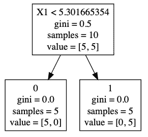
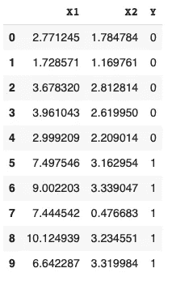
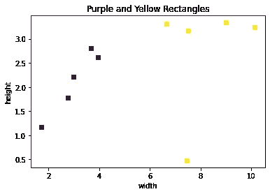
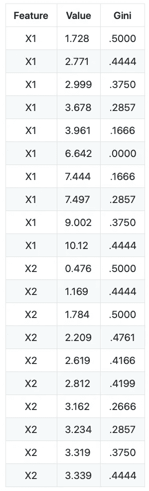
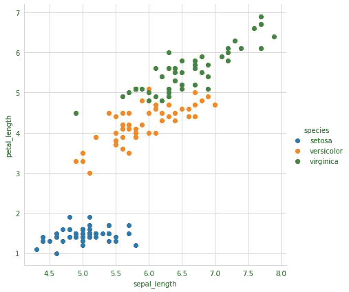
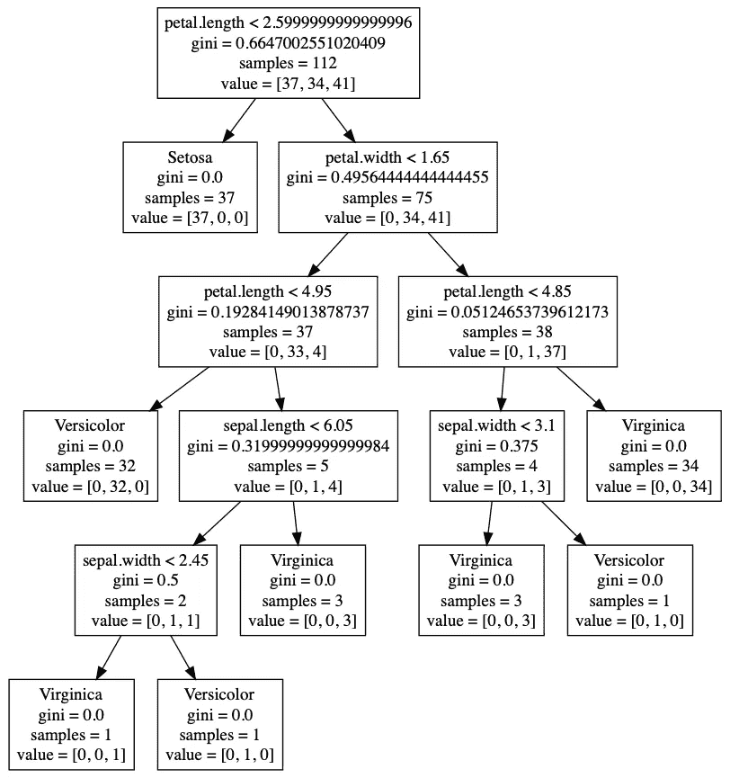

# 如何构建决策树

> 原文：<https://towardsdatascience.com/how-to-build-decision-trees-aa4c09114eba?source=collection_archive---------24----------------------->

## 使用 Python 示例从头构建简单的决策树

决策树是数据科学中进行预测的一种流行且强大的方法。决策树也形成了其他流行的集成方法的基础，如 bagging、boosting 和 gradient boosting。它的流行是由于该技术的简单性使其易于理解。我们将讨论为几个分类问题构建决策树。首先，让我们从一个简单的分类例子开始解释决策树是如何工作的。

## 代码

虽然本文主要描述构建和使用决策树的细节，但是在 my [GitHub](https://github.com/JimKing100/Decision_Tree_Live) 中可以找到用于拟合决策树、使用决策树进行预测以及打印绘制决策树的点文件的实际 Python 代码。

## 简单的例子

假设我们有 10 个不同宽度和高度的矩形。五个长方形是紫色的，五个是黄色的。数据如下所示，X1 表示宽度，X2 表示高度，Y 表示紫色矩形的等级 0 和黄色矩形的等级 1:

矩形数据

画出矩形，我们可以很清楚地看到不同的类。

矩形图

基于矩形数据，我们可以构建一个简单的决策树来进行预测。决策树由决策节点和叶节点组成。在下面的决策树中，我们从最上面的方框开始，它代表了树的根(一个决策节点)。根中的第一行文本描述了基于宽度(X1)小于 5.3 来拆分树的最佳初始决策。第二行代表最初的基尼系数，我们将在后面详细讨论。第三行代表初始水平的样本数，在本例中为 10。第四行表示节点的每个类中的项数——紫色矩形为 5，黄色矩形为 5。

矩形决策树

在按小于 5.3 的宽度(X1)分割数据后，我们得到两个叶节点，每个节点中有 5 个项目。所有紫色矩形(0)都在一个叶节点中，所有黄色矩形(1)都在另一个叶节点中。它们相应的基尼系数、样本大小和数值都会更新，以反映这种差异。

在这个非常简单的例子中，我们可以通过简单地检查矩形的宽度是否小于 5.3 来预测给定的矩形是紫色还是黄色。

## 基尼指数

构建决策树的关键是确定每个决策节点的最优分割。使用上面的简单例子，我们如何知道在 5.3 的宽度(X1)处分割根？答案在于基尼指数或分数。基尼指数是一个用来评估收入差距的成本函数。其定义如下:

所有类的 p(1-p)之和，其中 p 是一个节点中一个类的比例。由于 p 的和为 1，所以公式可以表示为 1 — sum(p 的平方)。基尼指数计算随机选择时某一特定特征被错误分类的概率，在 0 到 0 . 5 之间变化。

使用我们简单的 2 类示例，根节点的基尼指数是(1 — ((5/10) + (5/10) )) = .5 —矩形在 2 类中的平均分布。所以这个节点上 50%的数据集被错误分类。如果基尼系数是 0，那么在这个节点上我们的数据集将 100%被正确分类(0%不正确)。我们的目标是使用最低的基尼系数来构建决策树。

## 确定最佳分割

为了确定最佳分割，我们需要遍历所有特征，并将相邻训练样本之间的中点视为候选分割。然后，我们需要评估分割的成本(基尼系数)，并找到最佳分割(最低基尼系数)。

让我们看一个计算某项功能的基尼系数的例子:

1.  将 X1 按升序排序，我们得到第一个值 1.72857131
2.  让我们计算 X1 = 2.771245 的基尼系数
3.  对于类别 0，拆分是向左 1，向右 4(一个项目<= 2.771245, four items > 2.771245)
4.  对于类别 1，拆分为左侧 0 和右侧 5(零项目<= 2.771245, five items > 2.771245)
5.  左侧基尼系数为(1 — ((1/1) + (0/1) ) = 0.0
6.  右侧基尼系数为(1 — ((4/9) + (5/9) ) = 0.49382716
7.  拆分的基尼是左右两边的加权平均值(1 * 0) + (9 * 0.49382716) = .4444444

对每一行运行该算法，我们可以得到每个特征的所有可能的基尼系数:

基尼系数

如果我们看基尼系数，最低的是 0.0000，X1 = 6.642(1 级)。我们可以使用 6.642 作为阈值，但更好的方法是使用小于 6.642 的相邻要素，在这种情况下，X1 = 3.961(类 0)，并计算中点，因为这表示两个类之间的分界线。所以，中点阈值是(6.642 + 3.961) / 2 = 5.30！我们的根节点现在完成了 X1 < 5.30, a Gini of .5, 10 samples and 5 in each class.

## Building the Tree

Now that we have the root node and our split threshold we can build the rest of the tree. Building a tree can be divided into two parts:

1.  Terminal Nodes
2.  Recursive Splitting

**终端节点**

终端节点或叶子是决策树分支上的最后一个节点，用于进行预测。我们如何知道何时停止生长决策树？一种方法是显式地声明树的深度——在我们的例子中，将深度设置为 1。第一次分裂后，我们停止构建树，两个分裂的节点变成了树叶。更深层次的树会变得非常复杂，使数据过度拟合。

一棵树停止生长的另一种方式是一旦基尼系数为 0——那么就没有必要再分裂了。在我们的示例中，两个叶子的深度为 1，基尼系数为 0，因此实现终止的两种方法都满足。如果我们看终端节点，我们可以看到我们的预测。如果矩形的宽度(X1)小于 5.30，那么移动到树的左边，我们看到预测的类是 0 或紫色矩形。如果矩形的宽度(X1)大于 5.30，那么移动到树的右边，我们看到预测的类是 1 或黄色矩形。

矩形决策树

**递归分割**

现在我们知道了何时停止构建决策树，我们可以递归地构建该树。一旦我们有了根节点，我们就可以递归地左右分割节点，直到达到最大深度。我们从简单的例子中获得了所有的基本构件，但是为了演示递归分割，我们需要一个更复杂的例子。让我们使用著名的、有点累的 Iris 数据集，因为它在 scikit 中很容易获得，用于比较目的。

通过绘制虹膜数据，我们可以清楚地看到三个类别(Setosa、Versicolor 和 Virginica ),涵盖四个特征中的两个——萼片长度和花瓣长度:

虹膜数据集-萼片长度 x 花瓣长度

让我们递归地创建一个决策树，看看结果是什么样的。

Iris 决策树

在根节点我们有第一个花瓣长度的分割< 2.6 creating a leaf node with a Gini of 0.0 for Setosa and a decision node requiring a new split. We can clearly see the Setosa split in the graph at the midpoint between Setosa and Versicolor (petal_length = 2.6). Since the Gini is 0 for the left node, we are done and the leaf node is created just as we did with our rectangles. On the right side however, our right node has a Gini of .495\. Since we have the depth set to 5, we recursively split again on the right node. This continues until we hit a depth of 5, producing the decision tree we see in the graph.

## Pruning a Decision Tree

One downside of decision trees is overfitting. With enough depth (splits), you can always produce a perfect model of the training data, however, it’s predictive ability will likely suffer. There are two approaches to avoid overfitting a decision tree:

1.  Pre-pruning — Selecting a depth before perfect classification.
2.  Post-pruning — Grow the tree to perfect classification then prune the tree.

Two common approaches to post-pruning are:

1.  Using a training and validation set to evaluate the effect of post-pruning.
2.  Build a tree using a training set, then apply a statistical test (error estimation or chi-squared test) to estimate whether pruning or expanding a particular node improves the results.

I welcome constructive criticism and feedback so feel free to send me a private message.

Follow me on Twitter [@The_Jim_King](https://twitter.com/The_Jim_King)

这篇文章最初出现在我的网站上

参考代码和数据的文章包括:

[*机器学习精通——如何用 Python 从零开始实现决策树算法，杰森·布朗利 2019 年 12 月 11 日*](https://machinelearningmastery.com/implement-decision-tree-algorithm-scratch-python/)

[*GitHub—Joachim valente/决策树-cart，2019 年 10 月 8 日*](/decision-tree-from-scratch-in-python-46e99dfea775)