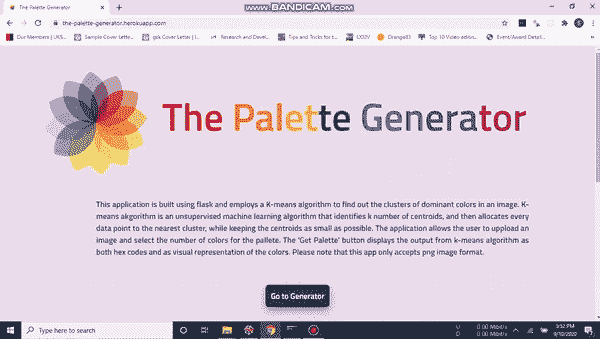
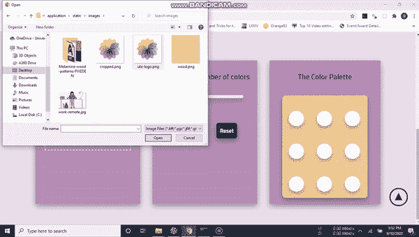
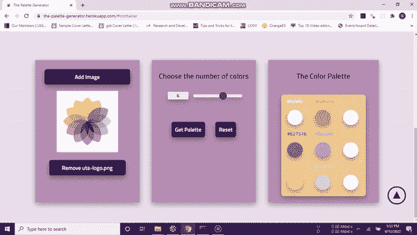
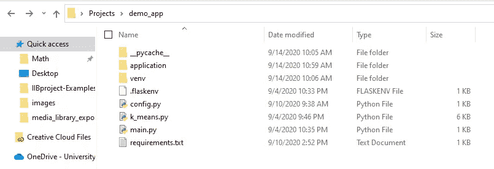
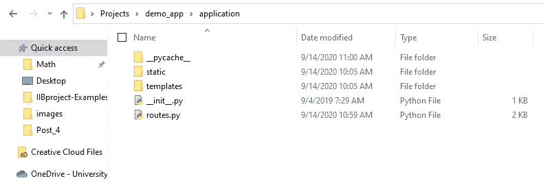
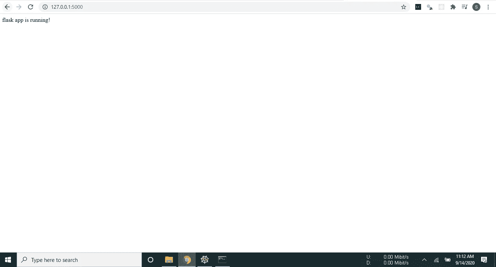

# 从头开始构建和部署一个无人监督的学习烧瓶应用程序

> 原文：<https://towardsdatascience.com/how-to-build-deploy-an-unsupervised-learning-flask-app-from-scratch-afd3a18661a7?source=collection_archive---------36----------------------->

## 学习构建一个部署在 Heroku 上的 web 应用程序，它使用 k-means 算法从上传的图像中挑选调色板。

图片来源:蒂娜·库珀

在这篇博文中，我将详细解释如何设置调色板生成器 web 应用程序。我将介绍设置 flask 应用程序架构的基础知识，用 python 构建 k-means 无监督学习算法的后端，用 html、css 和 javascript 构建前端。我还将介绍使用 jQuery 库连接前端和后端，以及将最终的应用程序部署到 Heroku。

这是我们将要构建的一个快速演示。

调色板生成器应用程序

选择图像文件

获取调色板

该项目的完整代码可以在我的 GitHub 上找到:

 [## saffafatima 12/调色板生成器应用程序

### 此时您不能执行该操作。您已使用另一个标签页或窗口登录。您已在另一个选项卡中注销，或者…

github.com](https://github.com/Saffafatima12/palette-generator-app) 

你准备好了吗？让我们开始吧！

# 设置基本的 flask 应用程序架构

设置一个基本的 flask 应用程序很简单。只需遵循以下步骤:

1.  用您的应用程序的名称创建一个文件夹。我称之为 demo_app
2.  打开命令行并安装 flask 模块
3.  cd 到 demo_app 文件夹中，创建一个名为 application 的文件夹(所有的前端都在这个文件夹中)
4.  现在创建。flaskenv、config.py、main.py、k-means.py 和 requirements.txt 文件(现在还不用担心这些奇怪命名的文件。我将在后面的段落中详细解释每个文件的功能)。
5.  在应用程序文件夹中创建一个 routes.py 文件和一个 __init__。py 文件。另外创建两个文件夹 static 和 template。在 static 中，为 css、图像和 javascript 创建子文件夹。在 templates 文件夹中创建一个名为 includes 的子文件夹。
6.  还可以使用以下命令安装 virtualenv 模块:pip install virtualenv。
7.  现在要创建一个虚拟环境文件夹，在命令行中运行命令 py -m venv venv。这将在您的 demo_app 的根目录下创建一个名为 venv 的虚拟环境文件夹。

完成后，您的 demo_app 的结构应该如下所示:

demo_app 文件夹

应用程序文件夹

现在我们可以将注意力转向填充我们刚刚创建的文件。

**The。flaskenv 文件:**在这个文件中，我们将把 flask 环境变量设置为 development，并将该文件链接到 main.py 文件。

**main . py 文件:**在这个文件中，我们将从应用程序文件夹中导入我们的 flask 应用程序。

**config . py 文件:**在这个文件中，我们将为 cookies 创建一个密钥。一旦我们在 Heroku 上部署我们的应用程序，这将非常重要。

k-means.py 文件:我们的 k-means 算法将进入这个文件。

requirements.txt 文件:在这个文件中，您将记录应用程序运行所需的所有依赖关系。要填充这个文件，您首先需要进入虚拟环境。您可以通过简单地 cd 到根目录并从命令行运行 venv/scripts/activate 来实现这一点。现在在 venv 中运行 pip freeze > requirements.txt 来记录你当前所有的依赖关系。请记住，在构建应用程序时，您需要更新此文件及其所有依赖项。你可能会注意到烧瓶没有安装在 venv 内。只需使用 pip install flask 命令安装它，并更新 requirements.txt 文件。

**_ _ init _ _。py 文件**:这里我们只是初始化 app 对象并将其连接到 routes.py 文件

**routes . py 文件**:这里我们定义当用户路由到某个网址时运行的函数。为了检查一切是否正确，定义一个函数“run ”,返回字符串“flask app 正在运行！”当用户路由到本地服务器地址后的“/”时。

返回命令行(确保您在虚拟环境中，并运行命令‘flask run’。您应该得到一个输出，提供您的应用程序运行的地址。将它复制并粘贴到您的浏览器中，您应该会得到以下输出。

flask app 正在运行！

如果到目前为止一切正常，那么恭喜你！现在，您已经准备好进入构建调色板生成器应用程序的下一个阶段。

# 编写 k-means 算法文件并将其连接到应用程序

现在我们可以开始为调色板生成器应用程序编写 k-means 算法了。

K-means 算法是一种非常简单的无监督机器学习技术。该算法采用 n 个数据点，并根据数据点和聚类质心之间的距离将它们划分为 k 个聚类。该算法旨在最小化每个数据点到其所属聚类的质心的距离。聚类的数量通常由算法的外部输入来指定。对于调色板生成器应用程序，我们希望算法能够识别相似颜色的像素簇。

我们首先导入所有必要的依赖项，并创建一个 get_points 函数。get_points 函数接收一个图像，将其大小调整为 200×400 像素，并将其转换为 RGB 格式。然后，该函数为预处理图像中的每个像素创建一个 rgb 元组列表。下面给出了带注释的代码。

现在，首先我们将创建两个名为 Point 和 Clusters 的类，它们的属性如下面的代码所示。然后，我们将创建一个函数，根据两个像素的 rgb 值来计算它们之间的欧几里德距离。

现在，我们必须创建一个包含一些函数的 k-means 类。我们将首先有一个初始化器，其中包含该类的属性，即类的数量和每个类的最小差异。

然后，我们创建 calculate_center 函数，它主要计算一个聚类的平均 r，g，b 值，并将其转换为具有这些值的点类。

assign_points 函数计算图像中每个点与每个聚类的质心之间的欧氏距离，并将该点分配给与该点距离最小的聚类。它返回每个聚类的点列表。

拟合函数使用先前定义的函数从图像中的点列表中生成聚类。

最后，我们将使用我们到目前为止定义的所有东西来构造 get_colors()函数。该函数将接受一个图像和聚类数作为输入参数，并返回颜色的十六进制值列表。列表的长度将等于输入的聚类数。

# 用 html 和 css 构建前端

现在我们可以用 html 和 css 创建前端了。在模板文件夹中，创建一个 index.html 文件。您可以选择在 index.html 文件中编写完整的 html 代码，或者只在 index.html 文件中保留基本的 html 框架，而在 includes 文件夹中的小 html 文件中编写其余的代码。我更喜欢后一种选择，因为当代码是小片段而不是一个大文件时，编写和调试代码要容易得多。每当您希望将代码包含在一个小文件中时，只需将所有代码复制到新创建的文件中，并在 index.html 文件中包含{ % include ' file _ path _ to _ your _ html _ file ' % }。标题的例子是:

{ % include " Includes/header . html " % }。

对于 html，您需要创建三样东西:

1.  允许用户上传图像的文件选择器
2.  一个滑块/文本框，允许用户在调色板中输入他们想要的颜色数量
3.  k-means 算法输出中的颜色显示。

使用 css 添加一些样式。将 css 文件保存在静态文件夹的 css 文件夹中，并在 index.html 文件中引用它们。

您还可以通过链接您的。js 文件在 java script 文件夹中静态保存到 index.html 文件中。

# 使用 j-Query 连接前端和后端

现在您已经构建了前端，我们可以开始使用 routes.py 文件了。

在 route.py 文件中，我们将添加一个在路由到服务器地址时呈现页面的函数。

现在，我们需要有一种方法将用户输入传递给 k-means 算法，并将算法的结果返回给用户。我们将假设从页面中获得一个名为 message 的 json 对象，它有两个键:image 和 name。image key 的值是 base 64 编码的图像，而 name 的值是用户输入的颜色数。我们将把图像对象解码成 Python 可以处理的格式，然后将它传递给从 k-means.py 文件导入的 fit()函数。然后，我们将使用输出，如果你记得是一个十六进制代码的颜色列表，并将它转换成一个名为响应的字典。然后，我们将使用 jsonify 函数将字典转换成 json 对象。

完成 routes.py 文件后，我们可以将注意力转向 index.js 文件，我们将在其中编写所有的 jQuery 代码。

好的，jQuery 方面发生了很多事情，我将尽力以一种容易理解的方式来解释它。

我的想法是读取图像输入，并在应用程序上显示图像。当用户按下“Get color palette”按钮时，k-means 算法的输出用于显示颜色的名称以及调色板区域中的圆圈填充。

为此，我们首先需要定义一个函数来读取上传的图像。要理解下面的代码，您需要对 jQuery 有一些基本的了解。你的代码很有可能和我的不一样，因为我的 html 代码和你的 html 代码不一样，但是我觉得大致思路应该是一样的。因此，该函数基本上是在加载图像文件时读取图像文件输入，并从图像中剥离元数据。我已经为图像插入了一个 console.log()函数，只是为了看看是否一切正常。

我们还需要有一个功能来处理颜色和颜色名称的显示后，获得调色板按钮被点击。为此，我想出了下面的代码。

代码生成了我们在 routes.py 文件中使用的名为 message 的 json 对象。代码还引入了 routes.py 文件中的响应 json 对象，用于更改圆圈的颜色，并在应用程序的调色板区域显示颜色名称。

您可以对 jQuery 代码进行更多的调整，以进一步定制应用程序。

# 在 Heroku 上部署应用程序

一旦您对 jQuery 感到满意，您就可以将您的应用程序部署到 Heroku。为了部署到 Heroku，我们需要在根目录中创建一个 Procfile。

在您的虚拟环境中安装 gunicorn 包。

您还需要用以下代码创建一个 wsgi.py 文件:

另外，记得更新 requirements.txt 文件中所有添加的依赖项，并将发布地址更新为“您的应用程序名称”。herokuapp.com

现在用 git init 和 git add 命令创建一个 git 存储库(您也可以在早期创建它，并跟踪您在项目中所做的更改)

为了将内容上传到 Heroku，请在 Heroku 上创建一个帐户，并在您的机器上安装 Heroku CLI。通过键入 heroku login 并按照说明进行操作，从命令行登录 Heroku。完成后，使用命令创建一个新的 Heroku 应用程序:heroku create 。现在使用 git 命令将您的应用程序推送到 heroku:git push heroku master。您应该会收到一个很长的输出，包括您的应用程序的网址。

如果发现错误，可以使用 heroku logs-tail 命令进行调试。一旦你排除了任何错误(或者幸运的是没有任何错误)，导航到网页找到你的应用程序部署在它的全部荣耀！

调色板生成器应用程序

**鸣谢:**

我的 k-means 算法的代码来自一个神奇的 Colab 笔记本，可以在 Venelin 的网站上找到:[https://www.curiousily.com/](https://www.curiousily.com/)。你绝对应该看看维尼林的博客。太棒了！:)