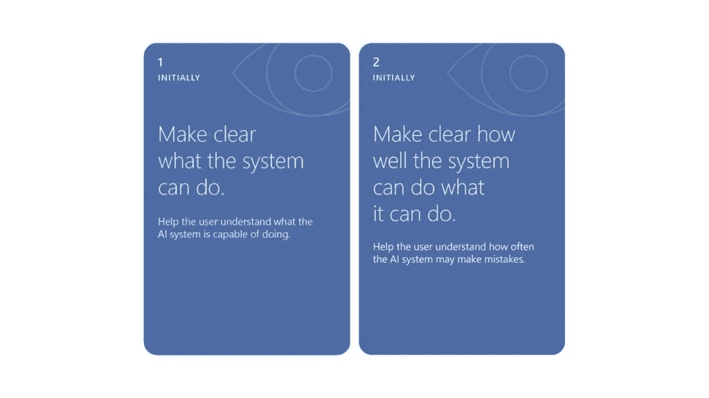

# 如何建立有效的人机交互:对机器学习和软件工程的思考

> 原文：<https://towardsdatascience.com/how-to-build-effective-human-ai-interaction-considerations-for-machine-learning-and-software-409838d9b358?source=collection_archive---------15----------------------->

图片来源:微软研究院

为了帮助从业者设计更好的面向用户的基于人工智能的系统，微软最近发布了一套基于数十年研究并通过各种人工智能产品的严格用户研究验证的人机交互指南[。这些指南涵盖了广泛的交互:从用户最初被引入人工智能系统开始，扩展到持续的交互，人工智能模型更新和改进，以及管理人工智能故障。](https://www.microsoft.com/en-us/research/publication/guidelines-for-human-ai-interaction/)

虽然指南描述了*人工智能从业者应该创造什么来支持有效的人-人工智能交互，但这一系列帖子解释了*如何在基于人工智能的产品中实施指南。**

我们关注机器学习和软件工程的含义，因为在大多数情况下，实施任何指南都不能仅仅通过前端接口调整来支持。例如，如果算法本身是不透明的，解释算法的行为(准则 11)是不可能的。在另一个例子中，如果记录基础设施和设备没有跟踪正确的信号，或者如果该信息是有噪声的，则根据用户的当前环境识别和定制信息(准则 3 和 4)可能是不可能的。

这一系列的帖子提出了机器学习从业者和软件工程师今天可以采取的行动，以实现指导方针所描述的有效的人机交互。

1.  第一部分讨论了在用户与人工智能系统的初始交互过程中，你可以用来帮助他们设定正确期望的方法。
2.  第二部分将讨论如何基于上下文处理和定时服务。
3.  第三部分将集中在当前的方法，以减轻偏见和适应用户的社会规范。
4.  第四部分将把注意力转移到系统可能出错时的处理情况。
5.  第五部分将扩展支持交互体验的含义。

# 第一部分:最初设定正确的期望

在这一部分中，我们重点关注在人和人工智能系统之间的初始交互过程中设置正确期望的两条准则:

**准则 1** :明确系统能做什么。
**准则二**:明确系统能做什么，做得有多好。

对于任何面向用户的软件来说，明确系统的功能和限制是非常重要的。这对于基于人工智能的系统来说可能尤为重要，因为人们通常对自己的能力抱有不切实际的期望。传递这些信息的传统技术包括用户手册、内置文档和上下文帮助。不幸的是，今天我们仍然不知道如何为人工智能软件生产这样的工件。以一个问题回答系统为例，比如你最喜欢的个人助理(比如 Alexa、Cortana、Google Assistant、Siri)。我们能精确描述它在哪些领域能回答问题，哪些领域不能吗？如果是这样，我们是否总是知道它在每个域中有多精确？如果助手能够回答历史问题，是否意味着它也能回答地理问题？机器学习工程师能自信地描述这些方面吗？膨胀的用户期望加上缺乏对人工智能系统能力的清晰了解，在最好的情况下会导致不满、不信任或产品放弃，在最坏的情况下会导致伤害、不公平和伤害。

下面，我们概述了工程师和模型开发人员现在可以采取的最佳实践和行动，以帮助终端用户清楚地了解人工智能系统的能力和局限性。

# 当评估一个人工智能模型的能力和局限性时，不要局限于总的、单一分数的性能数字。

弄清人工智能系统的能力和局限性，首先要对人工智能的潜在行为有一个更全面的理解。这需要重新思考当前依赖于综合、单一分数绩效数字的评估实践。

在机器学习评估中，通常使用诸如“ *Model X 对于给定的基准有 90%的准确性*”这样的声明来报告模型性能。这个总数很难告诉我们，我们是否应该期望整个基准测试的性能是一致的，或者在这个基准测试中是否有一些数据的准确性要低得多。在实践中，由于训练数据中的偏差或者因为一些概念可能比其他概念更难学习，后者发生得更频繁。这种行为的一个众所周知的例子是 [GenderShades](http://proceedings.mlr.press/v81/buolamwini18a/buolamwini18a.pdf) 研究，该研究表明，面部识别算法在性别检测方面的性能对于肤色较深的女性来说明显低于其他人口统计群体。如果系统工程师自己都不清楚这些差异，那么向最终用户和客户解释这些差异就更加困难了。

多方面、深入的误差分析可以帮助我们回答以下问题:*该模型是否对所有人口统计群体都同样准确？* *是否有任何环境或输入上下文使模型表现明显更好或更差？* *在第 99 个错误百分点时，系统性能有多差？*

要进行多方面、深入的错误分析，请考虑以下实践:

*   **检查不同粒度级别的故障模式** — [Pandora](https://www.microsoft.com/en-us/research/publication/towards-accountable-ai-hybrid-human-machine-analyses-for-characterizing-system-failure/) 是一种可以帮助以概括的方式描述故障的方法。Pandora 提供了一组在不同抽象级别上运行的性能视图:全局视图(传达整体系统性能)、集群视图(针对单个数据区)和实例视图(解释单个数据点的性能)。对于每个视图，可以查看一个或多个输入要素的组合如何与模型性能相关联。在这些视图之间来回切换使开发人员能够更好地理解不同上下文中的失败，方法是根据出错的可能性来分割数据。例如，这项工作的结果表明，对于具有丰富和多模态输入空间的系统，不同区域的性能可能非常不同，并且这些差异可能因非常不同的原因而出现。
*   **检查不同数据切片的故障模式** —在语言领域， [Errudite](https://www.aclweb.org/anthology/P19-1073.pdf) 工具允许开发人员以灵活的方式查询输入数据，并根据错误率描述结果集的特征。Errudite 通过引入具有语义意义的数据选择操作符，使数据切片变得更加容易。此外，该工具还支持临时数据编辑，从而支持反事实分析(即*如果某个特定示例略有不同，会发生什么？*)。

# 使用多个现实的基准进行评估。

使用任何指标评估人工智能的能力和局限性通常需要在一些数据上测试人工智能模型。在已知的公共基准上评估人工智能模型总是一种好的做法。与其他先进技术相比，它提供了系统性能的量化视角。然而，由于两个原因，它不应该是唯一的评价手段。

首先，在每个模型改进周期中，一次又一次地优化单个基准可能会导致隐藏的过度拟合。例如，即使模型没有在基准上训练或验证，建模决策的归纳偏差可能已经被导向基准改进。不幸的是，这种做法常常受到我们在大型比赛和学术文章中报告和奖励表现的方式的激励，这提出了一个重要的问题，即我们如何在使真实系统更加可靠的背景下重新思考这些做法。

其次，来自我们自己的应用程序的数据可能看起来与基准分布非常不同。基准人脸检测数据集可能不包括与您的应用程序将在其中操作的各种角度或光照条件相同的图像。此外，随着人们使用系统并使他们的行为适应系统，这些条件可能会随着时间而改变。

为了缓解这些问题，您可以:

*   根据多个基准而不是一个基准来监控模型。这样，您可以检查模型改进和调整是否在不同的基准上通用。
*   将基准划分为不同的用例集，并监控每个用例的性能，以便当泛化失败时，您可以将其映射回用例的类型。
*   在评估中包括来自真实应用程序的数据。如果您担心没有足够的真实应用程序使用数据，那么好消息是，对于评估，您可能不需要培训所需的那么多数据。即使是少量的真实数据也可能暴露原本隐藏的错误。
*   通过数据扩充(例如，视觉转换)、在合成对抗分布下进行测试，以及在评估过程中引入红队概念，以识别在已知基准中无法观察到的错误，来丰富您的评估数据。

还值得一提的是，任何类型的基准充实或评估都需要特别关注与隐私相关的问题，以便评估过程本身不会泄露用户敏感数据。

# 在检查人工智能的行为和性能时，包括以人为中心的评估指标。

为了更好地确保我们的人工智能以最终用户期望的方式行事，并与他们的价值观保持一致，我们需要在我们的评估中包括以人为中心的指标。最常用的评估指标之一是模型准确性。然而，准确性可能并不总是转化为用户满意度和成功的任务表现。[对指标设计的调查](https://arxiv.org/pdf/1607.08822.pdf)表明，在机器翻译和图像字幕等领域，存在人们关心但当前指标无法代表的模型性能的隐藏维度。类似地，[人们感知准确性的方式可能与计算的准确性大相径庭](https://www.microsoft.com/en-us/research/publication/understanding-the-effect-of-accuracy-on-trust-in-machine-learning-models/)；这种差异取决于与存在的误差类型和[向最终用户解释](https://www.microsoft.com/en-us/research/publication/will-you-accept-an-imperfect-ai-exploring-designs-for-adjusting-end-user-expectations-of-ai-systems/)系统精度的方式相关的多种因素。

以人为中心的人工智能评估指标，与人类对质量的概念和期望更密切相关，正在不断出现。当在[决策任务](https://academic.oup.com/qje/article-abstract/133/1/237/4095198?redirectedFrom=fulltext)或[混合主动性系统](https://www.microsoft.com/en-us/research/publication/principles-mixed-initiative-user-interfaces-2/)中使用一个模型来帮助人类时，这样的指标尤其重要。可以考虑使用的一些指标包括:

*   **可解释性** — *人类对模型如何决策的理解程度如何？*
*   **公平性** — *该模型在不同的人口统计群体上是否有可比较的表现？系统是否为这些小组分配了相当数量的资源？*
*   **团队效用** — *人类和机器合作表现如何？团队表现是否比任何一方单独表现更好？*
*   **性能可说明性** — *当系统出错时，人能提前预料到吗？*(下一节将详细介绍)
*   **互补性**——*机器是简单地取代了人类，还是更专注于人类需要帮助的例子和任务？*

这些度量标准的准确和正式的定义取决于领域，并且对于哪种定义最适合应用程序经常存在分歧。然而，这些讨论已经导致了一些开源贡献，以用于计算的库的形式，有时还优化了这种以人为中心的度量: [InterpretML](https://github.com/interpretml/interpret) ， [FairLearn](https://github.com/fairlearn/fairlearn) ， [AI Explainability 360](https://www.ibm.com/blogs/research/2019/08/ai-explainability-360/) 。

请记住，在一天结束的时候，这些度量标准都不能代替实际人员的评估，例如用户研究。如果人工评估对于您的情况来说太耗费资源，那么至少可以考虑使用人工注释器来检查较小的数据分区，以了解您选择的代理度量与您的应用程序场景中的人工质量概念的一致性。

# 部署其性能更容易向人们解释的模型。

在模型优化和超参数搜索过程中，我们可能会有多个同样或类似精确的模型假设。在这些情况下，在决定部署哪个模型时，除了准确性之外，还要考虑性能的可解释性。性能可解释性使模型更加以人为中心，因为它使人们能够更好地理解和预测模型何时可能出错，以便人们可以在需要时接管。在最近的一项[以人为中心的研究](https://www.microsoft.com/en-us/research/publication/beyond-accuracy-the-role-of-mental-models-in-human-ai-team-performance/)中，我们表明，当一个人与一个 ML 模型合作进行决策时，团队绩效会受到人们理解和预测模型*错误界限*的程度的显著影响(即，模型在哪里出错，在哪里成功)。

要确定一个具有更好的性能解释能力的模型，请考虑以下因素:

*   选择具有高度*简约性*的模型(即，当系统出错时，你需要多少信息块来描述，错误解释有多复杂？)和低*随机性*(即，在多大程度上可以通过错误解释干净地将错误与成功实例分开？).
*   为了测量感知的简约性和随机性，尝试通过训练简单的可解释的基于规则的分类器，如决策树或基于先前交互的[规则列表](https://www.ncbi.nlm.nih.gov/pmc/articles/PMC5108651/)，来逼近关于错误边界的人类心理模型(即，人类对错误边界的了解)。学习到的心智模型当然只是近似或模拟，但是如果它们足够简单，我们可以确保它们不会添加任何关于人们如何学习的误导性假设。

在未来，我们希望看到更多的工作来实现更好的模型选择，通过[增加损失函数](https://besmiranushi.com/docs/Backward_Compatibility_in_AI.pdf)或通过[约束最小化](https://arxiv.org/pdf/1905.10660.pdf)，作为模型优化和训练的一部分，目标是训练模型，使人类能够发展明智和合理的信任。

# 在调整模型参数时，考虑错误的成本和风险。

尽管一个给定的系统可能会犯许多类型的错误，但它们发生的可能性并不相同，而且它们还可能与不同的应用程序相关成本相关联。例如，在许多医学应用中，假阴性错误的成本可能比假阳性高得多，特别是如果在疾病存在时不治疗的后果比相应的副作用更危及患者的生命。正如你可能已经猜到的，明确地估计这样的成本和风险对于高风险的决策是特别必要的。风险评估的良好实践是在部署应用程序之前进行用户研究或试点研究，以预测潜在错误的影响。

成本估计可用于通知模型参数的调整。然而，目前大多数模型被训练得更一般，并且不针对与领域相关联的成本进行定制，主要是因为这些成本对于开发者来说通常是未知的，并且它们可能从一个消费者到另一个消费者而变化。因此，大多数模型都是在简单的 0/1 损失的标准近似值上训练的，希望它们能用于一般应用。意识到这样的成本估计困难，仍然有必要注意到，至少对于整个领域共享相似且已知的非均匀错误成本的情况，像[成本敏感学习](https://www.researchgate.net/publication/4047552_Cost-Sensitive_Learning_by_Cost-Proportionate_Example_Weighting)或[重要性采样](https://www.microsoft.com/en-us/research/publication/pattern-recognition-machine-learning/)这样的技术可以帮助捕捉不同示例的敏感性。例如，如果假阴性比假阳性代价更高，那么可以在优化过程中给这些情况分配更多的损失。其他技术包括过度(或不足)表示特定类别的实例，或者对接近决策边界的实例进行不同的加权。

当不同消费者的成本不同时，从长期来看，模型部署、编排和维护会带来额外的复杂性。然而，随着云部署服务的不断进步(例如，AzureML 上的[MLOps](https://github.com/microsoft/MLOps))，这项任务已经变得更加触手可及。这些服务通常倾向于将不同的模型版本容器化，并提供给不同端点的客户。

# 校准并解释不确定性。

到目前为止，我们介绍的技术更适合在全局级别或一组实例上描述和测量系统性能。然而，由于模型性能可以从一个实例到另一个实例而变化，在交互期间在单个实例上表达模型性能也可以帮助为最终用户设置适当的期望(例如，在单个实例上传达模型不确定性)。[模型校准](http://datascienceassn.org/sites/default/files/Predicting%20good%20probabilities%20with%20supervised%20learning.pdf)旨在将机器学习预测与仔细校准的置信度分数相关联，置信度分数反映了误差的概率分布。这将意味着，如果一个模型以 95%的置信度识别图像中的交通灯，如果您将模型预测准确性视为一个随机变量，则失败的可能性确实是 5%(在大量样本中)。

今天，许多开箱即用的机器学习算法都没有将校准的不确定性作为默认属性。一些例子包括朴素贝叶斯模型、支持向量机甚至神经网络。可用于不确定度校准的一些方法包括:

*   后处理技术(如[普拉特缩放](https://www.researchgate.net/publication/2594015_Probabilistic_Outputs_for_Support_Vector_Machines_and_Comparisons_to_Regularized_Likelihood_Methods)或[保序回归](https://www.researchgate.net/profile/Charles_Elkan/publication/2571315_Transforming_Classifier_Scores_into_Accurate_Multiclass_Probability_Estimates/links/0fcfd509ae852a8bb9000000.pdf))，这些技术不会改变模型的训练方式，但会对模型不确定性预测进行后处理，以便输出概率最好地反映误差。幸运的是，这些技术在 scikit-learn 等流行的 ML 库中很容易得到。如果你在问自己这些技术如何应用于深度学习，[这个调查](https://arxiv.org/pdf/1706.04599.pdf)提供了一个全面的总结。
*   内置技术(如[自举](https://papers.nips.cc/paper/6501-deep-exploration-via-bootstrapped-dqn.pdf)或[不确定性估计的放弃](http://proceedings.mlr.press/v48/gal16.pdf))，通常适用于特定的模型类别，但也可用于更广泛的环境。例如，概念，如辍学正则化，自举和系综显示，以改善不确定性估计。虽然这些方法中的一些确实有更多的计算要求(例如，深度网络的集合)，但考虑它们仍然是一个好主意，特别是对于高风险领域。
*   当难以进行精细的不确定性估计时，如果数据稀疏，“粗略”和粗粒度校准可能比根本没有校准要好。毕竟，人们不会对 75%或 76%的信心有太大的区别。但是，如果信心从 75%变为 90%，他们的决定可能会发生巨大变化。通过将原始模型输出分数映射到更大的置信度桶，粗粒度校准可以与事后技术集成。区分这些情况仍将有助于在不确定时以不同的方式表达答案，例如，“*我还不知道如何回答这个问题。我不确定，但我想答案可能是…*

尽管模型置信度\不确定性是表达预期性能的一种简洁明了的方式，但重要的是要意识到实践中可能出现的两个主要挑战:

1.  不确定性解释——生产中使用的不确定性分数可能并不总是容易解释，尤其是对于具有高维度和丰富输出的系统。以向视觉受损的用户提供场景描述的图像字幕系统为例。该系统已经向用户提供了下面的标题“一群人围坐在桌子旁吃晚餐”，并且 80%有把握。用户应该如何理解这种信心？这是否意味着场景中根本没有人？还是说他们不是在吃饭而是在干别的？在这种情况下，向用户详细说明输出分数的语义实际上是至关重要的。虽然总结更丰富产出的不确定性仍然不是一个很好理解的问题，但一个可能的替代方法是突出特定产出块的高度不确定性(如果可用)，以将注意力引导到正确的方向。
2.  训练数据与真实世界分布的对比——即使使用上述技术，重要的是要意识到，与其他学习问题一样，置信度分数只会与训练数据一样好。当真实世界的数据和模型在训练期间实际看到的数据之间存在较大差距时，尽管我们尽了最大努力进行校准，但置信度得分可能仍然与准确性不一致。为此，ML 社区正在朝着以下重要方向努力:检测不符合分布的示例(T0)或在数据集偏移下校准(T2)的示例(T1)和(T3)，在人类参与的情况下识别未知的未知(T4)的示例(T5)，以及恶意数据偏移的对抗性鲁棒性(T6)但这无疑仍是学习中最具挑战性的问题之一。

# 其他考虑

这篇文章提出了几个策略来更好地理解你的人工智能的性能和能力。但是在你的应用程序中部署 AI 之前，你还应该考虑如何最好地向你的目标用户呈现关于性能和功能的信息，这些用户很可能对 AI 知之甚少。例如，生产中使用的不确定性分数可能不总是容易被最终用户解释，尤其是对于具有高维度和丰富输出的系统。

在试图设定对人工智能系统的正确期望时，本帖中建议的大多数方法都侧重于基于解释的技术，这些技术由对人工智能的能力和局限性的更好理解来支持。然而，任何类型的文档都有一些重要的缺点。也就是说，大多数人不阅读文档！在高风险的场景中，人们可能会被要求或激励这样做，但这表明社区有机会在探索替代方法以设定人工智能系统的期望方面发挥创造力。例如，[最近的工作](https://www.microsoft.com/en-us/research/publication/will-you-accept-an-imperfect-ai-exploring-designs-for-adjusting-end-user-expectations-of-ai-systems/)已经研究了将模型参数直接暴露给最终用户，以允许他们试验人工智能的不同性能。这不仅可以让他们更好地了解人工智能在常规使用中的表现，还可以让人们在确定他们可能会受到人工智能的影响时有一种代理感。

最后，当人工智能随着时间的推移学习和改变时，弄清楚一个系统能做什么以及它能做得多好变得越来越具有挑战性。随着时间的推移，当人们与系统交互时，他们的期望可能会改变，甚至他们想要解决的任务的定义也可能会改变。这种动态很难用静态代理度量来跟踪，我们将在以后的文章中重点讨论如何处理随时间变化的挑战。

# 摘要

这篇文章介绍了机器学习和工程实践者可以用来设置正确的用户期望的实践，这些期望是关于人工智能系统可以做什么以及做得如何。因为很难区分虚构的宣传和实际的功能，所以负责任的做法是尽可能多地解释产品的预期质量。虽然对于数据密集型学习系统来说，这可能仍然很困难，但如上所述的机器学习和工程实践，以及未来可能出现的其他实践，可以帮助我们传递正确的信息，并建立合理的信任。

你有你自己的实践想与社区分享吗？欢迎在下面发表评论或给我们写信，地址是 aiguidelines@microsoft.com。

# 作者

[贝斯米拉·努什](https://besmiranushi.com/)，[萨勒玛·阿默什](http://saleemaamershi.com/)，[埃克斯·卡玛](https://www.ecekamar.com/)，[加甘·班萨尔](https://homes.cs.washington.edu/~bansalg/)，[丹·维尔德](https://www.cs.washington.edu/people/faculty/weld)，[米哈拉·沃莱亚努](https://mihaelav.com/)，[埃里克·霍维茨](http://erichorvitz.com/)