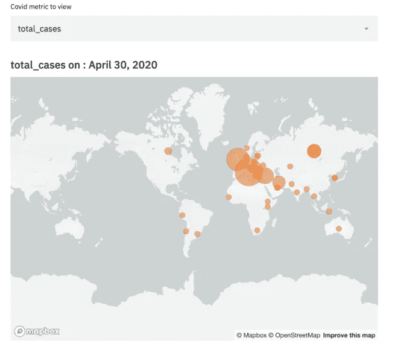
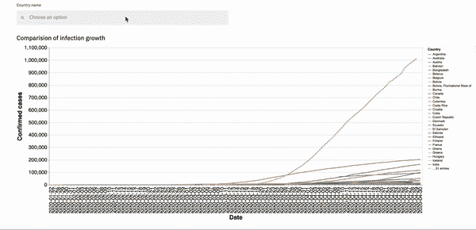
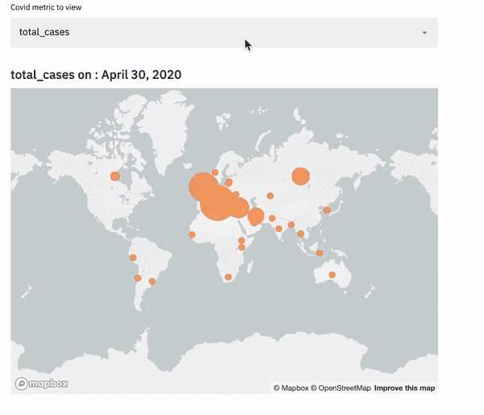
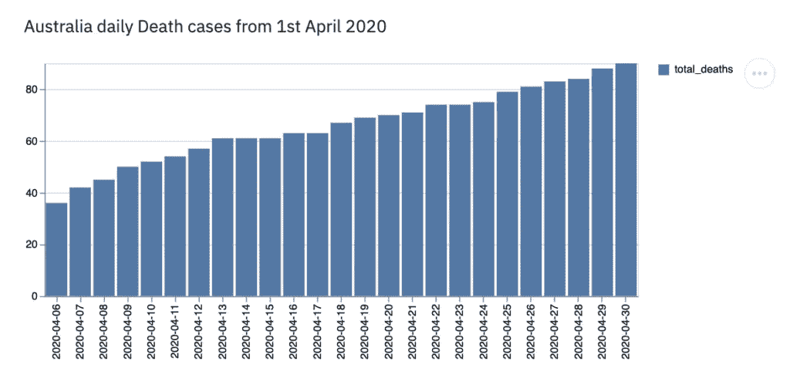
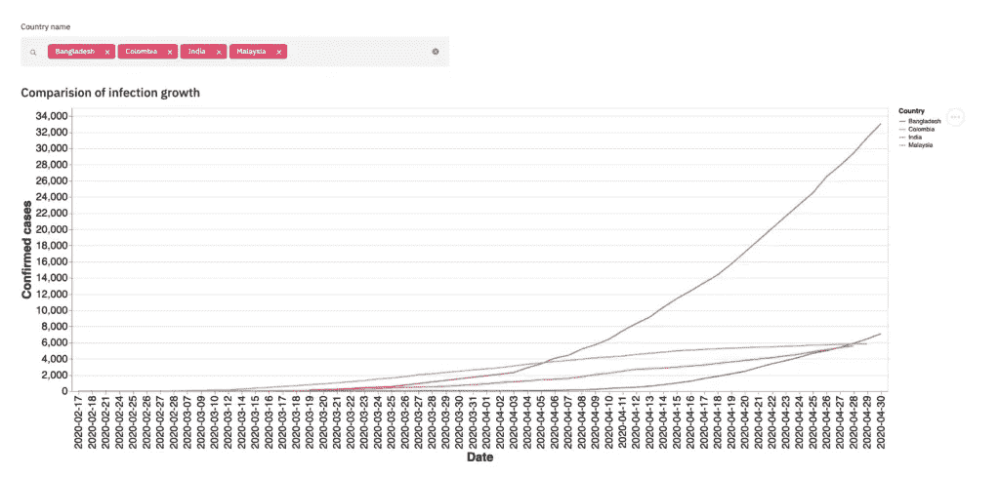

# 如何使用 Streamlit 在 Python 中构建交互式仪表盘

> 原文：<https://towardsdatascience.com/how-to-build-interactive-dashboards-in-python-using-streamlit-1198d4f7061b?source=collection_archive---------23----------------------->

## 借助交互式仪表盘提升您的数据科学项目



如果你正在做一个可视化项目，想要展示你的发现，或者如果你正在寻找工作，想要创建一些项目组合——交互式仪表盘是以一种容易理解的方式提供信息的好方法。

# 细流

今天，我们将在交互式仪表盘中使用 Python 和 Streamlit。

Streamlit 是一个开源应用程序框架，它通过一个漂亮的仪表板来探索和理解数据，使数据科学家的生活变得简单。

# 设置简化 it

让我们首先将 Streamlit 安装到我们的系统中，然后运行 hello 命令来验证一切正常。我们可以在终端中通过 **Ctrl+c** 随时杀死正在运行的 app。

```
$ pip install streamlit 
$ streamlit hello
```

# 导入库

安装 Streamlit 后，让我们导入我们将使用的所有库。

```
import streamlit as st 
import pandas as pd 
import numpy as np 
import pydeck as pdk 
import altair as alt 
from datetime import datetime
```

# 以不同的方式显示文本

Streamlit 使我们能够轻松清理、共享和可视化数据。我们可以用不同的方式写文章来解释我们的发现，比如给图表加标题，给出标题或副标题，或者我们可以解释图表或数据的细节。

> **标题**:设置 app 的标题，可以使用 **st.title()**
> 
> 标题:我们可以使用 st.header()作为标题，st.subheader()作为副标题
> 
> **Text** :为了编写特定图形或数据的描述，我们可以使用 **st.text()。** Streamlit 也支持 markdown，所以如果我们想将文本显示为 markdown，我们可以使用 **st.markdown()**
> 
> **Latex:** Streamlit 还显示 Latex 格式的数学表达式。通过使用 **st.latex()**
> 
> **写**:我们可以显示任何东西，如图形、数据框、函数、错误、模型等。通过使用 **st.write()**

# 取数据

现在我们已经安装了应用程序并导入了所有的库，下一步就是加载数据。这里我们将使用 Covid19 数据。

[从 Github 获取这个数据集。](https://raw.githubusercontent.com/nikkisharma536/streamlit_app/master/covid.csv)

## 数据缓存

Streamlit 提供了一种缓存机制，使我们的应用程序即使在从 web 加载数据或处理大型数据集时也能保持高性能。

# 简化小部件

小工具可以帮助我们过滤数据，或者通过按钮、滑块、选择框等直接将数据可视化到应用程序中。让我们来看几个例子。

## 多选

我们可以从列列表中选择或删除行。在这里，我们创建国家名称小部件，我们可以选择国家/地区，以便只显示那些选定值的数据/图表。



## 选择框



# 图表和地图

Streamlit 支持许多流行的可视化库，如 Matplotlib、Altair、deck.gl 等等。这里是显示图表的更多细节。

# 条形图



# 牛郎星图表



# 动画地图


# 所有的代码

这个任务的所有代码都可以在这里找到:[代码。](https://github.com/nikkisharma536/streamlit_app/blob/master/covid_data.py)

# 这是一个总结

这个帖子到此为止。在下一篇文章中，我们将讨论如何实时生产这些仪表板，以便其他人也可以访问您的仪表板。希望对你有帮助。

*原载于 2020 年 6 月 11 日 https://confusedcoders.com*[](https://confusedcoders.com/data-science/how-to-build-interactive-dashboards-in-python-using-streamlit)**。**