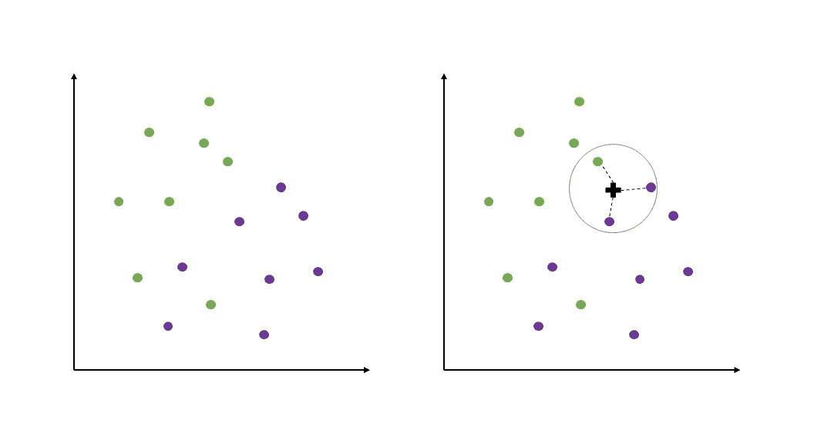
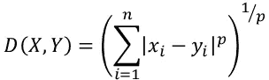
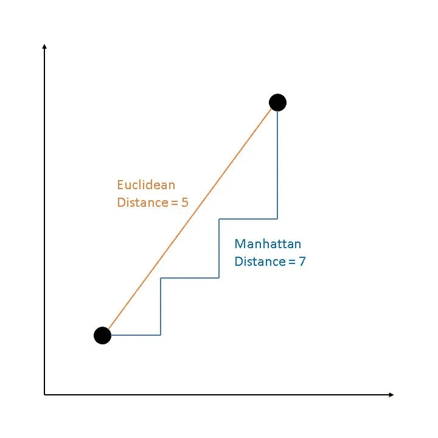
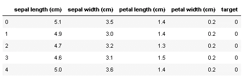
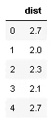
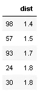
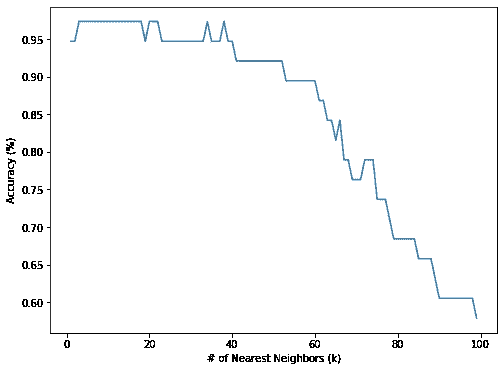

# 如何用 Python 从头开始构建 KNN

> 原文：<https://towardsdatascience.com/how-to-build-knn-from-scratch-in-python-5e22b8920bd2?source=collection_archive---------2----------------------->

## …嗯，至少没有 sklearn 的 KNeighborsClassifier。


在 [Unsplash](https://unsplash.com?utm_source=medium&utm_medium=referral) 上由 [Breno Assis](https://unsplash.com/@brenoassis?utm_source=medium&utm_medium=referral) 拍照

# k-最近邻

k-最近邻(KNN)是一种受监督的机器学习算法，可用于回归或分类任务。KNN 是非参数的，这意味着该算法不对数据的基本分布做出假设。这与线性回归等技术形成对比，线性回归是参数化的，需要我们找到一个描述因变量和自变量之间关系的函数。

KNN 的优点是非常直观易懂。当用于分类时，查询点(或测试点)基于最接近该查询点的 **k** 标记的训练点被分类。

有关简化的示例，请参见下图。左侧面板显示了一个包含 16 个数据点的二维图，其中 8 个数据点标为绿色，8 个数据点标为紫色。现在，右边的面板显示了当 **k** =3 时，我们如何使用 KNN 对一个新点(黑色十字)进行分类。我们找到三个最接近的点，并计算出在这三个点内每种颜色有多少张“选票”。在这种情况下，三个点中的两个是紫色的，因此，黑色十字将被标记为紫色。



当 k=3 时使用 KNN 的二维分类

**计算距离**

通过使用闵可夫斯基距离方程的几个版本之一来确定点之间的距离。闵可夫斯基距离的通用公式可表示如下:



其中 **X** 和 **Y** 为数据点， **n** 为维数， **p** 为闵可夫斯基幂参数。当 **p** =1 时，距离已知为曼哈顿(或出租车)距离，当 **p** =2 时，距离已知为欧几里德距离。在二维空间中，两点之间的曼哈顿距离和欧几里德距离很容易可视化(见下图)，但是在更高阶的 **p** 处，闵可夫斯基距离变得更加抽象。



二维中的曼哈顿距离和欧几里德距离

# 蟒蛇皮 KNN

为了用 Python 实现我自己版本的 KNN 分类器，我首先想导入几个公共库来帮忙。

## 加载数据

为了测试 KNN 分类器，我将使用 sklearn.datasets 中的鸢尾数据集。该数据集包含 150 种鸢尾植物的测量值(萼片长度、萼片宽度、花瓣长度、花瓣宽度)，平均分为三个物种(0 = setosa，1 = versicolor，2 = virginica)。下面，我加载数据并将其存储在一个数据帧中。



我还会将数据分为要素(X)和目标变量(y)，后者是每种植物的物种标签。

## 建立 KNN 框架

创建一个有效的 KNN 分类器可以分为几个步骤。虽然《KNN》包含了更多的细微差别，但我还是列出了最基本的任务清单:

1.  定义一个函数来计算两点之间的距离
2.  使用距离函数获得测试点和所有已知数据点之间的距离
3.  对距离测量值进行排序，以找到离测试点最近的点(即，找到最近的邻居)
4.  使用那些最接近点的多数类标签来预测测试点的标签
5.  重复步骤 1 到 4，直到所有测试数据点都被分类

## 1.定义一个函数来计算两点之间的距离

首先，我定义了一个名为 **minkowski_distance** 的函数，它接受两个数据点( **a** & **b** )和一个 minkowski 幂参数 **p，**的输入，并返回两点之间的距离。请注意，这个函数计算距离的方式与我之前提到的 Minkowski 公式完全一样。通过使 **p** 成为一个可调参数，我可以决定是要计算曼哈顿距离(p=1)、欧几里德距离(p=2)还是闵可夫斯基距离的更高阶。

```
0.6999999999999993
```

## 2.使用距离函数获得测试点和所有已知数据点之间的距离

对于第 2 步，我简单地重复 X 中所有标记点的 **minkowski_distance** 计算，并将它们存储在数据帧中。



## **3。对距离测量值进行排序，以找到最接近测试点的点**

在第三步，我使用熊猫**。sort_values()** 方法按距离排序，只返回前 5 个结果。



## 4.使用那些最接近点的多数类标签来预测测试点的标签

对于这一步，我使用**集合。计数器**跟踪与最近邻点重合的标签。然后我使用**。most_common()** 方法返回最常出现的标签。注意:如果“最常见”标签的标题在两个或多个标签之间有关联，那么返回的将是 **Counter()** 对象首先遇到的那个标签。

```
1
```

## 5.重复步骤 1 到 4，直到所有测试数据点都被分类

在这一步中，我将已经编写的代码投入使用，并编写一个使用 KNN 对数据进行分类的函数。首先，我对数据执行**train _ test _ split**(75%训练，25%测试)，然后使用 **StandardScaler()** 缩放数据。由于 KNN 是基于距离的，因此在将要素输入算法之前，确保对其进行适当的缩放非常重要。

此外，为了避免数据泄露，在执行完 **train_test_split** 之后，缩放特征*是一个好的做法。首先，只缩放来自训练集的数据*(**scaler . fit _ transform(X _ train)**)，然后使用该信息缩放测试集(**scaler . transform(X _ test)**)。这样，我可以确保不使用训练数据之外的信息来创建模型。**

*接下来，我定义一个名为 **knn_predict** 的函数，它接受所有的训练和测试数据、 **k** 和 **p** ，并返回我的 knn 分类器对测试集做出的预测( **y_hat_test** )。这个函数实际上并没有包含任何新的东西——它只是简单地应用了我在上面已经研究过的东西。该函数应该返回一个只包含 0、1 和 2 的标签预测列表。*

```
*[0, 1, 1, 0, 2, 1, 2, 0, 0, 2, 1, 0, 2, 1, 1, 0, 1, 1, 0, 0, 1, 1, 2, 0, 2, 1, 0, 0, 1, 2, 1, 2, 1, 2, 2, 0, 1, 0]*
```

*他们在那里！这些是这个自制的 KNN 分类器在测试集上做出的预测。让我们看看效果如何:*

```
*0.9736842105263158*
```

*看起来分类器在测试集上达到了 97%的准确率。一点也不差！但是我怎么知道它实际上是否工作正常呢？让我们检查 sklearn 的 **KNeighborsClassifier** 在相同数据上的结果:*

```
*Sklearn KNN Accuracy: 0.9736842105263158*
```

*不错！sklearn 的 KNN 分类器的实现给了我们完全相同的准确度分数。*

## *探索不同 k 值的影响*

*我的 KNN 分类器在选择值为 **k** = 5 的情况下表现相当好。KNN 没有像决策树或随机森林等其他算法那样多的可调参数，但 **k** 恰好是其中之一。让我们看看当我改变 k 时，分类精度是如何变化的:*

**

*在这种情况下，使用几乎任何小于 20 的 **k** 值都会在测试集上产生很高的(> 95%)分类精度。然而，当 **k** 变得大于大约 60 时，精确度确实开始下降。这是有意义的，因为数据集只有 150 个观察值——当 **k** 那么高时，分类器可能会考虑离测试点太远的标记训练数据点。*

## *每个邻居都有投票权——或者他们有吗？*

*在编写我自己的 KNN 分类器时，我选择忽略一个明显的超参数调整机会:每个最近的点在分类一个点时的权重。在 sklearn 的 **KNeighborsClassifier** 中，这是**权重**参数，可以设置为**‘均匀’**、**‘距离’**，或者其他自定义函数。*

*当设置为**‘uniform’**时，k 个最近邻点中的每一个在标记新点时获得相同的投票。当设置为**‘distance’**时，距离新点最近的邻居的权重大于距离较远的邻居。当然，在某些情况下，通过**“距离”**进行加权会产生更好的结果，而找出答案的唯一方法就是通过超参数调整。*

## *最后的想法*

*毫无疑问，sklearn 的实现无疑比我在这里拼凑的更加高效和用户友好。然而，我发现从头开始研究 KNN 是一个很有价值的练习，它只是巩固了我对算法的理解。我希望它对你也一样！*